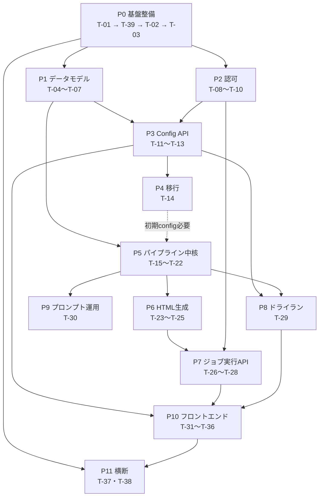

# 実装タスク一覧 — AI動向把握アプリケーション

> **このドキュメントの位置づけ**
> [`docs/spec.md`](./docs/spec.md)（仕様書 What/Why）と [`docs/design.md`](./docs/design.md)（設計書 How）を入力として、
> 設計書が扱う10項目（仕様書 §15-1〜10）と設計判断4項目（設計書 §11 A〜D）を **実装可能な単位のタスク** に分解し、
> **依存関係の順序** で並べたもの。
> 章参照は、断りがなければ **設計書** の §N（設計書は仕様書の章を §N と併記している）。
>
> **関連ドキュメント**
> 現時点では着手しない将来構想（過去記事の検索機能、記事データのDB蓄積など）は [`docs/future-roadmap.md`](./docs/future-roadmap.md) に分離している。
> **本ドキュメントは確定した実装バックログのみを扱う。**
>
> **更新ルール**
> - タスクを完了したら `- [x]` にする。分割・追加は末尾に `T-39` 以降を足し、既存IDは再利用しない。
> - 設計判断を変える場合は「§1 確定済み設計方針」を先に更新し、影響するタスクの「備考」に理由を残す。
> - 仕様書・設計書の確定値（7カテゴリ / 10タグ / 6軸100点 / 13除外ルール / enum / 配色 / xlsx列）は**変更しない**。

---

## 1. 確定済み設計方針

実装開始前に確定した方針。**タスク着手時にここへ戻って矛盾がないか確認すること。**

### 1.1 アーキテクチャ方針（プロジェクト決定）

| 論点 | 決定 | 根拠 |
|---|---|---|
| **開発の優先順位** | **社内連携が不要で、手元だけで完結して動くものを最優先**。Docker・SSO・クラウドストレージなど外部依存を必要とするものは後回し | 上司・PM のフィードバックを早く得ることを優先するため。環境構築の重さがボトルネックになるのを避ける |
| **永続化** | **ファイルが正**。`config.json` / 中間xlsx / 生成HTML / `raw_articles.json` / `validation_*.json` は実ファイルとして扱う。ただし **監査ログ・config改訂履歴は DB** で管理 | §8・§13.4 がファイルを処理の受け渡し単位とする前提。PROMPT-3 も xlsx を入力として読む。監査・履歴は §4.4・§6.3 |
| **DB 製品** | **当面は SQLite**（Docker 不要・手元完結）。**後から PostgreSQL へ切り替えられる形を維持**する：SQLAlchemy のモデル定義に閉じ込め、DB 固有機能に依存しない。接続先は設定 1つで切り替える | 手元優先の方針による。PostgreSQL が本当に必要になるのは全文検索・ベクトル検索（[future-roadmap.md](./docs/future-roadmap.md) 構想1）を実装するとき |
| **中間生成物の上書き** | **設計判断B**：正規名（固定名/シート）は upsert、旧版は `_history/{period}/{revision}_{run_id}/` へスナップショット退避（TTL・世代上限あり） | §11-B |
| **AI利用範囲** | **ハイブリッド**。 ・**crawl** = Claude API + `web_search` サーバーツール ・**filter** = 分類・10タグ付与・6軸採点・要約は Claude、**除外ルール判定・しきい値・重複判定・§12フォーマットチェックは決定的 Python で強制** ・**render** = 決定的 Python テンプレート | §7.1・§9.1・§10.1 のメールHTML厳密制約と §14 の再現性・冪等性要件を守るため。採点の再現性とスコア整合（§12）も決定的側で担保 |
| **PROMPT-3 の扱い** | 将来 render を LLM 生成へ切り替える可能性に備え、`prompts/` に **運用ドキュメントとして残す**（実行経路には接続しない） | §9 のプロンプト運用設計を維持 |
| **認証・認可** | **RBAC は本実装**（§6.2 権限マトリクス、サーバー側判定、config は admin 以外に**存在も中身も返さない**）。**認証（ID発行元）は開発用スタブのまま進める**。**トークン検証部だけ差し替え可能なインターフェース**に分離し、後から SSO を差し込めるようにする。差し替え口は README / CLAUDE.md に明記。**SSO 連携の実装自体は後回し**（社内IT担当への確認が必要なため別タスク） | §2 重要要件・§6.1・§4。SSO は仕様書 §1.3 で「既存SSO前提」＝新規構築はスコープ外。社内連携待ちで手が止まらないようにする |
| **スケジューラ** | **外部 cron → `POST /run`**。アプリはジョブ実行APIと状態機械のみを持ち、タイミング制御は外部（cron / Cloud Scheduler 等）に委ねる。ローカル用に `make run-weekly` / `make run-monthly`。本番 cron 登録手順は インフラ確定後に README へ追記（TODO項のみ先に作る） | §8.1〜8.4。二重起動しない構成・冪等性（§14）は維持 |

#### 備考：PostgreSQL 前提からの差分（2026-08-13 変更）

当初この表は **「監査ログ・config改訂履歴は PostgreSQL」** としており、リポジトリもその前提で生成されていた
（`asyncpg` / `compose.yml` の postgres:15.7 / `database_url` が `postgresql+asyncpg://` 固定 / CI に postgres サービス）。

**「社内連携が不要で手元完結するものを優先する」方針の確定に伴い、当面の DB を SQLite に変更した。**

| 項目 | 変更前 | 変更後 |
|---|---|---|
| DB 製品 | PostgreSQL（Docker 必須） | **SQLite**（Docker 不要） |
| ローカル起動 | `make up` で postgres 起動が必要 | **`make up` 不要**。`make migrate-all` だけで動く |
| 接続 URL | `postgresql+asyncpg://` 固定 | `DB_BACKEND` で切替（既定 `sqlite`） |
| compose.yml | ローカル開発に必須 | **将来の PostgreSQL 移行用に残す**（手元動作には不要） |

- 切り替え作業は **T-39** で実施する。
- **PostgreSQL へ戻す/移行する道は塞がない**：モデル定義は SQLAlchemy に閉じ込め、DB 固有機能（`JSONB`・配列型・`tsvector`・pgvector 等）を使わない。
- PostgreSQL が本当に必要になるのは検索機能の実装時（[future-roadmap.md](./docs/future-roadmap.md) 構想1・2）。

### 1.2 設計判断A〜D の採用結果（設計書 §11）

| 判断 | 採用 | 実装タスク |
|---|---|---|
| **A** `scoring_axes.weight` 合計100の担保 | **保存拒否（422）＋ UI に「比率維持で100へ補正」補助ボタン**（自動正規化はしない） | T-05 / T-33 |
| **B** 中間ファイル上書き vs バージョン退避 | **正規名は上書き ＋ 履歴退避**（TTL・世代上限で肥大抑制） | T-02 / T-22 |
| **C** ドライラン結果の出力先 | **一時ファイル（隔離パス `scratch/dry-run/{id}/` ＋ TTL）**。件数サマリは同ファイルから集計して即返し | T-02 / T-29 / T-35 |
| **D** config編集の画面配置 | **管理専用サブ画面 `/admin/config`**（週刊/月刊いずれのナビからも同一ルートへ、実体は単一モジュール） | T-32 |

---

## 2. フェーズと依存関係

**着手順の要点**

- **P0 → P1 → P2 が最優先**。P2（認可）を Config API より前に置くのは、「config は admin 以外に露出しない」（§2 重要要件・§6.1）を**後付けにしないため**。
- **P0 内の順序は T-01 → T-39 → T-02 → T-03**。T-39（SQLite 化）を T-03（ORM）より前に置くのは、DB 基盤が固まらないうちにマイグレーションを書くと作り直しになるため。
- P4（移行）は P5 より前に済ませておくと、パイプラインが実データの `config.json` で動かせる。
- P6 は P5 の xlsx 出力が正しく揃ってからでよい（入力が中間xlsx のため）。
- P10（フロント）は P3 と P7 の API が確定してから。OpenAPI 型生成を挟むので API 変更が落ち着くまで待つのが安全。

---

## 3. タスク一覧

### P0. 基盤整備

#### - [x] T-01: 依存追加と設定拡張
- **対応**: §0（全体方針）／§14
- **依存**: なし
- **成果物**: `backend/pyproject.toml`, `backend/src/config.py`, `backend/.env.example`
- **完了条件**:
  - `anthropic`（Claude API SDK）, `openpyxl`（xlsx 読み書き）を依存に追加し `uv lock` が通る
  - `Settings` に以下を追加：`anthropic_api_key`, `anthropic_model`（既定 `claude-opus-5`）, `artifact_root`（成果物ルート）, `scratch_ttl_hours`（既定24）, `history_max_generations`, `timezone`（既定 `Asia/Tokyo`）
  - `.env.example` に上記すべてを追記（既存の記法に合わせる）
  - `make lint` / `make test` が通る
- **備考**: モデルIDは `claude-opus-5`（日付サフィックスを付けない）。TZ は `Asia/Tokyo` 固定、ISO週は月曜始まり（§0・§14）。
  - 実績: `anthropic==0.121.0` / `openpyxl==3.1.5` で解決。派生プロパティ `tzinfo` / `scratch_root`（設計判断C）/ `history_root`（設計判断B）も追加済み。
  - ⚠️ **`.env.example` は Claude Code の `.env*` ガードレールにより AI が直接編集できない。** 以降 `.env.example` の更新を伴うタスク（T-08 認証スタブ、T-15 APIキー等）は、追記ブロックを提示して**手動で反映してもらう**運用とする。

#### - [x] T-39: DB 基盤を SQLite へ切り替え（PostgreSQL 移行の道は残す）
- **対応**: §1「確定済み設計方針」／[future-roadmap.md](./docs/future-roadmap.md)「現在の割り切り」
- **依存**: T-01
- **成果物**: `backend/pyproject.toml`, `backend/src/config.py`, `backend/src/adapter/database/database.py`, `backend/compose.yml`, `backend/Makefile.db.mk`, `backend/.github/workflows/ci.yml`, `backend/.gitignore`, `backend/README.md`, `backend/.env.example`
- **完了条件**:
  - `aiosqlite` を依存に追加（`asyncpg` は **PostgreSQL 移行用に残す**）
  - `Settings` に `db_backend`（`sqlite` | `postgresql`、**既定 `sqlite`**）と `sqlite_path` を追加し、`database_url` が backend に応じて分岐する
  - SQLite ファイルの親ディレクトリが存在しなくても起動できる（接続時に作成）
  - **`make up`（Docker）なしで `make migrate-all` → `make dev` → `/healthz` `/readyz` が通る**
  - `compose.yml` は削除せず、**将来の PostgreSQL 移行用であり手元動作には不要**である旨をファイル冒頭に明記
  - `Makefile.db.mk` の `up` / `down` / `db-init` が **PostgreSQL 専用**であることを `help-db` の表示とコメントで明示。`migrate-*` は両 backend で動く
  - CI から postgres サービスと `DB_*` 環境変数を外し、SQLite で `alembic upgrade head` → `make test-ci` が通る
  - `.gitignore` に SQLite ファイル（`*.db` 等）を追加
  - README に「手元は SQLite・Docker 不要」「PostgreSQL へ切り替える手順」を追記
  - `make lint` / `make test` が通る
- **備考**:
  - **DB 固有機能を使わない**こと（`JSONB`・配列型・`tsvector`・pgvector 等）。JSON は SQLAlchemy の汎用 `JSON` 型を使う。これが PostgreSQL へ戻せることの担保。
  - 後から追加したタスクだが、**実行順は T-01 の直後**（T-03 が DB 基盤に依存するため）。
  - `.env.example` はガードレールにより AI が編集できないため、追記ブロックを提示して手動反映する（T-01 備考参照）。

#### - [x] T-02: 成果物ストレージ層（ArtifactStore）
- **対応**: §8.2・§14／設計判断B・C
- **依存**: T-01
- **成果物**: `backend/src/adapter/storage/artifact_store.py`, `backend/tests/adapter/test_artifact_store.py`
- **完了条件**:
  - 正規名パス解決：`weekly_ai_intelligence_report.xlsx` / `monthly_ai_leading_cases.xlsx` / `raw_articles_{period}.json` / `validation_{period}.json` / `weekly_ai_intelligence_newsletter_{industry}_{period}.html` / `monthly_belief_{period}.html`
  - **原子的書き込み**（一時ファイル→rename）で、書き込み途中の成果物が読まれない
  - **世代退避**：正規名を上書きする前に `_history/{period}/{revision}_{run_id}/` へスナップショットを退避（設計判断B）。`history_max_generations` を超えた古い世代を削除
  - **隔離パス**：`scratch/dry-run/{dry_run_id}/` への出力と、`scratch_ttl_hours` を過ぎたディレクトリの掃除（設計判断C）
  - 入出力はすべて UTF-8（§14）
- **備考**: ここが「ファイルが正」方針の唯一の入口。以降のタスクは直接 `open()` せずこの層を経由する。

#### - [x] T-03: 監査ログ・config改訂履歴の ORM モデルとマイグレーション
- **対応**: §4.4・§6.3・§14
- **依存**: T-01, T-39
- **成果物**: `backend/src/adapter/database/models/audit_log.py`, `backend/src/adapter/database/models/config_revision.py`, `backend/migrations/versions/*.py`
- **完了条件**:
  - `audit_log`：`audit_id`(PK) / `event_type`(`config_update`|`run_start`|`run_finish`|`artifact_created`) / `actor` / `at` / `revision` / `diff`(JSON) / `target` / `period`（§4.4 のスキーマそのまま）
  - `config_revision`：`revision`(int) / `updated_at` / `updated_by` / `config_snapshot`(JSON) / `diff_summary` — `GET /config/history`（§3.3）が返せる形
  - 雛形 `adapter/database/models/example_item.py` を削除し、`models/__init__.py` の import を更新（`migrations/env.py` が metadata を拾えること）
  - `make migrate-all` が空DBに対して通る／`make test` が通る（**SQLite で完結。Docker 不要**）
- **備考**: モデルを `adapter/database/models/` に置けば `migrations/env.py` が自動で metadata に登録する。
  - **DB 固有型を使わない**（`JSONB` ではなく汎用 `JSON`、`ARRAY` は使わない）。PostgreSQL へ移行できる状態を保つため（§1 備考）。
  - SQLite は `ALTER TABLE` の制約が強いため、Alembic の `batch_alter_table` を使う前提で書く。
  - 実績: **SQLite が timezone を落とす**（`+09:00` を渡しても naive で返る）のに対し PostgreSQL の `TIMESTAMPTZ` は保持するため、そのままだと移行時に挙動が変わる。`adapter/database/types.py` の `UtcDateTime`（UTC 正規化する `TypeDecorator`）で両者を揃えた。naive datetime は保存時に拒否する。

---

### P1. データモデル（設計書 §2 ／ 仕様書 §15-2）

#### - [x] T-04: `config.json` のモデルと JSON Schema
- **対応**: §2.1（→ 仕様書 §5.2）
- **依存**: T-01
- **成果物**: `backend/src/enterprise/entities/config.py`, `backend/schemas/config.schema.json`（生成物）, `backend/tests/enterprise/test_config_model.py`, `backend/src/adapter/cli/export_config_schema.py`, `backend/tests/enterprise/data/config_initial.json`, `backend/Makefile`, `backend/README.md`
- **完了条件**:
  - Pydantic モデルで §2.1 の構造を表現：`meta` / `information_categories`(7件固定) / `required_tags`(10件固定) / `scoring_axes`(6件固定) / `scoring_total`(=100) / `exclusion_rules`(13件固定) / `enums` / `tunable_thresholds` / `source_whitelist_hint`
  - **固定IDは `Literal` で型表現**：カテゴリ7ID・タグ10ID・軸6ID（§5.1「変更すると中間xlsx互換が壊れる」）
  - **可変項目**（`weight` / `severity` / `enabled` / `priority` / `tunable_thresholds`）は通常フィールドとして可変
  - `additionalProperties: false` 相当（未知キーを拒否）
  - モデルから JSON Schema（draft 2020-12）を出力するコマンド／テストを用意し、§2.1 の Schema と構造が一致
- **備考**: enum の日本語値（`reliability` の「高/中/要確認/低」等）は確定値。推測で変更しない。
  - 実績: ルートモデルは `IntelligenceConfig`（`src/config.py` の `Settings` と混同しないため `AppConfig` は避けた）。共通の `_StrictModel` が `extra="forbid"` を付与＝§2.1 の `additionalProperties: false`。
  - 生成コマンドは `make config-schema`（`--check` で最新かを検査＝`make config-schema-check`）。**生成物のドリフトはテストが検出する**（`test_committed_schema_file_is_up_to_date`）。
  - `$defs` のキーをスネークケースへ寄せる `ConfigJsonSchemaGenerator` を入れ、§2.1 が参照する `#/$defs/priority` / `#/$defs/severity` と名前を一致させた。
  - §2.1 との差分は表現の違いのみ（Pydantic はネストモデルを `$ref` に切り出す／`const` に `type` を併記する／`updated_at` の nullable を `anyOf` で書く）。意味は同じで、テストで1項目ずつ突き合わせている。
  - 仕様書 §5.2 の確定 config を `tests/enterprise/data/config_initial.json` へ逐語でコピーし、**実データがそのまま通ること**と `model_dump(mode="json")` のラウンドトリップ一致（キー順込み）をテストで固定。**T-14 のフォールバック（xlsx が入手できない場合の初期 config）はこのファイルを本番位置へ移して使う。**
  - クロスフィールド制約（Σweight==100 / 降順整合 / 参照整合）は**この層では意図的に弾かない**。`test_cross_field_rules_are_not_enforced_here` で境界を明示済み。T-05 が担当。

#### - [x] T-05: クロスフィールドバリデータ
- **対応**: §2.1.1（→ 仕様書 §7.4）／設計判断A
- **依存**: T-04
- **成果物**: `backend/src/enterprise/entities/config_validation.py`, `backend/tests/enterprise/test_config_validation.py`, `backend/tests/enterprise/conftest.py`
- **完了条件**: §2.1.1 の6項目をすべて実装し、違反時は「どのパスがなぜダメか」を返す：
  1. `Σ scoring_axes[].weight == 100` — **不一致は保存拒否**（自動正規化しない＝設計判断A）
  2. `propose_next_meeting ≥ reference_info ≥ share_only ≥ min_total_score_to_publish`（降順整合）
  3. `weekly.target_industry ∈ enums.industry`（参照整合）
  4. `required_tags[*].value_source` が `enums.*` を指すとき、その enum キーが実在
  5. ID系（category/tag/axis の `id`）が現行値と不一致なら **422**
  6. 初期値（`min_total_score_to_publish=60` 等）が §5.2 実データと一致することを検証できる（移行時に使用）
- **備考**: 「保存拒否」を選んだ理由は §11-A（band が整数レンジのため按分で非整数 weight が生まれ、§12 検証と採点の再現性を損なう）。UI 側の補正ボタンは T-33。
  - 実績: 違反は例外ではなく `ConfigIssue`（`path` / `reason` / `code`）のリストで返す。**早期 return せず全項目を評価**するので、admin は一度の保存で複数の違反をまとめて直せる（T-34 の表示要件）。`path` は Pydantic の `loc` と同じドット区切り（`scoring_axes.0.weight`）で、モデル由来の 422 とこの層の 422 をフロントが同じ方法でフィールドへマッピングできる。
  - `code`（`ConfigIssueCode`）は設計書 §3.3 の `{path, reason}` に足した機械可読キー。**T-33 の「比率維持で100へ補正」ボタンは `weight_sum_mismatch` を見て出し分ける**想定。
  - 入口は3つ: `validate_config`（1〜5・保存前に必ず通す）/ `validate_initial_config`（6・移行専用）/ `ensure_valid_config`（違反時 `ConfigValidationError`。T-11 の検証済み書き込み・T-14 の「失敗時は書き込まず中断」用）。
  - **設計判断A の担保**: `test_weight_sum_violation_never_normalizes_the_input` で「検証後も入力 weight が変わっていない」ことを固定した。モジュール冒頭にも「この層に正規化処理を足さないこと」を明記済み。
  - 項目1 の `path` はセクション（`scoring_axes`）。合計のズレを特定の1軸へ帰属させられないため（§3.3 の 422 例も同じ）。項目2 は崩れた隣接ペアごとに1件返し、`path` は「高すぎる側」に置く（フォーム上で直す欄が1つに定まる）。
  - 項目5 の「現行値」は **`config.py` が `Literal` で固定している正準ID列** と解釈した。保存済み config はすべてこの検証を通っているので、正準列との比較＝ひとつ前の revision との比較になる。モデルが弾けない「重複＋欠落の組み合わせ」と「並び順の変更」をここで拾う。
  - ⚠️ 項目5 に **`exclusion_rules[].no` を含めた**（§2.1.1-5 の明記は category/tag/axis の `id` のみ）。`no` はルールの同一性そのもので、重複すると除外判定（T-17。`no` 昇順で評価）が非決定的になるため。
  - 項目6 の期待値テーブル（`INITIAL_*`）は §5.2 の初期値。**テストで `data/config_initial.json` と突き合わせている**のでズレたら落ちる。件数（7/10/6/13）はモデル側の min/max_length で担保済みなので項目6 では扱わない。weight・priority・severity・enabled も見るので、`中〜高`→`mid_high`（§5.3）の正規化ミスはここで落ちる。
  - `data/config_initial.json` を読むフィクスチャ（`initial_raw` / `raw` / `config`）は `tests/enterprise/conftest.py` へ移した（T-04 のテストと共用）。

#### - [x] T-06: `raw_articles.json` / `validation_*.json` のスキーマ
- **対応**: §2.3・§2.4（→ 仕様書 §13.2・§12.2）
- **依存**: T-01
- **成果物**: `backend/src/enterprise/entities/raw_article.py`, `backend/src/enterprise/entities/validation_report.py`, `backend/src/enterprise/entities/json_document.py`, `backend/tests/enterprise/test_raw_article.py`, `backend/tests/enterprise/test_validation_report.py`
- **完了条件**:
  - `RawArticle`：`collected_at`(YYYY-MM-DD) / `published_at`(nullable) / `title` / `url` / `source` / `raw_summary` / `region_hint`(4値) / `primary_or_secondary`(3値)。配列としての読み書きが可能
  - `ValidationReport`：`{ ok: bool, errors: [{row, field, reason}], warnings: [...] }`
  - 不正な JSON はパス付きのエラーで落ちる（黙って通さない）
- **備考**: crawl 段階では重複しうる記事も落とさない（統合判定は filter の責務・§13.2）。
  - 実績: 「パス付きエラーで落とす」読み書きは2ファイルで共通なので `json_document.py` に切り出した（`DocumentIssue` / `DocumentParseError` / `parse_json_document` / `validate_json_data` / `dump_json_document`）。`path` は T-05 の `ConfigIssue.path` と同じドット区切りで、配列は要素番号が入る（`1.url` = 2件目の `url`）。**壊れた要素だけ読み飛ばす挙動は持たせていない**（黙って通さない）。1回のパースで全違反を返す。
  - **重複を落とさないことをテストで固定**: 同一URL2件・完全同一2件・同一発表の別媒体3件がすべて保持されること、さらに `dedup`/`unique`/`distinct` を名前に含む関数がこのモジュールに無いことも検査している（`test_the_module_exposes_no_deduplication_helper`）。順序も保つ（収集順が統合時の代表選定の手がかり）。
  - 日付は §2.3 どおり `pattern` 付きの**文字列**（`DateText`）。中間xlsx の日付列（T-07 の `ColumnKind.DATE`）と同じ表現で揃えた。加えて `AfterValidator` で**実在しない日付**（`2026-02-30` 等）も弾く（LLM 出力なので桁数だけ合った日付が来る）。T-18 の日付演算用に `collected_on` / `published_on` プロパティを持たせた。
  - `region_hint`（4値）と `primary_or_secondary`（3値）は **config の `enums.region`（3値）/ `enums.info_type`（5値）とは別物**。どちらも `不明` を持つ crawl 段階の当たりで、確定値は T-19 が決める。この差をテストで明示している（`test_crawl_hints_are_coarser_than_the_config_enums`）。
  - `additionalProperties: false` は crawl では特に効く。LLM が点数やタグを勝手に足してきたら弾く＝「この段階で採点しない」（§13.2）を型で強制できる。
  - ⚠️ **`ValidationReport` に `ok == (errors が空)` の整合チェックを入れた**。§2.4 のスキーマは `ok` を素の boolean としか書いていないので**設計書からの追加**。ただし §12.2 が「エラーがある記事は本編HTML生成の対象から除外」と定めているため、`ok=true` かつ `errors` あり を通すと不備のある記事が本編に載る。生成側（T-20）は `ValidationReport.from_issues()` を使えば `ok` を取り違えない。
  - `ValidationIssue.row` は §2.4 どおり素の `int`（下限を付けていない）。1-indexed の xlsx 行で、週次のデータ行は5行目から（T-07 の `first_data_row`）。

#### - [x] T-07: 中間xlsx の列スキーマ定義
- **対応**: §2.2（→ 仕様書 §8）
- **依存**: T-01
- **成果物**: `backend/src/enterprise/entities/report_columns.py`, `backend/tests/enterprise/test_report_columns.py`
- **完了条件**:
  - **週次22列**を順序込みで定数化（収集日 / 情報カテゴリ / タイトル / 一言要約 / 合計スコア / 緊急性鮮度_点 / 信頼性_点 / アドバイザリー活用度_点 / AI業界市場インパクト_点 / 実務活用可能性_点 / 顧客関連度_点 / レポート採用区分 / 実務活用可能性 / 顧客関連度 / 信頼性 / 地域 / 情報種別 / 業務領域 / 業界 / AIテーマ / ソース / URL）
  - **除外ログ6列**（収集日 / タイトル / URL / ソース / 除外区分 / 除外理由）
  - **月次8列**（No / トピック(章) / 企業・組織 / タイトル / URL / 出典 / 掲載月 / 解説）
  - 各列に型・値域・multi 区切り（`;`）・config 対応キーを持たせ、**writer と reader の双方がこの定義だけを参照**する
  - 軸点の上限合計が 100（10+10+15+20+20+25）であることをテストで固定
- **備考**: 設計書末尾の指示どおり、**この列定義と T-04/T-05 の Schema が単体テストの基準**になる。
  - 実績: 1列＝`ReportColumn`（frozen dataclass）。`name` / `kind` / `separator` / `value_range` / `value_source` / `axis_id` / `tag_id` / `required_non_empty` / `note`。`axis_id` と `tag_id` は `Literal` 型なので**軸ID・タグIDのタイポを `make type-check` が落とす**（確認済み）。
  - 定義そのものの矛盾は `__post_init__` で **import 時に** 落とす（区切りの無い multi 列 / 値域の無い数値列 / 逆転した値域）。実行時まで気づけない壊れ方を防ぐため。
  - **writer と reader が列順を知らなくて済む形**にした: `header_row()` / `format_row()` / `parse_row()` / `format_cell()` / `parse_cell()` をこのモジュールが提供し、ラウンドトリップ（write→read で元の dict に戻る）をテストで固定。T-22 と T-24/T-25 はこれだけを呼ぶ。
  - `parse_cell` は**型の復元だけ**。値域・enum 所属・非空は検査しない（§12 のフォーマットチェック＝T-20 の責務）。openpyxl が日付書式セルを `datetime` で返すケースは吸収する。
  - multi の区切りは**列ごとに違う**: 週次4列（地域/業務領域/業界/AIテーマ）は `;`、月次「企業・組織」は `・`（§8.2 `A・B`）、月次「解説」は `\n\n`（3段落）。グローバル定数1つでは足りないので `separator` を列の属性にした。
  - 軸点の上限＝その軸の `weight`。`test_axis_score_upper_bounds_sum_to_the_scoring_total` で **10+10+15+20+20+25＝100＝`scoring_total`** を固定し、さらに §5.2 の初期 weight と一致することも突き合わせている。weight は可変（§7.2）なので**実行時の上限は `axis_score_bounds(config)` を見る**（T-20 は静的な `value_range` ではなくこちらを使うこと）。
  - 列2 と 列12〜20 が**10必須タグと1:1**であることをテストで固定。各列の `value_source` が config の `required_tags[].value_source` と一致することも検証しており、ここがズレると T-20 が enum 外の値を検出できなくなる。
  - ⚠️ **§12.1 の非空必須リストに「タイトル」が入っていない**（挙がっているのは 一言要約 / URL / ソース / 収集日 ＋ 6軸点 ＋ 10タグ）。仕様に忠実に `required_non_empty=False` としたので、**タイトル欠落は T-20 では落ちない**。カード見出しに使う T-24 側でガードすること。仕様側を直す判断なら §12.1 に追記が必要。
  - ⚠️ **除外ログ・月次シートの前置き行が仕様書・設計書に未規定**。週次の各週シートだけが「1行目タイトル / 2行目説明 / 3行目空行 / 4行目ヘッダ」と明記されている（§8.1）ため、この2シートは1行目ヘッダとした（`EXCLUSION_LOG_SHEET` / `MONTHLY_CASE_SHEET`）。実ファイルが入手できたら要確認。
  - 週次の1行目タイトル・2行目説明の**文言**は T-22 の担当（このモジュールは行位置だけ持つ）。`除外区分` の語彙（完全除外／統合／フォーマット不備 等）は §2.2.2 が「等」と書いて閉じていないため enum 化せず、T-17/T-18/T-20 に委ねた。

---

### P2. 認可（設計書 §4 ／ 仕様書 §15-4）

#### - [ ] T-08: ロール定義と認証スタブ（差し替えインターフェース）
- **対応**: §4.1（→ 仕様書 §2・§6.1）
- **依存**: T-01
- **成果物**: `backend/src/enterprise/entities/principal.py`, `backend/src/adapter/http/fastapi/auth/backend.py`, `backend/src/adapter/http/fastapi/auth/stub.py`, `backend/README.md`（差し替え口の記載）
- **完了条件**:
  - `Role` = `admin` / `editor` / `viewer` / `system`、`Principal`（ロール＋ユーザ識別子）を定義
  - **`AuthenticationBackend` プロトコル**を定義（例：`resolve(request) -> Principal | None`）。実装差し替えは DI（FastAPI の依存関係）1箇所のみで完結する
  - 開発用スタブ実装（リクエストヘッダ or 未署名JWT からロールを解決）を提供し、既定で有効
  - **差し替え口が README と CLAUDE.md に明記されている**（どのファイルのどのプロトコルを実装し、どこで差し替えるか）
  - スタブは本番環境で誤用されないようガード（設定フラグ or 起動時警告ログ）
- **備考**: SSO（OIDC）実装は社内IT担当への確認後の別タスク。ここでは検証部の境界を切ることだけが目的。

#### - [ ] T-09: RBAC ミドルウェアと権限マトリクス
- **対応**: §4.2・§3.1（→ 仕様書 §6.2）
- **依存**: T-08
- **成果物**: `backend/src/adapter/http/fastapi/auth/rbac.py`, `backend/tests/adapter/test_rbac.py`
- **完了条件**:
  - §6.2 の権限マトリクスを**そのまま定数化**（操作 × ロール → allow / deny / internal_only）
  - `GET /config`・`PUT /config`・`GET /config/history`・`POST /config/dry-run` の config ファミリは **admin のみ**。それ以外は**本体を一切返さず 403 のみ**（存在も中身も露出しない）
  - `GET /reports/{period}` は admin/editor/viewer/system すべて可
  - `POST /run/{type}` は admin/editor/system 可、viewer は 403
  - `system` は内部読込のみ（外部レスポンス経路を持たない）
  - **全ロール × 全エンドポイントの網羅テスト**（マトリクスと1:1）
- **備考**: フロントの非表示は補助であり、実体はここ（§6.1）。フロント実装（T-32）より先に完成させる。

#### - [ ] T-10: 監査ログ書き込みサービス
- **対応**: §4.4（→ 仕様書 §6.1・§14）
- **依存**: T-03, T-09
- **成果物**: `backend/src/application/usecases/audit.py`, テスト
- **完了条件**:
  - `config_update` / `run_start` / `run_finish` / `artifact_created` の4イベントを記録
  - `config_update` は **before→after の diff**（変更パスごと）を JSON で保持し、`revision` を伴う
  - `actor` は「ロール＋ユーザ識別子」形式（例 `admin:admin_a`）、`at` は `Asia/Tokyo`
  - 監査ログの書き込み失敗が本処理を黙って握り潰さない（ログ＋エラー伝播方針を明記）
- **備考**: **監査ログに config の中身をそのまま残すと非admin への漏洩面になりうる**ため、参照経路は admin 限定であることをテストで確認する。

---

### P3. Config API（設計書 §3 ／ 仕様書 §15-3）

#### - [ ] T-11: ConfigRepository（読み書き・revision・履歴記録）
- **対応**: §4.3・§6.3
- **依存**: T-02, T-03, T-04
- **成果物**: `backend/src/adapter/config_repository.py`, テスト
- **完了条件**:
  - `config.json`（ファイルが正）の読み込み／検証済み書き込み
  - `revision` の採番（成功時 `revision++`、`updated_at`/`updated_by` 更新）
  - **楽観ロック**：`base_revision` と現行の比較、不一致は競合として通知
  - 書き込みは T-02 の原子的書き込みを利用（壊れた config が読まれない）
  - 書き込み成功時に `config_revision` テーブルへスナップショットと `diff_summary` を記録
  - **実行時の revision ピン留め**：`get_pinned(revision)` でジョブ開始時点の config を固定参照できる（§6.3）
- **備考**: 実行中ジョブが config 変更の影響を受けないことは §14 の再現性要件そのもの。

#### - [ ] T-12: `GET /config` / `GET /config/history`
- **対応**: §3.2・§3.3
- **依存**: T-09, T-11
- **成果物**: `backend/src/adapter/http/fastapi/routers/config.py`（`all_routers` へ登録）, テスト
- **完了条件**:
  - `GET /config` → `200 { "revision": N, "config": {...} }`（admin のみ）
  - `GET /config/history` → `200 { "items": [{ revision, updated_at, updated_by, diff_summary }] }`（admin のみ）
  - **非admin は 403 のみでボディに config 情報を含まない**（エラーメッセージからも推測できないこと）
  - OpenAPI にレスポンススキーマが出る（T-31 の型生成の入力になる）

#### - [ ] T-13: `PUT /config`（更新・楽観ロック・監査）
- **対応**: §3.3・§4.3（→ 仕様書 §7.4）
- **依存**: T-05, T-10, T-12
- **成果物**: `backend/src/adapter/http/fastapi/routers/config.py`（追記）, `backend/src/application/usecases/update_config.py`, テスト
- **完了条件**:
  - Request：`{ base_revision, patch }`。`patch` は §7.2 の**編集可能パラメータのみ許可**（許可リスト方式）
  - 固定項目（ID系・`scoring_total`・`schema_version` 等）を含む patch は **422**
  - T-05 のバリデーション違反は **422**（`issues: [{path, reason}]`）— weight 合計100 不一致もここ（設計判断A）
  - `base_revision` 不一致は **409**（`{error:"revision_conflict", current_revision}`）
  - 成功時 `200 { revision, updated_at, updated_by }`、`revision++`、**監査ログに diff を記録**
  - 非admin は 403

---

### P4. 移行（設計書 §10 ／ 仕様書 §15-10）

#### - [ ] T-14: xlsx → config.json 初期マイグレーション CLI
- **対応**: §10.2・§10.3・§10.4
- **依存**: T-05, T-11
- **成果物**: `backend/src/adapter/cli/migrate_config.py`, `backend/Makefile`（ターゲット追加）, テスト
- **完了条件**: §10.3 の手順どおり：
  1. `weekly_ai_intelligence_requirements.xlsx` の4シート（`情報カテゴリ`/`必須タグ`/`除外ルール`/`スコアリング軸`）を読む
  2. 日本語 → ID（英小文字スネークケース）へ正規化。priority 表記「中〜高」→ `mid_high`（§5.3）
  3. `tunable_thresholds` に §5.2 の初期値を投入
  4. JSON Schema 検証（T-04）＋ 追加バリデーション（T-05）
  5. §5.2 実データとの一致チェック（**7 / 10 / 6 / 13 の件数**、初期しきい値）
  6. `meta.revision=1`, `updated_by=null`, `updated_at=migration時刻` を設定して出力
  7. マイグレーションレポート（差分・警告）を出力
  - **dry モードが既定**（既存 config があれば revision を維持して diff レポートのみ）／再実行可能
  - 検証（手順4-5）失敗時は**書き込まず中断**
- **備考**: ⚠️ **`weekly_ai_intelligence_requirements.xlsx` の実ファイルがリポジトリに無い**（§5 要確認事項）。着手前に入手すること。入手できない場合は §5.2 の確定 JSON を直接初期 config として投入するフォールバックを用意する。

---

### P5. パイプライン中核（設計書 §6 ／ 仕様書 §15-6）

#### - [ ] T-15: Claude クライアントラッパ
- **対応**: §6・§9
- **依存**: T-01
- **成果物**: `backend/src/adapter/llm/claude_client.py`, テスト（API呼び出しはモック）
- **完了条件**:
  - `anthropic` SDK を使い、モデル既定 `claude-opus-5`
  - **structured outputs**（`output_config.format` / Pydantic スキーマ）で構造化応答を強制し、パース失敗をリトライ可能に
  - 長時間・大出力になりうる呼び出しは**ストリーミング**を使う（HTTPタイムアウト回避）
  - リトライ（レート制限・5xx）は SDK 既定に委ねつつ、上限とバックオフを設定可能に
  - トークン使用量（`usage`）を呼び出しごとに記録し、監査/検証メタに載せられる形で返す
  - `stop_reason` が `refusal` の場合を握り潰さず、呼び出し元が判別できる
- **備考**: `budget_tokens` や `temperature` / `top_p` は使わない（現行モデルでは 400）。深さ制御は `output_config.effort` で行う。

#### - [ ] T-16: crawl ワーカー
- **対応**: §8.2・仕様書 §13.2（PROMPT-1）
- **依存**: T-06, T-15
- **成果物**: `backend/src/application/usecases/crawl.py`, テスト
- **完了条件**:
  - 入力 `period`（`2026-W31` or `2026-07`）から PROMPT-1 を組み立て、Claude + `web_search` サーバーツールで収集
  - 出力は `raw_articles_{period}.json`（T-06 のスキーマ、T-02 経由で書き込み）
  - **この段階でスコアリング・除外判定・タグ確定を行わない**（次段の責務）
  - **重複しうる記事も落とさない**（統合判定は filter）
  - 優先ソース（TechCrunch / VentureBeat / Ledge.ai / ITmedia / 公式PR / 政府・公的機関）をプロンプトに反映。個人ブログ・SNS単独・まとめアフィリエイトは収集しない
  - 7カテゴリを網羅するよう広く収集する指示を含む
- **備考**: 週次は「今週」の新規性、月次は「先進企業の具体的活用事例」を重視（§13.2）。

#### - [ ] T-17: 除外ルール判定エンジン
- **対応**: §6.2（→ 仕様書 §5.4・§13.3-1）
- **依存**: T-04, T-07
- **成果物**: `backend/src/enterprise/services/exclusion.py`, `backend/tests/enterprise/test_exclusion.py`
- **完了条件**:
  - 13ルールを **`no` 昇順**で評価し、`enabled=false` はスキップ
  - severity 5分岐を §5.4 どおりに実装：
    - `full_exclude` → 無条件除外（除外区分「完全除外」）
    - `default_exclude` → 原則除外。ただし **顧客関連度=「直接関係」かつ合計見込み ≥ `min_total_score_to_publish` なら例外採用**（理由を記録）
    - `low_priority` → 採用するが `adoption_class` を降格（「共有のみ」寄り）
    - `low_priority_or_exclude` → 鮮度が低ければ除外、そうでなければ低優先
    - `merge` → 除外ではなく統合（T-18 と連動）
  - 除外時は必ず除外ログ行（6列）を生成
  - **13ルール × 各 severity の分岐を網羅するテスト**
- **備考**: ここが「決定的 Python で強制」の中核。LLM の判断で severity 分岐を上書きさせない。

#### - [ ] T-18: 重複検知・統合
- **対応**: §6.3（→ 仕様書 §11）
- **依存**: T-07
- **成果物**: `backend/src/enterprise/services/dedup.py`, テスト
- **完了条件**:
  - **URL正規化**：クエリ・トラッキングパラメータ除去、末尾スラッシュ統一。`treat_same_url_as_duplicate=true` のとき一致で重複
  - **タイトル正規化**：記号・空白除去、全半角統一 → 類似度 ≥ `title_similarity_threshold`（既定0.85）で重複候補
  - **参照範囲**：週次は直近 `lookback_weeks`（既定8週）の各週シート＋除外ログ、月次は当月＋直近数ヶ月の cases と対応する週次記事
  - 同一発表の別媒体は**代表1件へ統合**し、代表の `ソース` 欄を `A / B(統合)` 形式に
  - 残りは除外ログへ（`除外区分=統合` / `除外理由=重複・転載記事`）
  - 閾値の境界値テスト（0.84 / 0.85 / 0.86）

#### - [ ] T-19: 分類・10タグ付与・6軸採点
- **対応**: §6.1-3/4・§6.4（→ 仕様書 §13.3-3/4）
- **依存**: T-04, T-15
- **成果物**: `backend/src/application/usecases/classify_and_score.py`, テスト
- **完了条件**:
  - Claude の structured output で 10必須タグと6軸点を取得。**出力スキーマの enum は config の `enums` から動的に生成**（config 外の値を構造的に出せないようにする）
  - 6軸の範囲を型で拘束：顧客関連度0-25 / 実務活用可能性0-20 / AI業界市場インパクト0-20 / アドバイザリー活用度0-15 / 信頼性0-10 / 緊急性鮮度0-10
  - **合計スコア = 6軸の和** をアプリ側で計算（LLM の申告値を信用しない）
  - `adoption_class` は `adoption_class_score_map` に従って**決定的に**決める（§6.4）：`≥propose_next_meeting`→「次回定例で提案」／`≥reference_info`→「参考情報」／`≥share_only`→「共有のみ」／それ未満→「不採用」
  - プロンプトに「config のパラメータは実行時点の値をそのまま使用し、主観で上書きしない」を明記（§13.3）
  - 一言要約（2〜3文）を生成
- **備考**: LLM は「軸ごとの点数と分類」だけを返す。しきい値の適用と合計計算は Python 側（決定的）。

#### - [ ] T-20: フォーマットチェック（§12）
- **対応**: §6.5（→ 仕様書 §12）
- **依存**: T-06, T-07
- **成果物**: `backend/src/enterprise/services/format_check.py`, テスト
- **完了条件**: §12.1 の必須項目をすべて検証：
  - 6軸点が範囲内 / 6軸の和が `合計スコア` と一致
  - 10必須タグがすべて非空
  - enum系タグの値が config の `enums` に存在（未定義値はエラー）
  - `一言要約`・`URL`・`ソース`・`収集日` が非空
  - 結果を `validation_{period}.json`（`{ok, errors[], warnings[]}`）として出力
  - **error のある記事は本編HTML生成の対象から外し、除外ログに `除外区分=フォーマット不備` として記録**
  - 合計スコア不一致・enum外・タグ欠落は `error`、要約が短すぎる等は `warning`

#### - [ ] T-21: filter オーケストレーション
- **対応**: §6.1（→ 仕様書 §13.3）
- **依存**: T-17, T-18, T-19, T-20
- **成果物**: `backend/src/application/usecases/filter.py`, 統合テスト
- **完了条件**: §6.1 の擬似コードどおりの順序で実行：
  1. 除外判定（T-17）→ 除外なら除外ログへ
  2. 重複・統合判定（T-18）→ 重複なら代表へ統合し除外ログへ
  3. 分類・10タグ付与（T-19）
  4. 6軸採点＋`adoption_class` 決定、`low_priority` 系は降格（T-19 + T-17）
  5. 採否：`合計スコア < min_total_score_to_publish` または `信頼性点 < min_reliability_score_to_publish` → 除外ログへ（`除外区分=低スコア/信頼性不足`）
  6. フォーマットチェック（T-20）→ error なら本編から除外
  7. 合計スコア降順で整列
  - **`config@revision` を実行開始時に固定参照**し、実行中の config 変更に影響されない（§6.3・§14）
  - 月次では、採用記事のうち「企業・組織の具体的活用事例」を事例(case)へ昇格し、章を `chapter_count_hint` 前後に束ねる。各事例の「解説」は ①事実 ②詳細 ③示唆 の3段落を `\n\n` 区切りで生成

#### - [ ] T-22: 中間xlsx ライタ
- **対応**: §2.2（→ 仕様書 §8）／設計判断B
- **依存**: T-02, T-07, T-21
- **成果物**: `backend/src/adapter/xlsx/report_writer.py`, テスト
- **完了条件**:
  - **週次**：ISO週ごとに1シート。1行目タイトル `Weekly AI Intelligence レポート (2026-Www)` / 2行目 説明 / 3行目 空行 / 4行目 ヘッダ（22列）/ 5行目以降 データ（**合計スコア降順**）
  - **除外ログ**シート（6列）へ **append**
  - **月次**：対象月ごとに1シート、8列、`No` 昇順＝章グルーピング順
  - **列順序は T-07 の定義だけを参照**（ハードコードしない）
  - multi 値は `;` 区切り
  - 同一 `{period}` の再実行は**正規名を上書き**しつつ、旧版を `_history/` へ退避（設計判断B）
  - 出力した xlsx を読み戻して列順・件数・降順が一致することをテストで確認（ラウンドトリップ）

---

### P6. HTML生成（設計書 §7 ／ 仕様書 §15-7）

#### - [ ] T-23: メールHTML 基盤とカテゴリ色マップ
- **対応**: §7.1・§7.2（→ 仕様書 §9.1・§10.1・§13.4）
- **依存**: T-01
- **成果物**: `backend/src/adapter/html/mail_html.py`, `backend/src/adapter/html/category_colors.py`, テスト
- **完了条件**:
  - **table レイアウト＋inline style のみ**を生成する部品（`<style>` タグ・外部CSS・flex・grid・JS を出力しない）
  - **生成結果を検証する lint テスト**：`<style`, `display:flex`, `display:grid`, `<script` が出力に含まれないことをアサート
  - `<meta charset="utf-8">` 明記、出力は UTF-8（§14）
  - フォント：`'Hiragino Kaku Gothic ProN','ヒラギノ角ゴ ProN','Meiryo',Arial,sans-serif`
  - カテゴリ色マップ（§7.2）：`ai_agent_automation=#0891b2` / `ai_major_company_model=#7c3aed` / `ai_governance_risk=#dc2626`（**実サンプル実測の確定値**）＋ 補完4色 `enterprise_ai_case=#059669` / `industry_ai_trend=#d97706` / `ai_training_org_change=#db2777` / `ai_implementation_ops=#4f46e5`
- **備考**: ⚠️ **補完4色はサンプル未収載のためブランド確認が必要**（§5 要確認事項）。差し替え可能な定数として1箇所にまとめること。

#### - [ ] T-24: 週刊メルマガ レンダラ
- **対応**: §7.3（→ 仕様書 §9）
- **依存**: T-22, T-23
- **成果物**: `backend/src/adapter/html/weekly_renderer.py`, テスト（ゴールデンファイル比較）
- **完了条件**: §7.3 のマッピング表どおり、当週シートから：
  - ヘッダ：グラデ背景 `linear-gradient(135deg,#4f46e5,#7c3aed)`、`Weekly AI Intelligence by Sapeet` / `{target_industry} 版` / `対象週：{ISO_WEEK}`
  - 今週のポイント（白カード、3〜4文）— `point_of_week_required=true` なら必須
  - `{target_industry}関連トピック`：列19「業界」に `target_industry` を含む記事、上限 `weekly.max_industry_topics`
  - 業界共通トピック：「業界横断」等、上限 `weekly.max_common_topics`。各カード = カテゴリラベル（色分け）/ タイトル `<a>`（href = 列22 URL）/ 一言要約 / **示唆ボックス**（背景 `#eef2ff`・左罫 `#6366f1`）/ 出典行 `出典：{ソース} ／ 記事を読む`
  - フッタ注記（編集部整理であり投資・法務助言でない旨）
  - **採用条件**：`レポート採用区分 ≠ 不採用` かつ `合計スコア ≥ min_total_score_to_publish`。**並び順は合計スコア降順**
  - 外枠 `max-width:680px` 中央、背景 `#f3f4f6`
  - 出力ファイル名 `weekly_ai_intelligence_newsletter_{industry}_{ISO_WEEK}.html`

#### - [ ] T-25: 月刊ビリーフ レンダラ
- **対応**: §7.4（→ 仕様書 §10）
- **依存**: T-22, T-23
- **成果物**: `backend/src/adapter/html/monthly_renderer.py`, テスト（ゴールデンファイル比較）
- **完了条件**: §7.4 のマッピング表どおり、当月シートから：
  - ヘッダ：`MONTHLY REPORT ON LEADING AI CASES` / `月刊ビリーフ by Sapeet` / `{YYYY年M月}号` バッジ / `対象期間：YYYY年M月1日 〜 M月末日` / 説明1文
  - 巻頭言（EDITORIAL）：見出し＋当月を一言で表すサブ見出し＋`#F7FAFC` カードに総論3段落
  - 目次（CONTENTS）：ネイビーカード、章一覧（`第N章` バッジ＋章タイトル＋件数右寄せ）＋ `全N事例・M章`
  - 本編：章ヘッダ（下端 `2px solid #4FA8DB`）→ 事例カード（`CASE NN ／ {企業・組織}` / タイトル `<a>` ネイビー href=URL / **`解説` の `\n\n` を `
` に分割**、最終段落は示唆トーン / 出典行）
  - むすび（CLOSING）：2段落（今月総括＋来月視点）
  - フッタ：ネイビー、`収録事例 N 件` / `トピック M 章` バッジ、対象期間・発行日
  - **並び順は `No` 昇順＝章グルーピング順**。構成目安 `target_case_count`(15) / `chapter_count_hint`(5)
  - 配色：外枠背景 `#EEF2F6`、本体白・角丸 `8px`、ネイビー `#1F4E78`、アクセント `#4FA8DB`/`#9FD4F2`、本文 `#2C3E50`、囲み `#F7FAFC`・罫 `#DCE7F0`。外枠 `width:680px; max-width:100%`
  - 出力ファイル名 `monthly_belief_{YYYY-MM}.html`

---

### P7. ジョブ実行API（設計書 §8・§1 ／ 仕様書 §15-8・§15-1）

#### - [ ] T-26: Run Orchestrator と状態機械
- **対応**: §8.3・§8.4（→ 仕様書 §13.1・§14）
- **依存**: T-16, T-21, T-24, T-25
- **成果物**: `backend/src/application/usecases/run_orchestrator.py`, テスト
- **完了条件**:
  - 状態機械：`Queued → Crawling → Filtering → Rendering → Done`、各段から `Failed`、`Failed → Queued`（該当stepからリトライ）
  - `resume_from`（`crawl` / `filter` / `render`）で再開ポイントを指定でき、**前段成果物の存在確認で自動スキップ**も可能（`raw_articles_{period}.json` があれば crawl をスキップ）
  - 各ステップは**独立に再実行可能**（§14）
  - **config は開始時 revision を固定参照**（T-11 の pin を使用）
  - **冪等性**：同一 `{period}` の再実行で該当シート/HTML を upsert、旧版は履歴退避（設計判断B）
  - **二重起動防止**：同一 `{type, period}` のジョブが同時に走らないロック（ファイルロック or DB アドバイザリロック）
  - 月次 filter は対象月の各週次レポートを再利用可能（再クロール省略可・§13.1 notes）
  - 実行開始/終了/成果物生成を監査ログへ（T-10）
- **備考**: 外部 cron から複数回叩かれても壊れないことが「外部cron方式」の前提条件。ロックのテストを必ず書く。

#### - [ ] T-27: `POST /run/{type}` / `GET /reports/{period}` / 生成物配信
- **対応**: §3.2・§3.3
- **依存**: T-09, T-10, T-26
- **成果物**: `backend/src/adapter/http/fastapi/routers/run.py`, `backend/src/adapter/http/fastapi/routers/reports.py`（`all_routers` へ登録）, テスト
- **完了条件**:
  - `POST /run/{weekly|monthly}`：Request `{ period, resume_from? }` → `202 { job_id, type, period, status }`。admin/editor/system 可、viewer は 403
  - `GET /reports/{period}`：`200 { period, type, html_url, xlsx_url, summary: {adopted, excluded} }`。全ロール可
  - 生成物配信エンドポイント（HTML / xlsx）— パストラバーサル不可、`artifact_root` 配下に限定
  - `{period}` の形式検証（`YYYY-Www` / `YYYY-MM`）とタイプの整合
  - ジョブ状態の取得手段（`GET /run/{job_id}` 等）を用意し、フロントがポーリングできる

#### - [ ] T-28: ローカル実行ターゲットと本番cron TODO
- **対応**: §8.1
- **依存**: T-27
- **成果物**: `backend/Makefile`, `README.md`
- **完了条件**:
  - `make run-weekly`（当週 ISO 週を解決して実行）／`make run-monthly`（前月を解決して実行）。`PERIOD=` で明示指定も可能
  - README に **「TODO: 本番 cron 登録」** の項を追加（インフラ確定後にコマンド例を追記する旨と、対象スケジュール `0 8 * * MON` / `0 9 1 * *`（Asia/Tokyo）を記載）
  - README のセットアップ手順にパイプライン実行手順を追記

---

### P8. ドライラン（設計書 §3.4 ／ 設計判断C）

#### - [ ] T-29: `POST /config/dry-run`
- **対応**: §3.3・§3.4／設計判断C（→ 仕様書 §7.3-5）
- **依存**: T-13, T-21
- **成果物**: `backend/src/adapter/http/fastapi/routers/config.py`（追記）, `backend/src/application/usecases/dry_run.py`, テスト
- **完了条件**:
  - Request：`{ period, candidate_config_patch }`（未保存の編集値）
  - 収集済みデータに候補 config を適用して再フィルタし、**`scratch/dry-run/{dry_run_id}/` へ隔離出力**（正規ファイルは一切上書きしない）
  - Response `202 { dry_run_id, scratch_url, summary: {adopted, excluded}, ttl_hours }`
  - 明細（除外区分・除外理由つき）がダウンロードできる
  - TTL 経過分の自動削除（T-02）
  - **admin のみ 202、editor / viewer は 403、system は割り当てない**（§3.4 の結論どおり config ファミリ扱い）
- **備考**: §3.4 の判断根拠（dry-run は config 値とその適用挙動を露出するため、run ファミリではなく config ファミリ）をコードコメントに残す。

---

### P9. プロンプト運用（設計書 §9 ／ 仕様書 §15-9）

#### - [ ] T-30: プロンプトのテンプレート化とバージョン管理
- **対応**: §9.1・§9.2（→ 仕様書 §13.2〜13.4）
- **依存**: T-15, T-21
- **成果物**: `prompts/PROMPT-1.md`, `prompts/PROMPT-2.md`, `prompts/PROMPT-3-WEEKLY.md`, `prompts/PROMPT-3-MONTHLY.md`, `prompts/README.md`, `backend/src/adapter/llm/prompt_loader.py`
- **完了条件**:
  - 4プロンプトを `{{変数}}` 付きテンプレートとしてファイル化し、**注入元を §9.1 の表どおり明記**（PROMPT-1: `{{PERIOD}}` / PROMPT-2: `{{PERIOD}}`,`{{dedup.*}}` / PROMPT-3-WEEKLY: `{{ISO_WEEK}}`,`{{target_industry}}`,`{{weekly.*}}` / PROMPT-3-MONTHLY: `{{MONTH}}`,`{{MONTH_JP}}`,`{{month_range}}`,`{{monthly.*}}`）
  - 各ファイルに `prompt_version`（semver）を持たせ、ローダが読み取る
  - **実行時に使用した `prompt_version` と `config.revision` を監査ログ／validation メタに記録**（再現性確保）
  - **PROMPT-3-WEEKLY / -MONTHLY の冒頭に「現時点では運用ドキュメント。実際の render は決定的 Python テンプレート（T-24/T-25）が担当し、本ファイルは将来 LLM 生成へ切り替える場合の仕様」と明記**
  - `prompts/README.md` に改訂は PR レビュー必須・テンプレート変数の増減は §9.1 の表と同時更新、を記載

---

### P10. フロントエンド（設計書 §5 ／ 仕様書 §15-5）

#### - [ ] T-31: API 型生成とクライアント基盤
- **対応**: §5・§3
- **依存**: T-12, T-27
- **成果物**: `frontend/package.json`（script追加）, `frontend/src/api/generated/`, `frontend/src/api/client.ts`, `frontend/src/types/index.ts`
- **完了条件**:
  - `pnpm openapi-types` script を追加し、バックエンドの OpenAPI から型を生成（`openapi-typescript` は導入済み devDep）
  - fetch ラッパ：認証ヘッダ付与（T-08 のスタブ形式）、**403 / 409 / 422 を型付きで区別**して返す
  - TanStack Query のクエリキー規約を決める（`['config']`, `['config','history']`, `['reports', period]` 等）
  - `as T` キャストを使わず型を通す（`frontend/CLAUDE.md` の規約）
  - `pnpm check` / `pnpm build` / `pnpm test` が通る

#### - [ ] T-32: 管理専用サブ画面の到達導線
- **対応**: §5.1／設計判断D
- **依存**: T-31
- **成果物**: `frontend/src/App.tsx`, `frontend/src/components/common/AdminNavLink.tsx`, `frontend/src/hooks/useCurrentUser.ts`
- **完了条件**:
  - **週刊/月刊いずれの画面からも同一ルート `/admin/config` に到達**（実体は単一モジュール）
  - ナビの「判断基準（管理者）」リンクは **admin のみ表示**（非表示は補助であり、実体はサーバー側403）
  - 非admin が直接 URL を叩いた場合、API が 403 を返し画面はアクセス不可メッセージのみを表示（**config の存在・中身を一切示唆しない**）
  - 既存の [`App.tsx`](frontend/src/App.tsx) のルート定義とコメントを活かして拡張する

#### - [ ] T-33: config 編集フォーム
- **対応**: §5.2・§5.4／設計判断A（→ 仕様書 §7.2・§7.4）
- **依存**: T-32
- **成果物**: `frontend/src/components/pages/AdminConfigPage.tsx`, `frontend/src/components/common/ConfigForm/*`, `frontend/src/lib/configSchema.ts`
- **完了条件**: §5.2 の10項目を config パスへバインド：
  - スコア軸配点 `scoring_axes[].weight` / 掲載最低スコア / 採用区分しきい値 / 除外ルール有効・無効（トグル）/ 除外ルール強度（enum選択、5値）/ カテゴリ優先度 / 週刊：対象業界（industry enum）・トピック上限 / 月刊：目標事例数・章数 / 重複判定パラメータ
  - **zod スキーマで §7.4 の制約を表現**：weight 合計100、`adoption_class_score_map` の降順整合、`target_industry` の参照整合
  - **ID系（category/tag/axis の `id`）は表示のみ・編集不可**
  - **合計100 不成立時は保存不可**（設計判断A）。該当軸をハイライトし、**「比率維持で100へ補正」ボタン**でフォーム値を埋める（保存は再度明示操作が必要）
  - `revision` を hidden 保持
  - react-hook-form + zod、shadcn/ui コンポーネントを使用

#### - [ ] T-34: 差分プレビューと保存フロー
- **対応**: §5.3
- **依存**: T-33
- **成果物**: `frontend/src/components/common/ConfigDiff.tsx`, 保存ミューテーション
- **完了条件**:
  - 変更内容を **before → after** の差分として表示（変更パス単位）
  - 保存 → `PUT /config`。**409（競合）**は「他の管理者が更新しました。再読込してください」と現行 revision を提示、**422** は `issues[].path` を該当フィールドにマッピングして表示
  - 成功時は新 revision を反映してフォームを再初期化
  - 保存前のクライアント一次チェック（zod）と、サーバー 422 が最終権限であることをコード上で明確に

#### - [ ] T-35: ドライラン UI
- **対応**: §5.3-5／設計判断C
- **依存**: T-29, T-34
- **成果物**: `frontend/src/components/common/DryRunPanel.tsx`
- **完了条件**:
  - 差分プレビュー画面から「この基準で再フィルタ（ドライラン）」を実行し、`POST /config/dry-run` を叩く
  - **件数サマリ（採用/除外）を即表示**、明細（除外区分・理由つき）をダウンロード可能
  - 「実ファイルは上書きされない／結果は TTL 後に削除される」ことを UI に明示

#### - [ ] T-36: レポート一覧・閲覧ページ
- **対応**: §3.3
- **依存**: T-31
- **成果物**: `frontend/src/components/pages/ReportsPage.tsx`
- **完了条件**:
  - 週次（`YYYY-Www`）／月次（`YYYY-MM`）のレポート一覧と、生成HTML・中間xlsx へのリンク
  - 採用/除外件数サマリの表示
  - **editor / viewer でも閲覧できる**（config には一切触れない）
  - editor / viewer 向けに `POST /run` 実行ボタンの出し分け（viewer は非表示、実体はサーバー403）

---

### P11. 横断

#### - [ ] T-37: テスト整備と CI
- **対応**: 設計書末尾の指示
- **依存**: 各実装タスク
- **成果物**: `backend/tests/**`, `frontend/src/**/*.test.tsx`, `backend/.github/workflows/ci.yml`
- **完了条件**:
  - **§2.1 の JSON Schema（T-04/T-05）と §2.2 の列定義（T-07）を単体テストの基準にする**（設計書末尾の明示指示）
  - 権限マトリクス（§6.2）を全ロール × 全エンドポイントで網羅（T-09 のテストを維持）
  - E2E：固定の `raw_articles.json` を入力に crawl をスキップして `filter → render` を通し、生成HTML をゴールデンファイル比較
  - HTML の制約テスト（`<style>` / flex / grid / JS が出力されない）
  - 冪等性テスト：同一 period を2回実行して正規ファイルが同一・履歴が1世代増える
  - CI に frontend のジョブを追加（現状 backend のみ）

#### - [ ] T-38: ドキュメント更新
- **対応**: —
- **依存**: T-08, T-28
- **成果物**: `README.md`, `CLAUDE.md`（backend用を新規）, `frontend/CLAUDE.md`
- **完了条件**:
  - **認証スタブの差し替え口**（どのプロトコルを実装し、どこで DI を差し替えるか）を README と CLAUDE.md に明記
  - **「TODO: 本番 cron 登録」**の項（T-28 と重複しないよう相互参照）
  - パイプライン実行手順（`make run-weekly` / `make run-monthly` / マイグレーション CLI）
  - README「次のタスク」を現状に合わせて更新（本 TASKS.md への参照を追加）
  - backend 側 CLAUDE.md にレイヤ構成・命名規約・成果物パス規約を記載

---

## 4. トレーサビリティ（設計書 → タスク）

| 設計書 | 仕様書 §15 | タスク |
|---|---|---|
| §1 アーキテクチャ設計 | 1 | T-02, T-09, T-11, T-26, T-27 |
| §2 データモデル | 2 | T-04, T-05, T-06, T-07 |
| §3 API設計 | 3 | T-12, T-13, T-27, T-29 |
| §4 権限・認可設計 | 4 | T-03, T-08, T-09, T-10, T-11 |
| §5 管理画面設計 | 5 | T-31, T-32, T-33, T-34, T-35, T-36 |
| §6 フィルタリング設計 | 6 | T-17, T-18, T-19, T-20, T-21 |
| §7 HTML生成設計 | 7 | T-23, T-24, T-25 |
| §8 スケジューラ設計 | 8 | T-26, T-27, T-28 |
| §9 プロンプト運用設計 | 9 | T-15, T-16, T-30 |
| §10 移行設計 | 10 | T-14 |
| **設計判断A**（weight合計100＝保存拒否） | — | T-05, T-33 |
| **設計判断B**（正規名上書き＋履歴退避） | — | T-02, T-22, T-26 |
| **設計判断C**（ドライラン＝一時ファイル隔離） | — | T-02, T-29, T-35 |
| **設計判断D**（管理専用サブ画面） | — | T-32 |
| 基盤・横断（特定の章に紐づかないもの） | — | T-01（依存・設定）, T-39（DB基盤=SQLite）, T-37（テスト/CI）, T-38（ドキュメント） |

---

## 5. 要確認事項（実装前に解消するもの）

| # | 内容 | 影響タスク | 担当 | 期限 |
|---|---|---|---|---|
| 1 | **カテゴリ色マップの補完4色**（`enterprise_ai_case` / `industry_ai_trend` / `ai_training_org_change` / `ai_implementation_ops`）— 実サンプルHTMLに存在せず設計書 §7.2 で近縁色を補完済み。ブランド確認が必要 | T-23, T-24 | | |
| 2 | **`weekly_ai_intelligence_requirements.xlsx` の実ファイル**がリポジトリに無い — 移行 CLI の入力。入手できない場合は §5.2 の確定 JSON を直接投入するフォールバックで進める | T-14 | | |
| 3 | **Anthropic API キーの発行と利用枠** — crawl / filter が Claude API に依存 | T-15, T-16, T-19 | | |
| 4 | **既存 SSO との連携方式**（README「次のタスク 2」）— 認証スタブの差し替え先。社内IT担当へ確認 | T-08（別タスク化） | | |
| 5 | **ホスティング環境**（README「次のタスク 1」）— 外部 cron の登録方法、成果物ストレージ（ローカルFS or オブジェクトストレージ）に影響 | T-02, T-28 | | |
