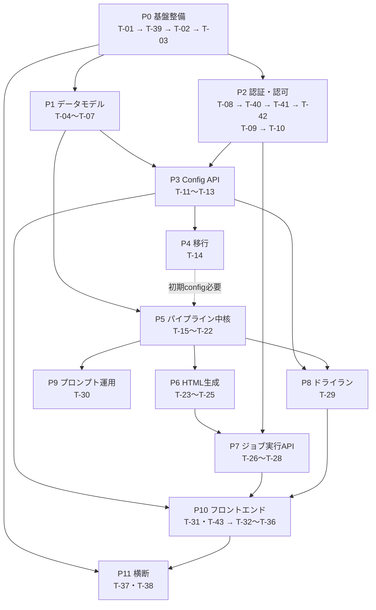

# 実装タスク一覧 — AI動向把握アプリケーション

> **このドキュメントの位置づけ**
> [`docs/spec.md`](./docs/spec.md)（仕様書 What/Why）と [`docs/design.md`](./docs/design.md)（設計書 How）を入力として、
> 設計書が扱う10項目（仕様書 §15-1〜10）と設計判断4項目（設計書 §11 A〜D）を **実装可能な単位のタスク** に分解し、
> **依存関係の順序** で並べたもの。
> 章参照は、断りがなければ **設計書** の §N（設計書は仕様書の章を §N と併記している）。
>
> **関連ドキュメント**
> 現時点では着手しない将来構想（過去記事の検索機能、記事データのDB蓄積など）は [`docs/future-roadmap.md`](./docs/future-roadmap.md) に分離している。
> **本ドキュメントは確定した実装バックログのみを扱う。**
>
> **更新ルール**
> - タスクを完了したら `- [x]` にする。分割・追加は末尾に `T-39` 以降を足し、既存IDは再利用しない。
> - 設計判断を変える場合は「§1 確定済み設計方針」を先に更新し、影響するタスクの「備考」に理由を残す。
> - 仕様書・設計書の確定値（7カテゴリ / 10タグ / 6軸100点 / 13除外ルール / enum / 配色 / xlsx列）は**変更しない**。

---

## 1. 確定済み設計方針

実装開始前に確定した方針。**タスク着手時にここへ戻って矛盾がないか確認すること。**

### 1.1 アーキテクチャ方針（プロジェクト決定）

| 論点 | 決定 | 根拠 |
|---|---|---|
| **開発の優先順位** | **社内連携が不要で、手元だけで完結して動くものを最優先**。Docker・SSO・クラウドストレージなど外部依存を必要とするものは後回し | 上司・PM のフィードバックを早く得ることを優先するため。環境構築の重さがボトルネックになるのを避ける |
| **永続化** | **ファイルが正**。`config.json` / 中間xlsx / 生成HTML / `raw_articles.json` / `validation_*.json` は実ファイルとして扱う。ただし **監査ログ・config改訂履歴は DB** で管理 | §8・§13.4 がファイルを処理の受け渡し単位とする前提。PROMPT-3 も xlsx を入力として読む。監査・履歴は §4.4・§6.3 |
| **DB 製品** | **当面は SQLite**（Docker 不要・手元完結）。**後から PostgreSQL へ切り替えられる形を維持**する：SQLAlchemy のモデル定義に閉じ込め、DB 固有機能に依存しない。接続先は設定 1つで切り替える | 手元優先の方針による。PostgreSQL が本当に必要になるのは全文検索・ベクトル検索（[future-roadmap.md](./docs/future-roadmap.md) 構想1）を実装するとき |
| **中間生成物の上書き** | **設計判断B**：正規名（固定名/シート）は upsert、旧版は `_history/{period}/{revision}_{run_id}/` へスナップショット退避（TTL・世代上限あり） | §11-B |
| **AI利用範囲** | **ハイブリッド**。<br>・**crawl** = AI + web検索<br>・**filter** = 分類・10タグ付与・6軸採点・要約は AI、**除外ルール判定・しきい値・重複判定・§12フォーマットチェックは決定的 Python で強制**<br>・**render** = 決定的 Python テンプレート | §7.1・§9.1・§10.1 のメールHTML厳密制約と §14 の再現性・冪等性要件を守るため。採点の再現性とスコア整合（§12）も決定的側で担保 |
| **AI呼び出し方式** | **Claude Code CLI（`claude -p` によるヘッドレス実行）を使う。Anthropic API は使わない**。認証は**会社の Team 契約**（APIキー不要）。呼び出しは **「AIクライアント層」1箇所に抽象化**し、実装を差し替えられる形にしておく | 2026-08-14 決定。上司より、**Team 契約の Claude Code CLI をアプリの自動処理に使う許可を得ている**。ただし**これは試作段階の手段**で、本番（将来の AWS 展開時）は Anthropic API 等への切り替えを想定する（`claude -p` は PC 起動が前提で無人運用に向かない）。詳細は下の「備考：AI呼び出し方式」 |
| **PROMPT-3 の扱い** | 将来 render を LLM 生成へ切り替える可能性に備え、`prompts/` に **運用ドキュメントとして残す**（実行経路には接続しない） | §9 のプロンプト運用設計を維持 |
| **認証** | **ID（メールアドレス）／パスワード認証を自前で実装する**。**SSO 連携はやらない**（→ [future-roadmap.md](./docs/future-roadmap.md) 構想3「将来の選択肢」へ格下げ）。パスワードのハッシュ化は **Passlib + bcrypt** に委ね、**自前でハッシュ処理・ソルト生成を書かない** | 社内IT担当の確認待ちで認証が着手できない状態を解消するため。「手元だけで完結して動くものを最優先」の方針（本表1行目）にも、外部IdP に依存しない自前認証のほうが合う。ハッシュは自作が最も事故りやすい領域なので実績あるライブラリに委ねる |
| **ユーザー登録とロール付与** | **自己登録可**（`POST /auth/register`）。**登録直後は全員 `viewer`** で、それ以外のロールは自己申告できない。`editor` / `admin` への昇格は **admin のみ**が実行できる（`PATCH /users/{user_id}/role`）。**最初の admin は CLI（`make create-admin`）で作る**（ブートストラップ問題の解消） | 「昇格は admin だけ」を守るには、登録経路がロールを一切受け取らない設計にするのが確実。最初の1人だけは API 経由で作れない（admin がいないと昇格できない）ため、DB へ直接書く CLI を正式な手段として用意する |
| **ログイン状態の保持** | **DB に永続化する不透明セッション ＋ HttpOnly Cookie**（`sid`）。**JWT（自己完結トークン）は使わない**。ロールは**リクエストごとに DB のユーザー行から解決**する。cron 等の非対話クライアント（`system`）だけは Cookie を持てないため、**サービストークン**（`Authorization: Bearer`）を別経路として用意する | **昇格・降格が即時に効く必要がある**のが決め手。JWT はロールをトークンへ焼き込むため、admin が降格しても有効期限まで旧ロールで通ってしまう。セッションなら**失効（ログアウト・パスワード変更・アカウント停止）をサーバー側で即時に行える**。鍵管理・ローテーションが不要で、規模的にも DB 参照1回のコストは問題にならない |
| **認可** | **RBAC は本実装**（§6.2 権限マトリクス、サーバー側判定、config は admin 以外に**存在も中身も返さない**）。従来方針から変更なし。認証の実装方式が変わっても、**認可は `Principal`（ロール＋ユーザ識別子）だけに依存する**よう境界を保つ | §2 重要要件・§6.1・§4。認証（誰か）と認可（何をしてよいか）を分けておけば、将来 SSO を足しても T-09 以降に手を入れずに済む |
| **スケジューラ** | **外部 cron → `POST /run`**。アプリはジョブ実行APIと状態機械のみを持ち、タイミング制御は外部（cron / Cloud Scheduler 等）に委ねる。ローカル用に `make run-weekly` / `make run-monthly`。本番 cron 登録手順は インフラ確定後に README へ追記（TODO項のみ先に作る） | §8.1〜8.4。二重起動しない構成・冪等性（§14）は維持 |
| **成果物の形（2026-08-18 変更）** | **週刊は業界版を廃止し、業界を問わない「週次ダイジェスト1本」**。**月刊は全業界1冊**のままで、業界の絞り込みは**Web 閲覧時のタグフィルタ**で行う（月刊に「業界共通動向」セクションは設けない） | 2026-08-18 の顧客要件変更。業界版を配るほど読み手が分かれておらず、1週あたり N 通を作る運用コスト（生成テキストが業界数ぶんの AI 往復＝1回数分）に見合わない。絞り込みは読む側の操作で足りる。詳細は下の「備考：成果物の再定義」 |
| **閲覧形式（2026-08-18 変更）** | **メール版 HTML（table＋inline style 制約）は廃止**し、**Web 版が唯一の閲覧形式**。ただし **HTML 生成そのものは続け、ファイルが正**（xlsx・`narrative_*.json` の構造も不変）。外れるのは**レンダラの体裁制約だけ**。将来メール配信が復活する場合は**レンダラを追加**して対応する | 配信基盤（メール送信）は仕様書 §1.3 でスコープ外のままで、**実際に配られていない**のに table レイアウト制約を守り続けていた。制約を外すと表現の幅が広がる。⚠️ 「制約を外す」＝「HTML をやめる」ではない（§8「ファイルが正」・PROMPT-3 が xlsx → HTML を入力/出力とする構成は維持） |

#### 備考：成果物の再定義（週刊=週次ダイジェスト1本 ／ 月刊=全業界1冊＋Web絞り込み ／ メール版廃止。2026-08-18 変更）

2026-08-18 の顧客要件変更により、**成果物の単位と閲覧形式を作り直す**（→ 実装は **T-52**）。
これまでで最も大きい仕様差分で、**仕様書 §1.2・§9・§10 の根幹に触れる**（→ **T-38 の筆頭項目**として記録済み）。

| 項目 | 変更前 | 変更後 |
|---|---|---|
| 週刊の単位 | **業界版**（対象業界ごとに1通。T-46 Step 4） | **週次ダイジェスト1本**（業界を問わない） |
| 週刊の構成 | 業界関連トピック ＋ 業界共通トピックの2セクション | **点数順の単一リスト**（業界振り分けなし） |
| 週刊の「今週のポイント」 | 3〜4文の総括（業界視点） | **各文を見出しにし、文ごとに詳細1段落**（箇条書き＋クリック展開の材料） |
| 月刊の単位 | 全業界1冊 | **全業界1冊のまま**（変更なし） |
| 月刊の業界絞り込み | なし | **Web 閲覧時のタグフィルタ**（事例カードに業界タグ／業界チップで絞る） |
| 月刊の「業界共通動向」 | — | **設けない**（章立ては従来どおり事例のテーマで束ねる） |
| 閲覧形式 | メール版 HTML が配信物、Web 版はその「別の見せ方」 | **Web 版が唯一の閲覧形式**。メール版 HTML の制約は廃止 |

**変更しないもの（この変更で動かさない確定値）**

- **中間xlsx の週次22列 / 月次8列 / 除外ログ6列**（§8.1・§8.2）と **enum**（§5.2）。
- **`narrative_{period}.json` を filter が書き render が読む**という受け渡し（2026-08-16 の決定3）。
  既存フィールドは**拡張のみ**で、意味を変えない。
- **図解（T-49）** は週刊 Web 版・月刊の両方で維持する。
- **§1.1「render = 決定的 Python テンプレート」**（レンダラは AI を呼ばない）。
- **HTML を生成してファイルとして置くこと自体**（`GET /files` からも従来どおり取得できる）。

**⚠️ 「メール版廃止」の意味を取り違えないこと**

- 廃止するのは **table＋inline style・`<style>`/flex/grid 禁止という体裁の制約**と、
  **閲覧ページからの「メール版 HTML を開く」導線**だけ。
- **HTML の生成は続ける**（§8「ファイルが正」・PROMPT-3 の入出力・設計判断B の履歴退避はどれも変わらない）。
- 将来メール配信が復活したら、**制約付きレンダラを1つ足す**（今のレンダラを戻すのではなく、
  出力先ごとにレンダラを持つ形にする）。そのときのために §7.1 の制約検査
  （`assert_mail_safe()`）をどう扱うかは **T-52 Step 3** で判断する。

#### 備考：PostgreSQL 前提からの差分（2026-08-13 変更）

当初この表は **「監査ログ・config改訂履歴は PostgreSQL」** としており、リポジトリもその前提で生成されていた
（`asyncpg` / `compose.yml` の postgres:15.7 / `database_url` が `postgresql+asyncpg://` 固定 / CI に postgres サービス）。

**「社内連携が不要で手元完結するものを優先する」方針の確定に伴い、当面の DB を SQLite に変更した。**

| 項目 | 変更前 | 変更後 |
|---|---|---|
| DB 製品 | PostgreSQL（Docker 必須） | **SQLite**（Docker 不要） |
| ローカル起動 | `make up` で postgres 起動が必要 | **`make up` 不要**。`make migrate-all` だけで動く |
| 接続 URL | `postgresql+asyncpg://` 固定 | `DB_BACKEND` で切替（既定 `sqlite`） |
| compose.yml | ローカル開発に必須 | **将来の PostgreSQL 移行用に残す**（手元動作には不要） |

- 切り替え作業は **T-39** で実施する。
- **PostgreSQL へ戻す/移行する道は塞がない**：モデル定義は SQLAlchemy に閉じ込め、DB 固有機能（`JSONB`・配列型・`tsvector`・pgvector 等）を使わない。
- PostgreSQL が本当に必要になるのは検索機能の実装時（[future-roadmap.md](./docs/future-roadmap.md) 構想1・2）。

#### 備考：SSO 前提からの差分（2026-08-13 変更）

当初この表は **「認証は開発用スタブのまま進め、後から SSO（OIDC）を差し込む」** としていた。
根拠は仕様書 §1.3 の「認証基盤の新規構築は含まない（**既存SSO前提でよい**）」と、設計書 §3.1 の「認証は既存 SSO 前提。ロールはトークンのクレームから解決」。

**方針確定により、SSO 連携をやめ、ID/PW 認証を自前で実装することにした。**

| 項目 | 変更前 | 変更後 |
|---|---|---|
| 認証方式 | 既存 SSO（OIDC）前提。手元は開発用スタブ | **ID（メール）/ パスワードを自前実装**（スタブは廃止） |
| ID の発行元 | 社内 IdP | **本アプリの `users` テーブル**（自己登録） |
| ロールの取得元 | トークンのクレーム | **DB のユーザー行**（リクエストごとに解決） |
| ログイン保持 | 未定（IdP 依存） | **DB 永続セッション ＋ HttpOnly Cookie** |
| 初期 admin | IdP 側で付与 | **CLI `make create-admin`** |
| SSO | 前提（別タスクで実装） | **やらない**。将来の選択肢へ格下げ（[future-roadmap.md](./docs/future-roadmap.md) 構想3） |

**変更の理由**

1. **社内IT担当への確認待ちがボトルネックだった。** SSO 連携方式が決まるまで認証が着手できず、P2（認可）以降が「スタブのまま進める」以外に選べなかった。自前認証なら手元だけで完結して動く（本表1行目の最優先方針と一致）。
2. **スタブのまま P3 以降へ進むリスクを断てる。** 「config は admin 以外に存在も中身も返さない」（§2 重要要件）が最重要要件である以上、ロールの出どころが偽装可能なスタブのまま機能を積み上げるのは望ましくない。
3. **要件が自前で満たせる規模だった。** 必要なのは社内利用者向けのログインと3ロールの出し分けだけで、IdP に委ねなければ実現できない要件（多要素認証・SCIM プロビジョニング・他システムとのシングルサインオン）は現時点で挙がっていない。

**スコープ上の注意（要確認事項 #4 に転記済み）**
本変更は **仕様書 §1.3 の「認証基盤の新規構築は含まない」というスコープ定義に対する明示的な差分**である。実装工数が増える方向の変更なので、仕様書 §1.3 と設計書 §3.1 の記述をこの方針に合わせて改訂する必要がある（→ T-38）。

**SSO へ戻す道は塞がない**：認可（T-09 以降）は `Principal`（ロール＋ユーザ識別子）だけに依存させ、「リクエスト → `Principal`」の解決だけを `AuthenticationBackend` プロトコルの内側に閉じ込める。将来 SSO を足す場合は、この実装をもう1つ追加して DI を差し替える（T-08）。ただし**そのときはロールの正となる場所（本アプリの DB か IdP か）を決め直す必要がある**ので、差し替え口を残すこと＝SSO 対応済みではない。

#### 備考：AI呼び出し方式（Anthropic API → Claude Code CLI、2026-08-14 決定）

当初この表と T-01・T-15 は **Anthropic API（`anthropic` SDK ＋ `ANTHROPIC_API_KEY`）** を前提としていた
（`pyproject.toml` の `anthropic>=0.116` / `config.py` の `anthropic_api_key` / `anthropic_model`）。

**パイプライン（crawl / filter / render）の AI 呼び出しは、Claude Code CLI（`claude -p` によるヘッドレス実行）に変更する。**

| 項目 | 変更前 | 変更後 |
|---|---|---|
| 呼び出し経路 | Anthropic API（`anthropic` SDK） | **Claude Code CLI（`claude -p`）をサブプロセスとして実行** |
| 認証 | `ANTHROPIC_API_KEY`（未発行＝要確認事項 #3） | **会社の Team 契約**（Claude Code のログイン済みセッション。**APIキー不要**） |
| 利用許可 | 未確認 | **上司より、Team 契約の Claude Code CLI をアプリの自動処理に使う許可を得ている** |
| 実行前提 | サーバープロセスから直接 HTTP | **CLI がインストールされ、ログイン済みの PC 上で動くこと** |

**なぜこうするか**

1. **APIキーの発行を待たずに着手できる。** 要確認事項 #3（API キーの発行と利用枠）が P5 のボトルネックになっていた。Team 契約で使える CLI なら手元だけで完結する（§1.1 1行目「社内連携が不要で手元だけで完結して動くものを最優先」と一致）。
2. **追加のコスト管理が要らない。** 従量課金の API と違い、Team 契約の範囲で動く。

**⚠️ これは試作段階の手段であり、本番の想定ではない**

- `claude -p` は **CLI がインストールされ、ログイン済みの PC が起動していること**が前提。**本番（将来の AWS 展開時）の無人運用には向かない**（cron が回るサーバー上に対話ログイン済みの CLI を置くことになる）。
- **本番では Anthropic API 等への切り替えを想定する。** 切り替えのトリガーは AWS への展開、または無人での定期実行が要件になった時点。
- **切り替えは「AIクライアント層」の差し替えで対応する。** そのために、**AI を呼ぶ箇所を1箇所に抽象化しておく**（→ T-15）。`ArtifactStore`（ローカル → S3）や `AuthenticationBackend`（ID/PW → SSO）と同じ扱い方をする。
  - 上位（T-16 crawl / T-19 分類・採点）は**プロンプトと出力スキーマだけを渡し、CLI かAPIかを知らない**こと。
  - 差し替え口は **DI 1箇所**に閉じる（`AuthenticationBackend` の `get_authentication_backend()` と同じ形）。
- 申し送りは [future-roadmap.md](./docs/future-roadmap.md)「現在の割り切り」→「AI 呼び出し：当面は Claude Code CLI」にも記録した。

**影響するタスク**

- **T-15**：`anthropic` SDK ラッパ → **AIクライアント層＋ Claude Code CLI 実装**へ書き換え（完了条件を更新済み）。
- **T-16 / T-19**：呼び出し先が T-15 の抽象に変わるだけで、責務の分割（AI が返すのは分類と点数だけ・しきい値と合計は Python）は**変更しない**。
- **T-01**：`anthropic` 依存と `anthropic_api_key` は**削除しない**（本番切り替え時にそのまま使う）。`anthropic_model` は CLI 実装でも `--model` に渡すので流用する。
- **要確認事項 #3**：API キーの発行は**本番切り替え時まで不要**になった（表を更新済み）。
- **T-38**：設計書 §6・§9 が「Claude API」と書いている箇所を、この方針に合わせて改訂する必要がある。

### 1.2 設計判断A〜D の採用結果（設計書 §11）

| 判断 | 採用 | 実装タスク |
|---|---|---|
| **A** `scoring_axes.weight` 合計100の担保 | **保存拒否（422）＋ UI に「比率維持で100へ補正」補助ボタン**（自動正規化はしない） | T-05 / T-33 |
| **B** 中間ファイル上書き vs バージョン退避 | **正規名は上書き ＋ 履歴退避**（TTL・世代上限で肥大抑制） | T-02 / T-22 |
| **C** ドライラン結果の出力先 | **一時ファイル（隔離パス `scratch/dry-run/{id}/` ＋ TTL）**。件数サマリは同ファイルから集計して即返し | T-02 / T-29 / T-35 |
| **D** config編集の画面配置 | **管理専用サブ画面 `/admin/config`**（週刊/月刊いずれのナビからも同一ルートへ、実体は単一モジュール） | T-32 |

---

## 2. フェーズと依存関係



**着手順の要点**

- **P0 → P1 → P2 が最優先**。P2（認証・認可）を Config API より前に置くのは、「config は admin 以外に露出しない」（§2 重要要件・§6.1）を**後付けにしないため**。
- **P0 内の順序は T-01 → T-39 → T-02 → T-03**。T-39（SQLite 化）を T-03（ORM）より前に置くのは、DB 基盤が固まらないうちにマイグレーションを書くと作り直しになるため。
- **P2 内の順序は T-08 → T-40 → T-41 →（T-09 → T-10）→ T-42**。ID/PW 認証の自前実装（§1.1「認証」）に伴い、認証の実体（T-08・T-40・T-41）が認可（T-09）より前に来る。T-42（ロール昇格 API）は admin 限定の認可判定が要るので T-09 の後。**T-09 と T-10 は T-40 と並行して進められる**（`Principal` の形さえ決まっていれば認可側は書ける）。
- P4（移行）は P5 より前に済ませておくと、パイプラインが実データの `config.json` で動かせる。
- P6 は P5 の xlsx 出力が正しく揃ってからでよい（入力が中間xlsx のため）。
- P10（フロント）は P3 と P7 の API が確定してから。OpenAPI 型生成を挟むので API 変更が落ち着くまで待つのが安全。

---

## 3. タスク一覧

### P0. 基盤整備

#### - [x] T-01: 依存追加と設定拡張
- **対応**: §0（全体方針）／§14
- **依存**: なし
- **成果物**: `backend/pyproject.toml`, `backend/src/config.py`, `backend/.env.example`
- **完了条件**:
  - `anthropic`（Claude API SDK）, `openpyxl`（xlsx 読み書き）を依存に追加し `uv lock` が通る
  - `Settings` に以下を追加：`anthropic_api_key`, `anthropic_model`（既定 `claude-opus-5`）, `artifact_root`（成果物ルート）, `scratch_ttl_hours`（既定24）, `history_max_generations`, `timezone`（既定 `Asia/Tokyo`）
  - `.env.example` に上記すべてを追記（既存の記法に合わせる）
  - `make lint` / `make test` が通る
- **備考**: モデルIDは `claude-opus-5`（日付サフィックスを付けない）。TZ は `Asia/Tokyo` 固定、ISO週は月曜始まり（§0・§14）。
  - 実績: `anthropic==0.121.0` / `openpyxl==3.1.5` で解決。派生プロパティ `tzinfo` / `scratch_root`（設計判断C）/ `history_root`（設計判断B）も追加済み。
  - ⚠️ **`.env.example` は Claude Code の `.env*` ガードレールにより AI が直接編集できない。** 以降 `.env.example` の更新を伴うタスク（T-08 認証スタブ、T-15 APIキー等）は、追記ブロックを提示して**手動で反映してもらう**運用とする。

#### - [x] T-39: DB 基盤を SQLite へ切り替え（PostgreSQL 移行の道は残す）
- **対応**: §1「確定済み設計方針」／[future-roadmap.md](./docs/future-roadmap.md)「現在の割り切り」
- **依存**: T-01
- **成果物**: `backend/pyproject.toml`, `backend/src/config.py`, `backend/src/adapter/database/database.py`, `backend/compose.yml`, `backend/Makefile.db.mk`, `backend/.github/workflows/ci.yml`, `backend/.gitignore`, `backend/README.md`, `backend/.env.example`
- **完了条件**:
  - `aiosqlite` を依存に追加（`asyncpg` は **PostgreSQL 移行用に残す**）
  - `Settings` に `db_backend`（`sqlite` | `postgresql`、**既定 `sqlite`**）と `sqlite_path` を追加し、`database_url` が backend に応じて分岐する
  - SQLite ファイルの親ディレクトリが存在しなくても起動できる（接続時に作成）
  - **`make up`（Docker）なしで `make migrate-all` → `make dev` → `/healthz` `/readyz` が通る**
  - `compose.yml` は削除せず、**将来の PostgreSQL 移行用であり手元動作には不要**である旨をファイル冒頭に明記
  - `Makefile.db.mk` の `up` / `down` / `db-init` が **PostgreSQL 専用**であることを `help-db` の表示とコメントで明示。`migrate-*` は両 backend で動く
  - CI から postgres サービスと `DB_*` 環境変数を外し、SQLite で `alembic upgrade head` → `make test-ci` が通る
  - `.gitignore` に SQLite ファイル（`*.db` 等）を追加
  - README に「手元は SQLite・Docker 不要」「PostgreSQL へ切り替える手順」を追記
  - `make lint` / `make test` が通る
- **備考**:
  - **DB 固有機能を使わない**こと（`JSONB`・配列型・`tsvector`・pgvector 等）。JSON は SQLAlchemy の汎用 `JSON` 型を使う。これが PostgreSQL へ戻せることの担保。
  - 後から追加したタスクだが、**実行順は T-01 の直後**（T-03 が DB 基盤に依存するため）。
  - `.env.example` はガードレールにより AI が編集できないため、追記ブロックを提示して手動反映する（T-01 備考参照）。

#### - [x] T-02: 成果物ストレージ層（ArtifactStore）
- **対応**: §8.2・§14／設計判断B・C
- **依存**: T-01
- **成果物**: `backend/src/adapter/storage/artifact_store.py`, `backend/tests/adapter/test_artifact_store.py`
- **完了条件**:
  - 正規名パス解決：`weekly_ai_intelligence_report.xlsx` / `monthly_ai_leading_cases.xlsx` / `raw_articles_{period}.json` / `validation_{period}.json` / `weekly_ai_intelligence_newsletter_{industry}_{period}.html` / `monthly_belief_{period}.html`
  - **原子的書き込み**（一時ファイル→rename）で、書き込み途中の成果物が読まれない
  - **世代退避**：正規名を上書きする前に `_history/{period}/{revision}_{run_id}/` へスナップショットを退避（設計判断B）。`history_max_generations` を超えた古い世代を削除
  - **隔離パス**：`scratch/dry-run/{dry_run_id}/` への出力と、`scratch_ttl_hours` を過ぎたディレクトリの掃除（設計判断C）
  - 入出力はすべて UTF-8（§14）
- **備考**: ここが「ファイルが正」方針の唯一の入口。以降のタスクは直接 `open()` せずこの層を経由する。

#### - [x] T-03: 監査ログ・config改訂履歴の ORM モデルとマイグレーション
- **対応**: §4.4・§6.3・§14
- **依存**: T-01, T-39
- **成果物**: `backend/src/adapter/database/models/audit_log.py`, `backend/src/adapter/database/models/config_revision.py`, `backend/migrations/versions/*.py`
- **完了条件**:
  - `audit_log`：`audit_id`(PK) / `event_type`(`config_update`|`run_start`|`run_finish`|`artifact_created`) / `actor` / `at` / `revision` / `diff`(JSON) / `target` / `period`（§4.4 のスキーマそのまま）
  - `config_revision`：`revision`(int) / `updated_at` / `updated_by` / `config_snapshot`(JSON) / `diff_summary` — `GET /config/history`（§3.3）が返せる形
  - 雛形 `adapter/database/models/example_item.py` を削除し、`models/__init__.py` の import を更新（`migrations/env.py` が metadata を拾えること）
  - `make migrate-all` が空DBに対して通る／`make test` が通る（**SQLite で完結。Docker 不要**）
- **備考**: モデルを `adapter/database/models/` に置けば `migrations/env.py` が自動で metadata に登録する。
  - **DB 固有型を使わない**（`JSONB` ではなく汎用 `JSON`、`ARRAY` は使わない）。PostgreSQL へ移行できる状態を保つため（§1 備考）。
  - SQLite は `ALTER TABLE` の制約が強いため、Alembic の `batch_alter_table` を使う前提で書く。
  - 実績: **SQLite が timezone を落とす**（`+09:00` を渡しても naive で返る）のに対し PostgreSQL の `TIMESTAMPTZ` は保持するため、そのままだと移行時に挙動が変わる。`adapter/database/types.py` の `UtcDateTime`（UTC 正規化する `TypeDecorator`）で両者を揃えた。naive datetime は保存時に拒否する。

---

### P1. データモデル（設計書 §2 ／ 仕様書 §15-2）

#### - [x] T-04: `config.json` のモデルと JSON Schema
- **対応**: §2.1（→ 仕様書 §5.2）
- **依存**: T-01
- **成果物**: `backend/src/enterprise/entities/config.py`, `backend/schemas/config.schema.json`（生成物）, `backend/tests/enterprise/test_config_model.py`, `backend/src/adapter/cli/export_config_schema.py`, `backend/tests/enterprise/data/config_initial.json`, `backend/Makefile`, `backend/README.md`
- **完了条件**:
  - Pydantic モデルで §2.1 の構造を表現：`meta` / `information_categories`(7件固定) / `required_tags`(10件固定) / `scoring_axes`(6件固定) / `scoring_total`(=100) / `exclusion_rules`(13件固定) / `enums` / `tunable_thresholds` / `source_whitelist_hint`
  - **固定IDは `Literal` で型表現**：カテゴリ7ID・タグ10ID・軸6ID（§5.1「変更すると中間xlsx互換が壊れる」）
  - **可変項目**（`weight` / `severity` / `enabled` / `priority` / `tunable_thresholds`）は通常フィールドとして可変
  - `additionalProperties: false` 相当（未知キーを拒否）
  - モデルから JSON Schema（draft 2020-12）を出力するコマンド／テストを用意し、§2.1 の Schema と構造が一致
- **備考**: enum の日本語値（`reliability` の「高/中/要確認/低」等）は確定値。推測で変更しない。
  - 実績: ルートモデルは `IntelligenceConfig`（`src/config.py` の `Settings` と混同しないため `AppConfig` は避けた）。共通の `_StrictModel` が `extra="forbid"` を付与＝§2.1 の `additionalProperties: false`。
  - 生成コマンドは `make config-schema`（`--check` で最新かを検査＝`make config-schema-check`）。**生成物のドリフトはテストが検出する**（`test_committed_schema_file_is_up_to_date`）。
  - `$defs` のキーをスネークケースへ寄せる `ConfigJsonSchemaGenerator` を入れ、§2.1 が参照する `#/$defs/priority` / `#/$defs/severity` と名前を一致させた。
  - §2.1 との差分は表現の違いのみ（Pydantic はネストモデルを `$ref` に切り出す／`const` に `type` を併記する／`updated_at` の nullable を `anyOf` で書く）。意味は同じで、テストで1項目ずつ突き合わせている。
  - 仕様書 §5.2 の確定 config を `tests/enterprise/data/config_initial.json` へ逐語でコピーし、**実データがそのまま通ること**と `model_dump(mode="json")` のラウンドトリップ一致（キー順込み）をテストで固定。~~**T-14 のフォールバック（xlsx が入手できない場合の初期 config）はこのファイルを本番位置へ移して使う。**~~ → **2026-08-14: xlsx を入手したのでフォールバックは不要になった。** このファイルは **T-14 の受け入れ基準**（xlsx から起こした config と全キー比較する相手）として使っている。
  - クロスフィールド制約（Σweight==100 / 降順整合 / 参照整合）は**この層では意図的に弾かない**。`test_cross_field_rules_are_not_enforced_here` で境界を明示済み。T-05 が担当。

#### - [x] T-05: クロスフィールドバリデータ
- **対応**: §2.1.1（→ 仕様書 §7.4）／設計判断A
- **依存**: T-04
- **成果物**: `backend/src/enterprise/entities/config_validation.py`, `backend/tests/enterprise/test_config_validation.py`, `backend/tests/enterprise/conftest.py`
- **完了条件**: §2.1.1 の6項目をすべて実装し、違反時は「どのパスがなぜダメか」を返す：
  1. `Σ scoring_axes[].weight == 100` — **不一致は保存拒否**（自動正規化しない＝設計判断A）
  2. `propose_next_meeting ≥ reference_info ≥ share_only ≥ min_total_score_to_publish`（降順整合）
  3. `weekly.target_industry ∈ enums.industry`（参照整合）
  4. `required_tags[*].value_source` が `enums.*` を指すとき、その enum キーが実在
  5. ID系（category/tag/axis の `id`）が現行値と不一致なら **422**
  6. 初期値（`min_total_score_to_publish=60` 等）が §5.2 実データと一致することを検証できる（移行時に使用）
- **備考**: 「保存拒否」を選んだ理由は §11-A（band が整数レンジのため按分で非整数 weight が生まれ、§12 検証と採点の再現性を損なう）。UI 側の補正ボタンは T-33。
  - 実績: 違反は例外ではなく `ConfigIssue`（`path` / `reason` / `code`）のリストで返す。**早期 return せず全項目を評価**するので、admin は一度の保存で複数の違反をまとめて直せる（T-34 の表示要件）。`path` は Pydantic の `loc` と同じドット区切り（`scoring_axes.0.weight`）で、モデル由来の 422 とこの層の 422 をフロントが同じ方法でフィールドへマッピングできる。
  - `code`（`ConfigIssueCode`）は設計書 §3.3 の `{path, reason}` に足した機械可読キー。**T-33 の「比率維持で100へ補正」ボタンは `weight_sum_mismatch` を見て出し分ける**想定。
  - 入口は3つ: `validate_config`（1〜5・保存前に必ず通す）/ `validate_initial_config`（6・移行専用）/ `ensure_valid_config`（違反時 `ConfigValidationError`。T-11 の検証済み書き込み・T-14 の「失敗時は書き込まず中断」用）。
  - **設計判断A の担保**: `test_weight_sum_violation_never_normalizes_the_input` で「検証後も入力 weight が変わっていない」ことを固定した。モジュール冒頭にも「この層に正規化処理を足さないこと」を明記済み。
  - 項目1 の `path` はセクション（`scoring_axes`）。合計のズレを特定の1軸へ帰属させられないため（§3.3 の 422 例も同じ）。項目2 は崩れた隣接ペアごとに1件返し、`path` は「高すぎる側」に置く（フォーム上で直す欄が1つに定まる）。
  - 項目5 の「現行値」は **`config.py` が `Literal` で固定している正準ID列** と解釈した。保存済み config はすべてこの検証を通っているので、正準列との比較＝ひとつ前の revision との比較になる。モデルが弾けない「重複＋欠落の組み合わせ」と「並び順の変更」をここで拾う。
  - ⚠️ 項目5 に **`exclusion_rules[].no` を含めた**（§2.1.1-5 の明記は category/tag/axis の `id` のみ）。`no` はルールの同一性そのもので、重複すると除外判定（T-17。`no` 昇順で評価）が非決定的になるため。
  - 項目6 の期待値テーブル（`INITIAL_*`）は §5.2 の初期値。**テストで `data/config_initial.json` と突き合わせている**のでズレたら落ちる。件数（7/10/6/13）はモデル側の min/max_length で担保済みなので項目6 では扱わない。weight・priority・severity・enabled も見るので、`中〜高`→`mid_high`（§5.3）の正規化ミスはここで落ちる。
  - `data/config_initial.json` を読むフィクスチャ（`initial_raw` / `raw` / `config`）は `tests/enterprise/conftest.py` へ移した（T-04 のテストと共用）。

#### - [x] T-06: `raw_articles.json` / `validation_*.json` のスキーマ
- **対応**: §2.3・§2.4（→ 仕様書 §13.2・§12.2）
- **依存**: T-01
- **成果物**: `backend/src/enterprise/entities/raw_article.py`, `backend/src/enterprise/entities/validation_report.py`, `backend/src/enterprise/entities/json_document.py`, `backend/tests/enterprise/test_raw_article.py`, `backend/tests/enterprise/test_validation_report.py`
- **完了条件**:
  - `RawArticle`：`collected_at`(YYYY-MM-DD) / `published_at`(nullable) / `title` / `url` / `source` / `raw_summary` / `region_hint`(4値) / `primary_or_secondary`(3値)。配列としての読み書きが可能
  - `ValidationReport`：`{ ok: bool, errors: [{row, field, reason}], warnings: [...] }`
  - 不正な JSON はパス付きのエラーで落ちる（黙って通さない）
- **備考**: crawl 段階では重複しうる記事も落とさない（統合判定は filter の責務・§13.2）。
  - 実績: 「パス付きエラーで落とす」読み書きは2ファイルで共通なので `json_document.py` に切り出した（`DocumentIssue` / `DocumentParseError` / `parse_json_document` / `validate_json_data` / `dump_json_document`）。`path` は T-05 の `ConfigIssue.path` と同じドット区切りで、配列は要素番号が入る（`1.url` = 2件目の `url`）。**壊れた要素だけ読み飛ばす挙動は持たせていない**（黙って通さない）。1回のパースで全違反を返す。
  - **重複を落とさないことをテストで固定**: 同一URL2件・完全同一2件・同一発表の別媒体3件がすべて保持されること、さらに `dedup`/`unique`/`distinct` を名前に含む関数がこのモジュールに無いことも検査している（`test_the_module_exposes_no_deduplication_helper`）。順序も保つ（収集順が統合時の代表選定の手がかり）。
  - 日付は §2.3 どおり `pattern` 付きの**文字列**（`DateText`）。中間xlsx の日付列（T-07 の `ColumnKind.DATE`）と同じ表現で揃えた。加えて `AfterValidator` で**実在しない日付**（`2026-02-30` 等）も弾く（LLM 出力なので桁数だけ合った日付が来る）。T-18 の日付演算用に `collected_on` / `published_on` プロパティを持たせた。
  - `region_hint`（4値）と `primary_or_secondary`（3値）は **config の `enums.region`（3値）/ `enums.info_type`（5値）とは別物**。どちらも `不明` を持つ crawl 段階の当たりで、確定値は T-19 が決める。この差をテストで明示している（`test_crawl_hints_are_coarser_than_the_config_enums`）。
  - `additionalProperties: false` は crawl では特に効く。LLM が点数やタグを勝手に足してきたら弾く＝「この段階で採点しない」（§13.2）を型で強制できる。
  - ⚠️ **`ValidationReport` に `ok == (errors が空)` の整合チェックを入れた**。§2.4 のスキーマは `ok` を素の boolean としか書いていないので**設計書からの追加**。ただし §12.2 が「エラーがある記事は本編HTML生成の対象から除外」と定めているため、`ok=true` かつ `errors` あり を通すと不備のある記事が本編に載る。生成側（T-20）は `ValidationReport.from_issues()` を使えば `ok` を取り違えない。
  - `ValidationIssue.row` は §2.4 どおり素の `int`（下限を付けていない）。1-indexed の xlsx 行で、週次のデータ行は5行目から（T-07 の `first_data_row`）。

#### - [x] T-07: 中間xlsx の列スキーマ定義
- **対応**: §2.2（→ 仕様書 §8）
- **依存**: T-01
- **成果物**: `backend/src/enterprise/entities/report_columns.py`, `backend/tests/enterprise/test_report_columns.py`
- **完了条件**:
  - **週次22列**を順序込みで定数化（収集日 / 情報カテゴリ / タイトル / 一言要約 / 合計スコア / 緊急性鮮度_点 / 信頼性_点 / アドバイザリー活用度_点 / AI業界市場インパクト_点 / 実務活用可能性_点 / 顧客関連度_点 / レポート採用区分 / 実務活用可能性 / 顧客関連度 / 信頼性 / 地域 / 情報種別 / 業務領域 / 業界 / AIテーマ / ソース / URL）
  - **除外ログ6列**（収集日 / タイトル / URL / ソース / 除外区分 / 除外理由）
  - **月次8列**（No / トピック(章) / 企業・組織 / タイトル / URL / 出典 / 掲載月 / 解説）
  - 各列に型・値域・multi 区切り（`;`）・config 対応キーを持たせ、**writer と reader の双方がこの定義だけを参照**する
  - 軸点の上限合計が 100（10+10+15+20+20+25）であることをテストで固定
- **備考**: 設計書末尾の指示どおり、**この列定義と T-04/T-05 の Schema が単体テストの基準**になる。
  - 実績: 1列＝`ReportColumn`（frozen dataclass）。`name` / `kind` / `separator` / `value_range` / `value_source` / `axis_id` / `tag_id` / `required_non_empty` / `note`。`axis_id` と `tag_id` は `Literal` 型なので**軸ID・タグIDのタイポを `make type-check` が落とす**（確認済み）。
  - 定義そのものの矛盾は `__post_init__` で **import 時に** 落とす（区切りの無い multi 列 / 値域の無い数値列 / 逆転した値域）。実行時まで気づけない壊れ方を防ぐため。
  - **writer と reader が列順を知らなくて済む形**にした: `header_row()` / `format_row()` / `parse_row()` / `format_cell()` / `parse_cell()` をこのモジュールが提供し、ラウンドトリップ（write→read で元の dict に戻る）をテストで固定。T-22 と T-24/T-25 はこれだけを呼ぶ。
  - `parse_cell` は**型の復元だけ**。値域・enum 所属・非空は検査しない（§12 のフォーマットチェック＝T-20 の責務）。openpyxl が日付書式セルを `datetime` で返すケースは吸収する。
  - multi の区切りは**列ごとに違う**: 週次4列（地域/業務領域/業界/AIテーマ）は `;`、月次「企業・組織」は `・`（§8.2 `A・B`）、月次「解説」は `\n\n`（3段落）。グローバル定数1つでは足りないので `separator` を列の属性にした。
  - 軸点の上限＝その軸の `weight`。`test_axis_score_upper_bounds_sum_to_the_scoring_total` で **10+10+15+20+20+25＝100＝`scoring_total`** を固定し、さらに §5.2 の初期 weight と一致することも突き合わせている。weight は可変（§7.2）なので**実行時の上限は `axis_score_bounds(config)` を見る**（T-20 は静的な `value_range` ではなくこちらを使うこと）。
  - 列2 と 列12〜20 が**10必須タグと1:1**であることをテストで固定。各列の `value_source` が config の `required_tags[].value_source` と一致することも検証しており、ここがズレると T-20 が enum 外の値を検出できなくなる。
  - ⚠️ **§12.1 の非空必須リストに「タイトル」が入っていない**（挙がっているのは 一言要約 / URL / ソース / 収集日 ＋ 6軸点 ＋ 10タグ）。仕様に忠実に `required_non_empty=False` としたので、**タイトル欠落は T-20 では落ちない**。カード見出しに使う T-24 側でガードすること。仕様側を直す判断なら §12.1 に追記が必要。
  - ⚠️ **除外ログ・月次シートの前置き行が仕様書・設計書に未規定**。週次の各週シートだけが「1行目タイトル / 2行目説明 / 3行目空行 / 4行目ヘッダ」と明記されている（§8.1）ため、この2シートは1行目ヘッダとした（`EXCLUSION_LOG_SHEET` / `MONTHLY_CASE_SHEET`）。実ファイルが入手できたら要確認。
  - 週次の1行目タイトル・2行目説明の**文言**は T-22 の担当（このモジュールは行位置だけ持つ）。`除外区分` の語彙（完全除外／統合／フォーマット不備 等）は §2.2.2 が「等」と書いて閉じていないため enum 化せず、T-17/T-18/T-20 に委ねた。

---

### P2. 認証・認可（設計書 §4 ／ 仕様書 §15-4）

> **⚠️ このフェーズは 2026-08-13 の方針変更（§1.1「備考：SSO 前提からの差分」）で作り直されている。**
> 変更前は「認証は開発用スタブのまま・SSO は別タスク」だったが、**ID/PW 認証を自前実装する**ことになったため、
> 旧 T-08（スタブ1枚）を **T-08 / T-40 / T-41 / T-42** に分割した（フロント側は T-43）。
> 新 ID は既存 ID を再利用しない規則に従い T-40 以降を採番しているが、**実行順は上記のとおり P2 の中**（§2 の「着手順の要点」参照）。

#### - [x] T-08: ロール・ユーザーモデルとパスワードハッシュ（Passlib + bcrypt）
- **対応**: §4.1（→ 仕様書 §2・§6.1）／§1.1「認証」
- **依存**: T-01, T-03（DB 基盤・マイグレーション運用）
- **成果物**: `backend/src/enterprise/entities/principal.py`, `backend/src/enterprise/services/password.py`, `backend/src/adapter/database/models/user.py`, `backend/src/adapter/http/fastapi/auth/backend.py`, `backend/migrations/versions/*.py`, `backend/tests/enterprise/test_password.py`, `backend/README.md`
- **完了条件**:
  - `Role` = `admin` / `editor` / `viewer` / `system`、`Principal`（ロール＋ユーザ識別子）を定義。**認可（T-09）が参照するのはこの型だけ**で、パスワードやセッションの存在を知らない
  - `users` テーブル：`user_id`(PK) / `email`(**小文字正規化して一意制約**) / `display_name` / `password_hash` / `role` / `is_active` / `created_at` / `updated_at` / `password_updated_at`
  - **パスワードハッシュは Passlib の `CryptContext(schemes=["bcrypt"])` に委ねる**。`hash()` / `verify()` を薄く包むだけで、**ソルト生成・比較・エンコードを自前で書かない**（§1.1「認証」）
  - **bcrypt の 72 バイト上限**を踏まえ、パスワード長は**バイト長で検証**する（文字数ではない。日本語を含むと3バイト/文字で、24文字で上限に達する）。上限超過は**黙って切り詰めず 422**
  - パスワードポリシーは**長さのみ**（既定 12 文字以上・72 バイト以内）。記号必須等の複雑性要件は課さない
  - `verify_and_update` 相当でハッシュのコスト設定変更に追随できる（ログイン成功時に古いコストのハッシュを再計算して保存）
  - **`AuthenticationBackend` プロトコル**を維持（`resolve(request) -> Principal | None`）。差し替えは DI 1箇所で完結する。**旧スタブ実装は削除する**
  - 平文パスワード・ハッシュが**ログ・例外メッセージ・`repr()` に出ない**ことをテストで固定
- **備考**: 旧タスクは「開発用スタブ＋SSO 差し替え口」だった。**SSO をやらない方針の確定（§1.1 備考）**によりスタブを廃止し、実ユーザーモデルに置き換えた。`AuthenticationBackend` プロトコルだけは残すが、目的は「将来 SSO を足せる余地」であって SSO 対応済みという意味ではない。
  - ⚠️ **Passlib は更新が止まっており、新しい `bcrypt` パッケージとの組み合わせで問題が起きうる**（バージョン検出の失敗・バックエンド初期化の失敗）。**着手時にまず `uv add "passlib[bcrypt]"` して実際に hash/verify が通るかを確認し、必要なら `bcrypt` にバージョン上限を張る**こと。ここで詰まる場合の代替は Passlib を外して `bcrypt` を直接使うことだが、**それは「自前でハッシュ処理を書かない」方針からの逸脱になるので、採用するなら §1.1 を先に更新する**。
  - `role` は DB 上は文字列。`system` は**ログイン可能なユーザーではない**（T-41 のサービストークン用）ので、`users` に `system` 行を作らない制約をテストで固定する。
  - 認証まわりのテーブルは `audit_log` / `config_revision` と同じく **DB 固有型を使わない**（§1 備考／T-03）。
  - **実績（2026-08-13）**: `make lint` / `make type-check` / `make test`（408件）すべて通過。
  - ⚠️ **上の bcrypt 懸念は現実のものだった。** `uv add "passlib[bcrypt]"` は **bcrypt 5.0.0** を引き、`CryptContext.hash()` が `ValueError: password cannot be longer than 72 bytes` で**必ず失敗**した。原因は passlib 側で、バックエンド初期化時の `detect_wrap_bug()` が 72 バイト超の probe を渡すのに対し、bcrypt 5.0 が切り詰めをやめて例外にするようになったため。**`bcrypt>=4.0,<5` に固定して解決**（実測 4.3.0 で正常）。この上限を外すと動かなくなるので、理由を `pyproject.toml` のコメントに残した。**Passlib は外していない**＝「自前でハッシュ処理を書かない」方針は維持（§1.1 の更新は不要だった）。
  - bcrypt 4.x では passlib が起動時に `(trapped) error reading bcrypt version` の WARNING をトレースバック付きで1回吐く（`bcrypt.__about__` が 4.1 で消えたため）。動作に実害はないが本番ログで障害に見えるので、`_build_context()` で**バックエンドを先読みしてその1回だけ握る**（以降の passlib 警告は通常どおり出る）。
  - ⚠️ **72 バイト超は切り詰めず拒否する**実装にした。`test_truncation_would_have_collapsed_distinct_passwords` で「拒否しなかった場合に何が起きるか」（先頭72バイトが同じ別パスワードで照合が通る）を実測で固定している。**日本語は1文字3バイトで24文字が上限**なので、文字数で検証すると踏む。
  - 長さ検証の2つの違反（短すぎる／バイト超過）は**同時に起きない**（UTF-8 は1文字最大4バイト、11文字×4=44 < 72）。それでも `validate_password_policy` は早期 return せず全項目を評価する形にした（将来ポリシーが増えたときの前提崩れに備える）。この前提自体もテストで固定済み。
  - `verify_password` は**ポリシー検証をしない**。照合時に見ると `MIN_PASSWORD_LENGTH` を引き上げた瞬間に既存利用者が一斉にログイン不能になるため。テストで境界を明示（`test_verify_does_not_enforce_the_policy`）。
  - 壊れたハッシュ（DB 破損・移行ミス）は例外にせず `False` を返す。失敗理由を呼び出し元に区別させないため（T-40 のログイン失敗文言の統一と対）。
  - `system` 行の禁止は **DB の CHECK 制約**（`ck_users_role_is_assignable`）で担保。アプリ層のバリデーションだけだと CLI や将来の直接投入経路をすり抜ける。
  - メールは `normalize_email()`（trim + 小文字化）を通してから保存し、`unique` 制約と組み合わせて `Admin@…` / `admin@…` の二重登録を防ぐ。**すべての入口でこれを通すこと**（T-40・T-41）。
  - 平文・ハッシュの非露出は3方向から固定：`User.__repr__` がハッシュを含まない／`PasswordPolicyError` のメッセージに平文が入らない／hash・verify 中の全ログに平文とハッシュが出ない（`caplog`）。
  - Alembic の autogenerate は `UtcDateTime` を `adapter.database.types.UtcDateTime(...)` と描画するが、**マイグレーション側に `adapter` の import が無く NameError になる**。DDL は `sa.DateTime(timezone=True)` と同一（`UtcDateTime` は Python 側の TypeDecorator）なので、既存マイグレーション（T-03）と同じ表記へ手で直した。**次に `make migrate-create` する人も同じ修正が要る。**

#### - [x] T-40: セッション発行と認証エンドポイント（登録・ログイン・ログアウト）
- **対応**: §4.1・§3.1（→ 仕様書 §2・§6.1）／§1.1「ログイン状態の保持」
- **依存**: T-08
- **成果物**: `backend/src/adapter/database/models/session.py`, `backend/src/application/usecases/auth.py`, `backend/src/adapter/http/fastapi/auth/session_backend.py`, `backend/src/adapter/http/fastapi/routers/auth.py`（`all_routers` へ登録）, `backend/migrations/versions/*.py`, テスト
- **完了条件**:
  - `sessions` テーブル：`session_id`(PK) / `user_id` / `created_at` / `expires_at` / `last_seen_at` / `revoked_at`
  - **Cookie に入れる生トークンは DB に保存しない**。`secrets.token_urlsafe(32)` 相当の生トークンを発行し、**その SHA-256 ハッシュを `session_id` として保存**する（DB が漏れてもセッションを乗っ取られない）
  - Cookie は `sid`、**`HttpOnly` / `SameSite=Lax` / `Path=/`**、`Secure` は設定で切替（`session_cookie_secure`、既定 true。http の localhost 用に false にできる）
  - 有効期限：**絶対期限 7日 ＋ アイドル期限 8時間**（いずれも設定値）。アクセスのたびに `last_seen_at` を更新し、アイドル期限を延長する（絶対期限は延ばさない）
  - `POST /auth/register`：`{email, display_name, password}` → **常に `viewer` で作成**。**リクエストに `role` を含められない**（含めたら 422）ことをテストで固定＝§1.1「昇格は admin のみ」の実体
  - 登録可能なメールドメインを設定で制限できる（`auth_allowed_email_domains`）。**既定値は `sapeet.com`**（2026-08-13 決定＝要確認事項 #6）。空にすれば無制限にできるが、**既定を無制限にしない**。許可外ドメインが 422 で弾かれることをテストで固定する
  - `POST /auth/login`：成功で セッション発行＋Cookie 付与。**失敗時のレスポンスは「メールアドレスまたはパスワードが違います」の1種類のみ**（アカウントの存在有無を区別させない）
  - **総当たり対策**：同一アカウントへの連続失敗を数え、N回（既定5）でM分（既定15）ロック。ロック中も**エラー文言は上と同一**にする
  - **存在しないアカウントへのログイン試行でも、ダミーハッシュに対して `verify()` を実行する**（応答時間差でアカウントの存在が漏れないようにする）
  - `POST /auth/logout`：該当セッションを失効（`revoked_at`）し Cookie を削除。**べき等**
  - `GET /auth/me`：`{user_id, email, display_name, role}` を返す。フロントの出し分け（T-32・T-36）の入力
  - `POST /auth/password`：本人のパスワード変更。**現在のパスワードを要求**し、成功時は**そのユーザーの他セッションをすべて失効**させる
  - **ロールはリクエストごとに `users` 行から解決する**（セッション行にロールを焼き込まない）＝ 昇格・降格が次のリクエストから効く。**テストで固定**：ログイン中のユーザーを昇格 → 再ログインなしで新ロールの権限になる
  - `is_active=false` のユーザーはセッションが残っていても**即座に弾く**
  - **未認証は 401、認証済みだが権限なしは 403** に統一（T-09 と接続）
  - **CSRF 対策**：状態を変えるメソッド（POST/PUT/PATCH/DELETE）で `Origin` ヘッダを検証し、`cors_allowed_origins` の許可リスト外なら 403。`SameSite=Lax` と二重に効かせる
- **備考**: **JWT を選ばなかった理由は §1.1「ログイン状態の保持」の根拠列のとおり**（admin による降格が有効期限まで効かないため）。この判断をモジュール冒頭のコメントにも残すこと。
  - ⚠️ **開発時、フロント（Vite `:5173`）とバックエンド（`:8000`）はオリジンが異なるため、`SameSite=Lax` の Cookie が送信されない。** 対策として **Vite の dev proxy（`/api` → `http://localhost:8000`）を入れて同一オリジンにする**（T-43 の成果物に含める）。`SameSite=None` + CORS credentials は HTTPS 必須になり手元完結の方針に反するので採らない。
  - 期限切れセッション行の掃除（起動時 or ログイン時のついで削除）を入れる。テーブルが単調増加しない形にすること。
  - **実績（2026-08-13）**: `make lint` / `make type-check` / `make test` すべて通過。テストは **473件**（T-40 で追加したのは 65件：ユースケース 36 / ルーター 24 / モデル 5）。
  - **セッション ID のハッシュに bcrypt を使っていない**（SHA-256）。パスワードと違い生トークンは 256 ビットの乱数で辞書攻撃の対象にならず、かつ**検証が全リクエストで走る**ため 1回0.2秒の bcrypt は使えない。「DB が漏れても生トークンを逆算できない」という目的には SHA-256 で足りる。理由は `hash_session_token()` の docstring に記載。
  - **ロックの実装場所**: 連続失敗の回数は `users.failed_login_attempts` / `users.locked_until` として**T-08 の users テーブルに列を追加**した（T-40 の完了条件は `sessions` しか挙げていなかったが、失敗回数はセッションではなくアカウントに紐づくため）。マイグレーション `49982b99a593` で追加。
  - ⚠️ **autogenerate が NOT NULL 列を `server_default` 無しで生成した。** 既存行があると `add_column` が失敗するので手で `server_default="0"` を補った。`UtcDateTime` の描画問題（T-08 の備考）も同じく再発したので、両方とも手で直している。**次に `make migrate-create` する人も確認すること。**
  - **ロック中は「ロックされました」と伝えない。** 存在しないアカウント・パスワード違い・ロック中・停止済みの4つすべてで `LOGIN_FAILED_MESSAGE` の1種類だけを返す。存在しないアカウントに対しても**ダミーハッシュへの `verify()` を実行**して応答時間を揃えており、`test_login_verifies_a_hash_even_for_an_unknown_account` で呼び出しを固定した。
  - ⚠️ **登録（`POST /auth/register`）だけはアカウントの存在を明かす**（重複時 409）。ログインと非対称だが、「既に登録済み」を伝えないと利用者が次の行動を取れないため意図的にそうした。**メールドメインが `sapeet.com` に限定されている**ので列挙の被害範囲は社内アドレスに限られる。無制限運用に切り替える場合はここを再検討すること。
  - **CSRF は `SameSite=Lax` ＋ `Origin` 検証の二段**。⚠️ ただし `cors_allowed_origins` の既定は `*` で、**その場合 Origin 検証は素通りする**（`SameSite=Lax` の1枚だけになる）。本番では実オリジンを設定すること。`Origin` ヘッダが無いリクエストは通す（cron 等の非ブラウザクライアント。T-41 のサービストークン経由を塞がないため）。
  - **昇格の即時反映をテストで固定済み**（`test_a_role_change_takes_effect_without_re_login`）。viewer でログイン中のセッションが、`users.role` の変更後に再ログインなしで editor として解決される。§1.1 で JWT を採らなかった理由そのもの。
  - 絶対期限が延長されないことも固定（`test_the_absolute_lifetime_is_not_extended_by_activity`）。アイドル期限内に触り続けても7日で切れる。
  - `_now()` を1箇所に集約し、テストは `monkeypatch` で時間を進める。有効期限・ロック解除の検証に実時間の待機を使わない。
  - **`.env.example` はガードレールにより AI が編集できない**（T-01 備考）。追記ブロックを提示済み。反映されるまで既定値で動く（`SESSION_COOKIE_SECURE=true` のため、**http の手元動作では `false` の設定が必要**）。

#### - [x] T-41: 初期 admin ブートストラップ CLI とサービストークン
- **対応**: §4.1／§1.1「ユーザー登録とロール付与」
- **依存**: T-08
- **成果物**: `backend/src/adapter/cli/create_admin.py`, `backend/src/adapter/cli/create_service_token.py`, `backend/src/application/usecases/bootstrap_admin.py`, `backend/src/enterprise/services/service_token.py`, `backend/src/adapter/http/fastapi/auth/service_token.py`, `backend/src/adapter/http/fastapi/auth/chain.py`, `backend/src/config.py`, `backend/src/adapter/database/models/audit_log.py`, `backend/Makefile`（ターゲット追加）, `backend/README.md`, テスト
- **完了条件**:
  - `make create-admin`（`uv run python -m adapter.cli.create_admin`）で **`admin` ロールのユーザーを DB へ直接作成**できる
  - **パスワードは対話プロンプト（`getpass`）で受け取り、エコーしない**。コマンドライン引数・環境変数で平文パスワードを渡す経路を**用意しない**（`ps` / シェル履歴 / CI ログに残るため）
  - **既に admin が存在する場合は既定で拒否**し、`--promote <email>`（既存ユーザーを admin へ昇格）を案内する。ブートストラップ用途以外での常用を防ぐ
  - 再実行可能：同一メールが既に存在する場合は**新規作成せず**、明示フラグがなければ何もしない
  - 監査ログに `user_role_change`（actor は `cli:create-admin`）を残す（T-10）
  - **サービストークン**：cron（`system` ロール）用に `Authorization: Bearer <token>` を受け付ける。トークンは設定（`service_token`）から読み、**ハッシュ比較ではなく `secrets.compare_digest` で定数時間比較**する。未設定なら system 経路そのものを無効化する
  - README に「最初のセットアップ手順」として `make migrate-all` → `make create-admin` → ログイン、を記載
- **備考**: 「最初の admin をどう作るか」は自己登録が全員 `viewer` である以上、**API 経由では原理的に解けない**（昇格できる admin がまだいない）。DB へ直接書ける経路を1つだけ、CLI として正式化する。
  - 環境変数で初期 admin を作る方式（`INITIAL_ADMIN_EMAIL` / `..._PASSWORD`）は、**平文パスワードが `.env` に残り続ける**ため採らない。加えて `.env*` は Claude Code のガードレールで AI が編集できない（T-01 備考）ので、手順としても回りくどくなる。
  - ⚠️ `system` は「ログインするユーザー」ではなく**呼び出し元の種別**。`users` テーブルに行を作らず、サービストークンから直接 `Principal(role="system")` を組み立てる（T-08 備考と対）。
  - `service_token` は `.env.example` への追記が必要だが **AI が直接編集できない**（T-01 備考）。追記ブロックを提示して手動反映してもらう。
  - **実績（2026-08-13）**: `make lint` / `make type-check` / `make test` すべて通過。テストは **570件**（T-41 で追加したのは 97件：ブートストラップ・ユースケース 30 / CLI 22 / サービストークン照合 16 / 認証バックエンドと合成 23 / トークン発行 CLI 4 / 設定 2）。
  - ⚠️ **サービストークンは設定に「ハッシュ」を置く形にした（完了条件の文面からの差分）。** 完了条件は「トークンは設定（`service_token`）から読み」としていたが、**設定値を `SERVICE_TOKEN_HASH`（生トークンの SHA-256・16進64桁）に変更**した。理由は「平文でトークンを保存しない」を設定ファイルにも適用するため（`.env` が漏れても**そのままでは system を騙れない**）。**`secrets.compare_digest` による定数時間比較は完了条件どおり**で、比較対象がハッシュになっただけ（bcrypt は使っていない。生トークンは 256 ビットの乱数で辞書攻撃の対象にならず、検証が cron の全リクエストで走るため。理由は T-40 の `hash_session_token()` と同じ）。生トークンは `make service-token` が1回だけ表示し、cron 側の秘密情報として渡す。
  - **未設定なら system 経路そのものが無効**（`ServiceTokenAuthenticationBackend.is_enabled` が false）。「空のハッシュは何にでも一致」にならないことをテストで固定（`test_an_unset_hash_disables_the_system_path`。ユニットと DI の両方）。⚠️ ここが逆になると §6.2 の認可が根本から崩れる。
  - ⚠️ **最も起きやすい運用ミス（`SERVICE_TOKEN_HASH` に生トークンを貼る）を警告して無効化する。** 照合は必ず失敗する（安全側）が、原因不明の 401 で止まるため。`looks_like_service_token_hash()`（64桁の16進か）で検出し WARNING を出す。**設定値そのものはログに出さない**。
  - **認証方式の合成を足した**（`auth/chain.py`）。`get_authentication_backend()` の**差し替え口は1箇所のまま**で、中身が「サービストークン → Cookie セッション」の2段になった。⚠️ **順序を入れ替えないこと**：Cookie を先に試すと、Bearer を提示したリクエストが Cookie の人のロールで通りうる（`test_a_cookie_session_cannot_override_a_service_token` で固定）。実アプリ（TestClient + 一時ルート）でも `Bearer` → `system:cron` / 不正トークン → 401 / 資格情報なし → 401 を実測確認済み。
  - **パスワードは `getpass` の2回入力のみ。** 引数・環境変数の経路は**作っていない**。`--password` が argparse に存在しないこと・モジュールのソースに `environ` / `getenv` が現れないこと・`DEFAULT_PROMPTER.read_secret is getpass.getpass` の3方向でテスト固定した（環境変数に置いても採用されないことも実測テスト）。TASKS.md の指示どおり環境変数方式は採らなかった（`.env` に平文が残り続けるため）。
  - **拒否が確定しているときはパスワードを聞かない**（`ensure_can_create_initial_admin()` を先に呼ぶ）。admin が既に居る場合に長いパスワードを2回入力させてから断るのを避けるため。`test_it_does_not_ask_for_a_password_it_will_not_use` で固定。
  - **既に admin が居る場合の挙動（要検討事項の決定）**: 新規作成は**拒否（終了コード1）**し `--promote <email>` を案内する。`--promote` は admin が居ても**拒否しない**（admin 全員がログイン不能になったときの**復旧手段**でもあるため）。既に admin のユーザーへの `--promote` は**何も書かずに 0**（べき等。監査ログも増やさない＝変えていないものを記録しない）。同一メールが既存なら**新規作成せず 1**（既存行のロール・パスワードを黙って書き換えない）。⚠️ **停止中（`is_active=false`）の admin も「居る」と数える**：除外すると admin を停止するだけで2人目を作れてしまう。
  - **終了コードで理由を区別する**: 0=成功/何もしなかった、1=業務規則による拒否（admin 既存・対象不在・メール既存）、2=入力不備（メール形式・表示名空・パスワードポリシー・確認不一致・中断）。cron やセットアップスクリプトから判定できるようにするため。
  - **業務規則は `application/usecases/bootstrap_admin.py` に置き、CLI は入出力だけ**にした（成果物リストは CLI 1ファイルだったが、`adapter → application → enterprise` の依存の向きを保つため分けた）。DB を触るテストがユースケース側でそのまま書けるという実利もある。
  - ⚠️ **`AuditEventType.USER_ROLE_CHANGE` を追加した**（設計書 §4.4 の enum への差分）。`event_type` は文字列カラムなのでマイグレーションは不要。**§4.4 の表の更新が必要（→ T-38）**。`user_registered` は T-10 の担当。`tests/adapter/test_models.py::test_event_types_match_the_design` の期待値も更新済み。
  - ~~⚠️ **監査ログの書き込みは T-10 が未着手のためモデルへ直接積んでいる。**~~ → **2026-08-14 実施済み（T-10）**。`_record_role_change()` は `AuditService.record_user_role_change()` を呼ぶ形になった（書く内容は不変）。`actor` は完了条件どおり `cli:create-admin`、`diff` は `{"role": {"before": <前のロール or null>, "after": "admin"}, "email": ...}`、`target` は `user_id`。`before: null` は「このコマンドが作成した」の意。**平文・ハッシュを書かないことをテストで固定**（`test_the_audit_log_contains_no_password_material`）。
  - メール形式の判定を `is_valid_email_format()` / `email_domain()` として `models/user.py` へ切り出し、**自己登録（T-40）と CLI（T-41）で同じ判定**にした（挙動は変えていない）。CLI は**ドメイン許可リスト（`auth_allowed_email_domains`）を課さない**：ブートストラップは運用者の判断で行う経路で、社内ドメイン外の管理者を作る余地を残す（自己登録は従来どおり制限される）。
  - `.env.example` は**ガードレールにより AI が編集できない**（T-01 備考）。`SERVICE_TOKEN_HASH` の追記ブロックを提示済み。未設定のままでも動く（system 経路が無効なだけ）。

#### - [x] T-09: RBAC ミドルウェアと権限マトリクス
- **対応**: §4.2・§3.1（→ 仕様書 §6.2）
- **依存**: T-08
- **成果物**: `backend/src/adapter/http/fastapi/auth/rbac.py`, `backend/tests/adapter/test_rbac.py`
- **完了条件**:
  - §6.2 の権限マトリクスを**そのまま定数化**（操作 × ロール → allow / deny / internal_only）
  - `GET /config`・`PUT /config`・`GET /config/history`・`POST /config/dry-run` の config ファミリは **admin のみ**。それ以外は**本体を一切返さず 403 のみ**（存在も中身も露出しない）
  - `GET /reports/{period}` は admin/editor/viewer/system すべて可
  - `POST /run/{type}` は admin/editor/system 可、viewer は 403
  - `system` は内部読込のみ（外部レスポンス経路を持たない）
  - **認証系エンドポイントをマトリクスへ追加**（方針変更に伴う追加分）：
    - `POST /auth/register`・`POST /auth/login` は**未認証で到達可**（public）
    - `POST /auth/logout`・`GET /auth/me`・`POST /auth/password` は**認証済みの全ロール可**
    - `GET /users`・`PATCH /users/{user_id}/role`・`PATCH /users/{user_id}/status` は **admin のみ**（T-42。`system` も 403）
  - **未認証は 401 / 認証済みかつ権限なしは 403** を全経路で統一（public 以外）
  - **全ロール × 全エンドポイントの網羅テスト**（マトリクスと1:1）。**未認証（匿名）も1つのケースとして含める**
- **備考**: フロントの非表示は補助であり、実体はここ（§6.1）。フロント実装（T-32）より先に完成させる。
  - 2026-08-13 の方針変更（§1.1 備考）で認証系エンドポイントが増えたが、**§6.2 の既存6行の判定は変更していない**。認可は `Principal` だけに依存するため、認証方式の変更（SSO → ID/PW）の影響を受けない。
  - ⚠️ **T-42 が先に着手されたため、admin 限定判定の最小実装 `require_admin()` が `auth/dependencies.py` に先行して入っている。** T-09 で `auth/rbac.py`（権限マトリクスの定数化）を作ったら、**`require_admin()` をマトリクスから導出する形へ置き換えること**。判定の正が2箇所に分かれたままだと、マトリクスを直しても `/users` 系が追随しない。網羅テストの対象にも `/users` の3本を含めること。
  - ⚠️ **網羅テストの範囲（2026-08-14 決定）**：**マトリクス定数は §6.2 の全行を定義する**（`GET /reports/{period}`・`POST /run/{type}` を含む）が、**テストは実装済みエンドポイントに限定する**。`/reports`・`/run` はルーターが存在しない（T-27 未着手）ため、HTTP 経由の網羅テストが書けない。**この2行のテストは T-27 で追加する**（T-27 の完了条件に明記済み）。定数そのものの内容検証（§6.2 と1:1）は、実装済み・未実装を問わず**全行を対象にする**。
  - ⚠️ **`/users` 3本を `system`（サービストークン）で叩くテストが存在しない**（2026-08-14 調査で判明）。完了条件に「`system` も 403」と明記しているが、`tests/adapter/test_users_router.py` に `Bearer` の呼び出しが1件も無い。**T-09 の網羅テストで必ず塞ぐこと。**
  - **引き継ぎ時の誤認について（記録）**：T-43 のコミット `e5da6bb`（「T-43完了: ログイン・登録画面(フロントエンド、P2完了)」）が「P2完了」と記載していたため、引き継ぎメモで P2 が完了扱いになっていた。**実際は T-09・T-10 が未完了**（2026-08-14 の調査で確認）。T-43 は P10 のタスクであり、P2 の完了判定とは無関係。
  - **実績（2026-08-14）**: `make lint` / `make type-check` / `make test` すべて通過。テストは **848件**（T-09 で追加したのは 116件：マトリクスの内容検証 45 / 判定関数 10 / アプリ配線 5 / HTTP 網羅 55 / サービストークン 1）。
  - **`require_admin()` の置き換え方**：`require_permission`（マトリクス由来の汎用判定）を新設し、**`require_admin` はその薄い別名**にした。`config.py` / `users.py` の **import も使い方も変えていない**（呼び出し側6本は既存テスト115件が無変更で通ることを確認済み）。判定の正は `rbac.py` の1箇所に集約された。
  - **オペレーションの解決はルートのテンプレートで行う**（`/users/{user_id}/role`）。FastAPI が routing 時に `scope["route"]` へ APIRoute を入れる（`fastapi/routing.py` の `APIRoute.matches`）ので、そこから prefix 込みのパスを取る。実パス（`/users/usr_123/role`）で引くと ID ごとに別キーになる。
  - ⚠️ **マトリクスに行の無いルートは 403（fail-closed）**。「登録し忘れ」と「許可されていない」は実行時に区別できないため、通す側へ倒さない。登録漏れは `test_every_route_is_covered_by_the_matrix` が名指しで落とす（`/healthz` `/readyz` だけは明示的に対象外）。
  - ⚠️ **`internal_only` を HTTP で通さない**（`system` の `GET /config` は 403）。§6.2 は「内部のみ」、§4.2 の擬似コードは `internal_only and caller.is_internal()` を許可としているが、設計書 §3.1 の「`system` は内部読込のみで**外部レスポンス経路を持たない**」が正で、**HTTP はその「内部」ではない**（パイプラインが `ArtifactStore` 経由でファイルを直接読む経路のこと）。`Principal.is_internal` をこの判定に使うと cron が config を読めてしまう。**マトリクス上は `deny` へ丸めず `internal_only` のまま保持**している（§6.2 が「×」と「内部のみ」を書き分けているため）。
  - ⚠️ **`POST /auth/logout` は public（未認証でも 204）として定義した。** T-09 の完了条件は logout を `/auth/me` と同じ「認証済みの全ロール可」に分類しているが、**T-40 の完了条件「べき等」**が実装・テストとして確定しているのでそちらを正とした。**T-09 の完了条件の分類のほうを実態に合わせるべき差分**（→ T-38）。
  - **`/auth/me` と `/auth/password` は `require_principal`（ロールを見ない）のまま**にした。マトリクス上この2つは4ロールすべて `allow` なので判定結果が同じになることを `test_the_authenticated_auth_routes_allow_every_role` で固定してある。ここがずれたら `require_permission` へ寄せること。
  - **★ 調査で判明していた穴を塞いだ**：`/users` 3本を**サービストークン（`system`）で叩いて 403** になることをテストで固定（`test_a_service_token_cannot_reach_the_user_management_api`）。加えて「不正トークンなら 401・有効トークンなら 403」で**認証と認可の切り分け**も固定した。ここが通ると cron のトークンだけで任意のユーザーを admin へ昇格できる。
  - **既存のルーターテストは削っていない。** 役割を分けた：`test_rbac.py` は「全エンドポイント × 全ロール」の網羅と配線、`test_config_router.py` / `test_users_router.py` は各ルーター固有の要件（config の存在を 403 の差で悟らせない・denial が config 構造を漏らさない等）。
  - **実効性はミューテーションで確認済み**：`GET /users` から `require_admin` を外すと8件（★ の system テスト含む）、マトリクスの `GET /users` × system を `allow` に変えると6件が落ちることを実測した。

#### - [x] T-10: 監査ログ書き込みサービス
- **対応**: §4.4（→ 仕様書 §6.1・§14）
- **依存**: T-03, T-09
- **成果物**: `backend/src/application/usecases/audit.py`, テスト
- **完了条件**:
  - `config_update` / `run_start` / `run_finish` / `artifact_created` の4イベントを記録
  - `config_update` は **before→after の diff**（変更パスごと）を JSON で保持し、`revision` を伴う
  - `actor` は「ロール＋ユーザ識別子」形式（例 `admin:admin_a`）。**`at` は UTC 正規化して保存し、表示・出力時に `Asia/Tokyo` へ変換する**（T-03 実績の `UtcDateTime`。naive datetime は保存時に拒否）
  - 監査ログの書き込み失敗が本処理を黙って握り潰さない（ログ＋エラー伝播方針を明記）
  - **認証イベントを追加**（方針変更に伴う追加分）：`user_registered` / `user_role_change`（before→after のロールを diff に持つ）/ `user_status_change`（停止・再開。T-42 で追加）。**ログイン成功・失敗は監査ログではなくアプリログへ**（件数が多く、`audit_log` の粒度と合わないため）
  - ⚠️ **`user_registered` は `AuditEventType` の enum に未定義**（2026-08-14 調査で判明。`models/audit_log.py` の docstring に「T-10 が足す」とあるだけで、`POST /auth/register` は現在**監査ログを一切書いていない**）。**enum への追加と、`application/usecases/auth.py` の登録成功時の書き込み実装の両方**を行う。`event_type` は文字列カラムなのでマイグレーションは不要。**diff にパスワード関連の値（平文・ハッシュ）を含めないこと**
  - ⚠️ **既に監査ログをモデルへ直書きしている箇所が3つある**（T-10 未着手のまま先行したため）。サービスを作ったら**3つともここへ寄せること**：`application/usecases/bootstrap_admin.py::_record_role_change()`（T-41）／ `application/usecases/manage_users.py::_record_audit()`（T-42）／ `application/usecases/update_config.py::_record_audit()`（T-13）。**3つ目は 2026-08-14 の調査で判明した追加分**（T-13 で増えたが、この完了条件は2箇所のままだった）
  - **パスワードハッシュ・平文・セッショントークンを監査ログに書かない**ことをテストで固定
- **備考**: **監査ログに config の中身をそのまま残すと非admin への漏洩面になりうる**ため、参照経路は admin 限定であることをテストで確認する。
  - ⚠️ `event_type` の追加は**設計書 §4.4 の enum に対する差分**。T-03 のモデルは文字列カラムなのでマイグレーション不要だが、**§4.4 の表を更新する必要がある**（→ T-38）。§4.4 は4種（`config_update` / `run_start` / `run_finish` / `artifact_created`）しか挙げていないが、実装は **7種**（＋ `user_registered` / `user_role_change` / `user_status_change`）。
  - **実績（2026-08-14）**: `make lint` / `make type-check` / `make test` すべて通過。テストは **870件**（T-10 で追加したのは 22件：サービス 19 / 登録の監査ログ 3。既存2件に検査を追加）。
  - **`AuditService` は `add()` するだけで commit しない。** 呼び出し元のトランザクションに乗せることで、T-13 の「config の書き込みが失敗したら監査ログも残らない」が成立する。`test_it_does_not_commit` で rollback 時に消えることを固定。**サービス側で commit すると、config は保存されていないのに『変更した』記録だけが残る**（またはその逆）。
  - **握り潰さない**方針をモジュール docstring に明記し、`test_a_failure_is_not_swallowed` で例外が伝播することを固定した。`try/except` で握る実装をここへ足さないこと。
  - **入口で門番を置いた**：`actor` が `役割:識別子` 形式でない／`at` が naive なら `ValueError`。「後から誰の操作か追えない行」「どのタイムゾーンか分からない行」を作らせないため。`at` は **UTC 保存・表示時に Asia/Tokyo へ変換**（T-03 の `UtcDateTime`）。
  - **直書き3箇所を寄せた**：`bootstrap_admin.py::_record_role_change()`（T-41）/ `manage_users.py`（T-42。`_record_audit` を `_record_role_change` / `_record_status_change` の2つへ分割）/ `update_config.py::_record_audit()`（T-13）。**`diff` の形も `actor` の表記も変えていない**ので既存テストは無変更で通る。
  - **`AuditLog(...)` の直書きが復活しないことをテストで固定**（`test_no_usecase_builds_an_audit_log_directly` が `usecases/*.py` を走査する）。⚠️ これが無いと、次に急ぐ人がまた直接積んで約束がずれる。
  - ⚠️ **`user_registered` は enum への追加から必要だった**（調査時点で `AuditEventType` に存在せず、`POST /auth/register` は監査ログを一切書いていなかった）。`AuthUsecase.register()` の成功時に記録する。**`record_user_registered()` はパスワードを引数に取らない**（渡さないよう気をつけるのではなく渡せない形にした。`test_the_registration_recorder_takes_no_password_argument` で署名を固定）。`actor` は本人（`viewer:usr_...`）。
  - **秘密の非露出を3種に拡張**：平文・bcrypt ハッシュに加え **セッショントークン**を検査する（従来のテストは前2種しか見ていなかった）。`test_manage_users.py` の該当テストは、停止でセッションを失効させる経路に実際のセッション行を用意したうえで `session_id` が `diff` に出ないことを確認している。
  - **ログイン成功・失敗は監査ログに入れない**（アプリログの担当）。`test_login_events_are_not_audit_events` が enum に `login_*` が現れないことを見張る。
  - **実効性はミューテーションで確認済み**：登録時の記録を削ると2件、サービスが commit するように変えると8件、直書きを1箇所復活させると1件が落ちることを実測した。

#### - [x] T-42: ユーザー管理 API（一覧・ロール昇格/降格）
- **対応**: §4.1・§3.1／§1.1「ユーザー登録とロール付与」
- **依存**: T-40, T-09, T-10
- **成果物**: `backend/src/adapter/http/fastapi/routers/users.py`（`all_routers` へ登録）, `backend/src/application/usecases/manage_users.py`, `backend/src/adapter/http/fastapi/auth/dependencies.py`（`require_admin` を追加）, `backend/src/adapter/database/models/audit_log.py`（`user_status_change` を追加）, テスト
- **完了条件**:
  - `GET /users` → `{items: [{user_id, email, display_name, role, is_active, created_at}]}`（**admin のみ**）。パスワードハッシュを返さない
  - `PATCH /users/{user_id}/role` → `{role}` を `admin` / `editor` / `viewer` のいずれかへ変更（**admin のみ**）。`system` は指定できない（422）
  - **最後の admin を降格・停止できない**（自分自身の降格を含む）。admin が0人になると CLI 以外で復旧できなくなるため、**409 で拒否**する
  - 変更は監査ログへ `user_role_change`（actor・before→after・対象 user_id）
  - `PATCH /users/{user_id}/status`（`is_active` の停止・再開、admin のみ）。停止時は**そのユーザーのセッションを全失効**
  - **昇格が即時に効くことをテストで固定**：viewer でログイン中のセッションが、admin による昇格後、再ログインなしに editor の権限で `POST /run` を通す
- **備考**: このタスクが §1.1「昇格できるのは admin だけ」の実体。自己登録（T-40）が `role` を受け取らないことと対で、**ロールが上がる経路をこの1本に絞る**（＋ブートストラップ CLI の T-41）。
  - 「最後の admin を守る」チェックは**トランザクション内で件数を数える**こと。2人の admin が同時に相手を降格させると 0 人になりうる。
  - **実績（2026-08-13）**: `make lint` / `make type-check` / `make test` すべて通過。テストは **615件**（T-42 で追加したのは 45件：ユースケース 24 / ルーター 21）。
  - ⚠️ **依存の T-09（RBAC）・T-10（監査ログ書き込みサービス）が未着手のまま着手した。** T-42 は admin 限定の認可判定なしには成立しないため、**必要な最小限だけを先取りした**：
    - **認可**: `auth/dependencies.py` に `require_admin()` を追加（未認証 401／admin 以外 403。`system` も 403）。~~**T-09 で `auth/rbac.py` を作ったら、この関数を §6.2 の権限マトリクスから導出する形へ寄せること。**~~ → **2026-08-14 実施済み（T-09）**。`require_admin` は `require_permission`（マトリクス由来）の薄い別名になり、**このファイルの import と使い方は変えていない**。
    - **監査ログ**: T-41 と同じく**モデルへ直接積んでいた**。→ **2026-08-14 実施済み（T-10）**。`_record_audit()` は `AuditService` を呼ぶ `_record_role_change()` / `_record_status_change()` の2つに分かれた（書く内容は不変）。
  - ⚠️ **`AuditEventType.USER_STATUS_CHANGE` を追加した**（設計書 §4.4 の enum への差分。完了条件は `user_role_change` しか挙げていない）。**admin の停止は実質的な権限剥奪**（ログインできない＝管理者として機能しない）なので、降格と同じ重みで記録しないと「誰が admin を無力化したか」が追えない。`event_type` は文字列カラムなのでマイグレーションは不要。**§4.4 の表の更新が必要（→ T-38）**。`tests/adapter/test_models.py::test_event_types_match_the_design` の期待値も更新済み。
  - **「最後の admin」は *有効な*（`is_active=true`）admin で数える。** ⚠️ **T-41 の `count_admins()`（停止中も数える）とは意図的に異なる**。T-41 は「2人目の初期 admin を CLI で作らせない」ための判定で、停止中を除外すると admin を停止するだけで2人目を作れてしまう。T-42 は「締め出されない」ための判定で、逆に停止中を数えると**最後の有効な admin を停止する操作が通ってしまい**、誰も管理画面へ入れなくなる。目的が違うので数え方も違う（両方テストで固定）。
  - 判定は「**変更後も有効な admin が1人以上残るか**」の1本に統一した（降格・停止・自分自身を同じ式で扱う）。`role=admin` への無変更まで 409 にしないのはこの形の副産物。
  - **同時実行対策は `SELECT ... FOR UPDATE`**（`_count_other_active_admins()`）。`count(*)` だけだと、2人の admin が同時に相手を降格させたとき両方が「相手が居る」と判断して 0 人になりうる。admin 行に行ロックを取れば後続は先行のコミットを待ち、更新後の状態を見て 409 を返せる。**SQLite では SQLAlchemy が `FOR UPDATE` を出力しない**（書き込みトランザクション自体が直列化されるので結果は同じ）が、PostgreSQL では出る（両ダイアレクトのコンパイル結果を実測確認済み）。標準 SQL なので §1「DB 固有機能を使わない」からは外れない。
  - **`system` は2重に塞いだ**：リクエストモデルが `Literal[Role.ADMIN, Role.EDITOR, Role.VIEWER]`（OpenAPI にも3値しか出ない＝T-31 の型生成に効く）＋ ユースケース側の `ASSIGNABLE_ROLES` 検査（直接呼び出し経路用）。DB の CHECK 制約（T-08）は最後の砦。**型と `ASSIGNABLE_ROLES` が一致することをテストで固定**（片方だけ増えると `system` が通る）。
  - **降格時にセッションを失効させていない。** ロールは毎リクエスト `users` 行から解決される（T-40）ので降格は次のリクエストから効く。失効させると「ログアウトされた」ことから降格に気づく副次的な情報が増えるだけで得がない。停止（`status`）は完了条件どおり全失効させる。
  - ロール変更・停止はどちらも**べき等**（同じ値なら何も書かず監査ログも増やさない）。T-41 の `ALREADY_ADMIN` と同じ「変えていないものを記録しない」方針。
  - ⚠️ **完了条件の「昇格が即時に効く」テストは、`POST /run`（T-26 未実装）の代わりに `GET /users` で固定した**。viewer でログイン中のセッションが admin による昇格後、**再ログインなしで** 403 → 200 に変わることを検証している（`test_a_promotion_takes_effect_without_re_login`）。降格側（admin → viewer で 200 → 403）も同じ形で固定済み。**T-26 の完成後に `POST /run` での editor 昇格ケースを足すこと。**
  - ⚠️ **`/users` 系のパスは設計書 §3.2 のエンドポイント表に無い**（2026-08-13 の方針変更で増えた分。§3.2 を grep して不在を確認済み）。§3.2 の表と §4.4 の enum の更新が必要（→ T-38）。

---

### P3. Config API（設計書 §3 ／ 仕様書 §15-3）

#### - [x] T-11: ConfigRepository（読み書き・revision・履歴記録）
- **対応**: §4.3・§6.3
- **依存**: T-02, T-03, T-04
- **成果物**: `backend/src/adapter/config_repository.py`, `backend/src/adapter/storage/artifact_store.py`（`config_path()` 追加）, `backend/tests/adapter/test_config_repository.py`, `docs/future-roadmap.md`（AWS 移行時の申し送り）
- **完了条件**:
  - `config.json`（ファイルが正）の読み込み／検証済み書き込み
  - `revision` の採番（成功時 `revision++`、`updated_at`/`updated_by` 更新）
  - **楽観ロック**：`base_revision` と現行の比較、不一致は競合として通知
  - 書き込みは T-02 の原子的書き込みを利用（壊れた config が読まれない）
  - 書き込み成功時に `config_revision` テーブルへスナップショットと `diff_summary` を記録
  - **実行時の revision ピン留め**：`get_pinned(revision)` でジョブ開始時点の config を固定参照できる（§6.3）
- **備考**: 実行中ジョブが config 変更の影響を受けないことは §14 の再現性要件そのもの。
  - **実績（2026-08-13）**: `make lint` / `make type-check` / `make test` すべて通過。テストは **643件**（T-11 で追加したのは 28件：置き場 2 / 読み込み 4 / 初期投入 5 / 保存・楽観ロック 7 / ピン留め 3 / 履歴一覧 2 / 差分 5）。
  - **方針の再確認（2026-08-13 決定）**: `config.json` は **DB に入れず、`ArtifactStore` 経由のファイル**として保存する。DB に入れるのは **監査ログ・config 改訂履歴・ユーザー／セッションのみ**という §1.1「永続化」の切り分けを維持した。
  - ⚠️ **`ArtifactStore` に `config_path()` を追加した**（T-02 の完了条件のパス一覧に `config.json` が無かったため）。他の成果物と違い **period に紐づかない**ので、`archive()` による世代退避は使わない（config の履歴は `config_revisions` が正）。理由は `config_path()` の docstring に記載。
  - **書き込み順序は「履歴行を flush → ファイルを原子的に書く → commit」**。ファイル書き込みが失敗したら rollback して履歴を残さない。ファイルが正なので「履歴にはあるが実体が無い revision」を作らない側を優先した（`get_pinned()` が実在しない config を返すのを防ぐ）。逆順にする変異でテストが落ちることを実測済み。
  - **`meta` はサーバが打つ**（`revision` / `updated_at` / `updated_by`）。呼び出し元が送ってきた `meta` は無視する。revision を偽装できると楽観ロックが成立しないため。`test_the_caller_cannot_dictate_the_revision_or_the_author` で固定。
  - **読み込みはモデル検証まで。クロスフィールド検証（T-05）を通さない。** 手編集で Σweight が崩れた config を読めなくすると `GET /config` が 500 になり、**admin が管理画面から直せなくなる**（直す手段がファイル編集だけになる）。書き込みは必ず `ensure_valid_config()` を通るので、この経路から壊れた config は入らない。境界をテストで明示（`test_a_hand_broken_cross_field_rule_can_still_be_read`）。
  - **差分（`diff_configs` / `summarize_diff` / `flatten_config`）をこのモジュールに置いた。** 形は §4.4 の監査ログ `diff`（`{path: {"before","after"}}`）に合わせてあるので、**T-10 / T-13 はそのまま `audit_log.diff` に使える**。パス表記は `ConfigIssue.path`（T-05）と同じドット区切り。`meta.*` は差分から除く（保存のたびに必ず3件出て、実際に変わった判断基準が埋もれるため）。スカラーだけの配列（`enums.industry` / `bands`）は1つの値として比較する（要素展開すると1件挿入で全要素が変更に見える）。
  - ⚠️ **`diff_summary` はフルパスで書く**（`scoring_axes.0.weight 25→30`）。設計書 §3.3 の例はセクション名を省いた `min_total_score_to_publish 60→62` だが、`weight 25→30` では6軸のどれか分からず履歴として役に立たないため。
  - ⚠️ **設計書 §3.3 の `PUT /config` 例（`min_total_score_to_publish` を 62 へ）は、そのままだと §2.1.1-2 の降順整合に違反する**（§5.2 の `share_only` が 60 なので `60 ≥ 62` が成り立たない）。T-05 の検証が正しく 422 を返すことをテスト実装中に実測した。**§3.3 の例を直すか、`share_only` も上げる例に変える必要がある（→ T-38）**。
  - `save()` のほかに **`create_initial()`** を用意した（§10.3 手順6 の `revision=1` / `updated_by=null`）。**T-14 はこれを呼ぶ**こと。既存 config があれば `ConfigAlreadyExistsError` で拒否する（§10.4 の冪等性。既存の判断基準を黙って上書きしない）。
  - `list_revisions()` は **`config_snapshot` 列を SELECT しない**。返り値の `RevisionSummary` にも中身のフィールドを持たせていないので、**T-12 の `GET /config/history` が誤って config を載せられない**（§3.3 の items は4項目）。中身を返す経路は `get_pinned()` の1本だけ。
  - ファイルは Asia/Tokyo（`+09:00`）で書き、DB は `UtcDateTime` で UTC 保存。同じ瞬間を指すことをテストで固定（§14）。
  - ⚠️ **現状はアプリ・DB・`config.json` がすべて同一ホスト（開発者の PC）にあるため、事実上 config を編集できるのは1人だけ。** 楽観ロックは実装済みだが、競合が実際に起きるのは共有ストレージへ移した後。**会社展開（本番 AWS）で `config.json` を S3 等へ移すと複数管理者が同一 config を編集できるようになる**（切り替えは `ArtifactStore` の実装差し替えで対応）。同時編集の競合対策（後勝ち・楽観ロックの強化等）は AWS 移行時に検討＝**現時点では未実装でよい**。詳細は [future-roadmap.md](./docs/future-roadmap.md)「`config.json` の置き場」に記録した。
  - 主要な性質はミューテーションテストで実効性を確認済み：楽観ロックの比較を外す／commit をファイル書き込みより前に出す／呼び出し元の `meta` をそのまま採用する、の3改変でそれぞれ対応するテストが落ちることを実測した。

#### - [x] T-12: `GET /config` / `GET /config/history`
- **対応**: §3.2・§3.3
- **依存**: T-09, T-11
- **成果物**: `backend/src/adapter/http/fastapi/routers/config.py`（`all_routers` へ登録）, `backend/tests/adapter/test_config_router.py`
- **完了条件**:
  - `GET /config` → `200 { "revision": N, "config": {...} }`（admin のみ）
  - `GET /config/history` → `200 { "items": [{ revision, updated_at, updated_by, diff_summary }] }`（admin のみ）
  - **非admin は 403 のみでボディに config 情報を含まない**（エラーメッセージからも推測できないこと）
  - OpenAPI にレスポンススキーマが出る（T-31 の型生成の入力になる）
- **備考**（実績 2026-08-14）: `make lint` / `make type-check` / `make test` すべて通過。テストは **732件**（T-12・T-13 で追加したのは 89件：ルーター 70 / patch 許可リスト 19）。
  - ⚠️ **依存の T-09（RBAC）が未着手のまま着手した。** T-42 と同じく `auth/dependencies.py` の `require_admin()` を使っている。~~**T-09 で `auth/rbac.py` を作ったら、config ファミリ4行も権限マトリクスから導出する形へ寄せ、網羅テストの対象に含めること。**~~ → **2026-08-14 実施済み（T-09）**。config ファミリ3行（実装済み分）は `test_rbac.py` の網羅テストに入った。`POST /config/dry-run` はマトリクスに行だけあり、HTTP テストは T-29 で足す。→ **2026-08-17 実施済み（T-29）**。
  - **「存在も中身も見せない」の担保は「認可をハンドラの手前で終わらせる」こと。** `require_admin` は依存として解決され、**ボディ検証より先に**走る（FastAPI が sub-dependency を先に解決するため。実測でテスト固定済み）。結果として非 admin のリクエストは **`config.json` を一度も読まない**。これが次の2つを同時に満たす：
    1. **存在の秘匿**：config が有る場合と無い場合で、非 admin への応答が**ステータス・本文とも完全に同一**（`test_the_denial_is_identical_whether_or_not_the_config_exists`）。状態依存にすると 403/404 の差で存在が分かる。
    2. **構造の秘匿**：非 admin の `PUT` は patch の中身（固定項目・未知キー・不正 revision）に関わらず応答が1種類（`test_a_denied_update_never_reveals_the_config_structure`）。項目別 422 を返すと config のキー構成が漏れる。
  - **`system`（cron）も 403。** §6.2 の「内部のみ」はパイプラインがファイルを直接読む経路のことで、**HTTP のレスポンス経路は持たない**（§3.1）。サービストークン（`Authorization: Bearer`）で実際に叩いて 403 を固定した。
  - ⚠️ **`GET /openapi.json` は未認証で到達でき、config のレスポンススキーマ（フィールド名と enum の日本語確定値）が載る。** T-12 の完了条件「OpenAPI にレスポンススキーマが出る（T-31 の型生成の入力）」に従った結果で、**露出するのはスキーマ（器）だけ・revision や weight などの運用中の値は含まれない**。とはいえ「存在も中身も」の厳密解釈とは緊張があるので、**`/openapi.json` と `/docs` を admin 限定にするか否かは要判断（→ T-38）**。admin 限定にする場合は、T-31 の型生成をオフライン生成（`export_config_schema` と同じ形の CLI）へ切り替える必要がある。
  - 降格の即時反映も config 経路で固定（`test_a_demoted_admin_stops_seeing_the_config_without_re_login`）。admin を降格させた次のリクエストから 200 → 403 になる。
  - 履歴一覧に中身が混ざらないことを HTTP 層でも固定（`config_snapshot` / `scoring_axes` / `exclusion_rules` の語が応答本文に現れない）。T-11 が `config_snapshot` を SELECT しない設計と対。
  - **認可の実効性はミューテーションで確認済み**：`get_config` から `require_admin` の依存を外すと 13件のテストが落ちる。

#### - [x] T-13: `PUT /config`（更新・楽観ロック・監査）
- **対応**: §3.3・§4.3（→ 仕様書 §7.4）
- **依存**: T-05, T-10, T-12
- **成果物**: `backend/src/adapter/http/fastapi/routers/config.py`（追記）, `backend/src/application/usecases/update_config.py`, `backend/src/enterprise/entities/config_validation.py`（`ConfigIssueCode` に4値追加）, `backend/tests/application/test_update_config.py`, `backend/tests/adapter/test_config_router.py`
- **完了条件**:
  - Request：`{ base_revision, patch }`。`patch` は §7.2 の**編集可能パラメータのみ許可**（許可リスト方式）
  - 固定項目（ID系・`scoring_total`・`schema_version` 等）を含む patch は **422**
  - T-05 のバリデーション違反は **422**（`issues: [{path, reason}]`）— weight 合計100 不一致もここ（設計判断A）
  - `base_revision` 不一致は **409**（`{error:"revision_conflict", current_revision}`）
  - 成功時 `200 { revision, updated_at, updated_by }`、`revision++`、**監査ログに diff を記録**
  - 非admin は 403
- **備考**（実績 2026-08-14）: T-12 と同時に実装。件数・共通事項は T-12 の備考を参照。
  - **許可リストは `EDITABLE_PATHS`（20パス）の1定数に集約した。** 配列要素は `*` で表す（`scoring_axes.*.weight`）。**判定の正を1箇所に保つ**ため、Pydantic の patch モデルで型として表現する案は採らなかった（型定義と §7.2 の表に許可判定が二重化し、422 の本文も FastAPI 既定の `detail:[...]` になって T-05 の `issues` と揃わなくなる）。代償として **OpenAPI 上の `patch` は自由形式オブジェクト**になる。T-33 のフォームは `GET /config` のスキーマから組むので実害は小さいが、T-31 の型生成で patch 型が欲しくなったら `EDITABLE_PATHS` から生成すること。
  - ⚠️ **§7.2 の表に行が無い4項目を許可した**：`tunable_thresholds.min_reliability_score_to_publish` / `weekly.point_of_week_required` / `monthly.min_score_for_case` / `monthly.require_editorial_and_closing`。§7.2 の見出しが「§5.2 の**可変項目**にマップ」で、可変項目の定義（§5.1 ／ T-04）は `tunable_thresholds` をまるごと可変としているため、表の取りこぼしと解釈した。特に `min_reliability_score_to_publish` は採否判定（T-21 手順5）が使う値で、許可しないと `config.json` の手編集でしか変えられない。**§7.2 の表に4行を追記する必要がある（→ T-38）**。`test_the_allow_list_covers_every_tunable_threshold` が「`tunable_thresholds` に編集できない項目が残っていない」ことを固定している。
  - **配列要素は添字ではなく識別子（`id` / `no`）で対応づける。** フロントがフィルタ済みの一覧を送ると添字がずれるため。**`id` / `no` はセレクタであって編集対象ではない**ので、ID を変える手段は「存在しない ID を指す」＝ 422 しかない（`test_changing_an_identifier_is_impossible`）。
  - **1件でも違反があれば何も適用しない**（部分適用しない）。「一部だけ通った」ことに admin が気づけないまま次回フィルタが走る事故を防ぐ。違反は早期 return せず全件返す（T-05 と同じ方針）。
  - **422 の `issues` を1種類の形に揃えた**（`{path, reason, code}`）。`ConfigIssueCode` に `field_not_editable` / `unknown_field` / `unknown_target` / `invalid_value` の4値を追加し、**モデル由来 422・クロスフィールド 422・patch 422 をフロント（T-34）が同じ方法で `path` からフォーム欄へマッピング**できるようにした。⚠️ この4値は T-05 のクロスフィールド検証は生成しない（生成元は T-13）。
  - **クロスフィールド検証はこの層で行わない。** `apply_patch` は Σweight≠100 の候補も作れ、拒否するのは保存直前の `ConfigRepository.save()`（T-05）1箇所。二重化するとドライラン（T-29）と保存で片方だけ直す事故が起きる。境界を `test_cross_field_rules_are_not_enforced_here` で明示。**自動補正しないことも `test_the_rejected_input_is_never_normalized` で固定**（設計判断A）。
  - **409（楽観ロック）を 422 より先に返す。** 古い `base_revision` の場合、admin が見ていない config に対する項目別 422 を返しても直しようがなく、正しい案内は「読み直して再保存」であるため（`test_a_conflict_is_reported_before_field_level_issues`）。
  - **監査ログは config の書き込みと同じトランザクションに載せた。** `save()` が commit する前に `AuditLog` を add し、失敗時は `rollback()` する。「config は変わったが誰が変えたか残っていない」を作らないため。**拒否時（422・409・403）に行が増えないことをテストで固定**。
  - ~~⚠️ **監査ログの書き込みは T-10 が未着手のためモデルへ直接積んでいる**（T-41・T-42 と同じ）。~~ → **2026-08-14 実施済み（T-10）**。`UpdateConfigUsecase._record_audit()` は `AuditService.record_config_update()` を呼ぶ形になった（書く内容・トランザクションの乗り方は不変）。`actor` は `Principal.actor`（`admin:usr_...`）、`revision` は採番後の値、`target` は `config.json`、`diff` は T-11 の `diff_configs()`（`meta.*` を除く）。
  - ⚠️ **`updated_by` は `Principal.actor` 形式（`admin:usr_xxx`）**。§3.3 の履歴例は `"admin_a"` とユーザ識別子だけだが、T-11 の申し送り（「T-13 は `Principal.actor` 相当を渡す」）と §4.4 の `actor` 表記に合わせた。
  - ⚠️ **エラー本文はプロジェクト共通の `detail` 封筒に載せた**（`{"detail":{"error":"revision_conflict","current_revision":2}}`）。§3.3 は封筒なしの形で書いているが、T-40・T-42 が既に `detail` 封筒で統一されているのでそちらに合わせた（→ §3.3 の記法を揃えるなら T-38）。
  - **T-05 を必ず通ることはミューテーションで確認済み**：`save()` から `ensure_valid_config()` を外すと5件のテストが落ちる。監査ログの add を外すと2件落ちる。

#### - [x] T-47: 手編集した `config.json` を履歴へ記録する CLI（`make config-record`）
- **対応**: §4.3・§6.3（→ 仕様書 §6.3・§7.4）／ §8.3（`ConfigPinError` の修復案内）
- **依存**: T-05, T-11, T-13, T-26
- **成果物**: `backend/src/adapter/cli/record_config.py`, `backend/src/adapter/config_repository.py`（追記）, `backend/src/application/usecases/update_config.py`（追記）, `backend/src/application/usecases/run_orchestrator.py`（`ConfigPinError` の文面）, `backend/Makefile`, `backend/tests/adapter/test_record_config_cli.py`
- **背景（実運用で発生・2026-08-17）**: T-26 の `get_pinned()` が、**手編集された `artifacts/config.json` と DB スナップショット（`config_revisions` revision=1・旧形式 `target_industry`）の乖離**を検出して実行前に停止した（`ConfigPinError` の設計どおり）。修復路として案内している管理画面（T-33）は最小実装済みだが、**サーバを立てずに `config.json` を直接調整する運用は今後も正式な admin 操作として残る**。ファイルと履歴を揃える CLI が要る。
- **完了条件**:
  - `artifacts/config.json` を読み、**T-04 スキーマ ＋ T-05 クロスフィールド検証**を通す
  - DB の**最新 revision のスナップショットと比較**し、差分があれば：
    - `meta.revision` を **最新+1** へ更新してファイルへ書き戻す（**原子的書き込み**）
    - `config_revisions` へ新スナップショットと `diff_summary` を記録
    - 監査ログ `config_update`（`actor` は `cli:` 系、`diff` は前 revision との差分）
    - **既存の `update_config` ユースケース／`ConfigRepository` の経路を再利用**し、`PUT /config` と履歴・監査の形が揃うこと（二重実装しない）
  - 差分がなければ「記録済み・変更なし」で正常終了（**冪等**）
  - **dry が既定**（差分と新 revision 番号のプレビューのみ）、`--apply` で書き込み
  - **検証失敗時は書き込まず中断**
  - `ConfigPinError` の修復案内を「`make config-record ARGS='--apply'` を実行（または管理画面から保存）」へ更新
  - テスト：乖離あり／なし／検証失敗／冪等性。`make help` へ1行追加
- **備考**: 手編集は「ファイルが正」（T-11）の帰結で、禁じる代わりに**履歴へ後から追いつかせる**のがこのタスク。書き込み経路を増やさない（`ConfigRepository.save()` の1本）ことが要点。
- **備考（実績 2026-08-17）**: `make lint` / `make type-check`（診断7件＝着手前と同じ・新規ゼロ） / `make test` すべて通過。テストは **2180件**（T-47 で +13：乖離あり4 / 乖離なし・冪等3 / dry 1 / 検証失敗3 / 拒否1 / 経路の固定1）。
  - **`update_config` の再利用は「保存の確定」まで到達した。** `UpdateConfigUsecase` に **`record_current()`** を足し、`execute()`（`PUT /config`）と共通の **`_commit()`**（監査ログを積む → `save()` → 失敗したら rollback）へ両方を通した。**CLI 側に書き込みコードは1行も無い**（`ConfigRepository` も `open()` も直接呼ばない）。再利用できなかったのは patch の適用（`apply_patch`）だけ——**手編集は既にファイルへ入っているので当てる patch が無い**。結果、履歴行・`diff_summary`・監査ログ `config_update`（`revision` / `diff` / `target`）の形は管理画面からの保存と同一で、違うのは `actor` だけ。
  - ⚠️ **`save()` に `diff_base_data`（差分の基準）を足した。** 既定は従来どおり保存前のファイルで、`PUT /config` の挙動は不変。渡すのは CLI だけ——**手編集の記録では新旧が同じファイル**なので、既定のままでは差分が必ず空になり、履歴が「何も変えていない revision」の列になる。基準を差し替えられる形にしたのは、差分の計算そのもの（`diff_configs`）を2つに増やさないため。
  - ⚠️ **`ConfigRepository.get_snapshot_data()`（生データのまま1行取得）を足した。** 実運用で壊れていたのは **revision=1 のスナップショットが旧形式（`target_industry`）で現行スキーマでは読めない**状態で、`get_pinned()` は `DocumentParseError` になる。**読めない行を基準にできないと、このコマンドは「何が食い違っているのか」を報告できないまま記録することになる**ので、検証しない口を1つだけ開けた。差分側も `flatten_config_data` / `diff_config_data`（生データ版）へ切り出し、既存の `flatten_config` / `diff_configs` はその薄い口にした。**`list_revisions()` が `config_snapshot` を SELECT しない方針（T-11）は不変**。
  - **記録の条件に「`meta.revision` が履歴の最新を指しているか」を含めた**（完了条件の「差分」の解釈）。⚠️ **中身の差だけを見ると、ファイルが古い revision を指したままの状態を「変更なし」と答えてしまい、実行は別のスナップショットを固定して走る**。記録後の不変条件を「ファイルの `meta.revision` == 履歴の最新」かつ「その revision のスナップショット == ファイルの中身」＝**`get_pinned()` が固定できる状態**と定義し、そこへ寄せる形にした（`test_the_revision_pointer_alone_is_enough_to_record`）。
  - ⚠️ **採番は `save()` の規則どおり「ファイルの `meta.revision` + 1」**（完了条件の文面は「履歴の最新+1」）。両者が揃っている通常の状態では同じ値。**ファイルのほうが古い revision を指している**食い違い方では採番先の履歴行が既にあるので、`ConfigRevisionAlreadyRecordedError` で**拒否する**（終了コード1）。revision の正はファイル（T-11）なので、CLI が黙って番号を付け替えると「どちらが正か」の判断を機械が勝手に下すことになる——ここは人が決める。
  - **楽観ロックは素通りさせていない**（`base_revision` にファイルの `meta.revision` を使う）。読んでから記録するまでに管理画面から保存されたら 409 相当で止まる。
  - **`actor` は `cli:config-record`**（T-41 の `cli:create-admin` と同じ形）。⚠️ **`admin:` を騙らない**——CLI からの変更を管理画面からの保存に見せかけない。`updated_by` も同じ値なので `GET /config/history` から経路が読める。
  - **`ConfigPinError` の文面に修復コマンドを入れた**（`run_orchestrator.py`）。`run_pipeline` の `FAILURE_HINTS`（CLI が例外の型から出す説明）にも同じ案内を足した——実際に画面で読むのはこちら。
  - **実データで確認済み**：手元の壊れた状態（ファイル revision=1・履歴も revision=1 だが旧形式）に対して dry 実行し、**5件の差分**（`target_industry` の消滅と `target_industries` の出現、`max_industry_topics` 5→3、`max_common_topics` 6→3、`min_score_for_case` 80→65）と `revision=2` の予告が出ることを確認した。⚠️ **`--apply` は実行していない**（実データの config と履歴を書き換えるので運用者の判断で）。

#### - [x] T-14: xlsx → config.json 初期マイグレーション CLI
- **対応**: §10.2・§10.3・§10.4
- **依存**: T-05, T-11
- **成果物**: `backend/src/adapter/cli/migrate_config.py`, `backend/Makefile`（`migrate-config`）, `docs/source/weekly_ai_intelligence_requirements.xlsx`（初期投入元）, `backend/tests/adapter/test_migrate_config_cli.py`, `README.md`（実行手順）
- **完了条件**: §10.3 の手順どおり：
  1. `weekly_ai_intelligence_requirements.xlsx` の4シート（`情報カテゴリ`/`必須タグ`/`除外ルール`/`スコアリング軸`）を読む
  2. 日本語 → ID（英小文字スネークケース）へ正規化。priority 表記「中〜高」→ `mid_high`（§5.3）
  3. `tunable_thresholds` に §5.2 の初期値を投入
  4. JSON Schema 検証（T-04）＋ 追加バリデーション（T-05）
  5. §5.2 実データとの一致チェック（**7 / 10 / 6 / 13 の件数**、初期しきい値）
  6. `meta.revision=1`, `updated_by=null`, `updated_at=migration時刻` を設定して出力
  7. マイグレーションレポート（差分・警告）を出力
  - **dry モードが既定**（既存 config があれば revision を維持して diff レポートのみ）／再実行可能
  - 検証（手順4-5）失敗時は**書き込まず中断**
- **備考**: ~~⚠️ **`weekly_ai_intelligence_requirements.xlsx` の実ファイルがリポジトリに無い**（§5 要確認事項）。着手前に入手すること。入手できない場合は §5.2 の確定 JSON を直接初期 config として投入するフォールバックを用意する。~~ → **2026-08-14 入手済み**（要確認事項 #2 解消）。§5.2 フォールバックは不要。
  - **突き合わせ結果**（着手前に実施）：件数（7 / 10 / 6 / 13）・カテゴリID・priority（`中〜高`→`mid_high`）・description・severity 5値・除外ルール名／具体例・軸の配点（25/20/20/15/10/10＝100）・評価観点・`合計=100` 行は **§5.2 と完全一致**。**文言差分は2件のみ**（`required_tags[].purpose` 6件の語尾／`scoring_axes[reliability].bands[2]` の「プレスリリース」vs「PR」）→ **要確認事項 #9**。
  - **xlsx に列が無く §5.2 から補う項目**：`required_tags[].id` / `.required` / `.value_source`、`scoring_axes[].id`、`meta`、`enums`、`tunable_thresholds`、`source_whitelist_hint`。うち **`id` は日本語→英字の機械変換では作れない**（「業務領域」→`business_area` 等）ため、**§5.2 の確定 ID を正とする対応表を CLI に持つ**（§10.2 の「日本語→ID」はこの対応表を指すものと解釈する）。
- **備考**（実績 2026-08-14）: `make migrate-config`（既定 dry）／`ARGS="--apply"` で書き込み。テスト25件。手元で `--apply` を実行し、**生成された `config.json` が §5.2 実データと `meta.updated_at` 以外で完全一致**することを確認済み。
  - **xlsx の置き場は `docs/source/` にしてコミットした。** 仕様書 §5 が xlsx を「初期投入元、以後の正は `config.json`」と位置づけているため、**実行時成果物（`artifact_root`）と同じ場所に置かない**（パイプラインが誤って xlsx を読む経路を作らない）。コミットする判断は、15KB・秘密情報なし・**CI で「実ファイルから §5.2 が再現できる」ことを固定できる**ため。テスト `test_the_generated_config_matches_the_spec_data` が実ファイルを入力に §5.2 と全キー比較している。
  - **文言差分は `SPEC_TEXT_NORMALIZATIONS`（7行）で §5.2 へ寄せ、寄せたことを必ず警告に出す**（要確認事項 #9 の決定）。**未適用の行も警告に出す**ので、xlsx 側が §5.2 に揃えられたら表を掃除できる。⚠️ **この表に「意味を変える」変換を足さないこと**（§5.2 の要約・略記に追随するためだけの表）。
  - **書き込みは `ConfigRepository.create_initial()` の1本だけ**（直接 `open()` しない）。`revision=1` / `updated_by=null` / `updated_at` の打刻・改訂履歴・原子的書き込みが T-11・T-02 に集約されている。`test_apply_goes_through_the_repository_and_records_the_revision` が「履歴行が残る」ことで経路を固定している（直接書いていたら履歴が空になる）。
  - **終了コードで「読めなかった」と「検証に落ちた」を分けた**：`3`=xlsx の不備（シート・列の欠落／未知の日本語表記）、`2`=手順4-5 の検証失敗、`1`=既存 config があって `--apply` を拒否、`0`=正常（dry も含む）。前者は xlsx を直す話、後者は §5.2 との突き合わせの話で、対処が別なので混ぜない。
  - **未知の日本語表記は推測せず落とす**（`低優先または除外` を `low_priority` に寄せたりしない）。severity の取り違えはフィルタ挙動（§5.4）が静かに変わる事故になる。
  - **列は見出し名で引く**（順序に依存しない）。見出し行も「1列目が `No`」で探すので、xlsx のタイトル行が増減しても壊れない。
  - ⚠️ **得点帯（`bands`）の区切りは ` / `（前後に空白）**。`9-10:公式/政府一次情報` のように**帯の文言に `/` が入る**ため、単独の `/` で割ると帯が壊れる（テストで固定）。
  - ⚠️ **xlsx の「合計」セルは数式（`=SUM(C5:C10)`）**。原本には計算結果が保存されているので満点=100 を突き合わせできるが、openpyxl で書き出し直した xlsx では値が取れない。その場合は**中断せず警告に留める**（満点の主張が読めないことと、満点が違うことは別。後者は `scoring_total` の issue で落とす）。
  - **`enums` のうち型で固定できるものは `Literal` / `StrEnum` から起こした**（写しを2つ持たない）。`industry` / `business_area` / `source_whitelist_hint` / `tunable_thresholds` は自由文字列・xlsx 外なので §5.2 の逐語コピーで、一致は T-05 `validate_initial_config` と上記の全キー比較テストが独立に確かめる。
  - **ミューテーションで確認済み**：手順5（`validate_initial_config`）を外すと1件、文言正規化を無効化すると4件、dry の早期 return を外すと2件のテストが落ちる。
  - ~~⚠️ **スコープ外の発見（未修正）**：`backend/.gitignore` に `artifacts/` が無く、`ArtifactStore` の書き込み先（`artifacts/config.json`・生成HTML・中間xlsx）が **git の追跡対象になる**。`make migrate-config ARGS="--apply"` を実行すると `git status` に生成物が出る。**成果物は実行時状態なのでコミットすべきではない**（→ T-02 側の修正が必要）。~~ → **2026-08-14 対応済み**（T-15 着手前に修正）。`backend/.gitignore` に `artifacts/` を追加し、`config.json`・生成HTML・中間xlsx・`_history/`・`scratch/` が追跡されないことを `git check-ignore` で確認した。**初期投入元の xlsx は成果物ではない**ので `docs/source/` のコミット済みのままで影響を受けない。なお T-14 当時の `--apply` 実測は、手元の `artifacts/` を汚さないよう `ARTIFACT_ROOT` / `SQLITE_PATH` を一時ディレクトリへ向けて行った。
  - 初期投入では**監査ログ（`audit_logs`）に行を作らない**（`create_initial()` の設計どおり。実行者は `config_revisions.updated_by=null` で表現される）。§4.4 の監査対象は admin の config 更新なので現状で整合しているが、「初期投入も誰かが実行した操作」と見なすなら T-10 の対象を広げる判断が要る（今回は §10 の記述どおり行を作らない側に寄せた）。

---

### P5. パイプライン中核（設計書 §6 ／ 仕様書 §15-6）

#### - [x] T-15: AIクライアント層（Claude Code CLI 実装）
- **対応**: §6・§9／§1.1「AI呼び出し方式」
- **依存**: T-01
- **成果物**: `backend/src/adapter/llm/ai_client.py`（プロトコル）, `backend/src/adapter/llm/claude_cli_client.py`（`claude -p` 実装）, `backend/src/adapter/llm/__init__.py`（DI 1箇所）, `backend/src/config.py`（`ai_*` 設定）, `backend/tests/adapter/test_ai_client.py`, `backend/tests/adapter/test_claude_cli_client.py`, `backend/README.md`（「AI 呼び出し（Claude Code CLI）」）
- **完了条件**:
  - **`AIClient` プロトコルを定義**し、**上位（T-16 / T-19）はこれだけに依存する**。渡すのは**プロンプトと出力スキーマ（Pydantic モデル）**だけで、**呼び出し先が CLI か API かを上位に知らせない**（§1.1「AI呼び出し方式」＝本番は API 実装へ差し替える）
  - **差し替え口は DI 1箇所**（`get_ai_client()`）に閉じる。`AuthenticationBackend` の `get_authentication_backend()` と同じ形にする
  - **Claude Code CLI 実装**：`claude -p <prompt>` をサブプロセスとして実行し、標準出力を受け取る。**APIキーは使わない**（会社の Team 契約でログイン済みの CLI を利用）
  - モデル既定は `claude-opus-5`（`Settings.anthropic_model` を流用し、CLI の `--model` へ渡す）
  - **構造化応答の強制**：出力を Pydantic スキーマでパースし、**失敗時はリトライ可能**にする（CLI に API の structured outputs 相当があるかは**未確認**。無ければ「スキーマを渡して JSON のみを出力させる＋パース失敗でリトライ」で担保する）
  - **CLI の前提が満たされないときに分かる形で落ちる**：`claude` が PATH に無い／未ログイン／終了コード非0 を、握り潰さず呼び出し元が判別できる例外にする
  - タイムアウトを設定可能にする（crawl は長時間になりうる）。リトライは上限とバックオフを設定可能に
  - 使用したモデル・`prompt_version`（T-30）を呼び出しごとに返し、**監査／validation メタに載せられる形**にする
  - **テストは実際に `claude` を起動しない**（サブプロセスをモックする）。CI に CLI とログインを要求しない
- **備考**: ⚠️ **これは試作段階の手段。本番（AWS 展開時）は Anthropic API 実装を追加してここを差し替える**（§1.1「備考：AI呼び出し方式」）。**その理由をモジュール冒頭のコメントに残すこと。**
  - `anthropic` 依存（`pyproject.toml`）と `anthropic_api_key`（`config.py`）は**残す**。本番切り替え時の API 実装がそのまま使う。
  - API 実装を書くときの注意（当初 T-15 の完了条件として調べてあったもの。**切り替え時に再確認すること**）：structured outputs は `output_config.format`、長時間・大出力はストリーミング（HTTPタイムアウト回避）、`stop_reason` が `refusal` の場合を握り潰さない、トークン使用量（`usage`）を返す。`budget_tokens` / `temperature` / `top_p` は使わない（現行モデルでは 400）。深さ制御は `output_config.effort`。
  - ~~⚠️ **CLI の起動オプション（`--model` / `--output-format` / 構造化出力の指定方法）と、サブプロセス経由での安定動作は未確認。** 着手時にまず手元で `claude -p` を1回叩いて、**出力形式とエラー時の終了コードを実測してから**実装すること。~~ → **2026-08-14 実測済み**（下記）。ただし**エラー時の出力形式・終了コードは未実測のまま**（成功時しか観測できていない）。
- **備考**（実績 2026-08-14）: **実測結果（claude 2.1.232 / Team 契約ログイン済み / macOS）**。実装はこの事実に合わせてある（推測で補っていない）。
  - **`claude -p "<プロンプト>" --output-format json` は成功時に終了コード 0 を返し、標準出力に単一の JSON オブジェクト（封筒）を出す。** 主なフィールドは `result`（**応答本文が文字列で入る**）/ `is_error` / `subtype`（`"success"`）/ `stop_reason` / `api_error_status` / `total_cost_usd` / `modelUsage` / `session_id` / `duration_ms`。
  - したがって **パースは2段階**：①標準出力を封筒として読む（`ClaudeCliEnvelope`）→ ②`result` 文字列を目的の Pydantic スキーマで読む。実測した封筒 JSON はテスト（`MEASURED_ENVELOPE`）に逐語で残してある。
  - **既定モデルは `claude-opus-5` が使われた**（`modelUsage` のキーで確認）。メタには「指定した値（`requested_model`）」と「実際に使われた値（`models_used`）」を**別々に**載せる（取れないときに指定値で埋めない）。
  - ⚠️ **些細なプロンプト（`1+1`）でも `duration_ms=131497`（約131秒）かかった。** CLI の起動・初期化のオーバーヘッドが大きい。**タイムアウトの既定は分類・採点系 10分（`AI_TIMEOUT_SECONDS`）／crawl 30分（`AI_CRAWL_TIMEOUT_SECONDS`）**にした。**短くしないこと**（短い既定は「本番相当の実行が途中で殺される」形で現れる）。`test_config.py` が既定値を固定している。
  - **成功判定を終了コード0だけに頼らない。** 封筒の `is_error` / `subtype` / `api_error_status` / `stop_reason=refusal` も確認し、矛盾（終了コード0なのに封筒が失敗を申告 等）は例外にする。終了コード非0と封筒「成功」が矛盾した場合は**失敗側（安全側）へ倒す**。
  - **エラー時の出力形式・終了コードは未実測**なので、原因を呼び出し元が判別できる**別個の例外**に分けた：`AIUnavailableError`（PATH に無い／実行不可＝再実行では直らない）/ `AITimeoutError` / `AIProcessError`（終了コード非0。**未ログインはここに出る想定**）/ `AIProtocolError`（封筒として読めない・成功判定フィールドが無い・`result` が無い）/ `AIResponseError`（封筒が失敗を申告）/ `AIOutputParseError`（スキーマ不一致がリトライ上限まで続いた）。すべて `AIClientError` を基底に持ち、**標準エラー出力の内容をメッセージに載せる**。
  - **構造化出力は「JSON Schema を添えて JSON のみを出力させる ＋ `result` を Pydantic で検証 ＋ 失敗時リトライ」で担保**（CLI に structured outputs 相当があるかは未確認のまま）。リトライ時は**パースエラーの内容と前回出力をプロンプトへ載せて**再依頼する。⚠️ **試行ごとに CLI のセッションは別（会話が続かない）**ため、元のプロンプトとスキーマを毎回まるごと送り直している。
  - ⚠️ **リトライするのはスキーマ不一致だけ。** プロセス失敗・タイムアウトは1回あたり数分かかるうえ、再実行で直るかを判別する材料（エラー時の形式）が無いので、**ジョブ単位の再実行＝呼び出し元の判断**に委ねた。
  - ⚠️ **子プロセスの環境から `ANTHROPIC_API_KEY` を除いて渡す。** 認証は Team 契約のログインセッションで、環境に APIキーが入っていると**課金経路が黙って API 側へ移る**（`test_the_api_key_is_not_handed_to_the_cli` が固定）。`anthropic` 依存と `anthropic_api_key` 設定は本番切り替え用に**残してある**。
  - **サブプロセスは `asyncio` で実行する**（同期 `subprocess.run` は使わない）。1回が数分〜30分になるため、イベントループを塞ぐと API サーバーがその間応答できない。タイムアウト時は kill してから必ず `wait()` する（ゾンビを残さない）。
  - **テストは実際に `claude` を起動しない。** サブプロセスの実行を `CommandRunner` で差し替え、実測した封筒 JSON を標準出力として流す。既定ランナー（`SubprocessCommandRunner`）の検証だけは**python を起動**して行う（終了コード・両ストリーム・タイムアウトでの停止・コマンド不在）。**CI に CLI とログインを要求しない。** テスト53件（`make test` 全体 951件）。→ **2026-08-14 補強後は48件**（`test_claude_cli_client.py` 単体。`test_ai_client.py` 15件と合わせて63件。全体 1393件）。
  - **ミューテーションで確認済み**：封筒の成功判定を外すと6件、終了コードの検査を外すと2件、APIキーの除去を外すと1件、リトライを外すと3件、`modelUsage` を指定値で埋めると2件のテストが落ちる。→ 補強後に追加：**`permission_denials` の検査を外すと5件**、**`result` からの JSON 抽出を外すと5件**が落ちる。
- **備考**（補強 2026-08-14。**T-16 着手前の追加実測で、それまでの成功判定をすり抜ける経路が2つ見つかった**）
  - ⚠️ **(a) ツールの許可が無いと、封筒は「成功」のまま中身が拒否記録になる。** `--allowedTools` を付けずにツールの要る指示を出すと、`is_error=false` / `subtype="success"` / `api_error_status=null` / `stop_reason=null` の**まま** `permission_denials` 配列に拒否記録が入り、`result` には「権限がないので実行できない」旨の日本語文が入る。**それまでの4フィールドの検査だけでは完全にすり抜けた。** → `_ensure_success()` に「`permission_denials` が空でなければ `AIResponseError`（`reasons` に拒否されたツール名を載せる）」を追加。⚠️ **この検査を外さないこと**（外すと「検索していない収集結果」＝モデルの記憶からの推測が成功として後段へ流れる。T-16 の webSearchRequests 検査と二重の歯止め）。拒否記録の要素の形（`{"tool_name": ...}`）には依存させていない（`list[Any]` として扱い、名前が読めない要素は内容をそのまま診断に載せて1件と数える）。
  - ⚠️ **(b) 「JSON のみ出力」と指示しても、`result` が ```json のコードフェンスで包まれ、後ろに説明文・`Sources:` が付くことがある**（実測で発生）。→ パース前処理を `_strip_code_fence()` から `_extract_json_payload()` へ差し替え、**テキスト中の最初の完全な JSON 値（オブジェクトか配列）を取り出してから**検証する。**取り出せなければ従来どおりリトライ経路**（断片の継ぎ接ぎはしない）。⚠️ **これは T-15 当初の「説明文の混じった出力は救済しない」という判断の変更**（`test_prose_around_the_json_is_not_rescued` を削除し、抽出側のテストへ置き換えた）。変えた理由は、1回の呼び出しが数分〜30分かかるうえ、**指示しても実際に起きる**逸脱で、リトライしても同じ形で返る見込みが高いため。曖昧さの上限は「最初の完全な値ひとつ」に限っている。
  - **(c) web 検索は `--allowedTools "WebSearch"` で有効化できる**（→ 申し送り① 解決）。**実施の有無は封筒トップの `server_tool_use` ではなく `modelUsage[].webSearchRequests` に出る。** 使い方は T-16 備考を参照。
  - ⚠️ **テストデータについて**：追加した封筒2件は上記の実測事実（拒否時のフィールドの出方／フェンスと後続文の付き方）を反映したもの。**`session_id` / `tool_use_id` / 所要時間・費用・文面の細部は記録から起こした値**で、判定には使っていない（判定に使うのは「`permission_denials` が空でないこと」と「テキストから JSON 値を取り出せること」だけ）。
  - **申し送り（未確認・T-16 で決める）**：~~①**web 検索の有効化方法**~~ → **2026-08-14 解決**（`--allowedTools "WebSearch"` を `ClaudeCliClient(extra_args=...)` で DI。プロトコルには漏らしていない）。②**プロンプトは argv で渡している**（実測がこの形）ので、OS の引数長上限（macOS で合計1MB程度）に当たる規模になったら標準入力経由へ変える必要がある（その形は未実測。**残件**）。③**`cwd` を指定していない**ので、CLI は起動時の作業ディレクトリのプロジェクト設定（`CLAUDE.md` 等）を読みうる。→ **2026-08-14 T-16 で方針決定**（T-16 備考「cwd を固定しない判断」）。

#### - [x] T-16: crawl ワーカー
- **対応**: §8.2・仕様書 §13.2（PROMPT-1）
- **依存**: T-06, T-15
- **成果物**: `backend/src/application/usecases/crawl.py`, `backend/tests/application/test_crawl.py`, `backend/src/adapter/llm/__init__.py`（`get_ai_client(web_search=...)`）, `backend/README.md`（「クローリング収集」）
- **完了条件**:
  - 入力 `period`（`2026-W31` or `2026-07`）から PROMPT-1 を組み立て、Claude + `web_search` サーバーツールで収集
  - 出力は `raw_articles_{period}.json`（T-06 のスキーマ、T-02 経由で書き込み）
  - **この段階でスコアリング・除外判定・タグ確定を行わない**（次段の責務）
  - **重複しうる記事も落とさない**（統合判定は filter）
  - 優先ソース（TechCrunch / VentureBeat / Ledge.ai / ITmedia / 公式PR / 政府・公的機関）をプロンプトに反映。個人ブログ・SNS単独・まとめアフィリエイトは収集しない
  - 7カテゴリを網羅するよう広く収集する指示を含む
- **備考**（実績 2026-08-14）: 入口は `CrawlWorker(client=..., store=..., config=...).crawl(period)` の1本。AI 呼び出しは **T-15 の `AIClient.complete()` だけ**で、CLI 固有の引数は持ち込まない。
  - ⚠️ **web 検索が実施されていない収集結果は受け取らない**（`SearchNotPerformedError`）。検索なしの記事一覧は**モデルの記憶からの推測**（実在しない URL・作り話）になりうるのに、**形の上では T-06 のスキーマを通ってしまう**。呼び出し後に `AICallMeta.web_search_requests` を見て、**0 のときも `None`（実装が報告していない）のときも失敗**にする。⚠️ **`None` も失敗にしたのは自分の判断**：許可した理由は「報告フィールドの名前が変わった／API 実装で埋め忘れた」ときに**この歯止めが黙って無効化される**のを防ぐため（安全側は止まる方）。⚠️ **検査は成果物を書く前に行う**（推測の結果をファイルに残さない。`test_the_artifact_is_not_written_when_the_search_did_not_happen`）。
  - **歯止めは二重**：①CLI へ許可を渡し忘れると封筒は成功のまま `permission_denials` に拒否記録が入る → `AIResponseError`（T-15 補強）。②許可はあるが実際には検索しなかった → ここの `SearchNotPerformedError`。①だけでは②を、②だけでは①の原因を捉えられない。
  - **web 検索の有効化は `adapter.llm.get_ai_client(web_search=True)`**。⚠️ **上位が言えるのは「web 検索を使う」までで、`--allowedTools "WebSearch" "WebFetch"` という CLI 固有の書き方はこの層（`WEB_SEARCH_CLI_ARGS`）が持つ**（`AIClient` プロトコルには出さない。API 実装へ差し替えるときはここでサーバーツールを有効にし、`web_search_requests` を埋める）。
  - ⚠️ **`WebSearch` だけでは足りず `WebFetch` も要る（2026-08-16 実測。初の通し実行 `make run-weekly PERIOD=2026-W33`）**：`--allowedTools "WebSearch"` のみを渡した crawl は、**約735秒走ったあと** 封筒の `permission_denials` に **`WebFetch` の拒否3件**を載せ、T-15 の拒否検査（`AIResponseError`）で停止した。原因は **PROMPT-1 が「本文から2〜4文の客観要約」を要求している**こと（仕様書 §13.2）で、モデルは検索結果の**記事本文を読むために `WebFetch` を使う**。⚠️ **このとき検索自体は実施されている**（`webSearchRequests` は非0）ので、**T-16 の検索実施の検査は素通りし、捉えたのは拒否検査だけだった**（二重の歯止めの片方しか働かない実例）。→ 許可を `WEB_SEARCH_TOOLS = ("WebSearch", "WebFetch")` の2つにした。**プロンプト本文は変えていない**（要約を落とせば §13.2 を満たさなくなる）。**検索実施の検査（`webSearchRequests` の合計）はそのまま維持**。
  - ⚠️ **許可するのはこの2つだけ**（`Bash`・ファイル書き込み等は渡さない）。許可した名前はそのまま crawl の子プロセス（`claude`）へ渡るので、**収集の一往復に実行系の経路を生やさない**。`test_only_the_two_web_tools_are_allowed` が「2つであること」を、`test_the_crawl_client_gets_no_permission_bypass_flag` が「`--dangerously-skip-permissions` / `--permission-mode` へ逃げていないこと」を固定する（全部許可へ逃げると、拒否が起きなくなり `permission_denials` の歯止めごと無効になる）。**未検証の選択肢**：CLI には利用可能なツール自体を絞る `--tools` もある（許可＝プロンプトなしで実行、とは別の軸）。**実測していないので今は使っていない**。
  - ⚠️ **`--allowedTools` は値を空白区切りで複数取る（可変長引数）**ので、`extra_args` は **argv の末尾**に置いたまま動かさないこと（後ろに別のフラグを足すと、その値まで許可の一覧として読まれる）。`test_extra_args_are_appended_without_touching_the_protocol` が位置を固定している。
  - **`WebFetch` 拒否の封筒（`MEASURED_WEBFETCH_DENIAL_ENVELOPE`）をテストへ残した**（拒否3件・`webSearchRequests=7`。ID・費用の細部は記録から起こした値で、判定には使っていない）。**許可を足したあともこの失敗経路は維持する**（許可の付け忘れ・CLI 側のツール名変更は、また同じ形で現れる）。テストは `test_ai_client.py` 20件（+5）・`test_claude_cli_client.py` 56件（+1）で、`make test` 全体 **1772件**。**ミューテーションで確認済み**：許可から `WebFetch` を落とすと3件、拒否検査（`permission_denials`）を外すと**6件**（従来5件＋今回の1件）が落ちる。
  - **`AICallMeta.web_search_requests` を追加した**（T-15 側）。CLI では `modelUsage[].webSearchRequests` の合計で、**モデルをまたいで足す**。⚠️ **報告が無ければ `None`（0 で埋めない）**。「検索していない」と「回数が分からない」は別の事実で、原因も対処も違う。`bool` / 文字列は回数として読み替えない。
  - **タイムアウトは crawl 用の30分（`Settings.ai_crawl_timeout_seconds`）が既定**。⚠️ 分類・採点系の10分ではない（`test_crawl_uses_the_long_timeout_not_the_scoring_one` が両方を固定）。
  - **PROMPT-1 は §13.2 をテンプレート化**（優先ソース／個人ブログ・SNS単独・まとめアフィリエイトは収集しない／7カテゴリ網羅／週次は新規性・月次は具体的活用事例／この段階で採点・除外・タグ確定をしない／重複も落とさない）。**足したのは3つだけ**で、いずれも「モデルが推測で補う余地」を消すためのもの：①**期間の実日付**（`2026-W31` → `2026-07-27〜2026-08-02`。解釈を実行ごとに揺らさない）②**収集日**（`collected_at` はモデルが今日を知らないと埋められない）③**web 検索を必ず使う指示**。
  - ⚠️ **7カテゴリは config から取る**（§13.2 自身が「config.json の7カテゴリ」と書いている）。名前を写すと admin の変更に追随しない（`test_a_renamed_category_follows_into_the_prompt`）。**crawl が config から見るのは情報カテゴリだけ**で、しきい値・配点・除外ルールは見ない（この段で判断しないから）。
  - ⚠️ **対象業界（`target_industry`）はプロンプトに渡さない。** この段は網羅に徹する（§13.2）。業界で絞るのは顧客関連度の採点（T-19）と除外（T-17）の担当で、ここで絞ると**後段が判断する材料自体が消える**（`test_the_prompt_does_not_narrow_the_collection_to_the_target_industry`）。
  - ⚠️ **出力形式（「JSON だけを出せ」＋ JSON Schema）の指示はプロンプトに書かない**（`AIClient` の実装が付ける。二重指示になり、API へ差し替えたときに片方だけ残る）。`test_the_prompt_leaves_the_output_format_to_the_ai_client` が固定。
  - **period は実日付へ開いて検証する**（`period_span()`）。表記が合っているだけの `2026-13` / 53週を持たない年の `-W53` はここで落とす（そのままプロンプトへ載せるとモデルが適当な期間を補う）。⚠️ 正規表現は **T-18（`enterprise.services.dedup`）のものを使い回した**（`adapter.storage.artifact_store` にも同じ検証があり、3つ目の写しを作らないため）。**共通の period 値オブジェクトを作るのは T-21 の担当**（T-18 備考の申し送りに合流）。
  - **0件でも落とさない**（§13.2 は件数を約束していない）が、`logger.warning` は出す（静かに0件を通すと、空のレポートまで気づかれない）。
  - **`cwd` 固定の要否（T-15 申し送り③）→ 今は固定しない。** 理由：(1) **CLI がどのスコープの設定を cwd からどう読むかは未実測**で、固定先を空ディレクトリにする変更は「推測で挙動を変える」ことになる（このプロジェクトの原則に反する）。(2) **実行場所は backend/ の1箇所**（`Makefile` / uvicorn の起動位置）で、リポジトリの root・backend には `CLAUDE.md` も `.claude/` も無い（`frontend/CLAUDE.md` は backend の親ではない）＝**今は project スコープの設定を拾わない**ことを確認済み。(3) 仮に拾って挙動が変わっても、**この段の失敗は黙って通らない**（ツールが拒否されれば `permission_denials`、検索されなければ `webSearchRequests=0` で落ちる）。⚠️ **前提が崩れる条件は「backend/ かその親に `CLAUDE.md` / `.claude/settings.json` を置いたとき」**。置くなら `cwd` の固定（`ClaudeCliClient` へ `cwd` を足す）を先に決めること。
  - **テストは実際に `claude` を起動しない**（`AIClient` を `FakeAIClient` へ差し替え）。テスト36件（`make test` 全体 1438件）。
  - **ミューテーションで確認済み**：検索実施の検査を外すと3件、検査を書き出しの**後ろ**へ移すと1件、`None` を成功扱いにすると2件、crawl の既定タイムアウトを `ai_timeout_seconds` にすると1件、週次・月次の重心を両方出すと2件、カテゴリを config から取らず固定文にすると2件が落ちる。
  - ⚠️ **スコープ外（未着手）**：`ScreenedArticle` の事実（`matched_rule_nos` / 顧客関連度の見込み / 合計見込み / `is_stale`）を誰が作るかは**依然として未決**（要確認事項 #10）。T-16 の完了条件は「この段階でスコアリング・除外判定・タグ確定を行わない」なので、**crawl には足していない**。選別（screening）用の AI 呼び出しを T-21 か新規タスクで置くのが素直（T-19 備考の申し送りと同じ）。
- **備考**: 週次は「今週」の新規性、月次は「先進企業の具体的活用事例」を重視（§13.2）。
  - **T-15 からの申し送り**：AI 呼び出しは `adapter.llm.get_ai_client()` から取った `AIClient.complete(prompt=..., output_schema=RAW_ARTICLES_ADAPTER, prompt_version=..., timeout=...)` の1本だけを使う（CLI 固有の引数を上位へ持ち込まない）。⚠️ **crawl は `Settings.ai_crawl_timeout_seconds`（30分）を明示的に渡す**（既定10分は分類・採点系向け）。⚠️ **web 検索の有効化方法は未確認**。CLI 側で許可指定が必要なら `ClaudeCliClient(extra_args=...)` を DI で渡す形にする（プロトコルには出さない）。返り値の `meta`（使用モデル・`prompt_version`）は `meta_to_audit_payload()` で監査／validation メタに載せられる（T-30）。

#### - [x] T-17: 除外ルール判定エンジン
- **対応**: §6.2（→ 仕様書 §5.4・§13.3-1）
- **依存**: T-04, T-07
- **成果物**: `backend/src/enterprise/services/exclusion.py`, `backend/tests/enterprise/test_exclusion.py`
- **完了条件**:
  - 13ルールを **`no` 昇順**で評価し、`enabled=false` はスキップ
  - severity 5分岐を §5.4 どおりに実装：
    - `full_exclude` → 無条件除外（除外区分「完全除外」）
    - `default_exclude` → 原則除外。ただし **顧客関連度=「直接関係」かつ合計見込み ≥ `min_total_score_to_publish` なら例外採用**（理由を記録）
    - `low_priority` → 採用するが `adoption_class` を降格（「共有のみ」寄り）
    - `low_priority_or_exclude` → 鮮度が低ければ除外、そうでなければ低優先
    - `merge` → 除外ではなく統合（T-18 と連動）
  - 除外時は必ず除外ログ行（6列）を生成
  - **13ルール × 各 severity の分岐を網羅するテスト**
- **備考**: ここが「決定的 Python で強制」の中核。LLM の判断で severity 分岐を上書きさせない。
- **備考**（実績 2026-08-14）: 判定は `evaluate_exclusions(ScreenedArticle, IntelligenceConfig)` の1本。**この層は config と記事データしか見ない**（AIClient を呼ばない）。
  - **「どのルールに当たるか」は上流からの申告（`ScreenedArticle.matched_rule_nos`）として受け取る。** ルール本文（「アフィリエイト・広告色の強いツール紹介記事」等）は自然文で、当たり判定そのものには意味理解が要るため決定的には書けない。⚠️ **申告できるのはルール番号までで、そこから先（除外か低優先か採用か）は渡さない。** 同じ申告でも admin が `severity` を変えれば結果が変わることを `test_the_same_signals_follow_the_config_severity` が固定している。
  - ⚠️ **`ScreenedArticle` に「除外すべき／採用すべき」に相当するフィールドを足さないこと。** 足した瞬間に上流（LLM）が severity 分岐を上書きできる。`test_screened_article_carries_facts_only` がフィールド集合を固定していて、足すと落ちる（落ちたときに何を判断すべきかは docstring に書いてある）。持ってよいのは事実だけ：`matched_rule_nos` / `customer_relevance` / `estimated_total_score` / `is_stale`。
  - **鮮度（`is_stale`）を日付から計算しない判断**：ルール13の `examples` が **「同一日付は新しいが中身が古いまとめ」** と明記しており、**日付を見ても判定できない**のが仕様の前提。加えて config に鮮度のしきい値が無く、日数を決め打ちすると「config に無いしきい値」が生まれる。よって事実として受け取る（既定 `False`）。
  - **最初に当たった1件で打ち切る**（設計書 §6.2 の擬似コードどおり）。後ろにより強い severity のルールがあっても評価しない。順序は **config の配列順ではなく `no` 昇順**（`enabled_rules_in_order()`）。config.json の要素順が入れ替わっても判定が変わらない。
  - **例外採用は「未判定なら適用しない」（安全側＝原則どおり除外）。** `customer_relevance` / `estimated_total_score` が `None` のときに例外採用へ倒すと、採点前で情報が無いほど通りやすくなる。境界は `≥`（しきい値ちょうどは採用。`test_the_exception_needs_the_score_to_reach_the_threshold`）。
  - **`除外区分` は severity 由来の3語だけをこのモジュールが持つ**（`完全除外` / `原則除外` / `低優先/除外`）。`統合` は T-18（§11.3）、`フォーマット不備` は T-20（§12.2）、`低スコア/信頼性不足` は T-21（§13.3-5）が持つ。§2.2.2 が「等」と書いて閉じていないため enum 化していない。
  - **`merge` は除外ではない**ので `除外区分` を埋めない（統合されるかは T-18 が決める）。除外以外の判定で除外ログ行を作ろうとすると `ExclusionError`（本編と除外ログの両方に載る事故を防ぐ）。
  - **降格 `downgrade_adoption_class()` もこのモジュールに置いた**（`low_priority` 分岐の効果そのもので、分岐と降格幅が離れると片方だけ変わるため）。**適用は採点後なので呼ぶのは T-21**。§5.4 が「**採用はするが**下げる」なので **1段だけ下げ、下限は `共有のみ`**（降格で `不採用` にはしない）。
  - 除外ログ行は T-07 の `EXCLUSION_LOG_COLUMNS` だけを見て組み立てる（列名・列順をここに書かない）。**URL は収集したまま**を記録する（正規化は T-18 の内部処理で、ログは「何を見て落としたか」の記録）。
  - テスト124件（**13ルール × 5 severity の65通りを総当たり**。条件つきの2分岐は同じテスト内で両枝を確認）。`make test` 全体 1075件。
  - **ミューテーションで確認済み**：`no` 昇順ソートを外すと1件、`enabled` のスキップを外すと14件、例外採用の境界を `>=`→`>` にすると14件、`is_stale` 分岐を外すと13件、顧客関連度の条件を外すと5件、降格の下限を外すと3件、除外ログのガードを外すと3件が落ちる。
  - **申し送り（T-19 / T-21）**：①`matched_rule_nos` を作るのは上流（分類・選別）。**config の13ルールを提示して「当たった番号」だけを返させる**形にすること（severity・採否を返させない）。②`estimated_total_score` は見込み値で、確定した合計は採点後に6軸の和として計算し直す（T-19）。③`low_priority` の記事は採点後に `downgrade_adoption_class()` を通す（§6.1 の 4）。

#### - [x] T-18: 重複検知・統合
- **対応**: §6.3（→ 仕様書 §11）
- **依存**: T-07
- **成果物**: `backend/src/enterprise/services/dedup.py`, テスト
- **完了条件**:
  - **URL正規化**：クエリ・トラッキングパラメータ除去、末尾スラッシュ統一。`treat_same_url_as_duplicate=true` のとき一致で重複
  - **タイトル正規化**：記号・空白除去、全半角統一 → 類似度 ≥ `title_similarity_threshold`（既定0.85）で重複候補
  - **参照範囲**：週次は直近 `lookback_weeks`（既定8週）の各週シート＋除外ログ、月次は当月＋直近数ヶ月の cases と対応する週次記事
  - 同一発表の別媒体は**代表1件へ統合**し、代表の `ソース` 欄を `A / B(統合)` 形式に
  - 残りは除外ログへ（`除外区分=統合` / `除外理由=重複・転載記事`）
  - 閾値の境界値テスト（0.84 / 0.85 / 0.86）
- **備考**（実績 2026-08-14）: 除外判定（T-17）と同じく **config と記事データしか見ない決定的層**（AIClient を呼ばない）。「これは同じ記事か」を LLM に聞かない。
  - **類似度の算出方法：`difflib.SequenceMatcher(...).ratio()`（標準ライブラリ）を選定。** 理由は3つ。①**依存を増やさない**（`rapidfuzz` 等は速いが、週あたり数十件 × 履歴8週の規模で速度は問題にならない）。②`ratio()` は `2 × 一致文字数 / 両文字列長の和` で、**既定 `title_similarity_threshold=0.85`（§5.2 の確定値）という設定値と直感が合う尺度**（尺度を変えると確定値の意味が変わってしまう）。③**文字の並び順を見る**（共通部分列ベース）ので「同じ発表の見出しが媒体ごとに少し違う」形——語尾・媒体名の付加・一部の言い換え——に素直に効く。集合ベース（Jaccard 等）は語順を捨てるため、無関係な記事でも共通語が多いと上がりやすい。
  - ⚠️ **決定性のため既定から2点変えている**（どちらもテストで固定）。①**引数の順序を正規化する**：`SequenceMatcher` は第2引数側を索引化するため `ratio(a,b) != ratio(b,a)` になる対が実在する（実測: `dacddc` / `cbbcba` で 0.1667 と 0.3333）。比較の呼び順で採否が変わらないよう常に同じ向きで測る。②**`autojunk=False`**：既定の自動 junk 判定は長さ200以上の系列でだけ効くため、**長い見出しだけ別の尺度になる**（実測で 21/22 → 20/22）。
  - ⚠️ **参照範囲に対象 period を含めない**（`weekly_periods_in_scope()` は手前 `lookback_weeks` 週だけを返す）。含めると **`{period}` の再実行で全記事が「既出」になって全滅する**（設計判断B で再実行は想定されている。§14 冪等性）。同じ実行内の記事同士の突き合わせは `deduplicate()` が別に行う（採用した記事をその場で履歴へ積む）ので、同一発表の別媒体は取りこぼさない。
  - **URL 正規化はクエリを丸ごと落とす**（§11.2「クエリ・トラッキング除去」の literal な読み）。トラッキングのキー名（`utm_*` / `gclid` / …）を列挙して消す方式は**列挙漏れが同じ記事を別物にする**うえ保守が要るので採らなかった。⚠️ **要確認**：クエリで記事を識別するサイト（`?id=123` 形式）では別記事が同じ URL に潰れうる。実データで問題が出たら **config にクエリキーの許可リストを足す**のが筋（ここへハードコードしない）。URL 一致そのものは `treat_same_url_as_duplicate=false` で止められる。
  - スキーム（http/https）・`www.` の有無・パスの大小は**寄せない**。§11.2 に無く、どれも「別 URL を同じとみなす」方向＝間違えると記事が消える側の操作なので推測で足さない。
  - **タイトル正規化に `casefold()`（大小文字の同一視）を足した**のは §11.2 に明記が無い判断。`OpenAI` / `OPENAI` を別物と数えても**類似度が下がるだけ**で、別記事を同じとみなす方向には働かないため。記号除去は Unicode 一般カテゴリ `P*`/`S*`/`Z*`/`C*` を落とす（列挙しない）。**正規化結果が空になる見出し同士は類似度 0.0**（空文字が「完全一致」になって巻き込むのを防ぐ）。
  - ⚠️ **月次の「直近数ヶ月」（§11.1）は仕様書・設計書のどちらにも数字が無く、config にもキーが無い。** ここで決め打ちすると「config に無いしきい値」が生まれるため、`monthly_periods_in_scope(period, lookback_months)` は**月数を必ず呼び出し側から受け取る**（要確認事項。決めるのは T-21 か config への追加）。 → **2026-08-16 解決：config に `tunable_thresholds.dedup.monthly_lookback_months`（既定 3）を追加**（要確認事項 #11）。この関数の形（月数を受け取る）は変えていない——**しきい値の出どころは config で、この層は渡された値に従う**という関係のままにするため。渡すのは T-21。
  - **代表が過去週の記事だった場合、過去の xlsx は書き換えない。** §11.3 が求めるのは「本編に載せず除外ログへ記録する」ところまでで、過去の成果物の更新は冪等性（§14）の扱いが別途要る。代表が今回の記事なら `ソース` 欄へ `A / B(統合)` を組み立てる（区切りは T-07 の `SOURCE_MERGE_SEPARATOR`）。**同じ媒体名は重ねない**（`A / A(統合)` にしない）。
  - `除外理由=重複・転載記事` は §11.3 の確定値だが、**除外ルール12の `name` と同じ文字列**なので、両者が一致することをテストで固定した（片方が動いたら気づける）。
  - ⚠️ **スコープ外の気づき**：period 表記（`YYYY-Www` / `YYYY-MM`）の検証が `adapter.storage.artifact_store`（T-02）と このモジュールに二重にある。enterprise 層は adapter に依存できないため今回は自前で持った。**共通の period 値オブジェクト**へ寄せるなら T-21 の担当。
  - テスト84件。`make test` 全体 1159件。
  - **ミューテーションで確認済み**：類似度の比較を `>=`→`>` にすると4件、`autojunk` を既定へ戻すと1件、引数順の正規化を外すと1件、空タイトルのガードを外すと1件、クエリを落とさないと3件、末尾スラッシュの統一を外すと4件、ホストの小文字化を外すと1件、NFKC を外すと4件、`casefold` を外すと7件、参照範囲に対象期間を含めると2件、実行内の記事を履歴へ積まないと2件、URL 一致のスイッチを無視すると1件、同じ媒体名の重複除去を外すと1件が落ちる。
  - **申し送り（T-21 / T-22）**：①履歴（`DedupHistory`）は **xlsx から読み戻して組み立てる**のが T-21/T-22 の仕事。除外ログ行は `収集日` しか持たないので、`weekly_period_of(収集日)` で period を決めて積む。②履歴の**順序がそのまま代表の優先順**（先に当たった1件が代表。設計書 §6.3）なので、安定した順序（新しい週から順など）で渡すこと。③`DedupResult.duplicates` の各件は `verdict.representative.period` で「過去週の記事の重複」か「今回の記事の重複」かを判別できる。

#### - [x] T-19: 分類・10タグ付与・6軸採点
- **対応**: §6.1-3/4・§6.4（→ 仕様書 §13.3-3/4）
- **依存**: T-04, T-15
- **成果物**: `backend/src/application/usecases/classify_and_score.py`, `backend/tests/application/test_classify_and_score.py`
- **完了条件**:
  - Claude の structured output で 10必須タグと6軸点を取得。**出力スキーマの enum は config の `enums` から動的に生成**（config 外の値を構造的に出せないようにする）
  - 6軸の範囲を型で拘束：顧客関連度0-25 / 実務活用可能性0-20 / AI業界市場インパクト0-20 / アドバイザリー活用度0-15 / 信頼性0-10 / 緊急性鮮度0-10
  - **合計スコア = 6軸の和** をアプリ側で計算（LLM の申告値を信用しない）
  - `adoption_class` は `adoption_class_score_map` に従って**決定的に**決める（§6.4）：`≥propose_next_meeting`→「次回定例で提案」／`≥reference_info`→「参考情報」／`≥share_only`→「共有のみ」／それ未満→「不採用」
  - プロンプトに「config のパラメータは実行時点の値をそのまま使用し、主観で上書きしない」を明記（§13.3）
  - 一言要約（2〜3文）を生成
- **備考**: LLM は「軸ごとの点数と分類」だけを返す。しきい値の適用と合計計算は Python 側（決定的）。
- **備考**（実績 2026-08-14）: 入口は `ArticleClassifier(client=..., config=..., timeout=None).classify(article, verdict=...)` の1本。AI 呼び出しは **T-15 の `AIClient.complete()` だけ**を使い、CLI 固有の引数は持ち込まない（差し替え口は `adapter.llm.get_ai_client()`）。**タイムアウトは既定（`ai_timeout_seconds`＝10分）**で、crawl の30分は渡さない。
  - **出力スキーマは `config` から `create_model` で毎回組み立てる**（`build_classification_schema()`）。**enum 系タグは `Literal[...]`** で、候補は `config.enums.*`／`information_categories[].id` の**実行時の値**。候補を文章で頼むだけでは守られないので、**config 外の値は JSON Schema の enum に載らない＝構造的に出せない**形にした。`enums.industry` に値を足すとスキーマが追随することをテストで固定している。
  - **`adoption_class` と合計スコアは出力スキーマに存在しない。** 前者は §6.4 の決定（`adoption_class_score_map`）、後者は6軸の和で、どちらもアプリ側の計算。スキーマは `extra="forbid"` なので **`total_score` や `adoption_class` を足した出力はパースに失敗する**（＝T-15 のリトライで指摘つきに出し直させる）。「申告を無視する」ではなく「申告する口を作らない」ことでこの境界を守っている。
  - **6軸の上限は `axis_score_bounds(config)`（＝実行時の `weight`）。** §5.2 では 25/20/20/15/10/10 になることをテストで固定しつつ、weight を変えれば上限も動く（静的な `value_range`＝T-07 を見ていない。T-20 と同じ立場）。⚠️ **`strict=True`** にしてあるので `true` を 1 点、`"9"` / `9.5` を 9 点と読み替えない（T-20 の `_is_integer` と揃えた）。
  - **★ 降格（T-17）との順序は `decide_adoption()` 1本に閉じた。** §6.1 の 4 のとおり **合算 → 区分決定 → （`low_priority` なら降格）** で、降格には T-17 の `downgrade_adoption_class()` をそのまま呼ぶ（降格幅を写し持たない）。呼び出し側（T-21）が順序を組み替えられないよう、**渡すのは `ExclusionVerdict` だけ**にしてある。`test_the_order_matches_the_pseudocode` が「90点の `low_priority` は『次回定例で提案』を決めてから1段下げて**参考情報**」を固定していて、しきい値をずらして代用する実装では通らない。降格前の区分は `AdoptionDecision.scored_class` に残す（監査で「なぜ下がったか」が読める）。
  - **除外済み（`action=exclude`）の判定を渡されたら AI を呼ぶ前に落とす**（`ClassificationError`）。§6.1 は除外記事を `continue` するので、ここへ来るのは呼び出し側の取り違え。1回の呼び出しが数分かかるため無駄打ちさせない。`merge` は除外ではないので通す（統合されるかは T-18 が決める）。
  - **除外判定・重複判定・§12 検証・採否のロジックはこの層に無い。** プロンプト本文でも「これらはアプリ側が config から決定的に行う」と宣言して LLM に判断させない。合計が `min_total_score_to_publish` 未満でも**この層は分類結果を返すだけ**（除外ログへ回すのは T-21）。
  - **一言要約の下限は T-20 の `MIN_SUMMARY_SENTENCES` をそのまま輸入した**（`SUMMARY_MIN_SENTENCES`）。ずらすと「指示どおり書いたのに warning」になる。上限3は §8.1 / T-07 の「2〜3文」の上側だが、**T-20 は長い側を warning にしていない**ので指示だけに留めた（この層で文の数を検証し直さない＝T-20 の重複実装をしない）。生成結果が §12 を通ることは `test_the_output_passes_the_format_check` が `check_article()` を実際に通して確かめている。
  - **プロンプトの版は `PROMPT_VERSION`（`0.1.0`）で、`AICallMeta.prompt_version` として返る**（監査／validation メタ・§9.2）。⚠️ **本文を変えたら版を上げること**。~~T-30 で `prompts/PROMPT-2.md` へ切り出す前提の暫定置き場。~~ → **2026-08-17（T-30）**：切り出しの向きが逆になった。**版と本文の正はこのモジュールのまま**で、`prompts/PROMPT-2.md` は `make prompts` が描画した読み物（理由は T-30 備考）。⚠️ **本文を変えたら `make prompts` も流すこと**。
  - multi タグは `tuple` にして**同じ値の重複を畳む**（`業界` 欄が `不動産;不動産` にならないように。順序は出力順のまま）。
  - **テストは `FakeAIClient`（`AIClient` プロトコルのテストダブル）で、実際の `claude` を起動しない。** 出力の検証は本物と同じ経路（渡した出力スキーマで `parse_json_document`）を通し、スキーマ不一致は本物と同じ `AIOutputParseError` にしてある。テスト76件（`make test` 全体 1383件）。
  - **ミューテーションで確認済み**：`extra="forbid"` を緩めると4件、軸点の範囲拘束を外すと3件、上限を静的な100にすると3件、`strict` を外すと2件、`Literal` を自由文字列にすると12件、multi の `min_length` を外すと1件、降格を適用しないと4件、区分の境界を `>=`→`>` にすると3件、タグへ降格前の区分を入れると1件、除外ガードを外すと各1件、重複除去を外すと1件、合計の軸欠落チェックを外すと1件が落ちる。
  - ⚠️ **スコープ外の申し送り（未着手・T-21 または新規タスクの判断）**：`ScreenedArticle.matched_rule_nos` / `customer_relevance`（見込み）/ `estimated_total_score`（見込み）/ `is_stale` を**誰が作るかが未決のまま**。§6.1 は除外判定（1）を分類（3）より前に置くので、これらは T-19 より**手前**で必要になるが、T-16 の完了条件は「この段階でスコアリング・除外判定・タグ確定を行わない」で、`raw_articles.json`（T-06・`extra="forbid"`）にも載せる場所が無い。**選別（screening）用の AI 呼び出しをもう1本置く**のが素直で、置き場は T-21 か crawl 直後の新規タスク。T-19 の責務（分類・タグ・軸点・要約）に含めなかったのは、T-19 の完了条件に無いため。⚠️ **その実装でも「返させるのはルール番号だけ・severity と採否は渡さない」を守ること**（T-17 申し送り①）。
  - ⚠️ **`config.revision` はこの層の戻り値に含めていない**（`ClassifiedArticle` が持つのは `AICallMeta` だけ）。§9.2 の「`prompt_version` と `config.revision` を記録」のうち後者は、config を固定参照している T-21 が持っているのでそちらで合わせる。

#### - [x] T-20: フォーマットチェック（§12）
- **対応**: §6.5（→ 仕様書 §12）
- **依存**: T-06, T-07
- **成果物**: `backend/src/enterprise/services/format_check.py`, テスト
- **完了条件**: §12.1 の必須項目をすべて検証：
  - 6軸点が範囲内 / 6軸の和が `合計スコア` と一致
  - 10必須タグがすべて非空
  - enum系タグの値が config の `enums` に存在（未定義値はエラー）
  - `一言要約`・`URL`・`ソース`・`収集日` が非空
  - 結果を `validation_{period}.json`（`{ok, errors[], warnings[]}`）として出力
  - **error のある記事は本編HTML生成の対象から外し、除外ログに `除外区分=フォーマット不備` として記録**
  - 合計スコア不一致・enum外・タグ欠落は `error`、要約が短すぎる等は `warning`
- **備考**（実績 2026-08-14）: 入口は `check_article(record, config, row=...)`（1行）と `check_articles(records, config)`（一覧）。**AIClient を呼ばない。** LLM は「合計スコアは78点です」と書きながら6軸の和が別の値になることがある層なので、その取りこぼしを潰す工程で再び LLM に妥当性を聞いたら意味が無い。
  - **検査の基準はすべて外から引く。このモジュールに値の一覧を書いていない**：列と「どの列が非空必須か」は T-07 の `WEEKLY_ARTICLE_COLUMNS`（`required_non_empty`）、**軸点の上限は `axis_score_bounds(config)`（＝実行時の `weight`。静的な `value_range` ではない）**、enum の実値は `config.enums.*` / `config.information_categories[].id`。weight を変えたのに検査だけ旧値、という食い違いが起きない（`test_the_range_follows_the_config_weight`）。
  - **見つかった違反はすべて返す**（最初の1件で打ち切らない）。§12.2 の検証レポートは修正のための一覧なので、1件直すたびに再実行させない。ただし**軸点が欠落／非整数のときは「6軸の和が違う」を重ねて報告しない**（直す先が同じで、実際には和を計算できない）。
  - `error`/`warning` の区分は §12.2 の確定事項どおり。**`ok` は「error が無いこと」**（T-06 の `ValidationReport` が `ok` と `errors` の食い違いを弾く）。`FormatCheckResult.accepted` に **warning だけの記事は残る**。
  - **「要約が短すぎる」の判定は文字数ではなく文の数**。⚠️ 文字数のしきい値は仕様にも config にも無いので作らなかった。§8.1 / T-07 の列注記が `一言要約` を **「2〜3文」**と定めているので、それを下回る（＝1文以下）ものを warning にする（`MIN_SUMMARY_SENTENCES=2`）。**長すぎる側は warning にしていない**（§12.2 が挙げているのは「短すぎる等」で、長い方は挙がっていない）。
  - `除外区分=フォーマット不備` / `除外理由=§12検証エラー`（設計書 §6.1 の擬似コードの文字列）。**何がなぜダメだったかの明細は `validation_{period}.json` 側**で、6列しかない除外ログの理由欄に詰め込まない。
  - ⚠️ **除外ログ用の4項目（`収集日/タイトル/URL/ソース`）自体が空で外された記事も、空セルのまま必ず記録する。** 記録を落とすと「本編にも除外ログにも無い記事」ができ、消えた理由を追えなくなる。
  - `0` 点は「空」ではない（`_is_empty`）。`True` を 1 点と読み替えない（`bool` は整数として通さない）。空の multi 列（`[]`）は「欠落」。
  - **`validation_{period}.json` の書き出しそのものはこの層では行わない。** enterprise 層は adapter に依存できないため、シリアライズは T-06 の `dump_validation_report()`、置き場は T-02 の `ArtifactStore.validation_path(period)` で、**繋ぐのは T-21**。ラウンドトリップはテストで確認済み。
  - 行番号は T-07 の `WEEKLY_ARTICLE_SHEET`（4行目ヘッダ / 5行目からデータ）から数える。`check_articles()` に渡す順がそのまま行番号になるので、**合計スコア降順に整列した後の一覧を渡すこと**（T-21）。
  - テスト148件。`make test` 全体 1307件。
  - **ミューテーションで確認済み**：非空チェックを外すと97件、軸点の上限を静的な `value_range` から取ると1件、合計スコアの一致検査を外すと6件、enum 検査を外すと10件、multi 列を要素ごとに見ないと13件、error のある記事を本編に残すと2件、要約の warning を止めると2件、`bool` を整数として通すと1件、空リストを非空とみなすと15件、行番号をヘッダ行から数えると2件が落ちる。
  - **申し送り（T-21）**：①`check_articles()` の入力は **週次22列の行**（`build_row()` の出力）で、月次8列は §12 の対象外（§12.2 は「週次フィルタリング完了時に自動実行」）。②`rejected` の各件は `format_error_log_row()` で除外ログ行になる（T-17・T-18 の除外ログ行と同じ6列）。③`report` を `dump_validation_report()` して `validation_{period}.json` へ書く。

#### - [x] T-21: filter オーケストレーション
- **対応**: §6.1（→ 仕様書 §13.3）
- **依存**: T-17, T-18, T-19, T-20
- **成果物**: `backend/src/application/usecases/filter.py`, `backend/src/application/usecases/monthly_cases.py`, `backend/src/enterprise/entities/period.py`, `backend/tests/application/test_filter.py`, `backend/tests/application/test_monthly_cases.py`, `backend/tests/enterprise/test_period.py`
- **完了条件**: §6.1 の擬似コードどおりの順序で実行：
  1. 除外判定（T-17）→ 除外なら除外ログへ
  2. 重複・統合判定（T-18）→ 重複なら代表へ統合し除外ログへ
  3. 分類・10タグ付与（T-19）
  4. 6軸採点＋`adoption_class` 決定、`low_priority` 系は降格（T-19 + T-17）
  5. 採否：`合計スコア < min_total_score_to_publish` または `信頼性点 < min_reliability_score_to_publish` → 除外ログへ（`除外区分=低スコア/信頼性不足`）
  6. フォーマットチェック（T-20）→ error なら本編から除外
  7. 合計スコア降順で整列
  - **`config@revision` を実行開始時に固定参照**し、実行中の config 変更に影響されない（§6.3・§14）
  - 月次では、採用記事のうち「企業・組織の具体的活用事例」を事例(case)へ昇格し、章を `chapter_count_hint` 前後に束ねる。各事例の「解説」は ①事実 ②詳細 ③示唆 の3段落を `\n\n` 区切りで生成
- **備考（2026-08-16 の決定。着手前に記録）**:
  - ⚠️ **決定1（要確認事項 #10 の解消・案2）：手順の順序が §6.1 の擬似コード・§13.3 と変わる。**
    実際の順序は **①分類・10タグ・6軸採点＋事実申告（AI 1往復）→ ②除外判定 → ③重複・統合 → ④採否 → ⑤フォーマットチェック → ⑥合計スコア降順で整列**。
    §6.1 が除外判定（1）を分類（3）より前に置いているのに対し、**除外判定に必要な事実**（`matched_rule_nos` / 鮮度）を作れるのが AI だけで、その AI 呼び出しが分類・採点そのものだから。選別用の呼び出しを別に立てると **1記事あたりの AI 往復が2倍**になる（1回あたり数分。T-15 備考）。
    - AI が申告してよいのは **ルール番号と鮮度だけ**（severity・除外可否・採否を返す口は作らない＝T-17 申し送り①）。プロンプトには13ルールの `no` / `name` / `examples` を提示する（当たり判定に意味理解が要るため）が、**`severity` と `enabled` は見せない**（判定の分岐を AI に渡さないため。有効/無効の適用は `enabled_rules_in_order()` が行う）。
    - `default_exclude` の例外採用（§5.4）は **実際の合計点**で判定する。§6.1 は `estimate_total(a)`（合計見込み）と書いているが、この順序では確定した6軸の和がすでにあり、**見積もりで代用する理由が無い**（仕様の意図＝「総合スコアがしきい値超なら例外採用」により忠実）。
    - **降格（`low_priority`）は T-19 の `decide_adoption()` 経由**で、T-21 は二重実装しない（§6.1 の 4 の順序＝合算 → 区分決定 → 降格 は `decide_adoption()` が1本で持つ）。
    - ⚠️ **設計書 §6.1・仕様書 §13.3 との差分。→ T-38 の改訂対象**。
  - **決定2：月次の重複遡り月数 = 3**（`tunable_thresholds.dedup.monthly_lookback_months`）。T-18 が保留していた「config に無いしきい値」を config へ足して解決した（要確認事項 #11）。⚠️ **§5.2 の確定 JSON へのキー追加＝仕様差分。→ T-38 の改訂対象**。
- **備考**（実績 2026-08-16）: 入口は `FilterWorker(client=..., store=..., config=..., history_reader=...).run(period)` の1本。**xlsx は書かない**（T-22 の責務）。この層がファイルとして書くのは `validation_{period}.json` だけ（T-20 申し送り③）。
  - **`config@revision` の固定は「深いコピーを抱え込む」形にした。** 参照を持つだけだと、呼び出し元が同じオブジェクトを持ち回して書き換えたときに実行中の基準が動く。`test_the_config_is_pinned_for_the_whole_run` が「実行開始後にしきい値を100へ上げても採否が変わらない」ことを固定している。revision は `FilterResult.config_revision` に載せて監査へ渡す（§9.2）。
  - **降格は T-19 の `decide_adoption()` 経由**（`analyze()` → 除外判定 → `finalize()`）。この層に降格幅もしきい値の比較も**写していない**。
  - **代表 → 分析結果の対応はオブジェクトの同一性（`id()`）で引く。** crawl は重複を落とさないので、内容が完全に同じ記事が2件並びうる（T-06）。タイトルや URL を鍵にすると取り違える。
  - ⚠️ **月次の参照範囲から対象月を外した**（§11.1 は「当月＋直近数ヶ月」）。当月の cases は**この実行の出力**なので、含めると再実行で全件が「既出」になって全滅する（§14 冪等性。T-18 が呼び出し側の責任としていた点）。
  - ⚠️ **除外ログは週次ブックの `除外ログ` シートへ一本化する**（月次実行で出た除外もそこへ積む）。§8.1 が除外ログを週次ブックの構成として定義しており、分けると重複判定（§11.1）の参照元が2箇所に割れるため。**仕様書に月次側の除外ログの規定が無い**ことによる判断（→ T-38 で確認）。
  - ⚠️ **`validation_{period}.json` の行番号は「整列後・不備除外前」の並び**（T-20 の `check_articles()` の仕様）。フォーマット不備で外れた記事があると実シートの行と件数ぶんずれる。消すには検証レポートに記事の識別子が要るが §2.4 は `{row, field, reason}` しか持たない（→ T-38）。
  - ⚠️ **§12 の error は、この経路では構造的に起きない**（合計はアプリが合算、タグは config の `Literal`、空文字はスキーマが弾く＝T-19）。そのため「フォーマット不備 → 本編から外して除外ログへ」の配線は、**検査そのものを差し替えて**テストしている（`test_a_format_error_drops_the_article_and_logs_it`）。起きないこと自体も別のテストで固定した。
  - **月次の事例昇格は決定的**（`monthly_cases.py`）。「企業・組織の具体的活用事例」は config のカテゴリ **`enterprise_ai_case`**（「企業AI活用事例／国内外企業によるAI導入・活用・業務改善・社内展開の具体事例」）そのものなので、**AI に「これは事例か」を聞かない**（聞くと config と無関係な2つ目の定義が生まれる）。条件は カテゴリ ＋ `min_score_for_case` ＋ `target_case_count` の3つで、すべて config 由来。
  - **解説の3段落は「3つの別フィールド」で受け取る**（`\n\n` 区切りで書けと文章で頼まない）。段落数を構造で固定し、連結は T-07 の `PARAGRAPH_SEPARATOR` が行う。`出典`（`媒体（日付）`）・`掲載月`・`URL`・`No`・`第N章` はアプリが埋める（収集済みの事実と通し番号を AI に書かせない）。
  - **章立ては「テーマ名 → 章」の対応表で受け取る。** 事例ごとに `chapter_theme` を書かせ、テーマが `chapter_count_hint` **を超えたときだけ**まとめ直しの1往復を足す。⚠️ **割り当てから漏れたテーマは自分自身を章名にして残す**（分割の網羅性を AI の出力に依存させると事例そのものが消えるため）。漏れは `logger.warning` に出す。テーマ名は `Literal` なので言い換えられない。
  - **AI の往復は「記事1件につき1回」＋（月次のみ）「事例1件につき1回 ＋ 章の束ね直し最大1回」。** 週次は事例の往復をしない（`test_a_weekly_run_has_no_cases`）。
  - **共通の period 値オブジェクトを作った**（`enterprise/entities/period.py`。T-16・T-18 の申し送り）。`adapter.storage.artifact_store` / `enterprise.services.dedup` / `application.usecases.crawl` に散っていた表記の正規表現と実日付への展開を1箇所へ寄せ、各層は自分の例外型（`ArtifactStoreError` / `DedupError` / `CrawlError`）へ包み直すだけにした。`test_every_layer_shares_one_definition` が写しの再発を検出する。
  - テスト69件（filter 31 / monthly_cases 18 / period 20）。`make test` 全体 1524件。

#### - [x] T-22: 中間xlsx ライタ
- **対応**: §2.2（→ 仕様書 §8）／設計判断B
- **依存**: T-02, T-07, T-21
- **成果物**: `backend/src/adapter/xlsx/report_writer.py`, `backend/src/adapter/xlsx/__init__.py`, `backend/tests/adapter/test_report_writer.py`
- **完了条件**:
  - **週次**：ISO週ごとに1シート。1行目タイトル `Weekly AI Intelligence レポート (2026-Www)` / 2行目 説明 / 3行目 空行 / 4行目 ヘッダ（22列）/ 5行目以降 データ（**合計スコア降順**）
  - **除外ログ**シート（6列）へ **append**
  - **月次**：対象月ごとに1シート、8列、`No` 昇順＝章グルーピング順
  - **列順序は T-07 の定義だけを参照**（ハードコードしない）
  - multi 値は `;` 区切り
  - 同一 `{period}` の再実行は**正規名を上書き**しつつ、旧版を `_history/` へ退避（設計判断B）
  - 出力した xlsx を読み戻して列順・件数・降順が一致することをテストで確認（ラウンドトリップ）
- **備考**（実績 2026-08-16）: 入口は `ReportStore(store).write_weekly(...)` / `write_monthly(...)` / `append_exclusions(...)` と、読み戻しの `read_weekly()` / `read_monthly()` / `read_exclusions()` / `read_history()`。**ライタとリーダを同じクラスに置いた**のは、列順・前置き行・シート名の解釈が2箇所に分かれると片方だけ壊れるため（T-07 が「writer と reader の双方がこの定義だけを参照する」としているのと同じ理由）。
  - **列名・列順・区切り文字をこのモジュールに書いていない。** すべて T-07 の `WEEKLY_ARTICLE_SHEET` / `EXCLUSION_LOG_SHEET` / `MONTHLY_CASE_SHEET` と `format_row()` / `parse_row()` から引く。**書いてよい確定文字列は §8.1 の前置き2行だけ**（`WEEKLY_SHEET_TITLE_FORMAT` / `WEEKLY_SHEET_DESCRIPTION`。T-07 備考が「文言は T-22 の担当」としていた分）。
  - **記事シートは作り直し、除外ログは append。** 記事側を追記にすると再実行で二重に並ぶ（§14 冪等性）。**除外ログは同じ period を2回実行すると同じ行が2回並ぶ**が、これは「いつ何を落としたか」の記録なので消さない（本編の重複とは意味が違う）。
  - **退避は上書きの直前**（`ArtifactStore.archive()` → `write_bytes()` の順）。逆順だと退避されるのが新しい内容になる。`test_the_previous_version_is_archived_before_the_overwrite` が退避ファイルの中身まで見て固定している。
  - **`除外ログ` シートは常に末尾へ移す**（§8.1 のシート構成「各週シート ＋ 除外ログ」）。固定名ファイルの中で他の週のシートは巻き込まない（upsert）。
  - ⚠️ **月次の `No` が昇順でなければ書かずに落とす**（`ReportStoreError`）。並べ替えて救わないのは、`No` の順序が章の束ね方そのもの（§8.2「昇順＝章グルーピング順」・T-21）で、ライタが黙って直すと「章がバラバラなのに番号だけ整った表」になるため。
  - **履歴の読み戻し（T-18 申し送り①）もここが持つ**（`read_history(periods)`）。週次シート／月次 cases に加えて `除外ログ` も見る（§11.1）。除外ログ行は `収集日` しか持たないので `weekly_period_of()` / `monthly_period_of()` で period を割り出す。**順序は渡された period の順 → 各期間で「本編 → 除外ログ」**（先に当たった1件が代表なので、本編に残っている記事を優先する）。⚠️ **`収集日` が空の行はどの期間にも入れない**（§12 不備で日付ごと欠けた記事。日付の無い行をどこかの週へ当てはめる方が誤り）。
  - **`FilterWorker` の `HistoryReader` を構造的に満たす**ので、`FilterWorker(history_reader=ReportStore(store))` でそのまま繋がる（`test_the_report_store_can_serve_as_the_history_reader`）。T-21 の出力行がそのまま書けて読み戻せることも通しで固定した。
  - openpyxl は `BytesIO` 経由で読み書きし、**書き込みは必ず `ArtifactStore.write_bytes()`（原子的）**。直接 `open()` しない（T-02 が唯一の入口）。読みは `read_only=True` で開いて必ず `close()` する。
  - テスト26件（＋ T-21 側の接続2件）。`make test` 全体 1552件。

#### - [x] T-44: narrative 生成（生成テキストの filter 内生成と `narrative_{period}.json` 出力）
- **対応**: 決定3（要確認事項 #12）／仕様書 §9.2-2・§9.2-4・§10.2-2/4/5（＝設計書 §7.3・§7.4 の「（生成テキスト）」行）
- **依存**: T-15, T-21, T-24, T-25
- **成果物**: `backend/src/enterprise/entities/narrative.py`（`narrative_{period}.json` のスキーマ）, `backend/src/application/usecases/narrative.py`（生成）, `backend/src/adapter/storage/artifact_store.py`（`narrative_path()` 追加）, `backend/src/application/usecases/filter.py`（拡張）, テスト
- **完了条件**:
  - `ArtifactStore.narrative_path(period)` を追加（正規名 `narrative_{period}.json`。**履歴退避＝設計判断B の対象**に含める）
  - **週次**：今週のポイント（当週の総括3〜4文・§9.2-2）＋**採用記事ごとの示唆**（「自社ではどう捉えるか」の1段落・§9.2-4）。示唆は xlsx 行と突き合わせられる鍵で紐づける
  - **月次**：巻頭言（当月を一言で表すサブ見出し＋全事例を俯瞰する総論3段落・§10.2-2）／章ごとの導入文（§10.2-4）／むすび2段落（今月総括＋来月視点・§10.2-5）
  - **採用記事・事例が確定した後**に生成する（採否・重複・フォーマット不備で外れた記事の生成テキストを作らない）
  - **週次の示唆は採用記事全件を1回の呼び出しでまとめて生成する**（記事ごとに往復しない。CLI のオーバーヘッドは1回あたり約131秒＝T-15 備考で、採用11件なら20分超が丸ごと増える）。月次の巻頭言も全事例を渡して1回
  - **段落数・文の数は別フィールドで受けて構造で固定する**（T-21 の解説3段落と同じ方式。「`\n\n` 区切りで3段落」と文章で頼まない）
  - T-24 / T-25 の `WeeklyNarrative` / `MonthlyNarrative` へそのまま渡せること（**レンダラは無変更**）
- **備考（起票時 2026-08-16）**:
  - ⚠️ **これは filter ステップの内部での生成であり、パイプラインは3段構成（crawl → filter → render）のまま。4段化ではない**（§3.1 の3プロンプトとの1:1対応を崩さず、T-26 の状態機械（§8.4）にも段を足さない）。
  - ⚠️ **narrative の内容は §8 の xlsx 列（確定値）には含めない。** 週次22列 / 月次8列は §8.1・§8.2 の確定値なので増やせず、生成テキストの正は**別JSON（`narrative_{period}.json`）**。
  - 生成テキストは §1.1「AI利用範囲」の **filter = AI** 側に置く（render は決定的テンプレートのまま＝§7.1・§9.1・§10.1 のメールHTML制約と §14 の再現性を守るため）。
- **備考**（実績 2026-08-16）: 入口は `FilterWorker.run(period, run_id=...)` のまま（**新しいステップも新しい CLI も足していない**）。生成は `NarrativeBuilder(client=..., config=...).build_weekly(records, period=...)` / `.build_monthly(cases, period=...)`、ファイルのスキーマは `enterprise/entities/narrative.py`、レンダラへの受け渡しは `to_weekly_narrative()` / `to_monthly_narrative()`。
  - **往復は period ごとに1回だけ**（週次＝今週のポイント＋全記事の示唆、月次＝巻頭言＋全章の導入文＋むすび）。記事ごと・章ごとに聞かない（1回あたり約131秒＝T-15 備考。採用11件を1件ずつ聞くと20分超が丸ごと増える）。**章導入文も月次の同じ1往復に載せた**（§10.2-2 の「全事例を俯瞰する総論」と同じ材料を見るため）。
  - **宛先は `Literal` で閉じた**（示唆の `url` ＝週次22列の列22の値、章導入文の `chapter` ＝月次8列の列2の値）。自由文字列にすると言い換えた宛先が返って**どのカードにも当たらない示唆**ができる（T-21 の章テーマと同じ扱い）。⚠️ **URL は正規化しない**——T-24 の `insight_for()` が当週シートの行から引く鍵がそれで、T-18 の正規化は「同じ記事か」を判定するためのもので行を指す鍵ではない。
  - **段落数は別フィールドで構造固定**（`editorial_overview` / `editorial_analysis` / `editorial_takeaway`、`closing_summary` / `closing_outlook`）。⚠️ **巻頭言3段落の役割分担はこちらの判断**（§10.2-4 の事例解説と違い、§10.2-2 は「3段落程度の総論」としか書いていない）。**今週のポイントだけは範囲（3〜4文）なので別フィールドにできず、要素数の下限・上限を持つ配列**で固定した。
  - **ファイルは文・段落の「列」で持ち、連結は読み出し側**（`point_of_week` / `editorial` / `closing` が `PARAGRAPH_SEPARATOR`＝T-07 の定義だけを使って連結する）。ファイルへ落とした後も段落の切れ目が残る。
  - **レンダラ（T-24 / T-25）は無変更。** 変換は `to_weekly_narrative()` / `to_monthly_narrative()` の**フィールド1:1の写し**だけで、必要な理由は2つ——(a) レンダラの入力は adapter 層の凍結データクラスでファイルのスキーマは enterprise 層の Pydantic モデル（enterprise から adapter を import できない＝依存の向き）、(b) ファイルは要素の列、レンダラは連結済みの文字列を取る。実際に HTML を組み立てるテストで接続を固定した。
  - **示唆は当週シートの全行ぶん作る**（カードになるのは §9.3 の採用条件と上限を通ったものだけだが、**その選別はレンダラの1箇所に置いたまま**にした。ここに写しを持つと上限を変えたときに「カードはあるのに示唆が無い」が黙って起きる）。
  - **不足は落とさず警告**（`_warn_about_missing`）。示唆・導入文が欠けた箱はレンダラが出さない（1件の欠落で号ごと落とすほうが損）。ただし**静かに減らさない**。
  - **採用0件・事例0件の実行では AI を呼ばず、空の narrative を書く。** 「無い」と「まだ作っていない」を read 側が区別できるようにするため。⚠️ 空を渡された週刊は `point_of_week_required=true` の config で **T-24 が意図どおり落ちる**（ここで黙って埋めない）。
  - **`narrative_{period}.json` も設計判断B の対象**：`ArtifactStore.narrative_path()` を追加し、**退避（`archive()`）→ 上書き**の順で書く（T-22・T-24 と同じ順序）。退避先の名前に `run_id` が要るので `FilterWorker.run(period, run_id=...)` を足した（**`None` なら退避しない**＝手元の単発実行）。⚠️ **`validation_{period}.json` は従来どおり退避していない**（本タスクでは触っていない。揃えるかは T-26 / T-38 で判断）。
  - **読み込み側のガード**：ファイルの中にも `period` を持たせ、**別の期間の narrative を読んだら落とす**（本文だけ先週のままの HTML が配信に回るのを防ぐ。レンダラは xlsx と narrative を別々に受け取るので気づけない）。種別の取り違えは `extra="forbid"` が落とす。
  - ⚠️ **設計書 §2（`narrative_*.json` のスキーマ）・§6.1（filter の出力）・§7.3/§7.4（「（生成テキスト）」の作り手）・§13.3 の出力一覧に差分が出る。→ T-38 の改訂対象**。
  - テスト50件（narrative スキーマ 18 / 生成 21 / filter への追加 11）。`make test` 全体 1731件。

#### - [x] T-46: 週刊の業界対応と採点キャリブレーション（初運用 2026-W33 / 2026-07 のフィードバック）
- **対応**: 仕様書 §13.2（PROMPT-1）・§5.2（`tunable_thresholds.weekly`）・§9.2-1/3（業界版・業界関連トピック）・§13.3（診断）／設計書 §7.3・§8.2
- **依存**: T-16, T-21, T-24, T-44, T-45
- **成果物**: `backend/src/application/usecases/crawl.py`, `backend/src/application/usecases/filter.py`, `backend/src/application/usecases/monthly_cases.py`, `backend/src/application/usecases/narrative.py`, `backend/src/enterprise/entities/config.py`, `backend/src/enterprise/entities/config_validation.py`, `backend/src/enterprise/entities/narrative.py`, `backend/src/adapter/html/weekly_renderer.py`, `backend/src/adapter/cli/run_pipeline.py`, `backend/src/adapter/cli/migrate_config.py`, `backend/src/application/usecases/update_config.py`, `backend/schemas/config.schema.json`, 各テスト
- **完了条件**:
  - **Step 1（crawl の重点収集・確定値の変更なし）**：`build_crawl_prompt` に**対象業界**を渡し、「7カテゴリの網羅は維持したうえで、対象業界に直接関わる記事を必ず収集対象に含める」旨を足す（**業界で絞り込ませない**）。月次は「**導入企業側**の具体的活用事例（ベンダーの製品発表ではなく、ユーザー企業の導入・活用・成果）」の重点をさらに明確にする。PROMPT-1 文面との差分は T-38 の対象として記録し、テストで固定する
  - **Step 2（filter の診断ログ・確定値の変更なし）**：`filter finished` 時に **採用N件のカテゴリ分布**と**スコア分布（最高/中央値/最低）**を INFO で出す。月次は**事例昇格判定の内訳**（`enterprise_ai_case` 該当X件 / うち `min_score_for_case` 以上Y件 / `target_case_count` による絞りZ件）を INFO で出す。**事例0件時の既存 WARNING は維持**
  - **Step 3（複数業界対応・config）**：`tunable_thresholds.weekly.target_industry`（`str`）を **`target_industries`（`list[str]`・最低1件・重複禁止・各要素が `enums.industry` に実在）**へ変更。初期値は `["不動産"]`。T-04（モデル）・T-05（初期値表と参照整合）・T-13（編集許可リスト）・T-14（移行 CLI の生成初期値）・§5.2 逐語テストデータ・`schemas/config.schema.json` の再生成まで整合させる
  - **Step 4（複数業界対応・生成と描画）**：生成テキストは**業界ごとに1回の AI 呼び出し**で作り、`narrative_{period}.json` は業界別に持つ。render は**業界数ぶんの HTML**（`weekly_..._{industry}_{period}.html`）を出し、`run_pipeline` は生成物をすべて列挙する
- **備考（起票時 2026-08-17）— 初運用（2026-W33 週刊 / 2026-07 月刊）の実測**:
  - ⚠️ **業界関連トピックが構造的に 0 件だった。** 週次採用15件の `業界` タグはすべて「業界横断」「IT」系で、**`不動産` が付いた記事は0件**（§9.2-3 の業界関連トピックが空＝`industry_topics=0`）。crawl（T-16）が対象業界をプロンプトへ渡さず網羅に徹する設計（T-16 備考）である以上、**収集の母集団に対象業界の記事が入らなければ後段では作れない**。→ Step 1（収集の重点。**絞り込みではなく「必ず含める」**）と Step 3/4（複数業界）で対処する
  - ⚠️ **採点分布が 60〜73 に密集した（最高73）。** §5.2 の確定値は `monthly.min_score_for_case=80` / `adoption_class_score_map.propose_next_meeting=85` で、**この分布では構造的に到達する記事が存在しない**（事例0件・「次回定例で提案」0件）。→ **運用キャリブレーション**として実行時 config の `min_score_for_case` を **80 → 65** へ手動調整し、月刊が成立した（**事例4件**）。⚠️ **config の初期値（＝仕様書 §5.2 の確定値）は変更していない。** 実行時 config のしきい値調整は §7.2 が admin に許している正当な操作で、T-13 の編集許可リストにも含まれる。ただし **§5.2 の初期値と実分布の乖離そのものは PM への報告事項**（→ 要確認事項 #13。恒久的に初期値を動かすかは PM 判断で、本タスクでは動かさない）
  - ⚠️ **週次採用15件に `enterprise_ai_case` が0件だった**（ベンダーの製品発表・モデル発表が中心）。月刊の材料は「導入企業側の事例」なので、§13.2 の月次の重心（「先進企業の具体的活用事例」）を**ベンダー発表と切り分ける形**に書き直す（Step 1）
  - ⚠️ **月次の採用記事一覧（カテゴリ・スコア）がどこにも保存されず、事例0件の原因を後から診断できなかった。** 月次実行が書く成果物は月次8列の cases・除外ログ・`validation_*.json` で、**「採用はされたが事例へ昇格しなかった記事」は残らない**（週次シートは週次実行が書くもので、月次 period のシートは無い）。→ Step 2 の診断ログで「カテゴリ該当が0件なのか、しきい値落ちなのか、`target_case_count` の絞りなのか」を実行ログから読めるようにする。⚠️ **成果物（xlsx の列・JSON のスキーマ）は増やさない**（§8 の確定値・§2 のスキーマに触れずに済む範囲で診断可能にする）
  - **採点リトライが本番で1回発動し、成功した**（T-15 の `AI_MAX_ATTEMPTS`）。原因は `business_area` に **enum 外の値**が返ったこと（1回目）で、パースエラーを添えた再依頼（2回目）で回復した。**スキーマ不一致だけをリトライする**という T-15 の切り分けが実運用で機能した実例
  - ⚠️ **同一入力の再採点で採用件数が 32 → 30 件に振れた（AI 採点の揺らぎ）。** §14 の冪等性は「同じ period を再実行しても正規ファイルが1つで履歴が1世代増える」ことであって**点数の再現性ではない**（点数の再現性は `prompt_version` と `config.revision` の記録＝§9.2 で追跡する形）。しきい値ちょうどの記事は再実行で採否が入れ替わりうるので、**しきい値を分布の谷ではなく密集帯の縁に置くと件数が不安定になる**。→ 記録のみ（本タスクでは対処しない）
- **備考（Step 1 実績 2026-08-17）**: 変更は `build_crawl_prompt` の本文だけ（**config の確定値は変えていない**）。`PROMPT_VERSION` を **0.1.0 → 0.2.0** へ上げた（§9.2 の再現性要件。本文を変えたら版も上げる）。
  - **対象業界は「必ず含める」で入れた**（`INDUSTRY_FOCUS_HEADING` / `INDUSTRY_FOCUS_FORMAT` / `INDUSTRY_FOCUS_INSTRUCTION`）。⚠️ **絞り込みへ転じさせない歯止めを本文の中に置いた**（`INDUSTRY_NOT_A_FILTER_NOTICE`：見つからないときに他カテゴリを減らして帳尻を合わせない）。T-16 が業界を渡さなかった理由（絞ると後段の材料が消える）は**今も有効**なので、重点と絞り込みを言葉で分けている。テストは「業界名が出ること」だけでなく「**7カテゴリのラベルが全部残っていること**」も見る（重点が網羅の置き換えになっていないこと）。
  - **業界名は config から取る**（`WeeklyThresholds.industries`）。⚠️ **参照側の読み出し口を1つにする目的で `industries`（タプル）を足した**——Step 3 でフィールドが複数形へ変わっても、crawl・採点・生成テキスト・描画は**この口だけ**を見ていれば追随する。プロパティなので `config.schema.json` は変わらない（`make config-schema-check` で確認済み）。
  - **月次の重心は §13.2 の文言（「先進企業の具体的活用事例」）を残したまま、「何を事例と数えないか」を足した**（導入した企業側 ⇔ ベンダーの製品・モデル発表）。⚠️ **週次側には出さない**（重心を両方出すと重み付けの指示が消える。T-16 の既存テストが固定）。
  - PROMPT-1 文面との差分は **T-38 の改訂対象**として記録済み。テストは crawl 38件（+2。網羅を狭めない検査へ差し替え）・config モデル 115件（+1）で、`make test` 全体 **1774件**。
- **備考（Step 2 実績 2026-08-17）**: 診断は**ログにだけ**出す。**成果物は増やしていない**（週次22列 / 月次8列は §8 の確定値、`validation_{period}.json` は §2.4 のスキーマ）。config の確定値も変更なし。
  - `filter finished` の直後に **カテゴリ分布**（`filter category distribution`）と **スコア分布**（`filter score distribution`＝`max` / `median` / `min`）を INFO で出す。⚠️ **カテゴリ分布は 0件のカテゴリも 0 として出す**（config の7カテゴリを起点に数える）——初運用で問題だったのは「`enterprise_ai_case` が**0件**」という事実そのもので、出現したものだけを並べるとログから読めない。中央値は偶数件で `.5` になるので、整数のときだけ整数で出す。
  - 月次は **事例昇格の内訳**（`monthly case selection`：`enterprise_ai_case` 該当 / `>=min_score_for_case(N)` / `dropped_by_target_case_count(N)` / `promoted`）を INFO で出す。⚠️ **内訳を数える場所を判定と同じ関数にした**（`select_cases()` が `CaseSelection` を返し、既存の `select_case_candidates()` はその位置だけを取る薄い口になった）。別関数で数え直すと**昇格条件の写しが2つ**でき、片方だけ変わったときに診断が嘘をつく。
  - **事例0件の WARNING は維持**（内訳の INFO を足しただけ）。`test_the_zero_case_warning_survives_the_breakdown_log` が両方出ることを固定している。
  - テスト filter 52件（+8）。`make test` 全体 **1782件**。
- **備考（Step 3 実績 2026-08-17）**: `tunable_thresholds.weekly.target_industry`（`str`）→ **`target_industries`（`list[str]`・`min_length=1`）**。⚠️ **仕様書 §5.2 の確定値に対する差分**（PM 要件として確認済み。→ T-38 に改訂項目を記録済み）。
  - ⚠️ **モデルに既定値を置かなかった。** 鍵が無い config を黙って `["不動産"]` として読むと、移行し忘れた環境が「なぜかその業界版だけ出る」状態で動き続ける。`monthly_lookback_months`（既定 3）とは事情が違う——あちらは**新しい鍵**なので既存ファイルをそのまま読ませる必要があったが、こちらは**鍵の入れ替え**で、古い鍵は `extra="forbid"` が必ず落とす（＝移行漏れは起動時に分かる）。
  - **既存 `artifacts/config.json` の移行手順**（`artifacts/` は `.gitignore` 対象＝環境ごとの実データなので**コードでは移行しない**）：`"target_industry": "不動産"` の行を **`"target_industries": ["不動産"]`** に手で書き換える（複数にするならここへ業界名を足す）。書き換えずに実行すると `ConfigRepository.load()` が `target_industry` を未知キーとして落とす（黙って既定へ倒れない）。**revision は上げなくてよい**（鍵の形の移行であって基準の変更ではない）。管理画面から変えるなら `PUT /config` の patch に `{"tunable_thresholds":{"weekly":{"target_industries":[...]}}}` を送る（T-13 の許可リストを更新済み）。
  - **参照側は `WeeklyThresholds.industries`（タプル）だけを見る**（Step 1 で足した読み出し口）。crawl・分類採点・生成テキストはこの1箇所の変更で複数業界に追随した。
  - **検証は T-05 に置いた**（モデルは件数だけ）：**各要素が `enums.industry` に実在**（違反した要素の索引を path に載せる＝フォームの欄へ対応づけられる）と、**重複禁止**（新コード `duplicate_industry_reference`）。重複を落とすのは**業界の数がそのまま生成物の数**だから（同じ HTML を2回書くと退避の世代を無駄に消費し、2回目が1回目を上書きする）。
  - **レンダラは「どの業界版か」を引数で受け取る**（`resolve_industry()`）。⚠️ **config に無い業界を指定したら `WeeklyRenderError`**（誰も選んでいない業界版を出さない）。**指定が無いときは先頭を描くが、対象業界が2件以上なら WARNING を出す**（黙って残りの業界版を落とさない）。業界数ぶん回すのは呼び出し側の責務で、**その配線は Step 4**。
  - 分類・採点のプロンプトは「対象業界（顧客関連度の判断基準。**いずれかに関係すれば**「関係する」）: 不動産 / 金融」の形にした（読み手が業界ごとに分かれるため）。生成テキストのプロンプトは Step 4 で業界ごとの生成に変える。
  - `schemas/config.schema.json` を再生成（`make config-schema`）。逐語データ（`tests/enterprise/data/config_initial.json`）・T-14 の生成初期値・T-05 の初期値表・T-13 の編集許可リストも更新。テスト +4（対象業界の索引つき違反 / 重複 / 複数業界 / 業界版ごとの描画ほか）。`make test` 全体 **1791件**。
- **備考（Step 4 実績 2026-08-17）**: 週刊を**業界ごとに1通**出すところまで通した（生成テキスト → 描画 → 生成物の列挙）。⚠️ **月刊は業界別ではない**（1通のまま）。
  - **`narrative_{period}.json`（週次）のスキーマが変わった**：`{period, point_of_week_sentences, insights}` → **`{period, industries: {業界名: {point_of_week_sentences, insights}}}`**（`WeeklyIndustryNarrative`）。今週のポイントも示唆も**読み手の業界が変われば別の文章**なので、業界の外に置く場所が無い。⚠️ **旧い形のファイルは `extra="forbid"` で落ちる**（`--from render` で前の実行の narrative を使い回すと落ちるので、その場合は `--from filter` からやり直す。**成果物なので移行はしない**）。⚠️ **設計書 §2 の `narrative_*.json` スキーマに対する差分 → T-38**。
  - **生成は業界ごとに1往復**（`NarrativeBuilder.build_weekly()` が業界を回す）。⚠️ **対象業界を N 件にすると週次の生成テキストの往復も N 倍**（1回あたり数分＝T-15 備考）。**記事ごとの往復を作らない**という T-44 の方針は維持（1業界につき全記事ぶんの示唆を1回で書かせる）。プロンプトは読み手を**1業界に固定**する（`WEEKLY_NARRATIVE_PROMPT_VERSION` を 0.1.0 → **0.2.0**）。
  - **鍵が無い業界は空を返す**（`for_industry()`）。埋めないのは、必須かどうかの判断を **config を見る側（T-24 の `point_of_week_required`）に一本化**しておくため——空のまま渡せば週刊は意図どおり落ちる。
  - **render ループは `run_pipeline` に置いた**（レンダラは1回1業界のまま）。回すのは呼び出し側の責務で、**T-26 でも同じ形にすること**（`resolve_industry()` の ⚠️）。生成物の列挙も業界数ぶんに増える（`test_one_html_is_rendered_per_target_industry` が「1通しか出ていないように見せない」ことを固定）。
  - テスト +6（narrative スキーマ 3 / 生成 1 / filter 1 / run_pipeline 1）。`make test` 全体 **1797件**。
- **備考（判断）**:
  - **仕様書の確定値を変えるのは Step 3 の `target_industries` だけ**（PM 要件として 2026-08-17 に確認済み）。しきい値（`min_score_for_case` 等）の初期値は**動かさない**——実行時 config で調整できる項目を仕様側で動かすと、キャリブレーションの履歴が config の revision 履歴から消える
  - **xlsx 22列 / 8列は変更しない**（§8.1・§8.2 の確定値）。診断は**ログ**で行う

---

### P6. HTML生成（設計書 §7 ／ 仕様書 §15-7）

#### - [x] T-23: メールHTML 基盤とカテゴリ色マップ
- **対応**: §7.1・§7.2（→ 仕様書 §9.1・§10.1・§13.4）
- **依存**: T-01
- **成果物**: `backend/src/adapter/html/mail_html.py`, `backend/src/adapter/html/category_colors.py`, テスト
- **完了条件**:
  - **table レイアウト＋inline style のみ**を生成する部品（`<style>` タグ・外部CSS・flex・grid・JS を出力しない）
  - **生成結果を検証する lint テスト**：`<style`, `display:flex`, `display:grid`, `<script` が出力に含まれないことをアサート
  - `<meta charset="utf-8">` 明記、出力は UTF-8（§14）
  - フォント：`'Hiragino Kaku Gothic ProN','ヒラギノ角ゴ ProN','Meiryo',Arial,sans-serif`
  - カテゴリ色マップ（§7.2）：`ai_agent_automation=#0891b2` / `ai_major_company_model=#7c3aed` / `ai_governance_risk=#dc2626`（**実サンプル実測の確定値**）＋ 補完4色 `enterprise_ai_case=#059669` / `industry_ai_trend=#d97706` / `ai_training_org_change=#db2777` / `ai_implementation_ops=#4f46e5`
- **備考**: ⚠️ **補完4色はサンプル未収載のためブランド確認が必要**（§5 要確認事項）。差し替え可能な定数として1箇所にまとめること。
- **備考**（実績 2026-08-16）: 部品は `adapter/html/mail_html.py`、色は `adapter/html/category_colors.py`。**T-24 / T-25 は HTML 文字列を直接組み立てず、この部品だけを通す**（メールクライアントで壊れない書き方を1箇所に閉じる）。
  - **確定3色と補完4色を別の定数に分けた**（`CONFIRMED_CATEGORY_COLORS` / `SUPPLEMENTED_CATEGORY_COLORS`）。1つの辞書にまとめると「どれが実サンプル実測でどれが未確認か」がコードから読めず、**差し替えてよい行が分からなくなる**。要確認事項 #1 が解けたら後者の4行だけを直す。`unconfirmed_category_ids()` / `is_brand_confirmed()` で未確認分を列挙できる。
  - **色は ID（`information_categories[].id`）で引く。ラベル文字列では引かない**（ラベルは admin が config で変えられるが ID は §5.2 の確定値）。`missing_category_ids()` が「config に7カテゴリあるのに色が6つ」の取りこぼしを拾い、テストが `()` を固定している。
  - ⚠️ **未知のカテゴリID は既定色（`#4b5563`）に落として描画を続ける**（例外にしない）。色が引けないだけで記事カードを1件落とす方が損害が大きい。`logger.warning` には出す。7色のどれとも重ならない中立色を選んである。
  - **エスケープをこの層の責務にした。** 記事タイトル・一言要約・ソース名は crawl が外部サイトから拾ってきたテキストで（T-16）、途中の工程は誰も HTML として無害化していない。文字列が HTML へ入る経路を `escape()` / `link()` / `paragraphs()` の3つに限り、レンダラ側で `f"<td>{value}</td>"` と書かせない形にした。
  - ⚠️ **`href` は `http` / `https`（と相対パス）だけに絞った。** §7.1 は「href は URL 列をそのまま使用」だが、`javascript:` をそのまま `href` へ置くのは混入経路そのもの。**使えない URL でも記事は落とさず、リンクを外してテキストだけ出す**（`<span>`）。→ 仕様の文言としては差分なので **T-38 の確認対象**。
  - **`forbidden_constructs()` が §7.1 の受け入れ条件**（`<style>` / `<script>` / `<link>` / `@import` / `display:flex` / `display:grid` / `javascript:` の href / `on*=` 属性）。`assert_mail_safe()` はレンダラの最後に通して**書き出す前に落とす**。⚠️ **誤検知しないことも同じだけ重要**（誤検知するとレンダラが正しい出力を落とすようになる）ので、`style=` 属性や本文中の「javascript:」「script」で反応しないことをテストで固定した。イベントハンドラ検出は `<[^>]*\son[a-z]+\s*=` として**タグの中だけ**を見る。
  - **style 属性の値だけ `'` をエスケープしない**（`escape_style()`）。`FONT_FAMILY` が `'Hiragino Kaku Gothic ProN'` を含み、属性は `"` で囲むので `'` を実体参照にする必要が無い。ゴールデンファイルの差分をレビューできる形に保つための判断。
  - ⚠️ **`safe_url()` はエスケープしない**（属性を書く `attributes()` が行う）。両方でエスケープすると `?a=1&b=2` の `&` が `&amp;amp;` になる。実装中に実際に踏んだので、分担をテストで固定した。
  - **箱（背景と余白を持つ領域）は `<div>` ではなく1セルの table**（`block()`）。余白の解釈がメールクライアントごとに割れるため（§7.1「table レイアウト」）。レイアウト table には `role="presentation"` を付ける。
  - テスト50件。`make test` 全体 1602件。

#### - [x] T-24: 週刊メルマガ レンダラ
- **対応**: §7.3（→ 仕様書 §9）
- **依存**: T-22, T-23
- **成果物**: `backend/src/adapter/html/weekly_renderer.py`, テスト（ゴールデンファイル比較）
- **完了条件**: §7.3 のマッピング表どおり、当週シートから：
  - ヘッダ：グラデ背景 `linear-gradient(135deg,#4f46e5,#7c3aed)`、`Weekly AI Intelligence by Sapeet` / `{target_industry} 版` / `対象週：{ISO_WEEK}`
  - 今週のポイント（白カード、3〜4文）— `point_of_week_required=true` なら必須
  - `{target_industry}関連トピック`：列19「業界」に `target_industry` を含む記事、上限 `weekly.max_industry_topics`
  - 業界共通トピック：「業界横断」等、上限 `weekly.max_common_topics`。各カード = カテゴリラベル（色分け）/ タイトル `<a>`（href = 列22 URL）/ 一言要約 / **示唆ボックス**（背景 `#eef2ff`・左罫 `#6366f1`）/ 出典行 `出典：{ソース} ／ 記事を読む`
  - フッタ注記（編集部整理であり投資・法務助言でない旨）
  - **採用条件**：`レポート採用区分 ≠ 不採用` かつ `合計スコア ≥ min_total_score_to_publish`。**並び順は合計スコア降順**
  - 外枠 `max-width:680px` 中央、背景 `#f3f4f6`
  - 出力ファイル名 `weekly_ai_intelligence_newsletter_{industry}_{ISO_WEEK}.html`
- **決定3（2026-08-16）：「生成テキスト」は filter が作り、render は受け取るだけ**
  - §7.3 の表で「（生成テキスト）」となっている**今週のポイント**・**示唆ボックス**（および §7.4 の巻頭言・章導入文・むすび）は、**T-21 の出力に含まれていなかった**。中間xlsx の22列／8列は §8 の確定値なので列も増やせない。
  - 選択肢は「filter を拡張して別JSON へ」「独立した narrate ステップを新設」「render 内で AI を呼ぶ」「省略」の4つ。**filter 拡張を採用**（`FilterWorker` が既に `AIClient` と固定参照した config を持っており、AI 往復が1ステップに集約される。T-26 の状態機械（§8.4）にも段を足さずに済む）。
  - **T-24 / T-25 はどの案でも変わらない形にしてある**：レンダラは `WeeklyNarrative` / `MonthlyNarrative` を**入力として受け取る**決定的テンプレートで、AI を呼ばない（§1.1 維持）。**生成側の実装は未着手（→ 別タスク）。** 中間受け渡しは `narrative_{period}.json` を想定（T-02 のパス解決追加が要る）。
- **備考**（実績 2026-08-16）: 入口は `render_weekly_html(period=..., articles=..., config=..., narrative=...)`（純関数）と `WeeklyRenderer(store).render(...)`（正規名へ書き出し・退避つき）。**HTML 文字列を直接組み立てず T-23 の部品だけを通す。**
  - ⚠️ **サンプル HTML はリポジトリに無い**（`docs/source/` にあるのは `weekly_ai_intelligence_requirements.xlsx` だけ）。設計書 §7.2 が「機械抽出した」と書いている `weekly_ai_intelligence_newsletter_不動産_2026-W31.html` は手元に無いため、**仕様書 §9・設計書 §7.3 の記述のみを正として実装**した。確定値として記述されている項目（配色・グラデーション・文言・上限・並び順）はすべて反映しているが、**記述に無い余白・字送り・カード枠線はこちらの判断**。サンプルが入手できたら体裁を突き合わせること（→ T-38）。
  - **業界関連トピックも業界共通トピックと同じカード形式にした。** §9.2-3 は「『その他ピックアップ』として `<ul>` のリンク列挙形式**でも可**」と書いているだけで、要求しているのは §9.3 の「記事→カードの対応」。2つの形式を持つと体裁の正が2つになるので、カードに揃えた。
  - **採用条件の「不採用」を文字列で書いていない**（`ADOPTION_CLASS_DESCENDING[-1]` から引く）。区分の語が変われば追随する。
  - ⚠️ **合計スコアが空の行は 0 点扱いで不採用**。§12.1 は合計スコアを非空必須にしているので、空の行はそもそも検証を通っていない。
  - ⚠️ **タイトルが空の記事はカードにしない**（T-07 申し送りの「T-24 側でガードする」）。§12.1 の非空必須にタイトルが無いため T-20 では落ちない。`WeeklySelection.untitled` に件数を持たせて `logger.warning` に出す。
  - **並び順は渡され方に依存させない。** シートは既に合計スコア降順（T-22）だが、この層でも降順に並べ直す（同点は渡された順＝安定ソート）。
  - **カテゴリの「色」は §7.2 の ID 別マップ、「ラベル」は config の `information_categories[].label`。** ラベルは admin が変えられるので config が正、色は §7.2 が正、と出所を分けた。⚠️ §7.2 の表のラベル（「AIエージェント・業務自動化」）とサンプル実測のラベル（「AIエージェント・自動化」）が食い違うが、config 側を採った。
  - **示唆ボックスは記事URL を鍵に引く**（`WeeklyNarrative.insights`）。URL は §12.1 の非空必須項目で、記事を一意に指せる唯一の列。示唆が無いカードはボックスごと出さない。
  - ⚠️ **`point_of_week_required=true` で今週のポイントが空なら `WeeklyRenderError`**。§9.2-2 が「必須」と書いているものを黙って省くと、要件を満たさない HTML が配信に回る。**生成側（決定3）が未実装のうちは、既定 config での週刊レンダリングはここで落ちる**——意図的（要件を満たしていない事実を隠さない）。
  - **書き出しは T-22 と同じ形**：`ArtifactStore.weekly_html_path()` で正規名を解決し、**退避（`archive()`）→ `write_text()` の順**（設計判断B）。再実行しても HTML は1本のまま（§14 冪等性）。
  - **ゴールデンファイル**は `tests/adapter/golden/weekly_ai_intelligence_newsletter_不動産_2026-W31.html`。意図した体裁変更のときだけ `UPDATE_GOLDEN=1 uv run pytest` で作り直し、**生成物の差分をレビューする**運用。ゴールデン自体が §7.1 を満たすことも別テストで固定してある。`<tr>` の間を改行で連ねているのは差分を行単位で読むため（表の描画には影響しない）。
  - テスト39件。`make test` 全体 1641件。

#### - [x] T-25: 月刊ビリーフ レンダラ
- **対応**: §7.4（→ 仕様書 §10）
- **依存**: T-22, T-23
- **成果物**: `backend/src/adapter/html/monthly_renderer.py`, テスト（ゴールデンファイル比較）
- **完了条件**: §7.4 のマッピング表どおり、当月シートから：
  - ヘッダ：`MONTHLY REPORT ON LEADING AI CASES` / `月刊ビリーフ by Sapeet` / `{YYYY年M月}号` バッジ / `対象期間：YYYY年M月1日 〜 M月末日` / 説明1文
  - 巻頭言（EDITORIAL）：見出し＋当月を一言で表すサブ見出し＋`#F7FAFC` カードに総論3段落
  - 目次（CONTENTS）：ネイビーカード、章一覧（`第N章` バッジ＋章タイトル＋件数右寄せ）＋ `全N事例・M章`
  - 本編：章ヘッダ（下端 `2px solid #4FA8DB`）→ 事例カード（`CASE NN ／ {企業・組織}` / タイトル `<a>` ネイビー href=URL / **`解説` の `\n\n` を `<p>` に分割**、最終段落は示唆トーン / 出典行）
  - むすび（CLOSING）：2段落（今月総括＋来月視点）
  - フッタ：ネイビー、`収録事例 N 件` / `トピック M 章` バッジ、対象期間・発行日
  - **並び順は `No` 昇順＝章グルーピング順**。構成目安 `target_case_count`(15) / `chapter_count_hint`(5)
  - 配色：外枠背景 `#EEF2F6`、本体白・角丸 `8px`、ネイビー `#1F4E78`、アクセント `#4FA8DB`/`#9FD4F2`、本文 `#2C3E50`、囲み `#F7FAFC`・罫 `#DCE7F0`。外枠 `width:680px; max-width:100%`
  - 出力ファイル名 `monthly_belief_{YYYY-MM}.html`
- **備考**（実績 2026-08-16）: 入口は `render_monthly_html(period=..., cases=..., config=..., narrative=..., issued_on=...)`（純関数）と `MonthlyRenderer(store).render(...)`（正規名へ書き出し・退避つき）。T-24 と同じ構え（T-23 の部品だけを通す／生成テキストは受け取るだけ／`ArtifactStore` 経由で退避 → 上書き）。
  - ⚠️ **サンプル HTML（`monthly_belief_2026-07.html`）もリポジトリに無い。** T-24 と同じく **仕様書 §10・設計書 §7.4 の記述のみを正**として実装した。確定値（配色・角丸・罫・文言・並び順）は反映済みだが、余白・字送り・バッジの形はこちらの判断（→ サンプル入手時に突き合わせ・T-38）。
  - ⚠️ **`No` が昇順でなければ `MonthlyRenderError`**（並べ替えて救わない）。T-22 のライタと同じ理由で、`No` の順序は章の束ね方そのもの（§8.2・§10.3）。レンダラが黙って直すと T-21 が決めた構成と違う HTML が出て、しかも誰も気づかない。
  - **章は「最初に現れた順」でまとめる。** 同じ章ラベルが離れて現れても1章として扱い、章ヘッダを2度出さない（**目次の件数と本編の見出し数が食い違わない**ようにするため）。
  - **章ラベルの分解（`第N章 <タイトル>` → バッジ＋タイトル）は、T-21 の `CHAPTER_LABEL_FORMAT` から正規表現を導いている**（`re.escape()` した書式のプレースホルダを差し替える）。体裁の正を2箇所に持つと、書式を変えたときにレンダラだけ古いまま静かに壊れる。書式に合わないラベルはバッジ無しで描画（章ごと落とさない）。
  - **`CASE NN` の NN は列1「No」そのもの**（レンダラ側で数え直さない）。数え直すと表の `No` と HTML の番号が食い違いうる。
  - ⚠️ **発行日の既定は `date.today()` ではなく対象月の末日**。`today()` にすると同じ入力から同じ HTML が出なくなる（§14 再現性・ゴールデンファイル比較も成立しない）。実際の発行日は `issued_on=` で明示的に渡す。
  - **`require_editorial_and_closing=true` で巻頭言・むすびが空なら `MonthlyRenderError`**（T-24 の今週のポイントと同じ扱い）。章導入文は §10.2-4 に「必須」の規定が無いので、無ければその段落だけ出さない。
  - **構成目安（`target_case_count` / `chapter_count_hint`）は出力を変えない。** 超過は `logger.warning` に出すだけ。件数を切り詰めると T-21 が選んだ事例が黙って消えるため（§10.3 は「目安」と書いている）。
  - **列7「掲載月」が対象月と違う行は警告に出す**（落とさない）。号バッジ・対象期間は period（＝シート名＝T-21 が入れる `掲載月`）から日付として組み立てる。`2月28日` のような月末は `calendar` 由来（T-21 の `Period`）。
  - **ゴールデンファイル**は `tests/adapter/golden/monthly_belief_2026-07.html`（更新手順は T-24 と同じ）。
  - テスト40件。`make test` 全体 1681件。

#### - [ ] T-48: 生成HTML の体裁改善（週刊の圧縮・月刊の視覚強化）
- **対応**: §7.3・§7.4（→ 仕様書 §9.2・§10.2）
- **依存**: T-24, T-25
- **成果物**: `backend/src/adapter/html/weekly_renderer.py`, `backend/src/adapter/html/monthly_renderer.py`, テスト（ゴールデンファイル更新）
- **完了条件**:
  - **Step 1（週刊の圧縮）**：記事カードを「カテゴリ色バッジ ＋ 見出し（リンク）＋ 1行要約（全角60字でカット・末尾 `…`）＋ 出典」のコンパクト形へ。**示唆ボックスは各セクション先頭の1件のみフル表示**し、残りは出さない
  - **Step 2（月刊の視覚強化）**：章ヘッダの `第N章` ナンバーバッジの大型化＋章色帯、事例カードの `CASE NN` の視覚強調、解説に含まれるキーとなる数値（時間削減・金額等）の引用ボックス化
  - ⚠️ **どちらも「装飾のみ・本文は不変」**。採否・並び順・上限・生成テキストの中身・確定値（配色・enum・xlsx 列）は一切動かさない
  - **メールHTML の制約（§7.1）は厳守**（`<style>` / JS / flex / grid を出さない。`assert_mail_safe()` を通す）
  - §9.2・§10.2 の体裁記述との差分は **T-38 の改訂対象として記録する**
- **スコープ外（今日はやらない）**:
  - ⚠️ **画像・図解の自動生成はやらない**（2026-08-17 の判断）。メールHTML に画像を載せるなら、生成・保管・配信（`GET /files` の許可リスト＝T-27）・代替テキスト・クライアント側の画像ブロックへの対処まで一式が要る。装飾の範囲を大きく超えるので別タスクとして起票し直すこと
  - 週刊の「その他ピックアップ」（§9.2-3 の `<ul>` 列挙形式）への分岐は入れない（T-24 の判断どおり体裁の正を1つに保つ）
- **備考**: 2026-08-17 の PM 要件（1通あたりのカード数が増えて通読されない／月刊の章立てが視覚的に追いにくい）で起票。~~**T-47 は欠番**（起票していない）。~~ → **T-47 はその後（同日）起票済み**（P3。`make config-record`）。
  - **実績（Step 1・2026-08-17）**: `one_line_summary()`（全角換算で切る）／`_category_badge()`（§7.2 の色を**背景**に敷いて白抜き）／`_card(show_insight=...)` の3点。カード内余白を `18px 20px` → `14px 16px`、カード間を `14px` → `10px` へ詰め、見出し 16px → 15px・要約 13px → 12px。
    - ⚠️ **切る位置は字数ではなく見た目の幅**（`east_asian_width` の `F`/`W`/`A` を全角2・他を半角1として数え、全角60字＝120半角ぶんで切る）。字数で数えると英数字ばかりの要約が全角60字の倍近い長さになり、カードの高さが揃わない。`A`（曖昧幅）を全角側へ寄せているのは日本語環境で全角表示される記号（`§`・`…`）のため。**字数で見ていたら通ってしまう長さ**をテストで固定した
    - ⚠️ **`…` を足すぶんの幅は上限から引かない**（1文字ぶんの超過を許す）。差し引くと上限ぎりぎりの要約が2文字短くなり、切れていないのに切れて見える
    - ⚠️ **示唆の間引きは `narrative` を書き換えない**（描画時に出さないだけ）。生成テキストは `narrative_{period}.json` に全件残り、**Web の閲覧ページ（T-36）は同じ narrative から全件をトグルで開ける**。`test_holding_back_an_insight_does_not_change_the_narrative` で固定
    - **出していない示唆の件数を `logger.info` に出す**（`insights_held`）。黙って間引くと「示唆が生成されていない」と読まれる
    - ⚠️ **`background-color:#dc2626` は `color:#dc2626` を部分文字列として含む。** 既存テスト（`color:{CATEGORY_COLORS[...]}` を見ていた）はバッジ化しても通ってしまうので、文字色まで見るテストを別に足した
    - **ゴールデンファイルを更新した**（`UPDATE_GOLDEN=1`）。要約の切り詰めと示唆の間引きがゴールデンを実際に通るよう、テストデータの2件目を長い要約＋示唆つきの「セクション2件目」にしてある
    - テストは週刊レンダラ 42 → 53件（+11：切り詰め 6／バッジ 1／示唆の間引き 4）。`make test` 全体 **2102件**（+11）。`make lint` / `make format` 通過
  - **実績（Step 2・2026-08-17）**: `_chapter_number_badge()`（ネイビー地の白抜きチップ・11px → 14px）／章ヘッダに**章色帯**（左端 `6px solid #4FA8DB` ＋地色）／`_case_number_badge()`（水色地・ネイビー文字）／`key_figure_quote()` と `_key_figure_box()`（キーとなる数値の引用ボックス）。
    - ⚠️ **確定値の下端罫（`2px solid #4FA8DB`・§10.2-4）は残した**。足したのは左端の帯と地色だけ
    - ⚠️ **帯の地色に新しい色を作らなかった**（`CHAPTER_BAND_BACKGROUND = PAGE_BACKGROUND`＝`#EEF2F6`）。囲みの `#F7FAFC`（§10.2-2・§10.2-5 の確定値）を使うと巻頭言・むすびのカードと章の帯が同じ見え方になり、階層が読めない。章＝ネイビー地バッジ／事例＝水色地バッジと**地色で階層を出している**
    - ⚠️ **`CASE NN ／ 企業名` をバッジ＋企業名に割った。** 確定文言の正は `CASE_LABEL_FORMAT` のままで、`CASE_NUMBER_FORMAT` ＋ `CASE_LABEL_SEPARATOR` ＋ `{organizations}` が確定文言と一致することを **import 時に検査**している（`_check_case_label_split()`。T-25 が `CHAPTER_LABEL_FORMAT` から正規表現を導いたのと同じ考え方）。**区切りの `／` は描かない**（バッジの境界が担う）
    - **引用ボックスは本文からの抜き書き**（`key_figure_quote()`）。解説の段落は**全段そのまま**描くので、引用の文は本文と重複して現れる（pull-quote の常道。§1.1 で render は AI を呼べないので要約はできない）。`test_quoting_does_not_remove_the_sentence_from_the_body` が「本文が消えていない」ことを固定
    - **抜き出す単位は `KEY_FIGURE_UNITS`（時間削減・金額・割合）。** ⚠️ **`件` / `名` / `人` は入れていない**（「3件の事例」「5名の担当者」のような数え上げが載るとキーとなる数値が埋もれる）。⚠️ **単位は長さの降順で正規表現へ組む**（`分` を `時間` より先に置くと「3時間」を取り逃す）。数値が無い事例にはボックスを出さない
    - **引用ボックスが出た事例数を `logger.info` に出す**（`key_figures`）。0 が続くなら解説に数値が入っていない＝単位リストの見直しの手がかり
    - **全角換算の切り詰めを T-23 の部品へ移した**（`mail_html.truncate_fullwidth()`）。Step 1 で週刊に書いたものを月刊の引用ボックスでも使うため、実装を1つに寄せた（週刊の `one_line_summary()` は上限を与えるだけの薄い口に）
    - **ゴールデンファイルを更新した**。引用ボックスがゴールデンを実際に通るよう、テストデータの1件目の解説に数値を1つ入れてある
    - テストは月刊レンダラ 47 → 65件（+18）／`mail_html` 50 → 57件（+7）／週刊 53件（変更なし・切り詰めの委譲後も同じ挙動）。`make test` 全体 **2134件**（+32）。`make lint` / `make format` 通過

#### - [x] T-49: 図解（filter が構造化データを申告 → 決定的 Python が描画）
- **対応**: §7.3・§7.4（→ 仕様書 §9.2・§10.2。**§10.2-4 への追加は規定が無い＝完全な追加**）
- **依存**: T-44（narrative）, T-25（月刊レンダラ）, T-36（閲覧 Web ページ）
- **成果物**: `backend/src/enterprise/entities/diagram.py`, `backend/src/enterprise/entities/narrative.py`, `backend/src/application/usecases/narrative.py`, `backend/src/adapter/html/monthly_renderer.py`, `backend/src/adapter/http/fastapi/routers/reports.py`, `frontend/src/components/pages/ReportsPage.tsx`, `prompts/PROMPT-2-NARRATIVE-*.md`, テスト
- **⚠️ 前提（起票時に確定した方針。実装中に崩さないこと）**:
  - **`render` は AI を呼ばない**（TASKS.md §1.1「render = 決定的 Python テンプレート」）。**この方針は本タスクでも不変**
  - 図解の **「内容」は filter 段の AI が構造化データとして申告**し、**「描画」は決定的 Python が行う**。レンダラが受け取るのは型の付いたデータだけで、HTML/SVG の断片は受け取らない
  - **確定値は動かさない**：中間xlsx の22列・8列に図解を混ぜない（列は §8.1・§8.2 の確定値）。図解は **`narrative_{period}.json` 側**の持ち物（2026-08-16 の決定3 と同じ扱い）
  - **画像は生成しない**（T-48 スコープ外の申し送りのうち、生成・保管・配信の許可リスト・代替テキスト・画像ブロック対策が要るのは**画像**の話。本タスクは HTML の table で描くので、そのどれも要らない）
- **完了条件**:
  - **1. 図解スキーマ**：AI が返せる図解タイプを **3種に限定**（`flow`＝3〜5ステップの流れ／`compare`＝2項目の対比／`metrics`＝数値ハイライト2〜4個）。タイプごとに Pydantic で構造を固定し、**自由描画をさせない**
  - **2. narrative 生成の呼び出しに図解申告を追加**：週刊は**記事ごとに0〜1個**、月刊は**事例ごとに0〜1個**。該当するタイプが無ければ `null`（**無理に作らせない**）。`narrative_{period}.json` のスキーマを拡張する
  - **3. 決定的レンダラ**：
    - 月刊（メール HTML）：**table＋inline style だけ**で描ける図解表現（ステップは横並びセル＋矢印文字、対比は2列表、数値は大きめのボックス）。`assert_mail_safe()` を通す
    - 週刊：**メール版は図解なし**（1行要約の圧縮方針＝T-48 Step 1 を維持）、**Web 版（T-36）のトグル展開内にのみ表示**
  - **4. テスト**：スキーマ外の図解を構造的に出せないこと／`null`（図解なし）が正常経路であること／メール版の図解が禁止構文ゼロであること
  - §9.2・§10.2 との差分は **T-38 の改訂対象として記録する**
- **スコープ外**:
  - 画像（PNG/SVG ファイル）の生成・保管・配信。⚠️ T-48 の申し送りどおり一式が要るので、必要になったら別タスクで起票し直すこと
  - 週刊メール版への図解。1通あたりの縦を伸ばすと T-48 Step 1 の圧縮が無意味になる
- **備考**: 2026-08-18 の PM 要件で起票。
  - **実績（Step 1：図解スキーマ・2026-08-18）**: `enterprise/entities/diagram.py`（`FlowDiagram` / `CompareDiagram` / `MetricsDiagram` と判別子つき union `Diagram`）＋ `narrative.py` への格納（週次 `WeeklyIndustryNarrative.diagrams` ／ 月次 `MonthlyNarrativeDocument.case_diagrams`）。
    - ⚠️ **自由描画は構造的に出せない**：`extra="forbid"` ＋ `type` の判別子つき union なので、`svg` / `html` / `layout` / `style` のような鍵を足しても**読み込みで落ちる**（レンダラまで届かない）。`test_free_form_drawing_instructions_are_rejected` が固定
    - ⚠️ **文字数・件数の上限はスキーマ側で課した**（`STEP_MAX_CHARS`＝18 など）。メールHTML の table は幅が固定（外枠 680px・カード左右余白 30px ＝ 図解に使えるのは約 620px で、`flow` 5マスなら1マス約 110px）で、**レンダラで切り詰めると AI が書いたものが黙って消える**
    - ⚠️ **数える単位は「文字数」**（`truncate_fullwidth()` の全角換算ではない）。Pydantic の `max_length` は文字数しか見られず、ここでやりたいのは「短く書かせる」ことなので半角混じりのぶれは許す。**見た目の幅で切るのは描画側の責務**
    - ⚠️ **月次の鍵に URL を使わなかった**（週次は示唆と同じ記事URL）。月次8列の列5「URL」は非空が保証されておらず、同じ一次発表を指す事例が並べば重なりうる。`No` は §8.2 の通し番号で T-22・T-25 の両方が昇順を強制している。JSON の鍵は文字列しか持てないので `"3"` の形（`case_diagram_key()` の1箇所だけが作る）
    - ⚠️ **`DIAGRAM_TYPES` と実装の union が一致していることを import 時に検査**（片方だけ増やすと、プロンプトが案内する種類と受け取れる種類がずれる）
    - テストは図解 17件・narrative +7件
  - **実績（Step 2：図解の申告・2026-08-18）**: `application/usecases/narrative.py` の出力スキーマとプロンプトへ図解を追加。
    - ⚠️ **往復は1つも増えていない**。週刊は示唆と同じ要素（`ArticleInsight.diagram`）へ相乗り、月刊は同じ1往復の出力へ `case_diagrams` を足した（CLI は1往復に数分＝T-15 備考）
    - ⚠️ **月刊は「事例ごとに1要素・図解が無ければ `diagram` を `null`」**にした。要素ごと省かせると**「書き忘れ」と「該当なし」の区別が付かない**
    - ⚠️ **足りない図解は警告しない**（`_warn_about_missing()` を通さない）。示唆・章導入文と違って**欠けているのが正常**。代わりに申告された件数を `logger.info` に出す（`weekly diagrams declared` / `monthly diagrams declared`）
    - **`prompt_version` を上げた**：週刊 0.2.0 → **0.3.0** ／ 月刊 0.1.0 → **0.2.0**。`make prompts` で `prompts/PROMPT-2-NARRATIVE-*.md` を生成し直した。⚠️ 3タイプの案内文（`DIAGRAM_PROMPT_LINES`）は**週次・月次で同じ本文**（写しを作らない）
    - テストは narrative +8件。filter のスクリプト化クライアントを「全事例が図解なし」の形へ更新（正常経路がテストの既定になる）
  - **実績（Step 3：決定的レンダラ・2026-08-18）**: `monthly_renderer._diagram()`（3タイプの描き分け）／`reports.py` の `ArticleCard.diagram`／フロントの `DiagramView`。
    - **月刊（メール HTML）**：`flow` は横並びセル＋**矢印の「文字」**（`FLOW_ARROW`＝`→`。画像を作らない）、`compare` は2列表（左右とも `width="48%"` で**同じ幅**＝対比が偏って見えないため）、`metrics` は大きめのボックスの横並び。3タイプとも `forbidden_constructs()` が空であることをテストで固定
    - ⚠️ **新しい色を作っていない**（`PANEL_BACKGROUND` / `PANEL_BORDER` / `NAVY` / `ACCENT` / `ACCENT_LIGHT` / `SURFACE` / `MUTED_TEXT` の確定パレットだけ）
    - ⚠️ **置き場所は解説の後・出典の前**。本文より前に置くと、§10.3 の3段落（①事実 から始まる）を読む前に**解釈された図**が目に入る。引用ボックス（T-48 Step 2）が本文の前で「何の話か」を、図解が本文の後で「どういう構造だったか」を示す並び
    - ⚠️ **週刊のメール版は図解を描かない**（`WeeklyNarrative.diagram_for()` はレンダラからは呼ばれない）。1通の縦を伸ばすと T-48 Step 1 の圧縮が無意味になる。**間引きではなく非表示**で、`narrative_{period}.json` には全件残る（示唆の間引きと同じ扱い）
    - ⚠️ **API が返すのは `Diagram`（構造化データ）で、描画済み HTML ではない**。`test_a_declared_diagram_is_returned_for_the_web_page` が「`<table` がレスポンスに現れない」ことまで見ている。描き方を決めるのは表示側で、Web 版は table 制約が無いので通常の CSS を使う（**同じデータの別の描き方**）
    - ⚠️ **図解の語も crawl 由来の文字列**なのでエスケープを通す（`test_the_diagram_text_is_escaped`）
    - **ゴールデンファイルを更新した**。図解のある事例2件（`flow` / `compare`）と**無い事例1件**が通るようにしてある
    - テストは月刊レンダラ 65 → 79件（+14）／週刊 57 → 59件（+2）／reports API +2件／フロント 100 → 106件（+6）。`make test` 全体 **2234件**。`make lint` / `make format` / `biome check` / `tsc -b` 通過
  - **確認（T-48 Step 2 の再描画・2026-08-18）**: **`--from render` の経路で装飾が出ることを確認した**。`test_a_rerender_from_the_stored_files_shows_the_step2_decorations` が、置いてあるファイル（月次xlsx ＋ `narrative_{period}.json`）から `run_orchestrator._render()` と同じ読み方で描き直し、章ナンバーバッジ・章色帯・確定値の下端罫・`CASE NN` バッジ・引用ボックスがすべて出ることを固定している。
    - ⚠️ **オーケストレータのテスト（T-26）はレンダラを差し替えている**ので、実物の HTML はそこを通らない。だからこの1本をレンダラ側に置いた
    - ⚠️ **装飾はレンダラ側にあるので、再描画で消えることは構造的に起きない**（filter の戻り値ではなくファイルが入力＝§8.2）。ゴールデンの更新も要らなかった

#### - [x] T-50: 週刊カードの見出しとリンクの分離
- **対応**: §7.3（→ 仕様書 §9.2-4）
- **依存**: T-48, T-36
- **成果物**: `backend/src/adapter/html/weekly_renderer.py`, `frontend/src/components/pages/ReportsPage.tsx`, テスト（ゴールデンファイル更新）
- **完了条件**:
  - 記事タイトルを**一回り大きく**し、**下線なしのプレーン見出し**にする（`<a>` にしない）
  - 記事へのリンクは**出典行へ移す**（`出典：〈ソース〉（記事を読む）`）
  - **メール版（T-24）と Web 版（T-36）の両方に適用**する。片方だけ直さない
  - ⚠️ **装飾のみ・本文と採否は不変**（採否・並び順・上限・生成テキスト・確定値の配色は一切動かさない）
  - **メールHTML の制約（§7.1）は厳守**（`assert_mail_safe()` を通す）
  - §9.2-4 との差分は **T-38 の改訂対象として記録する**
- **備考（実績 2026-08-18）**: 2026-08-18 の PM 要件（圧縮したカードで見出しが埋もれる）で起票。
  - **見出し 15px → `CARD_TITLE_FONT_SIZE`＝17px**。`m.link()` をやめ `m.escape()` した段落にした（`_card()`）
  - **出典行の書式を分けた**：`SOURCE_LINE_FORMAT`（`出典：{source}`）＋ `SOURCE_LINK_WRAPPER`（`（{link}）`）。⚠️ **`／ 記事を読む` の区切りは無くなった**（§9.2-4 の確定文言との差分）
  - ⚠️ **リンクにできない URL では括弧ごと出さない**。`m.link()` は使えない URL を `<span>` にして返す（記事は落とさない＝T-23 の方針）が、それを括弧に入れると**「（記事を読む）」と書いてあるのに飛べない行**になる。出典だけの行にした。`test_a_card_without_a_usable_url_shows_the_source_only` が固定
  - ⚠️ **「リンクが1つある」だけのテストでは足りない**（出典行のリンクが必ず1つある）。見出しの文字列が `</a>` の直前に無いこと・`<a ` の総数が1であることまで見る（`test_the_card_title_is_a_plain_heading_not_a_link`）
  - **Web 版も同じ形にした**（`ArticleRow`）。⚠️ **出典をバッジの隣からタイトルの下へ移した**——メール版が「見出し → 要約 → 出典行（リンク）」の順なので、Web だけ出典が上にあると同じ号の別の見せ方に見えない。文言の写し（`SOURCE_PREFIX` / `READ_MORE_LABEL`）はコンポーネント側の定数で、メール版とは**別に持っている**（フロントはバックエンドの定数を import できない）
  - **ゴールデンファイルを更新した**（`UPDATE_GOLDEN=1`）
  - テストは週刊レンダラ 53 → 57件（+4：プレーン見出し 1／字の大きさ 1／出典行のリンク 1／URL 無しの出典行 1。既存の「タイトルをリンクにする」1件は「URL 列を記事リンクに使う」へ書き換え）、フロント 97 → 100件（+3）。`make test` 全体 **2184件**（+4）。`make lint` / `make format` / `biome check` / `tsc -b` 通過

#### - [x] T-52: 成果物の再定義（週刊=週次ダイジェスト1本 ／ 月刊=全業界1冊＋Web絞り込み ／ メール版廃止）
- **対応**: 仕様書 §1.2・§9（全体）・§10.2・§5.2（`tunable_thresholds.weekly`）・§13.1・§13.4.1 ／ 設計書 §2・§3.3・§7.3・§8.2
- **依存**: T-46, T-48, T-49, T-50, T-36
- **成果物**: `backend/src/enterprise/entities/config.py`, `config_validation.py`, `narrative.py`, `backend/src/application/usecases/{crawl,narrative,filter,dry_run,update_config}.py`, `backend/src/adapter/html/weekly_renderer.py`, `backend/src/adapter/storage/artifact_store.py`, `backend/src/adapter/http/fastapi/routers/reports.py`, `backend/src/adapter/cli/{migrate_config,export_prompts}.py`, `backend/schemas/config.schema.json`, `frontend/src/{api/reports.ts,api/config.ts,lib/configFields.ts,components/pages/ReportsPage.tsx}`, 各テスト
- **⚠️ 前提（起票時に確定した方針。実装中に崩さないこと）**:
  - **確定値は動かさない**：中間xlsx の週次22列・月次8列・除外ログ6列（§8.1・§8.2）と enum（§5.2）。
    `narrative_{period}.json` の**既存フィールドは拡張のみ**（意味を変えない）
  - **図解（T-49）は維持**（週刊 Web 版・月刊の両方）
  - **§1.1「render = 決定的 Python テンプレート」は不変**（レンダラは AI を呼ばない）
  - **HTML の生成・ファイルが正は不変**。廃止するのは**体裁の制約と閲覧導線**だけ（§1「備考：成果物の再定義」）
- **完了条件**:
  - **Step 0（決定の記録）**：§1.1 の表に「成果物の形」「閲覧形式」の2行と「備考：成果物の再定義」を足し、
    T-38 の**筆頭項目**として仕様書 §1.2・§9・§10 の改訂対象を記録する
  - **Step 1（週刊の単一ダイジェスト化）**：
    - config: 対象業界を週刊の生成から切り離す（キーの置き場を選定・報告し、既存 `config.json` の移行手順を明記）。
      掲載件数の上限は**単一キー**へ整理する
    - crawl: **週次から業界重点を外す**（月次には残す）。`PROMPT_VERSION` を上げる
    - narrative: 業界ごと生成を廃止し**1本**へ。今週のポイントは**各文を見出し化し、文ごとに詳細1段落**を生成する
    - render: 業界振り分け・2セクション構成を廃止し、**点数順の単一リスト**。**点数は表示しない**（xlsx には残る）
  - **Step 2（閲覧ページの改修）**：
    - 週刊: 今週のポイントを**箇条書き＋クリックで詳細展開**／記事は**上位5件＋「続きを見る」**／点数非表示
    - 月刊: 事例カードに**業界タグ**を表示し、**業界チップで絞り込み**（タグの取得経路を調査して最小の追加で実現）
    - 「メール版 HTML を開く」リンクを一覧から削除（**生成 HTML は `GET /files` で引き続き取得可能**）
  - **Step 3（メール制約の扱い）**：`assert_mail_safe` と関連テストを「凍結して残す」か「レンダラごと整理する」かを
    比較検討して選定・報告する（判断基準：将来の復活コスト ⇔ 現在の保守コスト）
- **スコープ外**:
  - **メール配信そのもの**（SMTP・宛先管理）は従来どおり仕様書 §1.3 のスコープ外
  - **月刊 HTML への業界タグ表示**（Step 2 は閲覧ページの改修。HTML 側の体裁変更は起票し直す）
  - **要確認事項 #13（しきい値と実分布の乖離）・#14（月次の除外件数）** は本タスクで解かない
- **備考**: 2026-08-18 の顧客要件変更で起票（§1「備考：成果物の再定義」が方針の正）。
- **備考（Step 1 実績 2026-08-18。3コミット）**:
  - **対象業界の置き場（選定）**：`tunable_thresholds.weekly.target_industries` →
    **`tunable_thresholds.target_industries`**（直下）。⚠️ 起票時の2択（weekly に残す／
    monthly へ移す）**のどちらでもない**——週刊はこの値を**一切見なくなった**ので
    weekly に残すと名前が実態と食い違い、**顧客関連度の採点（T-19）は週次の filter でも
    走る**ので monthly へ移すと週次実行が `monthly.*` を読む形になる。残った参照は
    「月次 crawl の重点」「顧客関連度の採点（週次・月次）」「月刊の業界チップ」で、
    **どちらのアプリにも属さない**。読み出し口も `TunableThresholds.industries` へ引き上げた
  - **掲載件数の上限（選定）**：`max_industry_topics`(5) ＋ `max_common_topics`(6) →
    **`weekly.max_topics`（初期値 12）**。⚠️ **2本の合計（11）ではない**——PM が示した
    「max 5+7=12 相当」を採った（§5.2 の確定値2本との差1件は T-38 の改訂項目へ記録）
  - **既存 `config.json` の移行手順**（`artifacts/` は環境ごとの実データなので
    **コードでは移行しない**＝T-46 Step 3 と同じ扱い）:
    1. `tunable_thresholds.weekly` の中の `"target_industries": [...]` を **`weekly` の外**
       （`min_reliability_score_to_publish` の次）へ移す（値は変えない）
    2. `weekly` の `max_industry_topics` ＋ `max_common_topics` を **`"max_topics": <2つの合計>`**
       へ置き換える（1本のダイジェストに載せる件数として決め直してよい）
    3. 放置すると `ConfigRepository.load()` が `extra="forbid"` で落ちる（**黙って既定へ
       倒れない**＝移行漏れが起動時に分かる）。revision は上げなくてよい（鍵の形の移行）
    4. 手で書き換えた内容を履歴へ残すなら `make config-record ARGS='--apply'`（T-47）
    - **この環境の `artifacts/config.json` は移行済み**（対象業界 `不動産` / `IT` は保持、
      `max_topics` は運用値 3+3 の合計 **6**。旧版は `config.json.pre-t52.bak`）
  - **crawl**：対象業界の重点を**月次だけ**に限った（`PROMPT_VERSION` 0.2.0 → **0.3.0**）。
    ⚠️ **重点と歯止め（絞り込みに転じさせない注記）は `_industry_focus_lines()` が4行
    まとめて返す**形にし、分けて出せなくした
  - **narrative**：業界ごとの入れ子（T-46 Step 4）をほどいて**単一構造**へ。今週のポイントは
    **見出し1文＋詳細1段落の組**（`point_of_week_details`。⚠️ **鍵は見出しの文**——索引で
    対応づけると詳細が1件欠けたときに別の見出しへずれて付き、文章としては読めるので
    気づけない）。往復は period につき1回へ戻った（`WEEKLY_NARRATIVE_PROMPT_VERSION`
    0.3.0 → **0.4.0**）。⚠️ **旧い形のファイルは落ちる**（`--from filter` からやり直す）
  - **render**：業界振り分け・2セクション（§9.2-3・§9.2-4）を廃止し **点数順の単一リスト**
    （見出しは `TOPICS_SECTION_HEADING`＝「今週のトピック」）。ヘッダの「〈業界〉版」も削除。
    正規名は **`weekly_ai_intelligence_newsletter_{period}.html`**（業界が消えた）。
    ⚠️ **古い名前のファイルは配れないし一覧にも出ない**（`is_servable()` / `rendered_periods()`
    が同じ書式から導かれる。成果物は移行しない）。**点数は描かない**（順序を決めるために
    読むだけ＝実装は元から出しておらず、テストで固定したのが差分）
  - ⚠️ **列19「業界」を読まなくなっただけで xlsx 22列は不変**（業界タグは月刊の閲覧ページが使う）
- **備考（Step 2 実績 2026-08-18。2コミット）**:
  - **週刊**：今週のポイントを**箇条書き＋クリックで詳細展開**、記事は**上位5件＋
    「続きを見る（残りN件）」**（`INITIAL_ARTICLE_COUNT`＝5）。⚠️ **選別は変えない**
    （サーバーが返した順・集合のままで、表示の件数を段階的に増やすだけ）。
    ⚠️ **詳細が無い項目は開く口を出さない**（開けるのに空、を作らない）
  - **月刊の業界タグの取得経路（調査結果）**：月次8列に「業界」の列は無く、業界は
    **週次22列 列19 のタグ**。しかも**月次実行は22列を1行も書かない**ので既存の成果物から
    引けない。3案のうち **`narrative_{period}.json` の `case_industries`（`No` → タグ）** を採用
    （月次8列へ列を足す＝§8.2 の確定値に触るので不可／閲覧の口が22列から引く＝引く先が無い）。
    ⚠️ **AI には聞かない**——filter が事例の **URL** で22列の行を引き当てて写すだけ
    （列22 は §12.1 の非空必須項目で記事を一意に指せる唯一の列＝示唆の鍵と同じ理由）。
    ⚠️ **空のタグは鍵ごと置かない**
  - **`GET /reports/{period}/cases` を新設**（全ロール可。`GET /reports/{period}` と同じ行）。
    ⚠️ **config を読まない**（月次8列の行がそのまま号の内容で選別が要らない）。
    ⚠️ **業界チップの候補はその号の事例に付いているタグから作る**——`target_industries`
    （admin 限定）を候補にすると全ロールの口から設定値が読める（§6.1）。押しても0件の
    チップを出さない意味でもこちらが正しい
  - **月刊の閲覧は iframe をやめて事例カードへ**（CASE 番号・企業・章・解説3段落・図解・
    出典＋**業界タグ**）。⚠️ **絞り込みは表示だけ**（`No` 昇順＝章グルーピング順は保つ）
  - **「メール版 HTML を開く」リンクを一覧から削除**。⚠️ **生成 HTML は `GET /files` から
    従来どおり取得できる**（廃止したのは導線だけ）。中間xlsx へのリンクは残した
  - ⚠️ **月刊 HTML の体裁に業界タグは足していない**（スコープ外。起票し直すこと）
  - **取り残しを1件直した**：T-26 の `WeeklyRender` プロトコルに `industry` 引数が残り
    `make type-check` の診断が8 → 9件に増えていた（Step 1 (3/3) の見落ち）
- **備考（Step 3 の選定 2026-08-18）— メール制約の検査は「2つに割って、片方だけ凍結」**:
  起票時の選択肢は「①凍結して全部残す」「②レンダラごと整理する」の2つだったが、
  **どちらでもなく `forbidden_constructs()` を2つに割った**。理由は、1つのタプルに
  **性質の違う2種類**が混ざっていたこと:

  | 種類 | 何のための制約か | 判断 |
  |---|---|---|
  | **安全性**（`<script>` / `javascript:` の href / `on*=` 属性） | crawl 由来の外部文字列が HTML へ入る経路を塞ぐ（T-23） | **関門として残す**（`assert_safe_html()`。レンダラが今も通す） |
  | **メール互換性**（`<style>` / 外部CSS / flex / grid） | メールクライアントが解釈できない構文を出さない（§7.1） | **凍結**（`assert_mail_safe()`。呼ばれないがテストで生かす） |

  - **①では現在の保守コストが下がらない**：制約が関門のままだと、体裁を広げる変更が
    「なぜか失敗するレンダラ」として現れる（メール版廃止の目的が達成されない）。
  - **②では将来の復活コストが跳ね上がる**：検査を消すと、復活時に**正規表現と
    「誤検知しないこと」の担保をゼロから作り直す**ことになる（T-23 が実装中に踏んだ
    誤検知の罠——`style=` 属性・本文中の「javascript:」・`background-color:#dc2626` が
    `color:#dc2626` を含む——も一緒に失う）。
  - **⚠️ 安全性の検査を一緒に凍結しては駄目**（これが2つに割った決め手）。②を素直に
    やると、記事タイトル・要約・ソース名・図解の語（どれも crawl が外部から拾った
    文字列）に対するエスケープの取りこぼしを書き出す前に落とす関門まで消える。
  - **凍結の中身**：`MAIL_ONLY_CONSTRUCTS` と `assert_mail_safe()` は残し、
    **どのレンダラからも呼ばない**。テストは生かす（凍結＝呼ばれていない、であって
    壊れている、ではない）。⚠️ **割った2つの和が元の集合と一致すること**を
    `test_the_split_covers_the_original_set_exactly` が固定している（片方へ移し忘れると
    どちらの関門も見ていない構文ができる）。
  - **ゴールデンの §7.1 検査は1本だけ残した**：「今の出力がまだメール互換である」という
    事実の記録で、復活時の見積もり（レンダラを1つ足すだけで済むか）がここで読める。
    ⚠️ **体裁を広げる変更でここが落ちたら消してよい**（守ることが目的ではない）。
  - ⚠️ **HTML の体裁そのものは変えていない**（table レイアウトのまま）。制約が外れた
    だけで、モダンな CSS へ作り直すのは**別タスク**（T-52 のスコープ外）。
  - テストは `mail_html` 57 → **65件**（+8：分割の網羅 1／安全側の検出 3／
    メール制約を通すこと 4）。`make test` 全体 **2265件**。

---

### P7. ジョブ実行API（設計書 §8・§1 ／ 仕様書 §15-8・§15-1）

#### - [x] T-45: 通し実行 CLI（run_pipeline）— P7 前の手動動作確認用
- **対応**: §8.2（ステップ間の成果物受け渡し）／§13.1（period 解決）
- **依存**: T-16, T-21, T-22, T-24, T-25, T-44
- **成果物**: `backend/src/adapter/cli/run_pipeline.py`, `backend/Makefile`（`run-weekly` / `run-monthly`）, `backend/tests/adapter/test_run_pipeline_cli.py`
- **完了条件**:
  - `make run-weekly PERIOD=2026-W33` / `make run-monthly PERIOD=2026-07` の形で、
    crawl → filter（narrative 含む）→ render を手元で通しで実行できる
  - **PERIOD 省略時は「現在の週 / 前月」を Asia/Tokyo 基準で解決**（§13.1 の `{{ISO_WEEK}}` / `{{PREV_MONTH}}` と同じ規則）
  - config は**実行開始時に1回だけ読んで固定参照**し、全ステップへ同じものを渡す
  - **ステップスキップ**：`--from filter` / `--from render` で途中から再開できる（§14 の再開ポイントの簡易版）
  - **各ステップの開始・終了・所要時間を標準出力に出す**（AI 呼び出しは1回数分かかる実測がある＝T-15 備考。無言で待たせない）
  - 失敗時は「**どのステップで・どの例外か**」を明示して非0で終了。T-15 の例外6分類がそのまま読める形で表示する
  - `run_id` を発行して `FilterWorker.run(period, run_id=...)` へ渡す（T-44 の履歴退避が効く形）
  - 生成物のパスを標準出力に列挙して終了する
  - テストは**各ワーカーをモックした配線テスト**（実際の `claude` は起動しない）。`--from` の分岐・失敗時の終了コード・PERIOD 解決を網羅
- **備考（起票時 2026-08-16）**:
  - ⚠️ **これは動作確認用の薄い入り口であり、P7 の状態機械・ジョブ管理の代替ではない。**
    **P7（T-26）実装時に、この CLI は Orchestrator を呼ぶ薄い皮に置き換えるか廃止する。**
    ジョブ管理・状態機械・`resume_from` の本実装・二重起動防止は **T-26 の責務のまま**。
  - ⚠️ **監査ログ（`run_start` / `run_finish`）は書かない。** T-10 のイベント基盤は実装済みだが、
    **実行の監査は T-26 の完了条件**（「実行開始/終了/成果物生成を監査ログへ」）なので、
    ここで書くと二重実装になり、T-26 で剥がす対象が増える。
  - ⚠️ **`make run-weekly` / `make run-monthly` というターゲット名は T-28 の完了条件と同じ。**
    T-28（`POST /run` 経由のローカル実行ターゲット）を実装するときに、
    **この CLI 版を置き換えるのか別名で共存させるのかを決めること**（名前だけが残って中身が別物、を避ける）。
- **備考**（実績 2026-08-16）: 入口は `adapter.cli.run_pipeline`（`make run-weekly` / `make run-monthly`）。**ワーカーのロジックはこの CLI に1行も無い**（設計書 §8.2 の受け渡し表をそのまま配線しただけ）。
  - **相手は Protocol で受け、組み立ては `build_pipeline()` の1箇所**（`Pipeline` データクラスへ crawl / filter / xlsx / 週刊・月刊レンダラを詰める）。⚠️ **具象クラスを型に書かなかった**のは、そうするとテストがワーカーを本物として組み立てることになり、**実際の `claude` が起動しかねない**ため（テストは1つも本物を使わない＝完了条件）。
  - **config は開始時に `ConfigRepository.load()` で1回だけ読み、同じオブジェクトを全ステップへ渡す。** ⚠️ **`get_pinned(revision)` は使っていない**（DB のスナップショットではなく**ファイルが正**。T-11）。実行中に `config.json` を書き換えても `FilterWorker` が深いコピーを抱えるので判断基準は動かない。**T-26 は `get_pinned` を使うこと**（§8.3 の完了条件）。
  - **render は filter の戻り値を使わず、xlsx と `narrative_{period}.json` を読み直す。** §8.2 の受け渡しがファイル経由で、そうしないと `--from render`（前の実行の成果物から再開する）が確認にならないため。
  - ⚠️ **`--from` は明示指定だけ。前段成果物の存在による自動スキップはしない**（§8.3 の自動スキップは T-26 の責務）。`--from render` で narrative が無ければ「`--from filter` でやり直せ」と言って落ちる（黙って本文の無い HTML を出さない）。
  - ⚠️ **月次の除外ログは週次ブックへ `append_exclusions()` で積む**（§8.1・T-21 備考）。**0件のときは呼ばない**（書くものが無いのに週次ブックを上書きすると、退避の世代を1つ無駄に消費する）。
  - **失敗時は「どのステップで・どの例外か」だけを出して非0で終わる**（`EXIT_FAILED=1`／実行前に分かる不備は `EXIT_INVALID_INPUT=2`）。⚠️ **例外の型名をそのまま出す**（T-15 は原因ごとに型を分けているので、人向けの言葉へ言い換えるとその分類が潰れる）。`FAILURE_HINTS` は型 → 説明の表で、**判定ロジックを持たない**。6分類に加えて `SearchNotPerformedError` / `RawArticlesNotFoundError` / `DocumentParseError` / `ArtifactStoreError` の行を持つ。
  - **`run_id` は `cli-YYYYmmdd-HHMMSS`。** 退避先（`_history/{period}/{revision}_{run_id}/`）の名前に入るので、パス区切りを含まないことを実際に `archive()` を呼ぶテストで固定した。
  - **`common.logger` を import している**（副作用の `logging.basicConfig` が目的）。ワーカーの `logger.info`（crawl started / filter finished 等）が手元の端末に出ないと、**1回数分の AI 呼び出しの間ずっと無言**になる。
  - **PERIOD 省略時は §13.1 と同じ規則**（週次＝実行日の当週 `{{ISO_WEEK}}` / 月次＝前月 `{{PREV_MONTH}}`、Asia/Tokyo）。⚠️ **`make run-weekly PERIOD=2026-07` は受け付けない**（週刊のつもりで月刊の成果物を上書きするため）。
  - **監査ログは書いていない**（T-26 の責務。起票時の判断のまま）。
- **備考（2026-08-17 T-26 で置換）**: ⚠️ **このタスクの成果物は T-26 に吸収され、CLI は Orchestrator を呼ぶ薄い皮になった。** 以下の「実績」は置換前の記録として残してあるが、**現在の実装の説明としては T-26 の備考を見ること**。特に次の3点は変わっている：config は `load()` → **`get_pinned()`**／`run_id` は `cli-...` → **`job_id`**／`--from` に **`auto`** が増え、状態機械・二重起動防止・監査ログが効くようになった。
  - テスト37件（`make test` 全体 1768件）。**ミューテーションで確認済み**：`run_id` を filter へ渡さないと3件、`--from` を無視して常に全ステップ実行すると2件、除外0件でも週次ブックを上書きすると1件、種別と表記の一致検査を外すと2件、ステップの失敗を握り潰して次へ進むと11件、narrative の存在確認を外すと1件が落ちる。

#### - [x] T-26: Run Orchestrator と状態機械
- **対応**: §8.3・§8.4（→ 仕様書 §13.1・§14）
- **依存**: T-16, T-21, T-24, T-25
- **成果物**: `backend/src/application/usecases/run_orchestrator.py`, `backend/src/enterprise/entities/run_job.py`, `backend/src/adapter/storage/job_store.py`, `backend/src/adapter/pipeline_factory.py`, `backend/src/adapter/cli/run_pipeline.py`（薄い皮へ置換）, テスト
- **完了条件**:
  - 状態機械：`Queued → Crawling → Filtering → Rendering → Done`、各段から `Failed`、`Failed → Queued`（該当stepからリトライ）
  - `resume_from`（`crawl` / `filter` / `render`）で再開ポイントを指定でき、**前段成果物の存在確認で自動スキップ**も可能（`raw_articles_{period}.json` があれば crawl をスキップ）
  - 各ステップは**独立に再実行可能**（§14）
  - **config は開始時 revision を固定参照**（T-11 の pin を使用）
  - **冪等性**：同一 `{period}` の再実行で該当シート/HTML を upsert、旧版は履歴退避（設計判断B）
  - **二重起動防止**：同一 `{type, period}` のジョブが同時に走らないロック（ファイルロック or DB アドバイザリロック）
  - 月次 filter は対象月の各週次レポートを再利用可能（再クロール省略可・§13.1 notes）
  - 実行開始/終了/成果物生成を監査ログへ（T-10）
- **備考**: 外部 cron から複数回叩かれても壊れないことが「外部cron方式」の前提条件。ロックのテストを必ず書く。
- **備考（実績 2026-08-17）**: **T-45 の CLI を Orchestrator へ昇格・置換した**（T-45 備考の申し送りどおり。並存させない）。配線（`run_crawl` / `run_filter` / `run_render` と `Pipeline`）は `application/usecases/run_orchestrator.py` へ**そのまま**移し、`adapter/cli/run_pipeline.py` に残したのは**引数の解釈・進捗の表示・失敗の見せ方**の3つだけ。⚠️ **並べて残さなかったのは、配線が2つあると「`--from render` の前段確認」のような判断が片方にだけ入って食い違うため。** `build_pipeline()` は `adapter/pipeline_factory.py` へ出した（HTTP のルーターが `adapter.cli` を import しないため）。
  - **T-45 との差分は3つ**：①config は `load()` → **`get_pinned(revision)`**（§8.3 の完了条件。⚠️ 固定できない場合は**黙って `load()` へ落とさず** `ConfigPinError` で実行前に落とす。落とすと「ファイルを直したのに反映されない実行」が静かに走る）／②`run_id` は `cli-YYYYmmdd-HHMMSS` → **`job_id`（`job_YYYYmmdd-HHMMSS-xxxxxx`）に一本化**（ID が2つあると `_history/{period}/{revision}_{run_id}/` と監査ログの job を突き合わせられない。CLI か API かは `RunJob.trigger` が持つ）／③`--from` に **`auto`** を追加。
  - ⚠️ **`auto` が飛ばすのは crawl だけ**（`raw_articles_{period}.json` があれば省く）。§8.3 が自動スキップとして書いているのはこの1つで、**render まで自動で飛ばすと判断基準を変えて再実行しても filter が走らない**。render からの再開は明示指定でだけ行う（`test_auto_never_skips_the_filter` が固定）。
  - **ジョブ記録とロックはファイル**（`artifacts/_runs/{job_id}.json` ／ `artifacts/_runs/locks/{type}_{period}.lock`）。DB にしなかった理由は3つ：**CLI と API の別プロセスから同じ二重起動防止に従わせたい**／**SQLite にアドバイザリロックが無い**（`pg_advisory_lock` 相当が無く、結局ファイルか行ロックの自作になる）／**ジョブ記録は監査ログではない**（監査の正は DB の `audit_logs`）。⚠️ **前提は1ホスト**。複数インスタンス化するときは DB 行ロックへ差し替える。
  - ⚠️ **長時間ジョブ中のプロセス管理（明文化）**：**ジョブ全体のタイムアウトは無い**（効くのは AI 1呼び出しごとの `AI_TIMEOUT_SECONDS` / `AI_CRAWL_TIMEOUT_SECONDS` だけ）。**キャンセル API も無い**（止めるにはプロセスを落とす）。落とすとジョブ記録が非終端のまま残りロックも残るので、**ロックに持ち主の PID を書き、次に同じ period を要求したときに生存確認（`os.kill(pid, 0)`）で回収**し、記録を `Failed`（`AbandonedRunError`）にする。⚠️ **PID は再利用されうる**ので、生きていると誤判定して回収に失敗することがある（安全側の誤り。手で `_runs/locks/*.lock` を消す）。逆向き（走っているジョブのロックを奪う）は起きない。
  - ⚠️ **DB セッションを実行中ずっと開かない。** config の固定と監査ログの書き込みで**そのつど開いて閉じる**（90分開けたままだと監査ログが1件も commit されず、SQLite では他の書き込みも待たされる）。
  - **`prepare()` と `execute()` を分けた。** `POST /run`（T-27）は 202 を即返すが、**二重起動（409）と入力の不備（422）は応答を返す前に判定しなければならない**。ロックの取得までを `prepare()` で同期に済ませ、90分かかる `execute()` を背後に回す。⚠️ ロックは `execute()` の `finally` で外れるので、**`prepare()` したら必ず `execute()` すること**。
  - **リトライ（§8.4 の `Failed → Queued`）は `prepare_retry(job_id)`。同じ `job_id` を使い回す**（§8.4 の矢印が同じジョブの遷移なので）。失敗した段から再開し、その先の「完了済み」は取り消す（取り消さないと `remaining_steps` がその段を飛ばす）。⚠️ **config は取り直す**（§6.3 は「実行開始時点」の revision で、リトライは新しい実行）。入口は CLI の `--retry`。**HTTP には出していない**（§3.3 に対応する要求が無い。必要になったら T-27 の `POST /run` へ足す）。
  - **監査ログは `run_start` / `run_finish` / `artifact_created` の3種**（§4.4 の enum に既にある）。`diff` には job_id・種別・状態・trigger・開始段・試行回数を入れ、**config の中身は入れない**（実行系で判断基準そのものを残す理由が無い。固定した `revision` から `config_revisions` を引ける）。⚠️ **`run_start` が書けなければジョブを始めない**（`AuditService` の「握り潰さない」方針。誰が動かしたか分からない実行を作らない）。
  - **月次 filter の週次レポート再利用（§13.1 notes）は T-21 の `FilterWorker` が既に持っている**（`history_reader=ReportStore`。`monthly_lookback_months` で遡る）。Orchestrator 側で足したものは無い。
  - ⚠️ **`Queued → Failed` の1本は §8.4 の図に無い**（足した）。受付の後・1段目に入る前に落ちた場合（監査ログが書けない等）を「実行中でも完了でもない」まま残さないため。→ **§8.4 の図に1本足す必要がある（T-38）**。
  - ⚠️ **`_runs/` は成果物ではないが `artifact_root` の下に置いた**（設計書 §2 に記述が無い置き場）。→ **T-38 の確認対象**。
  - **実績**: `make lint` / `make type-check`（診断数は着手前と同じ7件＝新規ゼロ） / `make test` すべて通過。テストは **1894件**（T-26 で +83：状態機械 27 / ジョブ記録とロック 26 / Orchestrator 39 ＝ 新規 92 に対し、T-45 の CLI テスト 37件を 28件へ置換）。

#### - [x] T-27: `POST /run/{type}` / `GET /reports/{period}` / 生成物配信
- **対応**: §3.2・§3.3
- **依存**: T-09, T-10, T-26
- **成果物**: `backend/src/adapter/http/fastapi/routers/run.py`, `backend/src/adapter/http/fastapi/routers/reports.py`, `backend/src/adapter/http/fastapi/routers/files.py`（3本とも `all_routers` へ登録）, `backend/src/adapter/http/fastapi/auth/rbac.py`（行の追加）, `backend/src/adapter/storage/artifact_store.py`（配信の許可リスト）, テスト
- **完了条件**:
  - `POST /run/{weekly|monthly}`：Request `{ period, resume_from? }` → `202 { job_id, type, period, status }`。admin/editor/system 可、viewer は 403
  - `GET /reports/{period}`：`200 { period, type, html_url, xlsx_url, summary: {adopted, excluded} }`。全ロール可
  - 生成物配信エンドポイント（HTML / xlsx）— パストラバーサル不可、`artifact_root` 配下に限定
  - `{period}` の形式検証（`YYYY-Www` / `YYYY-MM`）とタイプの整合
  - ジョブ状態の取得手段（`GET /run/{job_id}` 等）を用意し、フロントがポーリングできる
  - ⚠️ **T-09 のマトリクステスト（`tests/adapter/test_rbac.py`）へ `/reports`・`/run` の行を追加する。** T-09 の時点ではルーターが存在せず、この2行だけ**マトリクス定数はあるが HTTP 経由の網羅テストが無い**状態で残してある（T-09 備考「網羅テストの範囲」）。ルーターを作るこのタスクで、他のエンドポイントと同じ形（全ロール＋未認証）のケースを足して穴を塞ぐこと
- **備考**: 認可の判定を新規に書かないこと。`auth/rbac.py` の権限マトリクス（T-09）に行が定義済みなので、そこから導出する依存（`require_permission` 相当）を使う。
- **備考（実績 2026-08-17）**: ルーターは3本（`run` / `reports` / `files`）。**認可の判定は1行も書いていない**（すべて `require_permission` 経由でマトリクスから導出）。
  - **ジョブ状態の照会は `GET /run/{job_id}`**（T-27 の完了条件が例示していた形）。`POST /run/{run_type}` とはメソッドが違うのでパスは衝突しない。⚠️ **返すのはジョブ記録1ファイルだけ**（成果物の実在確認も xlsx の読み込みもしない）。ポーリングされる口なので軽く保つ。
  - ⚠️ **ジョブ記録の絶対パスを返さない。** `artifacts` はサーバのファイルパス（`/srv/.../artifacts/...`）なので、配信できるものだけ `/files/...` の URL に直し、それ以外（`raw_articles` / `validation` / `narrative`）は **`artifact_count` に数えるだけ**にした。
  - ⚠️ **`GET /run/{job_id}` と `GET /files/{filename}` はマトリクスに行が無かった**ので追加した（§6.2 にも §3.2 にも無い）。**照会は `POST /run` と同じ行**（viewer は 403。実行できない相手に cron の稼働状況を見せる要件が無い）、**配信は `GET /reports` と同じ行**（全ロール可。一覧を返しながら実体を配らないのは意味を成さない）。→ **§3.2 の表への追記が必要（T-38）**。
  - ⚠️ **`GET /reports/{period}` は `html_url`（単数）→ `html_urls`（複数）に変えた。** 週刊は業界ごとに1通出る（T-46 Step 4）ので、単数だと「どれか1通」しか返せず残りへ到達できない。月刊は要素1件（`industry: null`）で**形を2つに割らない**（フロントが種別で分岐せず一覧を描ける）。→ **§3.3 の改訂が必要（T-38）**。
  - ⚠️ **一覧は config ではなく置いてあるファイルから作る**（`ArtifactStore.weekly_html_paths()`）。この口は**全ロールが叩ける**のに対し config は admin 以外に存在も中身も返さない（§6.1）ので、`target_industries` を読むと設定値の漏洩経路になる。過去の period で「その時点で出したもの」が並ぶ利点もある。
  - **生成物配信は許可リスト方式**（`ArtifactStore.is_servable()`）。`artifact_root` には `config.json`・`raw_articles_*`・`validation_*`・`narrative_*`・`_history/`・`_runs/`・`scratch/`（ドライランの隔離出力）が同居しているので、**除外リストにすると成果物の種類が増えるたびに配信経路が黙って広がる**。通すのは §3.3 が挙げる4種（週刊 HTML・月刊 HTML・中間xlsx 2つ）だけ。⚠️ **配信対象外と不在を区別せず、どちらも 404**（区別できると応答の差から `config.json` の有無を推し量れる）。
  - **`POST /run` は `period` を省略できるようにした**（§3.3 の例は必須の形）。cron のコマンドを固定文字列にするため（T-28）で、解決は CLI と**同じ関数**（`enterprise.entities.run_job.resolve_period`。写しを作ると叩く口によって対象期間がずれる）。本文ごと省略も可。→ **§3.3 への追記が必要（T-38）**。
  - **HTTP ステータスの割り当て**：二重起動 → **409** `already_running`／config を固定できない → **409** `config_not_pinnable`（入力の不備ではなく「実行できる状態にない」）／period の表記・種別違いと再開ポイントの前段欠落 → **422** `invalid_request`。本文はプロジェクト共通の `detail` 封筒。
  - **実行の切り離しは `RunLauncher`（`asyncio.create_task`）**。⚠️ **タスクへの強い参照を `_RUNNING` に保つ**（`create_task` の戻り値を捨てると走行中でも GC されうる）。テストは同期に走らせる実装へ差し替えるので、待ち合わせ無しで「202 の後に本当に走るか」を固定できる。
  - **`get_session_factory()` を `auth/dependencies.py` へ追加した。** `get_db_session` はリクエスト1回ぶんのセッションだが、ジョブは応答後 90分走るので閉じたセッションを掴めない。テストはここを差し替える（差し替え忘れると**本物の開発 DB** を掴む）。
  - **T-09 の申し送りを消化**：`/reports`・`/run` の HTTP 網羅テストを `test_rbac.py` の `REQUESTS` へ追加（`/run/{job_id}`・`/files/{filename}` も）。⚠️ ~~残る未実装行は `POST /config/dry-run`（T-29）だけ~~ → **2026-08-17 に T-29 が消化し、未実装行は無くなった**（明細のダウンロード行も同時に追加）。
  - **`ReportStore.read_exclusions()` に `period` を足した**（既存の `_exclusions_by_period()` を使う後方互換の追加）。除外ログは週次ブックに全期間ぶん積まれる（§8.1）ので、`summary.excluded` はそこから期間で切り出す。
  - ⚠️ **正規名の二重定義を残した**（週刊 HTML の形を、生成する `weekly_html_path()`・照合する `WEEKLY_HTML_RE`・探索する `weekly_html_paths()` の glob の**3箇所**に書いていた。コメントで「片方を変えたらもう片方も」と注意していただけ）。→ **2026-08-17 の T-29 Step 0 で解消**（`ArtifactNameFormat` の書式1つから3用途を導く形へ）。
  - **実績**: `make lint` / `make type-check`（診断数は着手前と同じ7件） / `make test` すべて通過。テストは **1985件**（T-27 で +91：run ルーター 22 / reports・files ルーター 39 / RBAC 30）。

#### - [x] T-28: ローカル実行ターゲットと本番cron TODO
- **対応**: §8.1
- **依存**: T-27
- **成果物**: `backend/Makefile`, `README.md`, `backend/README.md`, `backend/tests/test_cron_schedule.py`
- **完了条件**:
  - `make run-weekly`（当週 ISO 週を解決して実行）／`make run-monthly`（前月を解決して実行）。`PERIOD=` で明示指定も可能
  - README に **「TODO: 本番 cron 登録」** の項を追加（インフラ確定後にコマンド例を追記する旨と、対象スケジュール `0 8 * * MON` / `0 9 1 * *`（Asia/Tokyo）を記載）
  - README のセットアップ手順にパイプライン実行手順を追記
- **備考（実績 2026-08-17）**: **T-45 の CLI 版と置き換えず、別名で共存させた**（T-45 備考の申し送り「名前だけが残って中身が別物、を避ける」への回答）。
  - **`make run-weekly` / `run-monthly` は CLI のまま**（`POST /run` を叩く形にはしなかった）。理由は2つ：**サーバを起動していなくても手元で通しに動かせる**ことが T-45 からのこの入り口の目的であること／**T-26 で CLI も Orchestrator を通るようになった**ので、名前と中身の食い違いがそもそも無いこと（状態機械・二重起動防止・監査ログは API 実行と同じものが効く）。
  - **API 経由は `make run-weekly-api` / `run-monthly-api` を新設**（＋ `run-status`）。用途は「**cron が叩くのと同じ経路**で、認可・202・二重起動の 409 まで含めて確認する」こと。⚠️ **生トークンは環境変数で渡す**（`SERVICE_TOKEN=... make run-weekly-api`）。引数に書くと `ps` とシェル履歴に残る。未指定なら実行せず終了コード 2 で止める。
  - **cron のコマンド例は `period` を省略した形**（サーバが §13.1 の規則で解決する＝T-27）。crontab に日付計算を書かせないため。
  - **crontab の登録手順は枠だけ**（README の「TODO: 本番 cron 登録」）。⚠️ **スケジュールは確定値なので表として先に書き、`tests/test_cron_schedule.py` で設計書 §8.1 との一致を固定した**（README が先に古くなるのを防ぐ）。同じテストが「cron の起動時刻（月曜・毎月1日）と `resolve_period()` の既定（当週・前月）が噛み合うこと」も押さえている。
  - 確定後に決めることを5点として残した：**どこで動かすか**（`claude -p` はログイン済み CLI のある機に限られる＝無人サーバへ載せる時点で Anthropic API 実装への差し替えが要る）／`TZ=Asia/Tokyo` の明示（既定 UTC だと月曜 08:00 が日曜 23:00 になる）／生トークンの渡し方／**失敗の通知先**（202 は受付にすぎず cron のログでは成否が分からない）／cron 側での重ね打ち防止（アプリは 409 で断るが `flock` を足すかは運用判断）。
  - **実績**: `make lint` / `make test` 通過。テストは **1992件**（T-28 で +7：cron スケジュールの一致検査）。

---

### P8. ドライラン（設計書 §3.4 ／ 設計判断C）

#### - [x] T-29: `POST /config/dry-run`
- **対応**: §3.3・§3.4／設計判断C（→ 仕様書 §7.3-5）
- **依存**: T-13, T-21
- **成果物**: `backend/src/adapter/http/fastapi/routers/config.py`（追記）, `backend/src/application/usecases/dry_run.py`, `backend/src/adapter/xlsx/report_writer.py`（`write_dry_run`）, `backend/src/application/usecases/update_config.py`（`apply_patch_with_paths`）, `backend/src/application/usecases/filter.py`（`rejection_reason_for_scores`）, `backend/src/adapter/http/fastapi/auth/rbac.py`, テスト
- **完了条件**:
  - Request：`{ period, candidate_config_patch }`（未保存の編集値）
  - 収集済みデータに候補 config を適用して再フィルタし、**`scratch/dry-run/{dry_run_id}/` へ隔離出力**（正規ファイルは一切上書きしない）
  - Response `202 { dry_run_id, scratch_url, summary: {adopted, excluded}, ttl_hours }`
  - 明細（除外区分・除外理由つき）がダウンロードできる
  - TTL 経過分の自動削除（T-02）
  - **admin のみ 202、editor / viewer は 403、system は割り当てない**（§3.4 の結論どおり config ファミリ扱い）
- **備考（実績 2026-08-17）**: §3.4 の判断根拠（dry-run は config 値とその適用挙動を露出するため、run ファミリではなく config ファミリ）はルーターと `rbac.py` のコメントに残した。T-09 が「マトリクスに行だけあって HTTP テストが無い」と申し送っていた最後の1行を消化し、**未実装行は無くなった**。
  - ### ★ **採点をやり直すか、決定的に再適用するか → 決定的再適用を選定**
    - 選択肢は (A) `raw_articles_{period}.json` から AI 呼び出しをやり直して丸ごと再フィルタ ／ (B) 保存済みの採点結果（中間xlsx の軸点列）へ候補 config の決定的な部分だけを当て直す、の2つ。**(B) を選定**した。理由は3つで、3つ目が決め手:
      1. **費用と時間**：初運用の実測で採点だけに **55件 × 7秒 ＋ 約$4**。§7.3-5 は「結果件数を**即プレビュー**」＝ admin がしきい値を上げ下げしながら何度も叩く前提で、1回6分・$4 は釣り合わない
      2. **§7.3-5 の用途に足りる**：この画面で admin が動かすのは掲載しきい値・信頼性しきい値・採用区分しきい値で、**どれも6軸の点数から決定的に決まる**（`rejection_reason_for_scores` / `decide_adoption_class`）。点数さえ残っていれば AI は要らない
      3. **★ 再採点はプレビューとして成立しない**：AI の採点は同じ記事・同じ config でも実行ごとに揺れる（決定的な判断を Python 側へ寄せてあるのはまさにそのため＝T-17・T-19）。再採点すると **「しきい値を変えた効果」と「AI が違う点を付けた効果」が混ざり**、before → after の比較にならない。**変更点だけを動かす**のが (B)
    - **ヒントで問われた2点の整理**：
      - **除外ルールの enabled / severity は「事実申告済みだから再適用可能」か** → **判定ロジックとしては可能。ただし現状の成果物では不可能。** T-17 は事実（`matched_rule_nos` / `is_stale`）と config だけで判定し、AI には `severity` も `enabled` も見せていない（T-19）ので、強度を変えても事実は動かない。**しかしその事実がどの成果物にも書かれていない**（`ArticleFacts` は `FilterResult` の中だけ）。除外ログの `除外理由` にはルール名が入るが、それは「最初に当たった1件」であって当たり全部ではなく、除外された記事の点数も残っていないので採否まで追えない。よって `NOT_PREVIEWABLE_PATHS` へ（→ T-38 に `analysis_{period}.json` の案として記録）
      - **カテゴリや軸配点の変更は再採点が要るか** → **要る。** 軸の `weight` は**得点上限そのもの**（`axis_score_bounds()`。出力スキーマも `0〜weight` で作る）なので、古い上限で付いた点を新しい上限へ引き伸ばすのは点数の捏造になる。`information_categories[].priority` と `weekly.target_industries` は**分類プロンプトの本文に載る**（後者は顧客関連度の判断基準）ので、変更後も同じ点が出るとは言えない。3件とも `RESCORE_REQUIRED_PATHS` へ
  - **設計の中心は `EDITABLE_PATHS`（§7.2 の21項目）の3分割**。`DETERMINISTIC_PATHS`（5件＝しきい値だけ。受け付ける）／`RESCORE_REQUIRED_PATHS`（3件）／`NOT_PREVIEWABLE_PATHS`（13件）。**3つで `EDITABLE_PATHS` を過不足なく覆っていることをテストで固定**（`test_every_editable_path_is_classified`）。編集項目を足したときに「ドライランが黙って無視する」状態を作らないため。
  - ⚠️ **試算できない変更は 422 `not_previewable` で断り、「効果ゼロ」として通さない。** 通すと admin は「この変更は件数に影響しない」と読むが、実際は「この機能では分からない」で意味が逆。`issues[].code` は `rescore_required` / `not_previewable` の2つを `ConfigIssueCode` へ追加（フロントが「直してください」と「保存して実行するしかありません」を出し分けられる）。**patch の許可リスト違反（`validation_failed`）とは別の `error`** にしてある（あちらは「保存もできない」）。
  - ⚠️ **明細の配信口は `GET /config/dry-run/{id}/result.xlsx`**（設計書 §3.3 の `scratch_url` は `/scratch/dry-run/...` という生パス）。`GET /files/{filename}` は**全ロールが叩ける**うえ許可リストが scratch を通さない（T-27）ので、そこからは配れない。ファイルの実体は設計判断Cどおり `scratch/dry-run/{id}/` のまま、**口だけ config ファミリの下**に置いた。→ §3.3 の記法の改訂が必要（T-38）。
  - ⚠️ **レスポンスに `baseline`（試算前の件数）を足した**（§3.3 は `summary` だけ）。「件数を即プレビュー」は before が無いと読めない。**T-46 の複数業界による差分は無い**——採否は業界に依らず、業界ごとに分かれるのは render 段（週刊 HTML の本数）だけなので、`summary` は単一の `{adopted, excluded}` のままでよい。→ §3.3 への追記が必要（T-38）。
  - **降格（`low_priority`）は引き継ぐ。** 採用区分を候補 config で決め直すと、§5.4 の降格が黙って取り消される（降格したという事実は成果物に残らず、残るのは下げた後の値だけ）。**現行 config で決め直した区分と保存値がちょうど1段ずれていれば降格が当たっていたと読み**、候補側にも同じ1段を当てる。⚠️ **1段で説明が付かない場合は推測しない**（警告ログを出して決め直した値をそのまま使う）。
  - **採否の判定は1関数に保った**：`filter.rejection_reason()` を点数だけを入口にする `rejection_reason_for_scores()` へ切り出し、ドライランはそちらを呼ぶ。写しを作ると「保存では落ちるのにプレビューでは通る」が起きる。同じ理由で、**patch が触れたパスの列挙も `apply_patch` と同じ1本の走査**（`apply_patch_with_paths`）が返す。
  - **合計スコアは列の値を鵜呑みにせず6軸の和を取り直す**（「合計はアプリ側が決める」＝T-19 の約束をここでも守る）。軸の配点変更は断ってあるので値は保存時と一致する。
  - **明細 xlsx は `ReportStore.write_dry_run()`**（xlsx の読み書き口を1つに保つ）。⚠️ 正規名の解決も**既存ブックの読み込みも履歴退避もしない**——既存を読むとその中身が試算へ混ざり、退避するとドライランのたびに世代が1つ消える。列と並びは正規の週次シートと同じで、**1行目・2行目だけがドライランである旨を宣言する**（scratch から持ち出されても取り違えない）。
  - **TTL の掃除役は立てなかった。** scratch に触る2つの口（試算の書き込み前・明細のダウンロード時）が `purge_expired_scratch()` を呼ぶ。専用のスケジューラを増やさずに「TTL 経過分の自動削除」を満たす。
  - ⚠️ **既知の限界を3つ、テストで仕様として固定した**（消えるのは分析結果を成果物に残したとき＝T-38）：
    1. **しきい値を下げても件数は増えない**（除外ログに点数が無いので、戻る記事を評価できない）。試算できるのは「今載っている記事のうち何件落ちるか」まで
    2. **月次 period は 422**（月次実行は採点済みの22列を1行も書かない。書くのは8列の事例だけ）
    3. **重複判定パラメータは試算できない**（判定の入力は「除外を通り抜けた記事」だが、残っているのは重複を落とした後の一覧なので、緩めたときに戻る記事が出ない＝片側だけの誤解を招く数字になる）
  - **実績**: `make lint` / `make type-check`（診断数は着手前と同じ7件） / `make test` すべて通過。テストは **2091件**（Step 0 の正規名の集約で +21、T-29 本体で +85：ドライランのユースケース 41 / config ルーター 21 / RBAC 15（網羅テストは呼び出し元5通り＋未認証で1ケースが6件に増える）/ `write_dry_run` 4 / `apply_patch_with_paths` 4）。

---

### P9. プロンプト運用（設計書 §9 ／ 仕様書 §15-9）

#### - [x] T-30: プロンプトのテンプレート化とバージョン管理
- **対応**: §9.1・§9.2（→ 仕様書 §13.2〜13.4）
- **依存**: T-15, T-21
- **成果物**: `prompts/PROMPT-1.md`, `prompts/PROMPT-2.md`, `prompts/PROMPT-2-NARRATIVE-WEEKLY.md`, `prompts/PROMPT-2-NARRATIVE-MONTHLY.md`, `prompts/PROMPT-2-MONTHLY-CASE.md`, `prompts/PROMPT-2-MONTHLY-CHAPTERS.md`, `prompts/COMMON-OUTPUT-INSTRUCTIONS.md`, `prompts/PROMPT-3-WEEKLY.md`, `prompts/PROMPT-3-MONTHLY.md`, `prompts/README.md`, `backend/src/adapter/cli/export_prompts.py`, `backend/tests/adapter/test_export_prompts.py`, `backend/Makefile`（`prompts` / `prompts-check`）, `README.md`
- **完了条件**:
  - 4プロンプトを `{{変数}}` 付きテンプレートとしてファイル化し、**注入元を §9.1 の表どおり明記**（PROMPT-1: `{{PERIOD}}` / PROMPT-2: `{{PERIOD}}`,`{{dedup.*}}` / PROMPT-3-WEEKLY: `{{ISO_WEEK}}`,`{{target_industry}}`,`{{weekly.*}}` / PROMPT-3-MONTHLY: `{{MONTH}}`,`{{MONTH_JP}}`,`{{month_range}}`,`{{monthly.*}}`）
  - 各ファイルに `prompt_version`（semver）を持たせ、ローダが読み取る
  - **実行時に使用した `prompt_version` と `config.revision` を監査ログ／validation メタに記録**（再現性確保）
  - **PROMPT-3-WEEKLY / -MONTHLY の冒頭に「現時点では運用ドキュメント。実際の render は決定的 Python テンプレート（T-24/T-25）が担当し、本ファイルは将来 LLM 生成へ切り替える場合の仕様」と明記**
  - `prompts/README.md` に改訂は PR レビュー必須・テンプレート変数の増減は §9.1 の表と同時更新、を記載
- **備考**: 2026-08-17 完了。**PM にパイプラインで使用中のプロンプトを見せる必要が生じたための前倒し**（P9 の順番より前に着手した）。
  - ⚠️ **完了条件の「ファイルをテンプレート化してローダが読む」を、「コードを正とし、`prompts/*.md` はその描画結果を生成・CI で一致検査する」へ読み替えた。** したがって **`backend/src/adapter/llm/prompt_loader.py` は作っていない**（成果物から外し、`export_prompts.py` に置き換えた）。判断の根拠:
    - **プロンプトは `{{変数}}` の差し替えではなく、config から**組み立てられている**。** 7カテゴリ・10必須タグ（候補値つき）・6軸の得点帯・13除外ルールは `_tag_lines()` / `_axis_lines()` / `_exclusion_rule_lines()` が config から行を生成しており、週次/月次の重心（`WEEKLY_EMPHASIS` / `MONTHLY_EMPHASIS`）や `adoption_class` の「出力しない」行のような**分岐**もある。ファイルをテンプレートにしても、これらの文面はコード側に残る。**「PM が読むファイルにプロンプト本文の全部があるとは限らない」状態になり、必須条件（乖離させない）を満たしたつもりで満たせない。**
    - 逆向き（コードが正・ファイルは描画結果）なら、**PM が読むのは実際に組み立てられた文字列そのもの**になる。config 由来の値（不動産・13ルールの文面・得点帯）まで実値で読めるので、レビューの材料としてもテンプレートより情報量が多い。
    - **本文を1文字も変えずに済む**（本タスクの厳守事項）。テンプレート化は6つの組み立て関数を書き換える作業で、切り出しの過程で空白・改行が変わる危険があった。
    - **実行時にファイル読み込みが増えない**。プロンプトをファイルから読む形にすると、`prompts/` の欠落・パス解決の失敗が **30分の crawl の途中で**表面化しうる。また `backend/Dockerfile` のビルドコンテキストは `backend/` なので、リポジトリルートの `prompts/` はイメージへ入らない（コンテキスト変更が要る）。
    - **リポジトリに同じ形の前例がある**：`schemas/config.schema.json`（Pydantic モデルが正・`make config-schema` で生成・`--check` で検査）。同じ作法に揃えた。
  - **乖離の防止（必須条件）は2枚で担保している**。①本文は実行時と同じ `build_*_prompt()` を**そのまま呼んで**描画する（写しを書かない）。②`test_committed_prompts_match_the_code` がコミット済み `prompts/*.md` と描画結果の**完全一致**を検査する。⚠️ **ミューテーションで実効性を確認済み**：`crawl.py` の「あなたはAI動向のリサーチャーです。」を書き換えると3件（`test_committed_prompts_match_the_code` / `test_a_prompt_change_makes_the_committed_file_stale` / `test_check_passes_for_the_committed_files`）が落ちる。
  - ⚠️ **完了条件の「4プロンプト」は実態と合っていなかった。** filter の中で AI に頼んでいる仕事が **分類・採点／週次 narrative／月次 narrative／月次の事例原稿／月次の章立て** の5本に分かれている（T-19・T-44・T-21）。**使用中のものを全部出す**方針にしたので、`prompts/` は PROMPT-2 系が5ファイル＋共通の出力指示1ファイルになった。パイプラインの段は crawl → filter → render の3段のまま（§8.4）。
  - **出力形式の指示（`claude_cli_client.OUTPUT_INSTRUCTIONS`）も `COMMON-OUTPUT-INSTRUCTIONS.md` として出した。** 全プロンプトの末尾に付いて実際に送られているので、これが無いと `prompts/` は「実際に送っている本文」の一部を欠く。
  - **`prompt_version` の正はコードの `PROMPT_VERSION` 定数**（Markdown 側に写しを持たない）。`test_versions_come_from_the_code` が固定。**実行時の版と `config.revision` の記録は T-15 の `AICallMeta` / `meta_to_audit_payload()` で既に満たされている**（本タスクでの変更なし）。
  - **描画に使う config は仕様書 §5.2 の確定値**（`backend/tests/enterprise/data/config_initial.json`）。実行時に読む `artifacts/config.json` を使うと、生成物が実行環境・運用中の編集で変わって `--check` が成立しない。⚠️ **その代わり、`prompts/` に出ているカテゴリ・しきい値は「初期値」であって現在の運用値ではない**（読み方の注意は `prompts/README.md`）。運用中の値で読みたいときは `--config artifacts/config.json --output-dir /tmp/…` で別の場所へ出す。
  - **記事・行・事例は `export_prompts.py` の `SAMPLE_*`**（描画用）。サンプルを変えると生成物が変わるので `make prompts` を流し直すこと。
  - **PROMPT-3-WEEKLY / -MONTHLY は手書き**（実行経路に無く、描画元のコードが存在しない）。仕様書 §13.4 の本文を逐語で収録し、🚫「未使用・render は決定的 Python テンプレート」を冒頭に置いた。`test_prompt_3_is_marked_unused` が注記の存在を固定。**実装との差分**（今週のポイント・示唆・巻頭言などが別プロンプトになっている点、業界ごとに1通出す点）も各ファイルに書いてある。
  - 設計書 §9.1 の表にある **PROMPT-2 の `{{dedup.*}}` は実際の本文に現れない**（重複・統合判定は決定的 Python＝T-18 が持ち、AI に聞かない）。`prompts/PROMPT-2.md` の「補足」に記録した。**設計書側の改訂は T-38**。
  - ⚠️ **未解決**：`backend/Dockerfile` のビルドコンテキストは `backend/` なので、将来パイプラインをコンテナで動かす場合も `prompts/` はイメージに要らない（実行時に読まないため問題にならない）。ただし **`make prompts` / `make prompts-check` はリポジトリルートに `prompts/` がある前提**なので、backend だけを切り出して配布する形にはできない。
  - テスト15件（`make test` 全体 **1812件**）。`make lint` / `make prompts-check` も通過。

---

### P10. フロントエンド（設計書 §5 ／ 仕様書 §15-5）

#### - [ ] T-31: API 型生成とクライアント基盤
- **対応**: §5・§3
- **依存**: T-12, T-27
- **成果物**: `frontend/package.json`（script追加）, `frontend/src/api/generated/`, `frontend/src/api/client.ts`, `frontend/src/types/index.ts`
- **完了条件**:
  - `pnpm openapi-types` script を追加し、バックエンドの OpenAPI から型を生成（`openapi-typescript` は導入済み devDep）
  - fetch ラッパ：**すべてのリクエストに `credentials: "include"` を付ける**（認証は HttpOnly Cookie。**トークンを JS 側で保持しない**）。**401 / 403 / 409 / 422 を型付きで区別**して返す
  - **401 は「未ログイン」としてログイン画面へ誘導、403 は「権限なし」として画面内で処理**（両者を混同しない）
  - TanStack Query のクエリキー規約を決める（`['auth','me']`, `['config']`, `['config','history']`, `['reports', period]` 等）
  - `as T` キャストを使わず型を通す（`frontend/CLAUDE.md` の規約）
  - `pnpm check` / `pnpm build` / `pnpm test` が通る

#### - [x] T-43: ログイン・ユーザー登録画面とセッション連携
- **対応**: §5.1／§1.1「認証」「ログイン状態の保持」
- **依存**: T-31, T-40
- **成果物**: `frontend/vite.config.ts`（dev proxy）, `frontend/src/components/pages/LoginPage.tsx`, `frontend/src/components/pages/RegisterPage.tsx`, `frontend/src/hooks/useCurrentUser.ts`, `frontend/src/components/common/RequireAuth.tsx`, テスト
- **完了条件**:
  - **Vite に dev proxy を追加**（`/api` → `http://localhost:8000`）し、**フロントとバックを同一オリジンにする**。これが `SameSite=Lax` Cookie が dev で届くための前提（T-40 備考）
  - ログイン画面：メール＋パスワード → `POST /auth/login`。**失敗時はサーバーの文言をそのまま表示**し、フロント側で「このメールは未登録です」等に**言い換えない**（アカウント存在の漏洩防止を無効化しないため）
  - 登録画面：メール＋表示名＋パスワード → `POST /auth/register`。**ロール選択 UI を置かない**（登録直後は必ず viewer である旨を画面に明示）
  - `useCurrentUser` は `GET /auth/me` を叩き、`role` を全画面へ供給する（T-32 のナビ出し分け・T-36 のボタン出し分けの入力）
  - `RequireAuth`：未ログイン（401）でログイン画面へリダイレクト。**ログイン後は元の URL へ戻す**
  - ログアウト導線と、**セッション失効（401）時に自動でログイン画面へ落ちる**挙動
  - パスワードは `type="password"` かつ `autocomplete` 属性を適切に設定（`current-password` / `new-password`）
  - `pnpm check` / `pnpm build` / `pnpm test` が通る
- **備考**: 2026-08-13 の方針変更（§1.1 備考）で追加されたタスク。**T-32 以降のフロント画面はログイン済みが前提**になるので、P10 の中で T-31 の次に置く。
  - **トークンを `localStorage` に置かない**。Cookie は HttpOnly なので JS からは読めず、それでよい（XSS でトークンを抜かれる面を作らない）。フロントは「ログイン済みかどうか」を `GET /auth/me` の成否だけで判断する。
  - 本番でフロントとバックを別オリジンに置く構成にする場合、この dev proxy 方式は成立しない（→ 要確認事項 #5 ホスティング環境）。
  - **実績（2026-08-13）**: `pnpm check` / `pnpm build` / `pnpm test` すべて通過。テストは **43件**（T-43 で追加したのは 42件：fetch ラッパ 8 / 認証 API 7 / 戻り先の解決 5 / RequireAuth 3 / LoginPage 6 / RegisterPage 8 / QueryClient の 401 処理 2、加えて既存の `App.test.tsx` 1件をルート構成の変更に合わせて 4件へ書き換え）。
  - ⚠️ **依存の T-31（API 型生成とクライアント基盤）が未着手のまま着手した。** T-31 は `GET /config`（T-12）・`POST /run`（T-27）に依存しており、それらが未実装で OpenAPI から config/reports の型を生成できない。認証画面には fetch ラッパが要るので、**T-31 の完了条件のうち今使う分だけを先取りした**：
    - `src/api/client.ts`：全リクエストに `credentials: "include"`、401 / 403 / 409 / 422 を `ApiError` として区別（`isUnauthorized` / `isForbidden` / `isConflict` / `isValidationError`）。**T-31 でここを一般化するとき、401 と 403 の扱いを変えないこと。**
    - `src/api/auth.ts`：レスポンスの型は**手書きの zod スキーマ**。T-31 で `openapi-typescript` の生成物へ寄せる。
    - `src/api/query-keys.ts`：クエリキー規約を `authKeys` から開始。T-31・T-33 で `config` / `reports` を足す。
  - **`as T` キャストを使わずに型を通した**（`frontend/CLAUDE.md` の規約）。レスポンスは必ず zod スキーマの `parse()` を通し、location state のような外部由来の値は型ガードで絞る（`utils/loginRedirect.ts`）。
  - ⚠️ **`/api` を落とす rewrite が必須**。バックエンドのルーターは `/auth/...` のようにプレフィックス無しで生えている（`main.py` は `include_router` にプレフィックスを付けない）ので、proxy 側で `path.replace(/^\/api/, "")` しないと 404 になる。
  - **戻り先（`from`）はアプリ内パスだけを許す。** `//evil.example` や `https://…` を弾かないと、ログイン画面が外部サイトへの踏み台になる（オープンリダイレクト）。`/login` `/register` 自身へも戻さない（往復になる）。テストで固定済み。
  - **ログイン成功時は遷移の前に `GET /auth/me` を取り直す。** `['auth','me']` に未ログイン時の `null` が残ったまま認証必須ルートへ行くと `RequireAuth` に押し戻される（`staleTime: 30_000` があるため invalidate だけでは間に合わない）。
  - **セッション失効の検出は `QueryClient` の `queryCache` / `mutationCache` の `onError` に置いた**（`api/query-client.ts`）。任意の API が 401 を返したら `['auth','me']` を `null` にする＝どの画面からでもログイン画面へ落ちる。⚠️ **403 では落とさない**（再ログインしても解決しないため。両方テストで固定）。テストが同じ挙動をまっさらな状態で得られるよう、シングルトンではなく `createQueryClient()` を公開している。
  - **読み込み中はリダイレクトしない。** `GET /auth/me` の応答を待たずに判断すると、再読込のたびにログイン画面が一瞬見える。`RequireAuth` は `isPending` 中は「読み込み中…」を出す（テストで固定）。
  - **パスワードのポリシー（12文字以上・UTF-8 で 72 バイト以内）をフォームにも置いた**。⚠️ **バイト長で検査する**（日本語は1文字3バイトで24文字が上限）。サーバーが最終権限であることは変わらないが、422 を待たずに手元で気づける。`test('bcrypt の 72 バイト上限を…')` で「文字数で見ていたら通ってしまう25文字」を固定。
  - 登録フォームに**確認用パスワード欄**を足した（完了条件には無い）。CLI（T-41）が2回入力を求めるのと揃える。⚠️ **`password_confirmation` はサーバーへ送らない**（リクエストモデルが `extra="forbid"` なので 422 になる）。テストで送信ボディが `email` / `display_name` / `password` の3つだけであることを固定。
  - **ロール選択 UI が無いことをテストで固定**（`combobox` / `radio` / 「権限」ラベルが存在しない）。§1.1「昇格は admin のみ」の実体はサーバー側（登録経路が `role` を受け取らない）だが、UI 側にも回帰の網を張った。
  - **ルート構成を「ログイン不要」と「認証必須」に分けた**（`App.tsx`）。認証必須側は `RequireAuth` → `AppLayout` の下にまとめてあるので、T-32〜T-36 の画面はそこへ足すだけで保護される。⚠️ ここでの保護は**導線の整備であってアクセス制御ではない**（実体は未認証 401 / 権限なし 403）。
  - **shadcn/ui の土台をここで入れた**（T-33 の前提）。`button` / `input` / `label` / `card` / `alert` を `pnpm dlx shadcn@latest add` で生成し、`src/styles/index.css` に**デザイントークン（base color: neutral）**を追加した。トークンが無いと生成物が参照する `bg-primary` / `text-muted-foreground` / `border-input` 等が解決されず、コンポーネントが無スタイルで出る。
    - ⚠️ **CLI が `frontend/@/components/ui/` という実ディレクトリを作った。** ルートの `tsconfig.json` が solution 構成（`files: []`）で `paths` を持たず、`@` の解決先が分からなかったため。`tsconfig.json` に `compilerOptions.paths` を追記して解消済み（型チェックには使われない）。**次に `shadcn add` する人は生成先を確認すること。**
    - ⚠️ **CLI は umbrella の `radix-ui`（+307 パッケージ）を依存に足そうとするが、外した。** この repo は既に `@radix-ui/react-slot` を持っているので `button.tsx` の import をそちらへ向け（単体パッケージは `Slot`、umbrella は `Slot.Root` である点に注意）、`label.tsx` は Radix ではなく素の `<label>` にした。代償は2つ：**Biome の `noLabelWithoutControl` を `label.tsx` 1箇所で抑止**していること（汎用プリミティブなので `htmlFor` は呼び出し側が渡す）と、`shadcn add` の生成物をそのまま使えないこと。
    - ⚠️ **T-33 は `Select`（除外ルール強度の5値 enum）・`Switch`（有効/無効トグル）が要るので、そこで `radix-ui` を入れるかを決め直すことになる。** 素の HTML で代替できない挙動が要求されるため、そのときは umbrella を入れて `label.tsx` の抑止も外すのが素直。**この判断は T-43 では確定させていない。**
  - `pnpm` はローカルに未インストールだったため `pnpm install` から実施（`radix-ui` を外した後に再 install してツリーを整えてある）。
  - **主要な検証はミューテーションテストで実効性を確認済み**：`credentials` を `omit` に／戻り先を常に `/` に／失敗文言を「未登録です」に言い換え／確認欄をサーバーへ送る、の4つの改変でそれぞれ対応するテストが1件ずつ落ちることを実測した。

#### - [x] T-32: 管理専用サブ画面の到達導線
- **対応**: §5.1／設計判断D
- **依存**: T-31, T-43
- **成果物**: `frontend/src/App.tsx`, `frontend/src/components/common/AdminNavLink.tsx`（`useCurrentUser` は T-43 で作成済みのものを使う）
- **完了条件**:
  - **週刊/月刊いずれの画面からも同一ルート `/admin/config` に到達**（実体は単一モジュール）
  - ナビの「判断基準（管理者）」リンクは **admin のみ表示**（非表示は補助であり、実体はサーバー側403）
  - 非admin が直接 URL を叩いた場合、API が 403 を返し画面はアクセス不可メッセージのみを表示（**config の存在・中身を一切示唆しない**）
  - 既存の [`App.tsx`](frontend/src/App.tsx) のルート定義とコメントを活かして拡張する
- **備考（実績 2026-08-17）**: `AdminNavLink`（`ADMIN_CONFIG_PATH` / `ADMIN_CONFIG_LABEL` を持つ）を `AppLayout` のナビへ置き、`user?.role !== "admin"` なら `null` を返す。ルート定義（`App.tsx`）は T-43 のまま——`/admin/config` は既に `RequireAuth` の下にある。
  - ⚠️ **読み込み中は出さない**（`GET /auth/me` の応答前にリンクを出すと非 admin に一瞬見える）。`useCurrentUser()` は `isPending` 中 `user === null` なので、`role !== "admin"` の判定がそのまま「読み込み中は出さない」になる。テストで固定
  - ⚠️ **403 の画面は `FORBIDDEN_MESSAGE` 1文だけ**（`AdminConfigPage`）。config の項目名も既定値も revision も出さない。`test_403 のときは権限の文言だけを出し、config を示唆しない` が「掲載最低スコア」「revision」「保存する」の不在まで固定している
  - ⚠️ **403 でログイン画面へ飛ばさない**（`GET /config` は `retry: false`。再ログインしても権限は変わらないので、飛ばすと往復になる）

#### - [x] T-33: config 編集フォーム
- **対応**: §5.2・§5.4／設計判断A（→ 仕様書 §7.2・§7.4）
- **依存**: T-32
- **成果物**: `frontend/src/components/pages/AdminConfigPage.tsx`, `frontend/src/components/common/ConfigForm/*`, `frontend/src/lib/configSchema.ts`
- **完了条件**: §5.2 の10項目を config パスへバインド：
  - スコア軸配点 `scoring_axes[].weight` / 掲載最低スコア / 採用区分しきい値 / 除外ルール有効・無効（トグル）/ 除外ルール強度（enum選択、5値）/ カテゴリ優先度 / 週刊：対象業界（industry enum）・トピック上限 / 月刊：目標事例数・章数 / 重複判定パラメータ
  - **zod スキーマで §7.4 の制約を表現**：weight 合計100、`adoption_class_score_map` の降順整合、`target_industry` の参照整合
  - **ID系（category/tag/axis の `id`）は表示のみ・編集不可**
  - **合計100 不成立時は保存不可**（設計判断A）。該当軸をハイライトし、**「比率維持で100へ補正」ボタン**でフォーム値を埋める（保存は再度明示操作が必要）
  - `revision` を hidden 保持
  - react-hook-form + zod、shadcn/ui コンポーネントを使用
- **備考（実績 2026-08-17。⚠️ `tunable_thresholds` だけの部分実装）**: `AdminConfigPage.tsx` ＋ `lib/configFields.ts`（項目の定義と patch・差分の組み立て）。**16項目**（採否のしきい値5・週刊4・月刊4・重複判定3、加えて対象業界の複数選択）を出している。
  - ⚠️ **やり残しは3種**：`scoring_axes[].weight`（配点）／`exclusion_rules[].enabled` と `.severity`（有効/無効・5値 enum）／`information_categories[].priority`。**サーバー側（`EDITABLE_PATHS`）は既に許している**ので、必要なのは `FIELD_GROUPS` への追記と入力欄の種類（配列要素のセレクタ・`Select`）の追加。**「比率維持で100へ補正」ボタン（設計判断A）は配点フォームと同時に入れる**（配点が無い今は出す場所が無い）
  - ⚠️ **`radix-ui` を入れるかの判断（T-43 の申し送り）は先送りになった。** 今日の16項目は素の `<input type="number">` と `<input type="checkbox">` で足り、`Select`（除外ルール強度の5値）・`Switch` が要るのは上のやり残しのほう。**判断は依然として未確定**
  - **許可リストの判定を二重に持たない。** `FIELD_GROUPS` は「画面に出す項目」であって許可判定ではない（正は `EDITABLE_PATHS`）。⚠️ ここに足しただけでは通らず、ここに無い項目を送っても 422 になる、という分担をモジュール docstring に明記した
  - **項目のパス表記はサーバーの `ConfigIssue.path` と同じドット区切り**にした（422 をフォーム欄へ対応づける鍵）。`test_パスが config に実在する` が表記のずれを固定している
  - ⚠️ **読めない数値入力を 0 や既定値へ落とさない**（そのまま送って 422 を受ける）。落とすと「入力ミスが黙って別の値として保存される」。`test_読めない入力を 0 へ落とさず、そのまま差分に出す` で固定
  - **対象業界は集合として比べる**（並べ替えだけの差分を「変更」にしない）。選択肢は config の `enums.industry` から作り、**フロントに写しを持たない**（参照整合・重複禁止はサーバー＝設計書 §2.1.1-3）
  - ⚠️ **react-hook-form + zod は使っていない。** 16項目が「path → 値」の平坦な集合で、検証の最終権限がサーバー（設計判断A）なので、`useState` 1つと `changedFields()` で足りた。**配点フォーム（合計100 の一次チェック）を入れるときに導入を再検討する**——完了条件の「zod スキーマで §7.4 の制約を表現」はそのときの宿題として残っている
  - **ID系は入力欄にしていない**（`FIELD_GROUPS` にそもそも無い。仕様書 §5.1 の確定値）

#### - [x] T-34: 差分プレビューと保存フロー
- **対応**: §5.3
- **依存**: T-33
- **成果物**: `frontend/src/components/common/ConfigDiff.tsx`, 保存ミューテーション
- **完了条件**:
  - 変更内容を **before → after** の差分として表示（変更パス単位）
  - 保存 → `PUT /config`。**409（競合）**は「他の管理者が更新しました。再読込してください」と現行 revision を提示、**422** は `issues[].path` を該当フィールドにマッピングして表示
  - 成功時は新 revision を反映してフォームを再初期化
  - 保存前のクライアント一次チェック（zod）と、サーバー 422 が最終権限であることをコード上で明確に
- **備考（実績 2026-08-17）**: 差分は **before → after のテキスト**（`DiffPreview`。変更パス単位で、パスも併記）。⚠️ **リッチな UI（並記のカラム・ハイライト）は後日**——今日必要なのは「何が何から何へ変わるか」が保存の前に読めることだけ。`ConfigDiff.tsx` として切り出さず `AdminConfigPage` 内の関数にしてある（再利用先が無いうちに公開部品にしない）。
  - ⚠️ **patch には変更ぶんだけを入れる**（`buildPatch`）。全体を送ると、他の管理者が同時に変えた項目を「元の値へ戻す」patch になる。`test_変更ぶんだけを patch に入れ、base_revision を添えて送る` が送信ボディごと固定
  - **`revision` は表示のみ・編集不可**で、送るのは `base_revision`（楽観ロック）。**成功したらフォームを作り直す**（`key={revision}`）
  - ⚠️ **保存成功のメッセージはフォームの外に置いた。** `key={revision}` で作り直されるので、中に持たせると保存が通った瞬間に消えて何が起きたのか伝わらない（実装中に踏んだ）
  - ⚠️ **422 の理由を上と欄の両方へ二重に出さない。** 上は `VALIDATION_SUMMARY`（「各項目のメッセージを確認してください」）だけにし、理由は該当欄の下へ。同じ文が2箇所に出ると「どの欄の話か」を探す手間が増える
  - ⚠️ **422 を受けても入力値を自動補正しない**（設計判断A）。`test_422 を受けても入力値を自動補正しない` が「入力したまま・差分もそのまま」を固定している
  - **クライアント一次チェック（zod）は入れていない。** 型（数値/真偽/リスト）は入力欄の種類で担保し、値域・降順整合・合計100 はサーバーが 422 で返す。⚠️ **完了条件の「保存前の zod による一次チェック」は未実装**（配点フォーム＝T-33 の残りと同時に入れるのが素直）

#### - [x] T-35: ドライラン UI
- **対応**: §5.3-5／設計判断C
- **依存**: T-29, T-34
- **成果物**: `frontend/src/components/common/DryRunPanel.tsx`
- **完了条件**:
  - 差分プレビュー画面から「この基準で再フィルタ（ドライラン）」を実行し、`POST /config/dry-run` を叩く
  - **件数サマリ（採用/除外）を即表示**、明細（除外区分・理由つき）をダウンロード可能
  - 「実ファイルは上書きされない／結果は TTL 後に削除される」ことを UI に明示
- **備考（実績 2026-08-17）**: `AdminConfigPage` 内の `DryRunPanel`（対象期間の入力＋実行ボタン）。**T-29 が完成済みなので実際に叩いている**（枠だけの無効表示にはしていない）。
  - **件数は before → after で出す**（`baseline` → `summary`）。「採用 11 → 14 件 ／ 除外 44 → 41 件」の形。⚠️ before が無いと増減が読めない（T-29 が `baseline` を足した理由と対）
  - **明細は `scratch_url`（`/config/dry-run/{id}/result.xlsx`）へのリンク**で、TTL の時間数を隣に出す。⚠️ `GET /files/{filename}` からは配れない口なので、リンク先は config ファミリの下（T-29 備考）
  - ⚠️ **未保存の変更に対して試算する**（保存の前に件数を見るための機能）。変更が無ければボタンを押せない——同じ config で試算しても `baseline` と同じ数が出るだけ。`base_revision` も添えるので、編集中に他の管理者が保存していれば 409 で気づける
  - ⚠️ **422 `not_previewable` はサーバーの文言をそのまま出す。** 「この変更は件数に影響しません」と読める言い換えをしない——実際には**試算できない**のであって、効果が無いわけではない（T-29 が「効果ゼロとして黙って通さない」ことを要点にしている）。テストで固定
  - **対象期間は自由入力**（`2026-W31` のプレースホルダ）。⚠️ `GET /reports` の一覧から選ばせるほうが親切だが、この画面は config ファミリで **`GET /reports` を叩くと画面の責務がまたがる**ので今日は入れていない（表記の検証はサーバーの 422 `invalid_period`）

#### - [x] T-36: レポート一覧・閲覧ページ
- **対応**: §3.3
- **依存**: T-31
- **成果物**: `frontend/src/components/pages/ReportsPage.tsx`, `frontend/src/api/reports.ts`, `backend/src/adapter/http/fastapi/routers/reports.py`（`GET /reports` / `GET /reports/{period}/articles`）, `backend/src/adapter/storage/artifact_store.py`（`rendered_periods()`）, テスト
- **完了条件**:
  - 週次（`YYYY-Www`）／月次（`YYYY-MM`）のレポート一覧と、生成HTML・中間xlsx へのリンク
  - 採用/除外件数サマリの表示
  - **editor / viewer でも閲覧できる**（config には一切触れない）
  - ~~editor / viewer 向けに `POST /run` 実行ボタンの出し分け（viewer は非表示、実体はサーバー403）~~ → **未実装（やり残し）**。理由は下の備考
  - **自己登録直後の viewer が最初に着地する画面**がここになる（T-43）。「閲覧のみ可能。実行や設定変更が必要なら管理者に依頼する」旨が分かる状態にする
- **備考（実績 2026-08-17。T-48 と同じ日に前倒しで実施）**: 一覧 → 号の選択 → 詳細の3段。週刊は**記事ごとのトグル開閉**で要約（切っていない全文）と示唆を出し、月刊はメール版 HTML を iframe でそのまま見せる。
  - ⚠️ **`GET /reports` が無かったので足した**（既存は `GET /reports/{period}` だけ）。材料は `ArtifactStore.rendered_periods()`＝**置いてある生成 HTML** で、config も中間xlsx のシートも見ない。⚠️ **render まで通っていない period は一覧に出ない**（閲覧ページの一覧は「読めるレポート」の一覧。その period を直接引けば件数は返るので、一覧に出ないことと 404 は別）。⚠️ **件数サマリは一覧に載せない**（period ごとに xlsx を開くことになる）
  - ⚠️ **記事ごとのトグルには構造化データが要るので `GET /reports/{period}/articles` を足した。** メール版 HTML は §7.1 で JS 禁止なので、**同じ内容を JSON で返す口を別に置く**形にした。**週刊のみ**（月刊は章立ての読み物なので HTML をそのまま見せる＝割り切り）
  - ⚠️ **この口は config を読む**（採否・上限・業界の振り分けに要る）が、**返すのはメール版 HTML に出ている項目だけ**——カテゴリラベル・色・タイトル・要約・示唆・出典。⚠️ **合計スコアとしきい値は返さない**（HTML に出ていない＝返すと `min_total_score_to_publish` を推定できる新しい経路になる）。`test_the_articles_never_expose_scores_or_thresholds` がレスポンスの鍵の集合ごと固定している
  - ⚠️ **`config.json` が無いときに `config_not_found` を返さない**（全ロールが叩ける口なので、非 admin に config の存在を教えることになる。§6.1）。config が無ければ採否も決められないので **レポートの 404 へ畳む**
  - ⚠️ **示唆は全件返す**（メール版はセクション先頭1件だけ＝T-48 Step 1）。生成テキストの内容は配信物の本文なので、閲覧できる相手を HTML より狭める理由が無い。⚠️ **`narrative_{period}.json` 自体は配信しない**（`is_servable()` の許可リストに入れていない＝生の成果物はダウンロードさせない）
  - **選別はメール版と同じ判定を通す**（`select_articles()` をそのまま呼ぶ）。Web 用に別の選び方をすると「メールに載っていない記事が Web にある」状態になり、どちらが号の内容なのか決まらなくなる。フロント側でも並べ替え・絞り込みをしない（`api/reports.ts` の警告）
  - ⚠️ **生成テキストが無い号でも落とさない**（render は落とすが、閲覧は示唆なしで一覧を出す）
  - ⚠️ **`<details>` ではなく `aria-expanded` を持つボタン**にした（開閉の状態をテストとスクリーンリーダーの両方から同じ形で読める）。⚠️ **`javascript:` の URL はサーバーが `null` にして返す**ので、閲覧ページもリンクにしない（メール版 `link()` と同じ判定）
  - ⚠️ **`<a href>` / `<iframe src>` には `/api` を足す**（`artifactUrl()`）。API が返す `url` は `/files/...` で、dev の Vite proxy が `/api` を落としてバックエンドへ渡す形（`fetch` を通さない経路も同じ規則）
  - **RBAC**：`GET /reports` と `GET /reports/{period}/articles` を `Operation` とマトリクスへ追加（**`GET /reports/{period}` と同じ行**＝全ロール可）。`test_rbac.py` の網羅テストと `REQUESTS` にも追加済み。→ **§3.2 の表への追記が必要（T-38 に記録）**
  - **やり残し**: `POST /run` 実行ボタン（完了条件の1行）。**90〜100分走るジョブを1クリックで起動する導線**は確認ダイアログ・進捗ポーリング（`GET /run/{job_id}`）・二重起動 409 の扱いまで含めて設計が要り、「最小のページ」の範囲を超えるため今日は入れていない。ボタンの出し分け自体は `useCurrentUser().role` で足りる（実体はサーバー 403）
  - テストはバックエンド +33件（一覧 4 ／ 記事ごとの表示 12 ／ `rendered_periods` 3 ／ RBAC 網羅 +14）で `make test` 全体 **2167件**、フロント 43 → 60件（+17）

---

### P11. 横断

#### - [ ] T-37: テスト整備と CI
- **対応**: 設計書末尾の指示
- **依存**: 各実装タスク
- **成果物**: `backend/tests/**`, `frontend/src/**/*.test.tsx`, `backend/.github/workflows/ci.yml`
- **完了条件**:
  - **§2.1 の JSON Schema（T-04/T-05）と §2.2 の列定義（T-07）を単体テストの基準にする**（設計書末尾の明示指示）
  - 権限マトリクス（§6.2）を全ロール × 全エンドポイントで網羅（T-09 のテストを維持）。**未認証（匿名）ケースを含む**
  - **認証の回帰テスト**（方針変更に伴う追加分）：自己登録が必ず viewer になる／昇格が再ログインなしで効く／最後の admin を降格できない／ログイン失敗の文言がアカウント存在で変わらない／パスワード・ハッシュ・セッショントークンがログと監査ログに出ない
  - E2E：固定の `raw_articles.json` を入力に crawl をスキップして `filter → render` を通し、生成HTML をゴールデンファイル比較
  - HTML の制約テスト（`<style>` / flex / grid / JS が出力されない）
  - 冪等性テスト：同一 period を2回実行して正規ファイルが同一・履歴が1世代増える
  - CI に frontend のジョブを追加（現状 backend のみ）

#### - [ ] T-38: ドキュメント更新
- **対応**: —
- **依存**: T-08, T-28, T-41, T-42
- **成果物**: `README.md`, `CLAUDE.md`（backend用を新規）, `frontend/CLAUDE.md`, `docs/spec.md`, `docs/design.md`
- **完了条件**:
  - ⚠️⚠️ **【筆頭項目】仕様書 §1.2・§9・§10 を「成果物の再定義」に合わせて改訂する**（2026-08-18 の顧客要件変更＝T-52。
    **これまでで最大の仕様差分**で、§1.2 の2アプリの定義そのものに触れる。§1「備考：成果物の再定義」が方針の正）：
    - **§1.2 の表**「出力：業界別のニュースレターHTML（1メール）」→ **業界を問わない週次ダイジェスト1本**。
      「体裁の正：`weekly_ai_intelligence_newsletter_不動産_2026-W31.html`」→ **業界名を含まない正規名**へ
      （実装は `artifact_store.WEEKLY_HTML_NAME`）。「読み方：一週間の**各業界の**AI動向」→ 業界を問わない書き方へ
    - **§9 全体（週刊 HTML 仕様）**：§9.2-1 のヘッダ「`<業界>版`」を削除／§9.2-2 の今週のポイントを
      **見出し＋詳細1段落の箇条書き**へ／**§9.2-3「業界関連トピック」と §9.2-4「業界共通トピック」の2セクション構成を廃止**し
      **点数順の単一リスト**へ／§9.3 の「業界振り分け」を削除し、上限を**単一キー**（`weekly.max_topics`）へ
    - **§9.1・§10.1・§13.4 の「メールHTML（table レイアウト＋inline style）を厳守」を廃止する**。
      ⚠️ **HTML の生成をやめるのではない**（§8「ファイルが正」・PROMPT-3 の入出力は不変）。外れるのは体裁の制約だけで、
      **将来メール配信が復活する場合はレンダラを追加する**方針も併記する
    - **§10.2 に月刊の Web 絞り込みを追記する**：事例カードに**業界タグ**を出し、**業界チップで絞り込む**。
      ⚠️ **月刊に「業界共通動向」セクションは設けない**ことを明記する（設けないという決定自体を残す）。
      ⚠️ **業界タグは月次8列に無い**ので `narrative_{period}.json` の `case_industries` から取る（下の設計書 §2 の項目）
    - **§5.2・§7.2 の `tunable_thresholds.weekly`**：`target_industries` を **weekly の外**（`tunable_thresholds.target_industries`）へ移し、
      `max_industry_topics` / `max_common_topics` を **`max_topics`（既定 12）** へ統合したことを反映する
      （§7.2 の表の「週刊：対象業界」「週刊：トピック上限」の2行が対象）
    - **§13.1 の YAML 例・§13.4.1（PROMPT-3-WEEKLY）**：`{{target_industry}}` の展開と「業界ごとに1通」を削除し、
      **週次1通**へ戻す（T-46 Step 3 で入れた「業界ごとに1回展開する」の打ち消し）
    - **§13.2（PROMPT-1）**：T-46 Step 1 で足した対象業界の重点を **月次だけに限る**（週次からは外した）
    - **設計書 §2**：`narrative_*.json`（週次）を **業界ごとの入れ子から単一構造へ戻し**、
      `point_of_week_details`（見出し → 詳細1段落）と月次の `case_industries`（`No` → 業界タグ）を追記する
    - **設計書 §3.3**：`GET /reports/{period}` の `html_urls[].industry` が**週刊でも常に `null`** になったこと、
      `GET /reports/{period}/articles` が **`industry` / `industries` を持たず単一リスト（`articles`）を返す**こと、
      **`point_of_week_points`（見出し＋詳細）** を返すこと、**`GET /reports/{period}/cases`（月刊の事例＋業界タグ）** を足したことを反映する
    - **設計書 §3.2**：エンドポイント表に **`GET /reports/{period}/cases`**（`GET /reports/{period}` と同じ行＝全ロール可）を追加する
    - **設計書 §7.3・§8.2**：週刊の出力を「対象業界の数だけ HTML」→ **1通**へ戻す
  - **⚠️ 仕様書・設計書を ID/PW 認証の方針へ改訂する**（2026-08-13 の方針変更＝§1.1 備考の反映。**現状これらは SSO 前提のまま**）：
    - 仕様書 §1.3「含まない：認証基盤の新規構築（既存SSO前提でよい）」→ **自前の ID/PW 認証はスコープ内**へ改訂
    - 設計書 §3.1「認証は既存 SSO 前提。ロールはトークンのクレームから解決」→ **セッション Cookie ＋ DB のユーザー行からロールを解決**へ改訂
    - 設計書 §4.4 監査ログの `event_type` に `user_registered` / `user_role_change` を追加（T-10）
    - 設計書 §3.2 エンドポイント一覧に `/auth/*` と `/users/*` の行を追加（T-09 のマトリクスと1:1）
  - ⚠️ **フィルタ手順の順序を実装に合わせて改訂する**（2026-08-16 の決定1＝要確認事項 #10。理由は T-21 備考）：
    - 設計書 §6.1 の擬似コード／仕様書 §13.3 の「■ 手順」→ **①分類・タグ・6軸採点＋事実申告（AI 1往復）→ ②除外判定 → ③重複・統合 → ④採否 → ⑤フォーマットチェック**の順へ
    - 設計書 §6.2 の `estimate_total(a)`（合計見込み）→ **確定した合計スコア**へ（`default_exclude` の例外採用条件）
    - §6.1・§13.3 に「**当たったルール番号と鮮度は AI の事実申告として受け取り、severity の適用と採否は Python が行う**」ことを明記（T-17 のモジュール docstring と同じ趣旨）
  - ⚠️ **仕様書 §13.2（PROMPT-1）の本文に「対象業界の重点」と月次の事例の定義を追記する**（2026-08-17 の T-46 Step 1。理由は T-46 備考の実測）：
    - §13.2 の「収集範囲の観点」に、**7カテゴリの網羅を維持したうえで対象業界（`tunable_thresholds.weekly.target_industries`）に直接関わる記事を必ず含める**という段落を追加する。⚠️ **絞り込みではない**ことを本文に明記する（絞ると業界タグの確定＝T-19・除外＝T-17 の材料が消える）
    - §13.2 の月次の重心「先進企業の具体的活用事例」に、**導入した企業（ユーザー企業）側の事例**であること／**ベンダーの製品・モデル・機能の発表そのものは活用事例として数えない**ことを追記する
    - 実装は `application/usecases/crawl.py` の `INDUSTRY_FOCUS_*` / `INDUSTRY_NOT_A_FILTER_NOTICE` / `MONTHLY_EMPHASIS`（**`PROMPT_VERSION` は 0.1.0 → 0.2.0**）
  - ⚠️ **仕様書 §5.2 の `tunable_thresholds.weekly.target_industry`（単数）を `target_industries`（1件以上のリスト）へ改訂する**（2026-08-17 の PM 要件＝T-46 Step 3。**確定値の変更**）。同時に直す箇所：
    - 仕様書 §7.2 の表「週刊：対象業界 `tunable_thresholds.weekly.target_industry` / enum選択(industry)」→ **複数選択**（`target_industries`）
    - 仕様書 §9.2-1「業界名は `config.weekly.target_industry` から」・§9.3「`業界` に `target_industry` を含む」→ **その号の業界**（週刊は業界ごとに1通出す）
    - 仕様書 §13.1 の YAML 例・§13.4.1 の `{{target_industry}}` → **業界ごとに1回展開する**書き方へ（出力は業界数ぶん）
    - 設計書 §2.1 の JSON Schema 抜粋（`weekly.required` / `target_industry`）と §2.1.1-3「`weekly.target_industry ∈ enums.industry`」→ **各要素の参照整合＋重複禁止**へ
    - 設計書 §2 の `narrative_*.json`（週次）のスキーマ → **業界ごと**（`industries: {業界名: {point_of_week_sentences, insights}}`。T-46 Step 4）
    - 設計書 §7.3・§8.2 の週刊の出力 → **対象業界の数だけ HTML が出る**（`weekly_..._{industry}_{period}.html` を業界ごとに1通）
    - 実装は `enterprise/entities/config.py`（`target_industries` / 読み出し口 `WeeklyThresholds.industries`）・`config_validation.py`（`check_target_industries_reference` と新コード `duplicate_industry_reference`）・`adapter/html/weekly_renderer.py`（`resolve_industry()`）
  - ⚠️ **仕様書 §5.2 の確定 JSON に `tunable_thresholds.dedup.monthly_lookback_months`（既定 3）を追記する**（2026-08-16 の決定2＝要確認事項 #11）。あわせて **§11.1 の「直近数ヶ月」をこの鍵の参照へ書き換え**、§7.2 の「重複判定パラメータ `dedup.*`」がこの鍵を含むことを確認する
  - ⚠️ **設計書 §3.2・§3.3 をジョブ実行 API の実装に合わせて改訂する**（2026-08-17 の T-27）：
    - §3.2 のエンドポイント表に **`GET /run/{job_id}`**（○ / ○ / 403 / ○。`POST /run` と同じ行）と **`GET /files/{filename}`**（全ロール ○。`GET /reports/{period}` と同じ行）を追加する。認可の根拠は `auth/rbac.py` のコメント
    - §3.3 の `GET /reports/{period}` の **`html_url`（単数）→ `html_urls`（`[{industry, url}]`）** へ改訂する（週刊は業界ごとに1通＝T-46 Step 4。月刊は要素1件で `industry: null`）
    - §3.3 の `POST /run/{type}` の Request で **`period` を省略可**にする（省略時は §13.1 の規則＝週次は当週・月次は前月。cron のコマンドを固定文字列にするため）
    - §3.3 に **エラーの割り当て**を追記する：409 `already_running`（二重起動）／409 `config_not_pinnable`（開始時 revision を固定できない）／422 `invalid_request`。本文はプロジェクト共通の `detail` 封筒（§3.3 は封筒なしの形。T-13 の申し送りと同じ論点）
    - §3.3 の `xlsx_url` / `html_url` の `/files/...` について、**配信は許可リスト方式**（週刊 HTML・月刊 HTML・中間xlsx 2つだけ。`config.json` / `raw_articles` / `validation` / `narrative` / `scratch` / `_history` / `_runs` は配信しない）ことを明記する
    - 実装は `adapter/http/fastapi/routers/{run,reports,files}.py`・`auth/rbac.py`・`adapter/storage/artifact_store.py`（`is_servable` / `weekly_html_paths`）
  - ⚠️ **仕様書 §9.2-4（週刊の記事カード）を圧縮後の体裁へ改訂する**（2026-08-17 の T-48 Step 1。**装飾のみ・本文と採否は不変**）：
    - §9.2-4 の「カテゴリラベル（小・色分け）」→ **色つきバッジ**（§7.2 の確定色を**背景**に敷いて白抜き）。⚠️ **色の値は動かしていない**（`category_colors.py` の3確定色＋4補完色そのまま）
    - §9.2-4 の「本文要約（`一言要約` を流用可）」→ **全角60字で切って末尾 `…`**（`weekly_renderer.SUMMARY_MAX_FULLWIDTH_CHARS`）。全文前提の記述と差分。⚠️ **中間xlsx の列4 の値は切らない**（表示だけ）
    - §9.2-4 の「**示唆ボックス**」→ **各セクションの先頭カード1件のみ**（`INSIGHTS_PER_SECTION`）。§9.2-4 は各カードの要素として挙げている。⚠️ **生成テキスト（`narrative_{period}.json`）は全件残る**ので、Web の閲覧ページ（T-36）では全件をトグルで開ける。仕様書に「メール版は要旨のみ・Web 版が全文」という2面性を書き足す必要がある
    - あわせて §9.1 に**カード内余白・字送りの確定値が無い**ことを確認する（T-24 備考のとおり、余白・字送り・枠線はこちら側の判断のまま。サンプル HTML が入手できたら突き合わせる）
  - ⚠️ **仕様書 §9.2-4 の「見出しとリンク」をさらに改訂する**（2026-08-18 の T-50。**装飾のみ・本文と採否は不変**。上の T-48 Step 1 の改訂と同じ箇所を続けて直すこと）：
    - §9.2-4 の「タイトル（`<a>` リンク・黒文字）」→ **リンクにしないプレーン見出し**（下線なし・`weekly_renderer.CARD_TITLE_FONT_SIZE`＝17px）。⚠️ **URL 列は使わなくなったのではない**（リンクの置き場が出典行へ移っただけ）
    - §9.2-4 の出典行「出典：媒体 ／ 記事を読む」→ **`出典：〈ソース〉（記事を読む）`**（`SOURCE_LINE_FORMAT` ＋ `SOURCE_LINK_WRAPPER`）。⚠️ **区切りの `／` は無くなった**
    - §9.2-4 に、**リンクにできない URL（`http`/`https` 以外）では括弧ごと出さない**ことを追記する（記事自体は落とさない＝T-23 `link()` の方針と同じ）
    - 同じ体裁を **Web の閲覧ページ（T-36）にも適用済み**であることを、上の「メール版は要旨のみ・Web 版が全文」の2面性の記述に併記する（**見出しとリンクの置き方は2面で同じ**）
    - 実装は `adapter/html/weekly_renderer.py`（`_card` / `_source_line` / `CARD_TITLE_FONT_SIZE` / `SOURCE_LINK_WRAPPER`）・`frontend/src/components/pages/ReportsPage.tsx`（`ArticleRow`）
  - ⚠️ **仕様書 §10.2（月刊のセクション構成）を視覚強化後の体裁へ改訂する**（2026-08-17 の T-48 Step 2。**装飾のみ・本文と `No`・章の束ね方は不変**）：
    - §10.2-4 の章ヘッダ「`第N章` バッジ＋章タイトル＋章導入文（下端 `2px solid #4FA8DB`）」→ **バッジをネイビー地の白抜きチップへ大型化し、左端に章色帯（`6px solid #4FA8DB`）と地色（`#EEF2F6`）を足した**。⚠️ **下端罫は確定値なので残している**。⚠️ **帯の地色は確定パレット内の値**（外枠背景と同値。囲みの `#F7FAFC` を使うと巻頭言・むすびのカードと見分けが付かない）
    - §10.2-4 の事例カード「`CASE NN ／ 企業名`」→ **`CASE NN` を水色地バッジ、企業名をその隣**へ。⚠️ **区切りの `／` は描かない**（バッジの境界が担う）。確定文言の正は `CASE_LABEL_FORMAT` のままで、分解が確定文言と一致することは実装が import 時に検査している
    - §10.2-4 に**キーとなる数値の引用ボックス**を追記する（**規定が無い＝完全な追加**）。解説から時間削減・金額・割合を含む最初の1文を**抜き書き**して本文の前に置く。⚠️ **本文は全段そのまま出るので引用は重複して現れる**／⚠️ **数値が無い事例にはボックスを出さない**／⚠️ 抜き出す単位（`KEY_FIGURE_UNITS`）に **`件`・`名`・`人` を含めない**（数え上げが載るとキーとなる数値が埋もれる）
    - 実装は `adapter/html/monthly_renderer.py`（`_chapter_number_badge` / `CHAPTER_BAND_BACKGROUND` / `_case_number_badge` / `key_figure_quote` / `_key_figure_box`）・`adapter/html/mail_html.py`（`truncate_fullwidth`）
    - ~~⚠️ **画像・図解の自動生成は入れていない**（T-48 のスコープ外）。載せるなら生成・保管・配信の許可リスト（T-27）・代替テキスト・クライアント側の画像ブロックへの対処まで一式が要るので、別タスクとして起票すること~~ → **2026-08-18 に T-49 で図解のみ実施**（下の項目）。**画像（PNG/SVG ファイル）は引き続きやらない**
  - ⚠️ **仕様書 §9.2・§10.2 に図解を追記する**（2026-08-18 の T-49。**§10.2-4 は規定が無い＝完全な追加**）：
    - **方針を先に書く**：図解の**内容**は filter 段の AI が構造化データとして申告し、**描画**は決定的 Python が行う。**§1.1「render = 決定的 Python テンプレート」は不変**で、レンダラは AI を呼ばない
    - §10.2-4 の事例カードに **図解（0〜1個）** を追記する。位置は**解説の後・出典行の前**。表現は3タイプ固定（`flow`＝3〜5ステップの流れ／`compare`＝2項目の対比／`metrics`＝数値ハイライト2〜4個）。⚠️ **画像は作らない**——`flow` の矢印も `→` の文字で、table＋inline style だけ（§7.1 を満たす）
    - §9.2 の「メール版は要旨のみ・Web 版が全文」の2面性に、**図解はメール版に出ない**ことを足す（週刊のメール版は描かず、Web の閲覧ページのトグル展開内にだけ出る。T-48 Step 1 の圧縮を保つため）
    - 設計書 §2 の `narrative_*.json` スキーマに **`diagrams`（週次・鍵は記事URL）と `case_diagrams`（月次・鍵は列1「No」の文字列）** を追記する。⚠️ **中間xlsx の22列・8列は動かしていない**（図解は narrative 側の持ち物＝2026-08-16 の決定3 と同じ扱い）
    - 設計書 §3.3 の `GET /reports/{period}/articles` のレスポンスに **`diagram`** を追記する。⚠️ **返すのは構造化データで、描画済み HTML ではない**（描き方を決めるのは表示側）。図解が無い記事は `null`
    - 設計書 §9.1 のプロンプト表に、**`PROMPT-2/weekly_narrative` 0.3.0 ／ `PROMPT-2/monthly_narrative` 0.2.0** で図解の申告を足したことを反映する
    - 実装は `enterprise/entities/diagram.py`・`enterprise/entities/narrative.py`・`application/usecases/narrative.py`・`adapter/html/monthly_renderer.py`（`_diagram` / `_flow_body` / `_compare_body` / `_metrics_body`）・`adapter/http/fastapi/routers/reports.py`・`frontend/src/components/pages/ReportsPage.tsx`（`DiagramView`）
    - ⚠️ **画像（PNG/SVG ファイル）の生成・保管・配信は引き続きやらない**（許可リスト＝T-27・代替テキスト・クライアント側の画像ブロックへの対処まで一式が要る）
  - ⚠️ **設計書 §3.2・§3.3・§3.4 と仕様書 §7.3-5 をドライランの実装に合わせて改訂する**（2026-08-17 の T-29）：
    - §3.2 のエンドポイント表に **`GET /config/dry-run/{dry_run_id}/result.xlsx`**（○ / 403 / 403 / ×。`POST /config/dry-run` と同じ行）を追加する。明細ファイルの中身は「未保存の config を適用した結果」＝ config の値とその適用挙動そのもの（§3.4 の根拠2）なので、dry-run 自体より広くはできない
    - §3.3 の `POST /config/dry-run` の Response `scratch_url` の値を **`/config/dry-run/{id}/result.xlsx`** へ改訂する（例は `/scratch/dry-run/dry_.../result.xlsx` という生パス）。**`GET /files/{filename}` は全ロールが叩ける口で、許可リストが scratch を通さない**ため、そのパスからは配れない。ファイルの実体は設計判断Cどおり `scratch/dry-run/{id}/` に置いたまま、口だけ config ファミリの下に置いた
    - §3.3 の Response に **`baseline: {adopted, excluded}`**（試算前の件数）と **`period` / `base_revision`** を追記する。§7.3-5 は「結果件数を即プレビュー」だが、**before が無いと増減が読めない**（「9件」だけでは判断できない）。値は同じ成果物から数えているので追加の読み込みは無い
    - §3.3 に **エラーの割り当て**を追記する：404 `no_scored_data`（その period の採点済みデータが無い）／409 `revision_conflict`（`base_revision` を付けた場合）／422 `validation_failed`（§7.2 の許可リスト違反）／422 **`not_previewable`**（後述）／422 `invalid_period`
    - §7.3-5「任意で『この基準で再フィルタ（ドライラン）』」に、**適用できるのは既存の採点結果へ決定的に再適用できる変更（掲載しきい値・信頼性しきい値・採用区分しきい値）だけ**であることと、それ以外は 422 で断ることを明記する。⚠️ **「効果ゼロ」として黙って通さない**のが要点（通すと admin が「この変更は件数に影響しない」と読む）
    - 実装は `application/usecases/dry_run.py`（3分割 `DETERMINISTIC_PATHS` / `RESCORE_REQUIRED_PATHS` / `NOT_PREVIEWABLE_PATHS`）・`adapter/http/fastapi/routers/config.py`・`auth/rbac.py`・`adapter/xlsx/report_writer.py`（`write_dry_run`）
  - ⚠️ **設計書 §3.2・§3.3 と仕様書 §9.2 に閲覧 Web ページの2口を追記する**（2026-08-17 の T-36）：
    - §3.2 のエンドポイント表に **`GET /reports`**（一覧）と **`GET /reports/{period}/articles`**（記事ごとの表示）を追加する。どちらも **`GET /reports/{period}` と同じ行**（全ロール可）。認可の根拠は `auth/rbac.py` のコメントと `routers/reports.py` のモジュール docstring
    - §3.3 に両方の Request / Response を追記する。⚠️ **`articles` はメール版 HTML に出ている項目だけを返す**（カテゴリラベル・色・タイトル・要約・示唆・出典）。**合計スコアとしきい値は返さない**ことを明記する（返すと admin 限定の config の値を推定できる）。エラーの割り当ては 404 `report_not_found`（その週の HTML が無い／config が無い）／404 `industry_not_published`／404 `articles_not_available`（月次）／422 `invalid_period`
    - §3.3 の一覧について、**材料は「置いてある生成 HTML」**（`ArtifactStore.rendered_periods()`）であり、**render まで通っていない period は出ない**ことを明記する
    - 仕様書 §9.2 に **「メール版は要旨のみ・Web 版が全文」という2面性**を書き足す（T-48 Step 1 の §9.2-4 改訂と同じ論点。メール版は要約を全角60字で切り示唆をセクション先頭1件に絞るが、Web の閲覧ページは同じ号の全文をトグルで開ける）
    - 実装は `adapter/http/fastapi/routers/reports.py`・`auth/rbac.py`・`adapter/storage/artifact_store.py`（`rendered_periods`）・`frontend/src/api/reports.ts`・`frontend/src/components/pages/ReportsPage.tsx`
  - ⚠️ **仕様書 §7.2 の表を「今の管理画面が出している項目」と突き合わせる**（2026-08-17 の T-33 部分実装）：
    - §7.2 の表に行が無い4項目（`min_reliability_score_to_publish` / `weekly.point_of_week_required` / `monthly.min_score_for_case` / `monthly.require_editorial_and_closing`）は **T-13 が編集を許し、T-33 が入力欄も出した**。上のほうに記録済みの「§7.2 の表に4行を追記」と同じ話だが、**画面に出ている以上は表の取りこぼしとして確定した**（実装が先に進んだ）
    - §7.4 の「バリデーション」に、**クライアント一次チェックは未実装で、値域・降順整合・合計100 はサーバーの 422 が唯一の関門**であることを書く（設計判断A の「自動補正しない」と併せて）
    - ⚠️ §5.2 の `dedup.monthly_lookback_months` も**画面に出した**（要確認事項 #11 の決定どおり）。§7.2 の「重複判定パラメータ `dedup.*`」がこの鍵を含むことの確認は、上に記録済みの項目と同じ
  - ⚠️ **成果物に「分析結果」を残すかを判断する**（2026-08-17 の T-29 で判明した制約。**新しい成果物の追加＝設計書 §2・§8 への差分になるので単独で判断すること**）：
    - **問題**：AI が記事ごとに出した**軸点・タグ・事実申告（該当除外ルール番号・鮮度）**は `FilterResult` の中だけに在り、どの成果物にも書かれない。中間xlsx の週次シート（22列）に残るのは**採用された記事の軸点まで**で、除外された記事は6列の除外ログ（点数なし）に落ちる。月次実行に至っては採点済みの22列を1行も書かない（書くのは8列の事例だけ）
    - **その結果ドライラン（T-29）にできないこと**：(a) しきい値を**下げた**ときに何件**増える**かの試算（落ちた記事の点数が無い）／(b) **除外ルールの enabled・severity** を変えたときの試算（事実申告が無い。⚠️ **判定ロジック自体は決定的で再適用可能**——AI には severity も enabled も見せていない＝T-19 ので、事実さえ残っていれば再採点は要らない。**残っていないことだけが理由**）／(c) **月次 period** のドライラン全般／(d) **重複判定パラメータ**の試算（判定の入力は「除外を通り抜けた記事」だが、残っているのは重複を落とした後の一覧）
    - **案**：`analysis_{period}.json`（全記事 × 軸点・タグ・要約・事実申告・除外判定の結果）を filter 段で書く。TTL・世代退避は設計判断B に合わせる。これがあれば上の (a)〜(d) がすべて解け、ドライランは「保存済みの分析へ config を丸ごと当て直す」形になり、`DETERMINISTIC_PATHS` を大幅に広げられる
    - **論点**：成果物を1種類増やすこと（§8 は「ファイルが正」で成果物の一覧を確定値として持つ）／`raw_articles` と同じく**配信しない**扱いにすること／週次55件で数百KB規模になること／T-21 が「成果物は増やさない」と明記していること（あちらは**診断のため**に増やさないという判断で、ここは**機能のため**なので別の判断になりうる）
  - ⚠️ **設計書 §8.3・§8.4 をジョブ実行の実装に合わせて改訂する**（2026-08-17 の T-26）：
    - §8.4 の状態遷移図に **`Queued --> Failed`** を1本足す（受付の後・1段目に入る前に落ちた場合を「実行中でも完了でもない」まま残さないため）
    - §8.3 に **`resume_from=auto`**（前段成果物の存在確認で crawl だけを省く）を追記し、**render まで自動で飛ばさない**ことを明記する
    - §2（成果物の置き場）に **`_runs/{job_id}.json`（ジョブ記録）と `_runs/locks/{type}_{period}.lock`（二重起動防止）** を追記する。⚠️ 成果物ではないが `artifact_root` の下に置いている
    - §8 に**長時間ジョブの割り切り**を明記する：ジョブ全体のタイムアウトは無い／キャンセル API は無い／落ちたプロセスのロックは PID の生存確認で回収する
    - 実装は `enterprise/entities/run_job.py`（遷移表）・`adapter/storage/job_store.py`（記録とロック）・`application/usecases/run_orchestrator.py`
  - ⚠️ **設計書 §3.3 の `PUT /config` リクエスト例を直す**（T-11 で判明）：例は `min_total_score_to_publish` を 62 にしているが、§5.2 の `share_only` が 60 なので **§2.1.1-2 の降順整合（`share_only ≥ min_total_score_to_publish`）に違反し、実装は 422 を返す**。値を下げるか、`adoption_class_score_map` も併せて上げる例に差し替える
  - **認証まわりの運用手順**を README に明記：初回セットアップ（`make migrate-all` → `make create-admin` → ログイン）／ユーザーの昇格手順／サービストークンの設定
  - **`AuthenticationBackend` の差し替え口**（どのプロトコルを実装し、どこで DI を差し替えるか）を README と CLAUDE.md に明記。**「SSO は現時点でやらない。これは将来の余地であって対応済みではない」**ことも併記（§1.1 備考）
  - ~~**「TODO: 本番 cron 登録」**の項（T-28 と重複しないよう相互参照）~~ → **2026-08-17 実施済み（T-28）**。ルート README と `backend/README.md` の両方にあり、スケジュールの一致は `tests/test_cron_schedule.py` が固定している。**このタスクで残っているのは、インフラ確定後に crontab 登録の実コマンドを埋めること**
  - ~~パイプライン実行手順（`make run-weekly` / `make run-monthly` / マイグレーション CLI）~~ → **2026-08-17 実施済み（T-28）**
  - README「次のタスク」を現状に合わせて更新（本 TASKS.md への参照を追加）
  - backend 側 CLAUDE.md にレイヤ構成・命名規約・成果物パス規約を記載
- **備考**: 仕様書・設計書の改訂を**このタスクまで遅らせている**のは、認証の実装（T-08・T-40〜T-42）で決めた細部が固まってから一度に直すほうが手戻りが少ないため。それまでの**実装方針の正は TASKS.md §1**（future-roadmap.md の記載と同じ扱い）。

---

## 4. トレーサビリティ（設計書 → タスク）

| 設計書 | 仕様書 §15 | タスク |
|---|---|---|
| §1 アーキテクチャ設計 | 1 | T-02, T-09, T-11, T-26, T-27 |
| §2 データモデル | 2 | T-04, T-05, T-06, T-07, **T-46**（`weekly.target_industries` の複数形化）, **T-52**（対象業界の置き場・上限キーの統合・narrative の単一化） |
| §3 API設計 | 3 | T-12, T-13, T-27, T-29, **T-40**（`/auth/*`）, **T-42**（`/users/*`）, **T-52**（`/reports/{period}/cases`・articles の単一リスト化） |
| §4 権限・認可設計 | 4 | T-03, T-08, T-09, T-10, T-11, **T-40, T-41, T-42**（認証の自前実装＝§1.1 備考） |
| §5 管理画面設計 | 5 | T-31, T-32, T-33, T-34, T-35, T-36, **T-43**（ログイン・登録画面）, **T-52**（閲覧ページの改修） |
| §6 フィルタリング設計 | 6 | T-17, T-18, T-19, T-20, T-21, **T-44**（生成テキスト＝決定3）, **T-46**（診断ログ・業界別の生成テキスト）, **T-52**（生成テキストを1本へ・今週のポイントの詳細段落） |
| §7 HTML生成設計 | 7 | T-23, T-24, T-25, **T-44**（§7.3・§7.4 の「（生成テキスト）」の作り手）, **T-46**（業界数ぶんの HTML）, **T-48**（体裁改善＝週刊の圧縮・月刊の視覚強化）, **T-49**（図解）, **T-52**（週次ダイジェスト1本・メール制約の廃止） |
| §8 スケジューラ設計 | 8 | T-26, T-27, T-28, **T-45**（P7 前の暫定 CLI。T-26 実装時に置換 or 廃止） |
| §9 プロンプト運用設計 | 9 | T-15, T-16, T-30, **T-46**（PROMPT-1 の重点収集）, **T-52**（重点収集を月次だけに限る） |
| §10 移行設計 | 10 | T-14 |
| **設計判断A**（weight合計100＝保存拒否） | — | T-05, T-33 |
| **設計判断B**（正規名上書き＋履歴退避） | — | T-02, T-22, T-26, **T-44**（`narrative_{period}.json`） |
| **設計判断C**（ドライラン＝一時ファイル隔離） | — | T-02, T-29, T-35 |
| **設計判断D**（管理専用サブ画面） | — | T-32 |
| 基盤・横断（特定の章に紐づかないもの） | — | T-01（依存・設定）, T-39（DB基盤=SQLite）, T-37（テスト/CI）, T-38（ドキュメント） |

---

## 5. 要確認事項（実装前に解消するもの）

| # | 内容 | 影響タスク | 担当 | 期限 |
|---|---|---|---|---|
| 1 | **カテゴリ色マップの補完4色**（`enterprise_ai_case` / `industry_ai_trend` / `ai_training_org_change` / `ai_implementation_ops`）— 実サンプルHTMLに存在せず設計書 §7.2 で近縁色を補完済み。ブランド確認が必要 | T-23, T-24 | | |
| 2 | ~~**`weekly_ai_intelligence_requirements.xlsx` の実ファイル**がリポジトリに無い — 移行 CLI の入力~~ → **2026-08-14 入手済み**（実ファイルを受領。§5.2 のフォールバックは不要になった）。置き場は **`docs/source/`（コミット済み）** ＝「初期投入元は仕様の出典であって実行時入力ではない」ため成果物（`artifact_root`）とは分ける。4シート（`情報カテゴリ`/`必須タグ`/`除外ルール`/`スコアリング軸`）の構成・件数（**7 / 10 / 6 / 13**）・ID・配点は §5.2 と一致。文言差分2件は **§5.2 を正**として解決（要確認事項 #9） | T-14 | | 解消済 |
| 3 | ~~**Anthropic API キーの発行と利用枠** — crawl / filter が Claude API に依存~~ → **2026-08-14 決定**。パイプラインの AI 呼び出しは **Claude Code CLI（`claude -p`）** を使い、認証は**会社の Team 契約**（APIキー不要）。上司の許可取得済み。**APIキーの発行は本番（AWS 展開）で API へ切り替えるときまで不要**（§1.1「備考：AI呼び出し方式」） | T-15, T-16, T-19 | | 決定済 |
| 8 | **Claude Code CLI の実行前提** — `claude -p` は CLI がインストールされ**ログイン済みの PC**が起動していることが前提。本番の無人運用に持ち込めないため、**AWS 展開時に Anthropic API 実装へ切り替える**判断が必要（切り替えは T-15 の AIクライアント層の差し替えで対応）。~~着手時に `--model` / 構造化出力の指定方法・エラー時の終了コードを実測すること~~ → **2026-08-14 一部実測**（T-15 備考）。`--model` / `--output-format json` の封筒形式・約131秒のオーバーヘッドは確認済み。~~**残る未実測は (a) エラー時の出力形式と終了コード（成功時しか観測できていない）、(b) web 検索の有効化方法（T-16）、(c) 長大プロンプトを argv で渡す限界**~~ → **2026-08-14 追加実測**（T-15 備考「補強」）。**(b) は解決**：web 検索は `--allowedTools` で有効化し、実施の有無は `modelUsage[].webSearchRequests` で確認する（封筒トップの `server_tool_use` には出ない）。⚠️ **2026-08-16 追記（初の通し実行の実測）**：**許可は `WebSearch` だけでは足りず `WebFetch` も要る**。`WebSearch` のみで crawl を回すと、約735秒後に `permission_denials` へ **`WebFetch` の拒否3件**が入って停止した（PROMPT-1 が本文からの2〜4文の客観要約を求めるため、モデルは本文を読みに `WebFetch` を使う）。**このとき検索自体は実施済み**（`webSearchRequests` は非0）で、拒否検査だけが捉えた。crawl へ渡す許可は **`WebSearch` / `WebFetch` の2つだけ**（実行系は渡さない。T-16 備考）。⚠️ **同時に「成功に見える失敗」が2つ見つかった**：許可が無いと封筒は `is_error=false` / `subtype="success"` のまま `permission_denials` に拒否記録が入る／「JSON のみ」と指示してもコードフェンス＋後続の説明文が付く。どちらも T-15 側で検査・前処理を足して塞いだ。**残件は (a) エラー時の出力形式と終了コード（依然として成功時しか観測できていない）、(c) 長大プロンプトを argv で渡す限界（macOS で合計1MB程度）**。いずれも「読めない出力を推測で補わず別個の例外で落とす」形にして先へ進めている | T-15, T-16, T-19 | | 一部実測 |
| 4 | ~~**既存 SSO との連携方式** — 認証スタブの差し替え先。社内IT担当へ確認~~ → **2026-08-13 解消**。SSO 連携はやらず **ID/PW 認証を自前実装**する方針が確定（§1.1「備考：SSO 前提からの差分」）。**社内IT担当への確認は不要になった**。SSO は将来の選択肢として [future-roadmap.md](./docs/future-roadmap.md) 構想3 へ格下げ | — | — | 解消済 |
| 5 | **ホスティング環境**（README「次のタスク 1」）— 外部 cron の登録方法、成果物ストレージ（ローカルFS or オブジェクトストレージ）に影響。**認証にも影響**：フロントとバックが別オリジンになる場合、Cookie の `SameSite` 設定と CSRF 対策の見直しが必要（T-40・T-43） | T-02, T-28, T-40, T-43 | | |
| 6 | ~~**自己登録を誰に開放するか**~~ → **2026-08-13 決定**。**メールドメイン許可リストで `sapeet.com` に絞る**（`auth_allowed_email_domains` の既定値）。T-40 で許可リストの仕組みと既定値を実装し、**許可外ドメインからの登録が拒否されることをテストで固定**する | T-40 | | 決定済 |
| 7 | ~~**仕様書 §1.3 / 設計書 §3.1 の改訂**~~ → **2026-08-13 合意済み**。SSO をやめて ID/PW 認証を自前実装する差分を、実装が固まった時点で仕様書・設計書へ反映する。**改訂そのものは T-38 で実施**（それまでの実装方針の正は §1.1） | T-38 | | 合意済 |
| 10 | ~~**`ScreenedArticle`（T-17 の入力）の事実を誰が作るか** — `matched_rule_nos` / 顧客関連度の見込み / 合計見込み / `is_stale` は、§6.1 が除外判定（1）を分類（3）より前に置くため **T-19 より手前**で必要。しかし T-16 の完了条件は「この段階でスコアリング・除外判定・タグ確定を行わない」で、`raw_articles.json`（T-06・`extra="forbid"`）にも置き場が無い~~ → **2026-08-16 決定：案2（T-19 の AI 呼び出しを拡張して事実も同時に返させる）を採用。選別用の AI 呼び出しは追加しない。** AI が返してよいのは **①該当しうるルール番号のリスト（空可）②鮮度が低いか** の事実申告までで、severity の適用・除外の決定は従来どおり T-17 の決定的 Python（T-17 申し送り①のまま）。⚠️ **これに伴い処理順序が §6.1・§13.3 と変わる**（採点と事実申告 → 除外判定 → 重複統合 → 採否 → フォーマットチェック）。`default_exclude` の例外判定は「合計見込み」ではなく**実際の合計点**で行う（見積もりの代用が要らなくなるため仕様の意図には忠実）。理由と差分は **T-21 備考**に記録、ドキュメント改訂は **T-38** | T-16, T-19, T-21 | | 決定済 |
| 11 | ~~**月次の重複遡り月数（§11.1「当月＋直近数ヶ月」）が仕様書・設計書・config のどこにも無い**（2026-08-14 T-18 実装時に判明。`monthly_periods_in_scope()` は月数を呼び出し側から受け取る形で保留していた）~~ → **2026-08-16 決定：config の `tunable_thresholds.dedup` に `monthly_lookback_months`（既定 3）を追加する。** T-04 スキーマ・T-05 の初期値表・§5.2 逐語テストデータ（`tests/enterprise/data/config_initial.json`）・T-14 の生成初期値・T-13 の編集許可リストを更新済み。⚠️ **§5.2 の確定 JSON へのキー追加＝仕様差分**（→ T-38）。既存 `config.json` を読めなくしないため**モデル側の既定値は 3**、値域は 1 以上 | T-04, T-05, T-13, T-14, T-18, T-21 | | 決定済 |
| 9 | ~~**xlsx 実ファイルと §5.2 の文言差分2件のどちらを正とするか**（2026-08-14 発見、要確認事項 #2 の突き合わせで判明）。(a) `required_tags[].purpose` — xlsx は語尾つき（例「レポート全体の分類軸になる」）、§5.2 は語尾を落とした形（「レポート全体の分類軸」）で **10件中6件**が相違（No.1/2/4/6/9/10）。(b) `scoring_axes[reliability].bands[2]` — xlsx「`5-6:ブログ・プレスリリース要確認`」、§5.2「`5-6:ブログ・PR要確認`」~~ → **2026-08-14 決定：§5.2 を正とし、移行 CLI が寄せて警告に出す**。仕様書・T-04 のテストデータは無変更。実装は `migrate_config.SPEC_TEXT_NORMALIZATIONS`（7行）で、適用のたびに警告としてレポートへ出す。**未適用の行もレポートに出す**ので、xlsx が §5.2 に揃えられたら気づける | T-14 | | 決定済 |
| 12 | ~~**週刊・月刊の「生成テキスト」を誰が作るか**（2026-08-16 T-24 着手時に判明）。設計書 §7.3・§7.4 が「（生成テキスト）」としている**今週のポイント・カード毎の示唆ボックス・巻頭言3段落・章導入文・むすび2段落**が、T-21 の出力（週次22列 / 月次8列）に含まれていない。列は §8.1・§8.2 の確定値なので増やせず、render は §1.1 で AI を呼べない~~ → **2026-08-16 決定3：filter（T-21）を拡張して生成し、`narrative_{period}.json` として render へ渡す。** `FilterWorker` が既に `AIClient` と固定参照した config を持っており AI 往復が1ステップに集約されること、T-26 の状態機械（§8.4）に段を足さずに済むことが理由。**T-24 / T-25 はこの決定に依存しない形で完成済み**——レンダラは `WeeklyNarrative` / `MonthlyNarrative` を入力として受け取る決定的テンプレートで、空でも描画できる（`point_of_week_required` / `require_editorial_and_closing` が true のときだけ落とす）。~~⚠️ **生成側（T-21 拡張・`ArtifactStore.narrative_path()` の追加）は未着手。タスク未起票**（P6 完了後に起票が必要）~~ → **2026-08-16 生成側を T-44 として実装（完了）**：`narrative_{period}.json`（`enterprise/entities/narrative.py`）を filter が書き、render は読んで渡すだけ。レンダラは無変更 | T-21, T-24, T-25, T-26, **T-44** | | 解消済 |
| 13 | **§5.2 の採点しきい値の初期値と実分布の乖離（PM 報告事項）** — 初運用（2026-W33 / 2026-07）の実測で、**採点が 60〜73 点に密集し最高73点**だった。§5.2 の確定値 `monthly.min_score_for_case=80` / `adoption_class_score_map.propose_next_meeting=85` には**構造的に到達する記事が無く**、月刊の事例が0件になった。運用では**実行時 config の `min_score_for_case` を 65 へ手動調整**して月刊を成立させた（事例4件。§7.2 が admin に許している正当な操作）。⚠️ **仕様書 §5.2 の初期値は変更していない**（T-46 の判断）。恒久的に初期値を下げるのか、採点の得点帯（§5.2 `scoring_axes[].bands`）側を見直すのかは **PM 判断**。あわせて、**同一入力の再採点で採用件数が 32 → 30 件に振れた**（AI 採点の揺らぎ）ため、**しきい値を密集帯の縁に置くと件数が不安定になる**点も判断材料として共有する | T-21, T-46, T-38 | PM | |
| 14 | **月次 period の `summary.excluded` が実質いつも 0 になる（2026-08-18 の調査。修正は未着手・判断待ち）** — `GET /reports/{period}` の除外件数は、除外ログの各行を **`収集日` から period のバケットへ振り分けて**数えている（`ReportStore._exclusions_by_period()`）。一方 `収集日` は **crawl が実行日を入れる値**（`CrawlWorker.collected_on()` → プロンプトの「収集日は {today}（本日）」）で、**月次 cron は「毎月1日に前月ぶん」を回す**（`resolve_period()` / 仕様書 §13.1）。したがって 2026-07 号の除外ログは全行 `収集日=2026-08-01` になり、**`2026-07` のバケットには1件も入らない**（実測：40件が `2026-08` へ入り `2026-07` は 0）。⚠️ 逆向きの取り違えもある：**同じ月に回した週次実行の除外は `2026-07` に入る**ので、週次を回した月では「月刊の除外件数」として**週次ぶんの件数が出る**（実測：週次83件＋月次40件の月で `2026-07` は 83）。⚠️ **`summary.adopted`（月次）は事例数**（8列シートの行数）で、採点は通ったが事例へ昇格しなかった記事は**どちらの数にも現れない**。**選択肢**：(a) 除外ログに実行 period の列を足す（§8.1 の6列＝確定値への差分）／(b) 除外ログを period ごとのシートへ分ける（§8.1 の構成への差分・重複判定＝§11.1 の参照元が割れる）／(c) 月次の `summary.excluded` を出さない（画面から落とす）／(d) 現状のまま「その月に収集した除外」と読み替える（表示文言を変える）。**いずれも仕様差分か表示仕様の変更になるので単独で判断すること** | T-27, T-36, T-38 | | |
