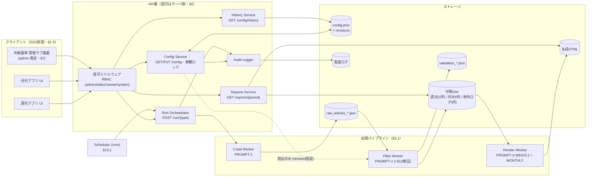
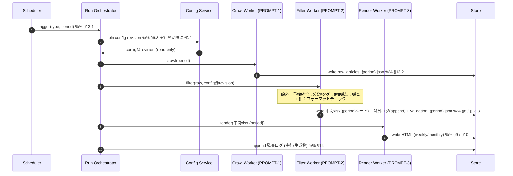
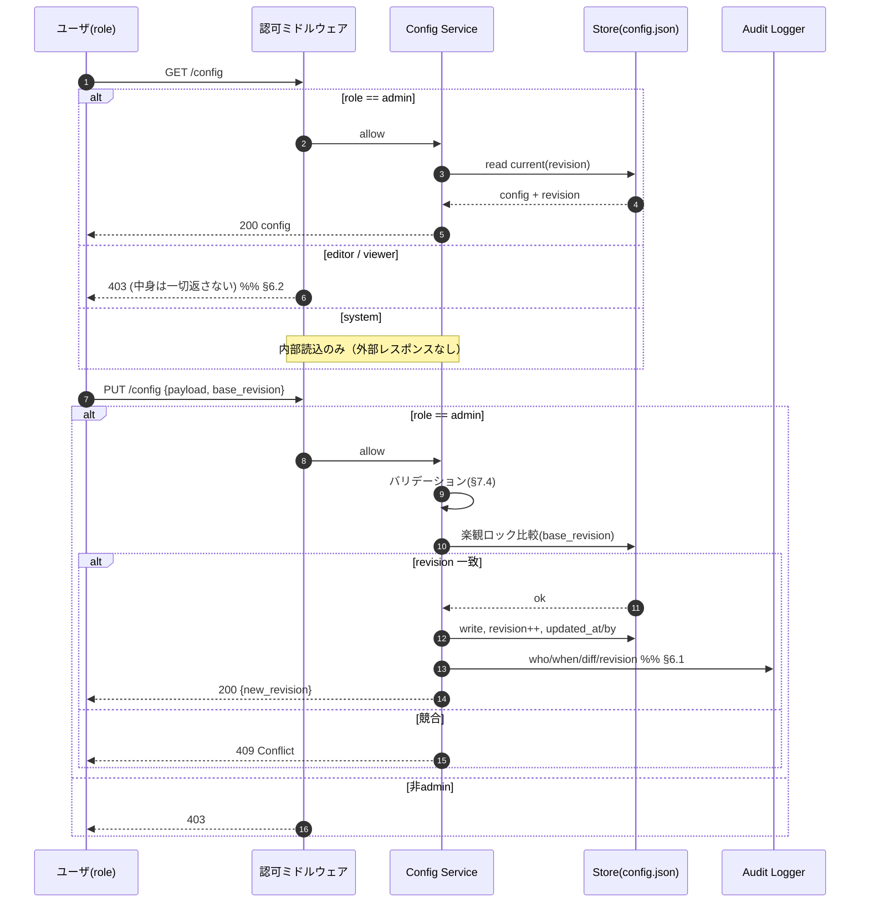
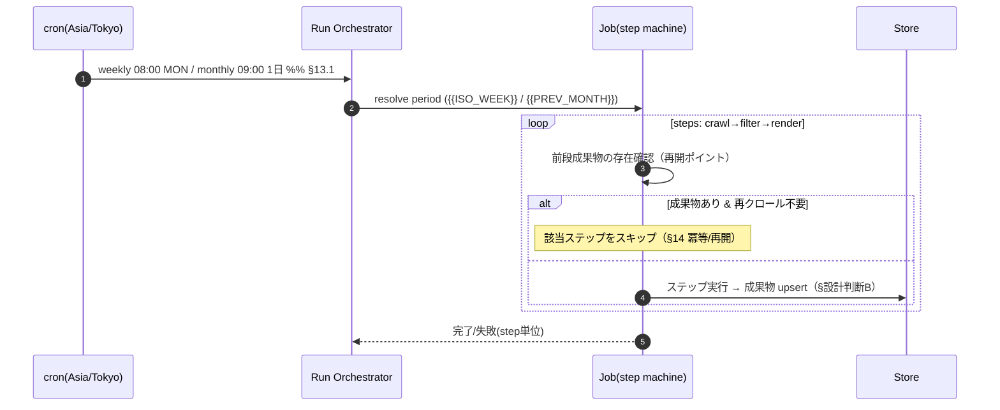
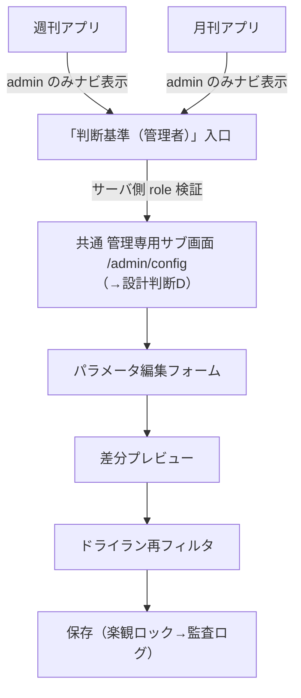
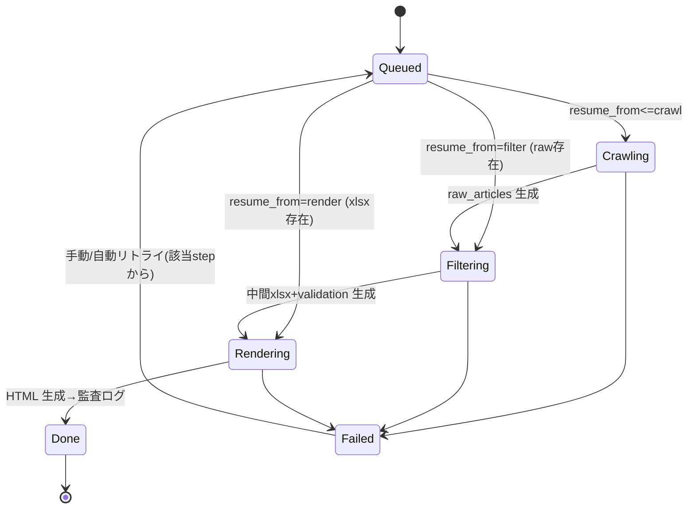

# AI動向把握アプリケーション 設計書（How）

> **対象**：週刊メルマガ（Weekly AI Intelligence by Sapeet）／ 月刊ビリーフ（月刊ビリーフ by Sapeet）
> **入力仕様書**：`ai_intelligence_apps_仕様書v3.md`（以下「仕様書」。章参照は §N 表記）
> **本書の位置づけ**：仕様書（What/Why）を実装可能な設計（クラス構成・DBスキーマ・API・シーケンス・画面遷移・アルゴリズム）へ落とし込んだもの。仕様書 §15 の指示1〜10に対応する。
> **確定値の扱い**：7カテゴリ / 10タグ / 6軸100点 / 13除外ルール / enum / 配色 / xlsx列は仕様書の確定値であり、本書はこれを**変更せずに参照**する（根拠：仕様書冒頭注記・§5.1）。

---

## 0. 用語・記法・全体方針

- ID は英小文字スネークケース、表示名は `label`（根拠：§5.1）。
- 入出力は UTF-8、TZ は `Asia/Tokyo`、ISO週は月曜始まり（根拠：§14）。
- 認可は**必ずサーバ側**で判定し、フロントの非表示は補助に過ぎない（根拠：§6.1・§6.2）。
- パイプラインは3ステージ（crawl / filter / render）で、設定テンプレートの3プロンプトと 1:1 対応（根拠：§3.1・§13）。
- 本書の各設計要素には、根拠となる仕様書の章番号を併記する。

### 0.1 仕様書内の表記ゆれに関する確認
仕様書冒頭注記は「§13 設計書に落とし込む際の指示」と記すが、目次・本文の実体は **§15** である（§13はプロンプトテンプレート）。本書は **§15** を設計指示として採用する。

---

## 1. アーキテクチャ設計（→ §15-1 / 根拠：§3）

### 1.1 コンポーネント構成



**設計上のポイント**
- `config.json` は Filter からは**読込のみ**、書込は Config Service 経由の admin 操作のみ（根拠：§3.2・§6.1）。
- Filter は起動時 revision を固定参照し、実行中の config 変更に影響されない（根拠：§6.3・§14）。
- 管理サブ画面（ADM）は週刊/月刊いずれの UI からも同一導線で到達する共通モジュール（根拠：§7.1、詳細は §5 本書）。

### 1.2 シーケンス：パイプライン全体（crawl → filter → render）



失敗時は各ステップ独立に再実行可能。`raw_articles.json` があれば crawl をスキップし filter から再開できる（根拠：§14）。

### 1.3 シーケンス：config 読込と権限判定



### 1.4 シーケンス：スケジュール起動



---

## 2. データモデル（→ §15-2）

### 2.1 `config.json` JSON Schema（根拠：§5.2 を正、制約は §7.4）

JSON Schema（draft 2020-12）で構造・型・enum・固定IDを表現する。IDは `const`/`enum` で固定寄り、`weight`・`severity`・`enabled`・`priority`・`tunable_thresholds` を可変として表現する（根拠：§5.1）。
なお **軸weightの合計=100** や **adoption_class_score_map の降順整合** といった**クロスフィールド制約**は JSON Schema 単体で表現できないため、§2.1.1 の「追加バリデーション（サーバ実装）」で担保する。

```json
{
  "$schema": "https://json-schema.org/draft/2020-12/schema",
  "$id": "https://sapeet.example/schemas/config.json",
  "title": "AI Intelligence config.json",
  "type": "object",
  "additionalProperties": false,
  "required": ["schema_version","meta","information_categories","required_tags","scoring_axes","scoring_total","exclusion_rules","enums","tunable_thresholds"],
  "properties": {
    "schema_version": { "const": "1.0" },
    "meta": {
      "type": "object",
      "additionalProperties": false,
      "required": ["config_name","source_of_truth_xlsx","editable_by","visible_to","revision"],
      "properties": {
        "config_name": { "const": "ai_intelligence_requirements" },
        "source_of_truth_xlsx": { "const": "weekly_ai_intelligence_requirements.xlsx" },
        "editable_by": { "type": "array", "items": { "const": "admin" }, "minItems": 1 },
        "visible_to": { "type": "array", "items": { "const": "admin" }, "minItems": 1 },
        "updated_at": { "type": ["string","null"], "format": "date-time" },
        "updated_by": { "type": ["string","null"] },
        "revision": { "type": "integer", "minimum": 1 }
      }
    },

    "information_categories": {
      "type": "array", "minItems": 7, "maxItems": 7,
      "items": {
        "type": "object", "additionalProperties": false,
        "required": ["id","label","priority","description"],
        "properties": {
          "id": { "enum": ["ai_major_company_model","ai_agent_automation","ai_governance_risk","enterprise_ai_case","industry_ai_trend","ai_training_org_change","ai_implementation_ops"] },
          "label": { "type": "string" },
          "priority": { "$ref": "#/$defs/priority" },
          "description": { "type": "string" }
        }
      }
    },

    "required_tags": {
      "type": "array", "minItems": 10, "maxItems": 10,
      "items": {
        "type": "object", "additionalProperties": false,
        "required": ["id","label","type","required","purpose","value_source"],
        "properties": {
          "id": { "enum": ["information_category","ai_theme","industry","business_area","info_type","region","reliability","customer_relevance","practical_usability","adoption_class"] },
          "label": { "type": "string" },
          "type": { "enum": ["single","multi","enum"] },
          "required": { "const": true },
          "purpose": { "type": "string" },
          "value_source": { "type": "string" }
        }
      }
    },

    "scoring_axes": {
      "type": "array", "minItems": 6, "maxItems": 6,
      "items": {
        "type": "object", "additionalProperties": false,
        "required": ["id","label","weight","criterion","bands"],
        "properties": {
          "id": { "enum": ["customer_relevance","practical_usability","market_impact","advisory_usability","reliability","urgency_freshness"] },
          "label": { "type": "string" },
          "weight": { "type": "integer", "minimum": 0, "maximum": 100 },
          "criterion": { "type": "string" },
          "bands": { "type": "array", "items": { "type": "string" }, "minItems": 1 }
        }
      }
    },
    "scoring_total": { "const": 100 },

    "exclusion_rules": {
      "type": "array", "minItems": 13, "maxItems": 13,
      "items": {
        "type": "object", "additionalProperties": false,
        "required": ["no","severity","enabled","name","examples"],
        "properties": {
          "no": { "type": "integer", "minimum": 1, "maximum": 13 },
          "severity": { "$ref": "#/$defs/severity" },
          "enabled": { "type": "boolean" },
          "name": { "type": "string" },
          "examples": { "type": "string" }
        }
      }
    },

    "enums": {
      "type": "object", "additionalProperties": false,
      "required": ["priority","severity","reliability","customer_relevance","practical_usability","adoption_class","region","info_type","industry","business_area"],
      "properties": {
        "priority": { "type": "array", "items": { "$ref": "#/$defs/priority" } },
        "severity": { "type": "array", "items": { "$ref": "#/$defs/severity" } },
        "reliability": { "type": "array", "items": { "enum": ["高","中","要確認","低"] } },
        "customer_relevance": { "type": "array", "items": { "enum": ["直接関係","近く応用可能","テーマ一部参考","一般参考","関連薄い"] } },
        "practical_usability": { "type": "array", "items": { "enum": ["すぐ活用","具体例参考","参考になる","追加解釈が必要","一般的","見込み薄い"] } },
        "adoption_class": { "type": "array", "items": { "enum": ["次回定例で提案","参考情報","共有のみ","不採用"] } },
        "region": { "type": "array", "items": { "enum": ["日本","海外","グローバル"] } },
        "info_type": { "type": "array", "items": { "enum": ["一次情報(公式発表)","主要メディア報道","専門メディア報道","ブログ・プレスリリース","個人SNS・二次情報"] } },
        "industry": { "type": "array", "items": { "type": "string" } },
        "business_area": { "type": "array", "items": { "type": "string" } }
      }
    },

    "tunable_thresholds": {
      "type": "object", "additionalProperties": false,
      "required": ["min_total_score_to_publish","adoption_class_score_map","min_reliability_score_to_publish","weekly","monthly","dedup"],
      "properties": {
        "min_total_score_to_publish": { "type": "integer", "minimum": 0, "maximum": 100 },
        "adoption_class_score_map": {
          "type": "object", "additionalProperties": false,
          "required": ["propose_next_meeting","reference_info","share_only"],
          "properties": {
            "propose_next_meeting": { "type": "integer", "minimum": 0, "maximum": 100 },
            "reference_info": { "type": "integer", "minimum": 0, "maximum": 100 },
            "share_only": { "type": "integer", "minimum": 0, "maximum": 100 }
          }
        },
        "min_reliability_score_to_publish": { "type": "integer", "minimum": 0, "maximum": 10 },
        "weekly": {
          "type": "object", "additionalProperties": false,
          "required": ["target_industry","max_industry_topics","max_common_topics","point_of_week_required"],
          "properties": {
            "target_industry": { "type": "string", "description": "enums.industry のいずれか（§7.4 の参照整合で担保）" },
            "max_industry_topics": { "type": "integer", "minimum": 0 },
            "max_common_topics": { "type": "integer", "minimum": 0 },
            "point_of_week_required": { "type": "boolean" }
          }
        },
        "monthly": {
          "type": "object", "additionalProperties": false,
          "required": ["target_case_count","chapter_count_hint","min_score_for_case","require_editorial_and_closing"],
          "properties": {
            "target_case_count": { "type": "integer", "minimum": 0 },
            "chapter_count_hint": { "type": "integer", "minimum": 0 },
            "min_score_for_case": { "type": "integer", "minimum": 0, "maximum": 100 },
            "require_editorial_and_closing": { "type": "boolean" }
          }
        },
        "dedup": {
          "type": "object", "additionalProperties": false,
          "required": ["lookback_weeks","title_similarity_threshold","treat_same_url_as_duplicate"],
          "properties": {
            "lookback_weeks": { "type": "integer", "minimum": 0 },
            "title_similarity_threshold": { "type": "number", "minimum": 0, "maximum": 1 },
            "treat_same_url_as_duplicate": { "type": "boolean" }
          }
        }
      }
    },

    "source_whitelist_hint": { "type": "array", "items": { "type": "string" } }
  },

  "$defs": {
    "priority": { "enum": ["low","mid","mid_high","high"] },
    "severity": { "enum": ["full_exclude","default_exclude","low_priority","low_priority_or_exclude","merge"] }
  }
}
```

#### 2.1.1 追加バリデーション（スキーマ外・サーバ実装。根拠：§7.4）
1. `Σ scoring_axes[].weight == 100`（不一致は保存不可。→ **設計判断A** 参照）。
2. `adoption_class_score_map.propose_next_meeting ≥ reference_info ≥ share_only ≥ tunable_thresholds.min_total_score_to_publish`（降順整合。根拠：§7.4）。
3. `weekly.target_industry ∈ enums.industry`（参照整合）。
4. `required_tags[*].value_source` が `enums.*` を指す場合、その enum キーが実在する。
5. ID系（category/tag/axis の `id`）は UI 編集不可・API では現行値と不一致なら 422（根拠：§7.4）。IDを変えると中間xlsx互換が壊れるため、変更は「スキーマ変更」画面で警告付きのみ（根拠：§5.1）。
6. 初期値（`min_total_score_to_publish=60` 等）は §5.2 の実データと一致していることをマイグレーション時に検証（→ §10 本書）。

### 2.2 中間xlsx 列スキーマ（テーブル定義。根拠：§8）

#### 2.2.1 週次 `weekly_ai_intelligence_report.xlsx`（各週シート・**22列・順序厳守**）
- シート＝ISO週ごと（例 `2026-W31`）＋ `除外ログ`。ヘッダは4行目、データは5行目以降、**合計スコア降順**（根拠：§8.1）。

| # | 列名 | 型/値域 | config対応 | 備考 |
|--:|---|---|---|---|
| 1 | 収集日 | `YYYY-MM-DD` | | 非空（§12） |
| 2 | 情報カテゴリ | カテゴリID(英) | information_categories.id | §5.2 の7ID |
| 3 | タイトル | string | | |
| 4 | 一言要約 | string(2〜3文) | | 非空（§12） |
| 5 | 合計スコア | 0-100 int | scoring_total | 6軸和と一致（§12） |
| 6 | 緊急性鮮度_点 | 0-10 int | urgency_freshness | |
| 7 | 信頼性_点 | 0-10 int | reliability | `≥ min_reliability_score_to_publish` |
| 8 | アドバイザリー活用度_点 | 0-15 int | advisory_usability | |
| 9 | AI業界市場インパクト_点 | 0-20 int | market_impact | |
| 10 | 実務活用可能性_点 | 0-20 int | practical_usability | |
| 11 | 顧客関連度_点 | 0-25 int | customer_relevance | |
| 12 | レポート採用区分 | enum | adoption_class | enums.adoption_class |
| 13 | 実務活用可能性 | enum | practical_usability | enums.practical_usability |
| 14 | 顧客関連度 | enum | customer_relevance | enums.customer_relevance |
| 15 | 信頼性 | enum | reliability | enums.reliability |
| 16 | 地域 | multi(`;`区切り) | region | enums.region |
| 17 | 情報種別 | enum | info_type | enums.info_type |
| 18 | 業務領域 | multi(`;`区切り) | business_area | enums.business_area |
| 19 | 業界 | multi(`;`区切り) | industry | enums.industry |
| 20 | AIテーマ | multi(`;`区切り) | ai_theme | free_controlled |
| 21 | ソース | string | | 統合時 `A / B(統合)`（§11.3） |
| 22 | URL | string(URL) | | 非空（§12） |

> **配点整合の確認**：軸点の上限（§8列6〜11）は 10+10+15+20+20+25＝100 で、`scoring_total=100`（§5.2）と一致する。

#### 2.2.2 `除外ログ` シート（週次側・**6列**。根拠：§8.1・§11.3）

| # | 列名 | 内容 |
|--:|---|---|
| 1 | 収集日 | `YYYY-MM-DD` |
| 2 | タイトル | string |
| 3 | URL | string |
| 4 | ソース | string |
| 5 | 除外区分 | severity日本語（完全除外／原則除外／低優先／統合／フォーマット不備／低スコア 等） |
| 6 | 除外理由 | ルール名または検証理由 |

#### 2.2.3 月次 `monthly_ai_leading_cases.xlsx`（各月シート・**8列・順序厳守**。根拠：§8.2）

| # | 列名 | 内容 |
|--:|---|---|
| 1 | No | 通し番号（1〜）＝章グルーピング順・昇順（§10.3） |
| 2 | トピック(章) | `第N章 <章タイトル>` |
| 3 | 企業・組織 | 主体（複数可 `A・B`） |
| 4 | タイトル | 事例見出し |
| 5 | URL | 一次/報道URL |
| 6 | 出典 | `媒体（日付）／ プレスリリース` |
| 7 | 掲載月 | `YYYY-MM` |
| 8 | 解説 | `\n\n` 区切り3段落（①事実 ②詳細 ③示唆） |

### 2.3 `raw_articles.json` スキーマ（根拠：§13.2）

```json
{
  "$schema": "https://json-schema.org/draft/2020-12/schema",
  "title": "raw_articles",
  "type": "array",
  "items": {
    "type": "object",
    "additionalProperties": false,
    "required": ["collected_at","title","url","source","raw_summary","region_hint","primary_or_secondary"],
    "properties": {
      "collected_at": { "type": "string", "pattern": "^\\d{4}-\\d{2}-\\d{2}$" },
      "published_at": { "type": ["string","null"], "pattern": "^\\d{4}-\\d{2}-\\d{2}$" },
      "title": { "type": "string", "minLength": 1 },
      "url": { "type": "string", "minLength": 1 },
      "source": { "type": "string", "minLength": 1 },
      "raw_summary": { "type": "string", "minLength": 1, "description": "2〜4文の客観要約（§13.2）" },
      "region_hint": { "enum": ["日本","海外","グローバル","不明"] },
      "primary_or_secondary": { "enum": ["一次(公式)","報道","不明"] }
    }
  }
}
```

### 2.4 `validation_*.json` スキーマ（根拠：§12.2）

```json
{
  "$schema": "https://json-schema.org/draft/2020-12/schema",
  "title": "validation report",
  "type": "object",
  "additionalProperties": false,
  "required": ["ok","errors","warnings"],
  "properties": {
    "ok": { "type": "boolean" },
    "errors":   { "type": "array", "items": { "$ref": "#/$defs/issue" } },
    "warnings": { "type": "array", "items": { "$ref": "#/$defs/issue" } }
  },
  "$defs": {
    "issue": {
      "type": "object",
      "additionalProperties": false,
      "required": ["row","field","reason"],
      "properties": {
        "row": { "type": "integer", "description": "対象xlsx行" },
        "field": { "type": "string", "description": "列名/タグID" },
        "reason": { "type": "string" }
      }
    }
  }
}
```
`error` 例：合計スコア不一致・enum外・必須タグ欠落。`warning` 例：要約が短すぎる（根拠：§12.2）。

---

## 3. API設計（→ §15-3 / 根拠：§6.2）

### 3.1 共通事項
- 認可はサーバ側（認可ミドルウェア）で判定。非許可は本体を一切返さず HTTP ステータスのみ（根拠：§6.1・§6.2）。
- 認証は既存 SSO 前提（根拠：§1.3）。ロールはトークンのクレームから解決。
- `config` 系レスポンスは `admin` 以外に**存在も中身も**返さない（403）。`system` は内部読込のみで外部レスポンス経路を持たない（根拠：§6.2）。

### 3.2 エンドポイント一覧と権限（根拠：§6.2 権限マトリクス）

| メソッド/パス | 概要 | admin | editor | viewer | system |
|---|---|:--:|:--:|:--:|:--:|
| `GET /config` | 現行 config 取得（revision含む） | 200 | 403 | 403 | 内部のみ |
| `PUT /config` | パラメータ更新（楽観ロック） | 200/409/422 | 403 | 403 | × |
| `GET /config/history` | 改訂履歴 | 200 | 403 | 403 | × |
| `GET /reports/{period}` | HTML/一覧取得 | 200 | 200 | 200 | 200 |
| `POST /run/{weekly\|monthly}` | パイプライン実行 | 202 | 202 | 403 | 202 |
| `POST /config/dry-run` | ドライラン再フィルタ（→設計判断C、認可根拠は §3.4） | 202 | 403 | 403 | × |

> **`config` 系 3行（GET/PUT /config, GET /config/history）と `POST /config/dry-run` は同一の「config ファミリ」認可（admin のみ）で揃える。** 詳細は §3.4。

### 3.3 主要 I/O 定義

**`GET /config` → 200**
```json
{ "revision": 1, "config": { "...": "§2.1 の config.json 全体" } }
```

**`PUT /config`（Request）**（根拠：§6.3 楽観ロック）
```json
{
  "base_revision": 1,
  "patch": {
    "scoring_axes": [ { "id": "customer_relevance", "weight": 25 } ],
    "tunable_thresholds": { "min_total_score_to_publish": 62 },
    "exclusion_rules": [ { "no": 11, "enabled": false } ]
  }
}
```
- `patch` は §7.2 の編集可能パラメータのみ許可。ID系・`scoring_total` 等の固定項目を含むと **422**（根拠：§7.4・§2.1.1-5）。

**`PUT /config` レスポンス**
- `200 { "revision": 2, "updated_at": "...", "updated_by": "..." }`
- `409 { "error":"revision_conflict", "current_revision": 3 }`（根拠：§6.3）
- `422 { "error":"validation_failed", "issues":[{ "path":"scoring_axes", "reason":"weight合計が100でない" }] }`（根拠：§7.4）

**`GET /config/history` → 200**
```json
{ "items": [ { "revision": 2, "updated_at": "...", "updated_by": "admin_a", "diff_summary": "min_total_score_to_publish 60→62" } ] }
```

**`GET /reports/{period}` → 200**
- `{period}` は `2026-W31`（週次）/ `2026-07`（月次）。
```json
{
  "period": "2026-W31",
  "type": "weekly",
  "html_url": "/files/weekly_ai_intelligence_newsletter_不動産_2026-W31.html",
  "xlsx_url": "/files/weekly_ai_intelligence_report.xlsx#sheet=2026-W31",
  "summary": { "adopted": 11, "excluded": 24 }
}
```

**`POST /run/{type}`（Request/Response）**（根拠：§13.1）
```json
// Request
{ "period": "2026-W31", "resume_from": "filter" }  // resume_from 省略時は crawl から
// Response 202
{ "job_id": "job_...", "type": "weekly", "period": "2026-W31", "status": "queued" }
```
- `resume_from` により再開ポイントを指定（`raw_articles.json` があれば `filter` から）。根拠：§14。

**`POST /config/dry-run`（Request/Response）**（根拠：§7.3-5、設計判断C）
```json
// Request（未保存の編集値を送る。base_revision で現行との突合も可）
{ "period": "2026-W31", "candidate_config_patch": { "tunable_thresholds": { "min_total_score_to_publish": 62 } } }
// Response 202（隔離パスへ一時出力／件数サマリは同ファイルから集計）
{ "dry_run_id": "dry_...", "scratch_url": "/scratch/dry-run/dry_.../result.xlsx",
  "summary": { "adopted": 9, "excluded": 26 }, "ttl_hours": 24 }
```

### 3.4 `POST /config/dry-run` の認可設計と再確認（設計時追加・仕様書§6.2に明記なし）

**結論：現行のまま（admin=202 / editor=403 / viewer=403 / system=×）で妥当。** 変更なし。

**再確認の根拠**
本エンドポイントは §6.2 の権限マトリクスに列挙がない「設計時追加分」であるため、既存の許可判断を **「run ファミリ（実行系）」ではなく「config ファミリ（判断基準系）」に分類できるか** で決めた。

1. **機能の本質は config の操作である**：dry-run は「この基準で再フィルタし結果件数を即プレビュー」する機能（§7.3-5）で、入力は編集中の config パラメータ、出力はその config を適用した結果である。実データ収集や本番成果物の生成を目的とする `POST /run`（run ファミリ）とは目的が異なり、`PUT /config` に付随する検証補助（config ファミリ）に位置づくのが自然。
2. **config の可視性制約から admin 限定が必然**：config は `visible_to:["admin"] / editable_by:["admin"]`（§5.2 meta）で、非admin には**存在も中身も返さない**（§6.1・§2 重要要件）。dry-run は config 値そのもの（未保存の編集値を含む）と、その適用挙動（除外・採点結果）を露出する。これを editor/viewer に返すと config 内容の間接的な漏洩になるため、**editor=403 / viewer=403**。§6.2 の config 系3行（すべて admin のみ / editor・viewer=403）と整合する。
3. **画面フロー上も admin 専用導線に属する**：dry-run は管理専用サブ画面（設計判断D）の編集フロー内の「任意ステップ」（§7.3-5）であり、そもそも非admin はこの画面へ到達しない。
4. **system=× の理由**：dry-run は admin の**対話的プレビュー**用途（§7.3-5「任意で」）で、スケジューラの定期実行対象ではない。スケジューラが実行するのは本番パイプライン（`POST /run`）のみ（§13.1）。定期ドライランの要件は仕様書に存在しないため、system には割り当てない。
5. **副作用の観点でも安全側**：dry-run は実ファイルを上書きせず隔離パス（scratch, TTL付）にのみ出力する（設計判断C）。仮に将来 system へ開放する要件が出ても、本番成果物を汚さない設計になっている。

**判断に迷い得た点（明記）**
唯一の分岐は「dry-run を run ファミリ扱いにして editor にも 202 を与えるか」だった。§6.2 では `POST /run` は editor=202 で、editor は「生成結果を確認・軽微修正する」役割（§2）だからである。しかし dry-run は生成結果の確認ではなく **判断基準（config）の事前検証**であり、config 非露出の要件（§6.1・§2）が run ファミリの利便性より優先される。したがって **config ファミリ（admin のみ）に寄せる**のが仕様の趣旨に忠実と判断した。将来 editor に「新基準適用時の件数だけを、config 値を伏せて見せる」要件が明確化された場合は、**config 値を返さない集計専用の別エンドポイント**（例：`POST /reports/preview-count`）を新設する形で対応し、`/config/dry-run` 自体の admin 限定は維持する。

---

## 4. 権限・認可設計（→ §15-4 / 根拠：§2・§6）

### 4.1 ロール定義（根拠：§2 アクター表）

| ロール | config 表示 | config 編集 | HTML閲覧 | 実行トリガ |
|---|:--:|:--:|:--:|:--:|
| `admin` | ○ | ○ | ○ | ○ |
| `editor` | ×（要約表示のみ可） | × | ○ | ○ |
| `viewer` | × | × | ○ | × |
| `system` | 読込のみ(内部) | × | ○ | ○ |

- config の**表示・編集は admin のみ**。管理画面の「パラメータ編集」タブ自体を admin 以外に非表示（根拠：§2 重要要件・§6.1）。フロント非表示は補助で、実体は API 側 403 で担保。

### 4.2 認可判定（サーバ側・擬似コード）
```text
function authorize(role, action):
    matrix = PERMISSION_MATRIX  # §6.2 をそのまま定数化
    decision = matrix[action][role]
    if decision == "allow": return OK
    if decision == "internal_only" and caller.is_internal(): return OK
    return DENY(403)   # config系は本体を返さず 403 のみ
```

### 4.3 config 更新の一貫性（楽観ロック。根拠：§6.3）
- 更新は `base_revision` で衝突検知。成功時 `revision++`、`updated_at`/`updated_by` を記録。
- 実行中ジョブは開始時 revision を固定参照（実行中に config が変わっても切替わらない）。

### 4.4 監査ログ スキーマ（根拠：§6.1・§14）

| フィールド | 型 | 内容 |
|---|---|---|
| `audit_id` | string | 主キー |
| `event_type` | enum | `config_update` / `run_start` / `run_finish` / `artifact_created` |
| `actor` | string | who（ロール＋ユーザ識別子） |
| `at` | datetime | when（Asia/Tokyo） |
| `revision` | int | 対象 config revision |
| `diff` | json | `config_update` 時の before→after 差分 |
| `target` | string | 対象成果物パス（xlsx/HTML等） |
| `period` | string | 対象期間 |

```json
{
  "audit_id": "aud_0001",
  "event_type": "config_update",
  "actor": "admin:admin_a",
  "at": "2026-08-12T10:00:00+09:00",
  "revision": 2,
  "diff": { "tunable_thresholds.min_total_score_to_publish": { "before": 60, "after": 62 } },
  "target": "config.json",
  "period": null
}
```

---

## 5. 管理画面設計（→ §15-5 / 根拠：§7）

### 5.1 到達導線（週刊/月刊から同一画面へ。根拠：§7.1）



### 5.2 編集フォームのバインディング（config パス対応。根拠：§7.2）

| UI項目 | config パス | 種別 | バリデーション |
|---|---|---|---|
| スコア軸配点 | `scoring_axes[].weight` | 数値 | 合計100（§7.4・設計判断A） |
| 掲載最低スコア | `tunable_thresholds.min_total_score_to_publish` | 数値0-100 | |
| 採用区分しきい値 | `adoption_class_score_map.*` | 数値 | 降順整合（§7.4） |
| 除外ルール有効/無効 | `exclusion_rules[].enabled` | トグル | |
| 除外ルール強度 | `exclusion_rules[].severity` | enum選択 | §5.4 の5値 |
| カテゴリ優先度 | `information_categories[].priority` | enum選択 | priority enum |
| 週刊：対象業界 | `weekly.target_industry` | enum(industry) | 参照整合 |
| 週刊：トピック上限 | `weekly.max_industry_topics/max_common_topics` | 数値 | |
| 月刊：目標事例数・章数 | `monthly.target_case_count/chapter_count_hint` | 数値 | |
| 重複判定パラメータ | `dedup.*` | 数値/真偽 | |

- ID系（category/tag/axis の `id`）は**表示のみ・編集不可**。変更は別「スキーマ変更」画面で警告付き（根拠：§7.4・§2.1.1-5）。

### 5.3 画面フロー（根拠：§7.3）
1. admin がアプリを開く → ナビに「判断基準（管理者）」表示。
2. 現行 config をフォーム化表示（`revision` を hidden 保持）。
3. 変更 → 差分プレビュー（before→after）。
4. 保存 → サーバでバリデーション（§7.4）＋楽観ロック（§6.3）→ `config.json` 更新 → 監査ログ。
5. 任意で「この基準で再フィルタ（ドライラン）」→ 収集済みデータへ新基準適用の結果件数を即プレビュー（実ファイルは非上書き。→設計判断C）。

### 5.4 バリデーションUI
- 保存前にクライアントで一次チェック、確定はサーバ 422 応答を表示（§7.4）。
- 合計100不成立時は該当軸をハイライトし、補助操作（比率維持で100へ補正）を提示（→設計判断A）。

---

## 6. フィルタリング設計（→ §15-6 / 根拠：§13.3・§5.4・§11・§12）

### 6.1 メインアルゴリズム（擬似コード）
```text
function filter(raw_articles, config@revision, history):
    results = []; exclusion_log = []; validation = {ok:true, errors:[], warnings:[]}
    tt = config.tunable_thresholds

    for a in raw_articles:
        # 1) 除外判定（exclusion_rules を no 昇順、enabled のみ）§13.3-1 / §5.4
        verdict = evaluate_exclusions(a, config.exclusion_rules, tt)
        if verdict.action == "exclude":
            exclusion_log.append(log(a, verdict.category, verdict.reason)); continue

        # 2) 重複・統合判定 §13.3-2 / §11
        dup = detect_duplicate(a, history, tt.dedup)
        if dup.is_duplicate:
            merge_into_representative(dup.rep, a)     # ソース欄 "A / B(統合)"
            exclusion_log.append(log(a, "統合", "重複・転載記事")); continue

        # 3) 分類・10タグ付与（enum系は config.enums の値のみ）§13.3-3
        tags = classify_and_tag(a, config)

        # 4) 6軸採点（各軸 bands に従い整数配点・範囲厳守）§13.3-4
        s = score_axes(a, config.scoring_axes)         # 各軸 int、範囲内
        total = sum(s.values())                         # = 合計スコア（必ず一致）
        tags.adoption_class = decide_adoption_class(total, tt.adoption_class_score_map)

        # low_priority 系は adoption_class を降格 §5.4
        if verdict.action == "low_priority":
            tags.adoption_class = downgrade(tags.adoption_class)  # 共有のみ 寄り

        # 5) 採否 §13.3-5
        if total < tt.min_total_score_to_publish or s.reliability < tt.min_reliability_score_to_publish:
            exclusion_log.append(log(a, "低スコア/信頼性不足", reason)); continue

        record = build_row(a, tags, s, total)

        # フォーマットチェック §12
        errs = format_check(record, config)
        if errs:
            validation.errors += errs; validation.ok = false
            exclusion_log.append(log(a, "フォーマット不備", "§12検証エラー")); continue

        results.append(record)

    # 6) 出力整形
    results = sort_desc(results, key="合計スコア")        # §8.1 降順
    write_weekly_or_monthly_xlsx(results)                # §8（週22列 / 月8列）
    append_exclusion_log(exclusion_log)                  # §8.1（6列）
    write_validation(validation)                         # §12.2
    return
```

### 6.2 除外 severity 分岐（根拠：§5.4）
```text
function evaluate_exclusions(a, rules, tt):
    for r in rules sorted by no:            # §13.3-1 No 順
        if not r.enabled: continue
        if not matches(a, r): continue
        switch r.severity:
          full_exclude:            return {action:"exclude", category:"完全除外", reason:r.name}
          default_exclude:
              # 例外採用: 顧客関連度=直接関係 かつ 合計見込み ≥ min_total_score_to_publish
              if a.customer_relevance == "直接関係" and estimate_total(a) >= tt.min_total_score_to_publish:
                  return {action:"keep", note:"default_exclude例外採用: "+r.name}
              return {action:"exclude", category:"原則除外", reason:r.name}
          low_priority:            return {action:"low_priority", reason:r.name}
          low_priority_or_exclude: # 鮮度が低ければ除外、そうでなければ低優先
              return {action: ("exclude" if is_stale(a) else "low_priority"),
                      category:"低優先/除外", reason:r.name}
          merge:                   return {action:"merge", reason:r.name}   # §11 と連動
    return {action:"keep"}
```

### 6.3 重複統合（根拠：§11.2・§11.3）
```text
function detect_duplicate(a, history, d):
    if d.treat_same_url_as_duplicate and normalize_url(a.url) in history.urls:
        return dup(rep = history.by_url[normalize_url(a.url)])
    for h in history.recent:                       # 週次: 直近 lookback_weeks 週＋除外ログ
        if title_similarity(norm(a.title), norm(h.title)) >= d.title_similarity_threshold:
            return dup(rep = h)                    # 同一発表の別媒体 → 代表1件へ merge
    return no_dup()
# normalize_url: クエリ/トラッキング除去・末尾スラッシュ統一（§11.2）
# norm(title): 記号・空白除去、全半角統一（§11.2）
```

### 6.4 adoption_class 決定（根拠：§13.3-4・§5.2 tunable）
```text
function decide_adoption_class(total, m):   # m = adoption_class_score_map
    if total >= m.propose_next_meeting: return "次回定例で提案"
    if total >= m.reference_info:       return "参考情報"
    if total >= m.share_only:           return "共有のみ"
    return "不採用"
```

### 6.5 フォーマットチェック（根拠：§12.1・§12.2）
```text
function format_check(rec, config):
    errs = []
    # 6軸点が範囲内（0-25/0-20/0-20/0-15/0-10/0-10）
    for axis in config.scoring_axes: assert_in_band(rec[axis], errs)
    # 6軸和 == 合計スコア
    if sum(axis_points(rec)) != rec["合計スコア"]: errs += err("合計スコア","6軸和と不一致")
    # 10必須タグが全て非空
    for t in REQUIRED_10_TAGS: if empty(rec[t]): errs += err(t,"欠落")
    # enum系が config.enums に存在
    for t in ENUM_TAGS: if rec[t] not in config.enums[t]: errs += err(t,"enum外")
    # 一言要約/URL/ソース/収集日 非空
    for f in ["一言要約","URL","ソース","収集日"]: if empty(rec[f]): errs += err(f,"空")
    return errs
```

---

## 7. HTML生成設計（→ §15-7 / 根拠：§9・§10）

### 7.1 メールHTML共通制約（根拠：§9.1・§10.1・§13.4）
- **table レイアウト＋inline style のみ**。`<style>`タグ／外部CSS／flex／grid／JS は**禁止**。
- 文字コード UTF-8・`<meta charset>` 明記（根拠：§14）。href は xlsx の URL 列をそのまま使用（根拠：§9.3・§10.3）。
- フォント：`'Hiragino Kaku Gothic ProN','ヒラギノ角ゴ ProN','Meiryo',Arial,sans-serif`。

### 7.2 カテゴリ色マップ（確定。根拠：§9.2-4・§13.4.1・実サンプルHTML）
実サンプル `weekly_ai_intelligence_newsletter_不動産_2026-W31.html` を機械抽出した結果、**カテゴリラベル色は3種のみ**（`AIエージェント・自動化=#0891b2` / `主要企業・モデル動向=#7c3aed` / `ガバナンス・リスク=#dc2626`）で、残り4カテゴリの色指定は**サンプルに存在しない**。したがって3色を確定値（サンプル実測）とし、残り4カテゴリは近縁色で補完する（サンプル準拠の方針・§9.3）。補完4色はブランド指定があれば差し替え可能。

| カテゴリID | ラベル | 色 | 出所 |
|---|---|---|---|
| `ai_agent_automation` | AIエージェント・業務自動化 | `#0891b2`（シアン） | 実サンプルHTML実測（ラベル「AIエージェント・自動化」）／§9.2・§13.4.1 |
| `ai_major_company_model` | 主要AI企業・モデル動向 | `#7c3aed`（バイオレット） | 実サンプルHTML実測（ラベル「主要企業・モデル動向」）／§9.2・§13.4.1 |
| `ai_governance_risk` | AIガバナンス・法規制・リスク | `#dc2626`（レッド） | 実サンプルHTML実測（ラベル「ガバナンス・リスク」）／§9.2・§13.4.1 |
| `enterprise_ai_case` | 企業AI活用事例 | `#059669`（グリーン） | 補完（サンプル未収載・要ブランド確認） |
| `industry_ai_trend` | 業界別AI動向 | `#d97706`（アンバー） | 補完（サンプル未収載・要ブランド確認） |
| `ai_training_org_change` | AI人材育成・組織変革 | `#db2777`（ピンク） | 補完（サンプル未収載・要ブランド確認） |
| `ai_implementation_ops` | AI導入・運用ノウハウ | `#4f46e5`（インディゴ＝アクセント同系） | 補完（サンプル未収載・要ブランド確認） |

> **検証記録**：上表3色は実サンプルHTMLのカテゴリラベル `<div style="…color:#XXXXXX…">` から抽出し、`#0891b2 / #7c3aed / #dc2626` の3色のみが使用されていることを確認済み（distinct 3件）。仕様書 §13.4.1 のサンプル記載（`ai_agent_automation=#0891b2, ai_major_company_model=#7c3aed, ai_governance_risk=#dc2626`）とも一致。

### 7.3 週刊：xlsx列 → HTML要素 マッピング（根拠：§9.2・§9.3・§8.1）

| HTML要素/セクション | 中間xlsx列（週次） | 変換規則 |
|---|---|---|
| ヘッダ「〈業界〉版」 | `config.weekly.target_industry` | config値を差込（§9.2-1） |
| ヘッダ「対象週」 | シート名（`2026-Www`） | |
| 今週のポイント | （生成テキスト） | `point_of_week_required=true` で必須（§9.2-2） |
| 業界関連トピック | 列19「業界」に `target_industry` を含む記事 | 上限 `weekly.max_industry_topics`（§9.2-3） |
| 業界共通トピック（カード） | 列19「業界」に「業界横断」等 | 上限 `weekly.max_common_topics`（§9.2-4） |
| ├ カテゴリラベル（色分け） | 列2「情報カテゴリ」 | §7.2 色マップ |
| ├ タイトル（`<a>`黒） | 列3「タイトル」＋列22「URL」 | href=URL（§9.3） |
| ├ 本文要約 | 列4「一言要約」 | |
| ├ 示唆ボックス | （生成1段落） | 背景`#eef2ff`／左罫`#6366f1`（§9.1） |
| └ 出典行 | 列21「ソース」＋列22「URL」 | 「出典：〈ソース〉 ／ 記事を読む」 |
| 並び順 | 列5「合計スコア」 | 降順（§9.3） |
| 採用条件 | 列12/列5 | `採用区分≠不採用` かつ `合計スコア≥min_total_score_to_publish`（§9.3） |

**週刊 配色（確定・根拠：§9.1）**：外枠背景 `#f3f4f6` ／ ヘッダ `linear-gradient(135deg,#4f46e5,#7c3aed)` ／ アクセント `#4f46e5` ／ 示唆ボックス背景 `#eef2ff`・左罫 `#6366f1`。外枠 `max-width:680px` 中央。

### 7.4 月刊：xlsx列 → HTML要素 マッピング（根拠：§10.2・§10.3・§8.2）

| HTML要素/セクション | 中間xlsx列（月次） | 変換規則 |
|---|---|---|
| ヘッダ号バッジ/対象期間 | 列7「掲載月」 | `YYYY年M月号`・`YYYY年M月1日〜M月末日`（§10.2-1） |
| 巻頭言 EDITORIAL | （生成3段落） | `require_editorial_and_closing=true`（§10.2-2） |
| 目次 CONTENTS | 列2「トピック(章)」を集約 | 章一覧＋件数＋`全N事例・M章`（§10.2-3） |
| 章ヘッダ | 列2「トピック(章)」 | 下端 `2px solid #4FA8DB`（§10.2-4） |
| 事例カード見出し | 列3「企業・組織」＋列4「タイトル」＋列5「URL」 | `CASE NN ／ 〈企業〉`、タイトルは`<a>`(ネイビー) href=URL（§10.3） |
| 事例本文 | 列8「解説」 | `\n\n` を `<p>` 分割・最終段は示唆トーン（§10.3） |
| 出典行 | 列6「出典」 | 上罫＋グレー小（§10.2-4） |
| むすび CLOSING | （生成2段落） | §10.2-5 |
| フッタ件数バッジ | 列1「No」件数・章数 | `収録事例 N 件`／`トピック M 章`（§10.2-6） |
| 並び順 | 列1「No」 | 昇順＝章グルーピング順（§10.3） |
| 構成目安 | — | `target_case_count`(15)・`chapter_count_hint`(5)（§10.3） |

**月刊 配色（確定・根拠：§10.1）**：外枠背景 `#EEF2F6`（本体白・角丸`8px`） ／ ネイビー `#1F4E78` ／ アクセント `#4FA8DB`・`#9FD4F2` ／ 本文 `#2C3E50` ／ 囲み `#F7FAFC`・罫 `#DCE7F0`。外枠 `width:680px; max-width:100%` 中央。

---

## 8. スケジューラ設計（→ §15-8 / 根拠：§13.1・§14）

### 8.1 ジョブ定義（YAML → 内部ジョブモデル）

| job_id | cron | TZ | period 解決 | pipeline |
|---|---|---|---|---|
| `weekly_ai_intelligence` | `0 8 * * MON` | Asia/Tokyo | `{{ISO_WEEK}}`（当週） | crawl→filter→render |
| `monthly_belief` | `0 9 1 * *` | Asia/Tokyo | `{{PREV_MONTH}}`（前月） | crawl→filter→render |

### 8.2 ステップ間の成果物受け渡し（根拠：§13.1）

| step | prompt_ref | 入力 | 出力 |
|---|---|---|---|
| crawl | PROMPT-1 | period | `raw_articles_{period}.json` |
| filter | PROMPT-2 | `raw_articles_{period}.json` ＋ `config.json@revision`（開始時固定・§6.3） | 中間xlsx `#sheet={period}`／除外ログ append／`validation_{period}.json` |
| render | PROMPT-3-WEEKLY / -MONTHLY | 中間xlsx `#sheet={period}` | 週刊/月刊 HTML |

### 8.3 再開ポイント・冪等性（根拠：§14）
- 各ステップは独立再実行可能。`raw_articles_{period}.json` があれば crawl をスキップし filter から再開（`POST /run` の `resume_from`）。
- 月次 filter は対象月の各週次レポートを再利用してよい（再クロール省略可。§13.1 notes）。
- 冪等性：同一 `{period}` の再実行は該当シート/HTML を upsert（上書き方式は**設計判断B**）。
- config は開始時 revision を固定参照（§6.3・§14）。

### 8.4 ジョブ状態機械



---

## 9. プロンプト運用設計（→ §15-9 / 根拠：§13.2〜13.4）

### 9.1 テンプレート化と変数注入元

| プロンプト | ステージ | 主な `{{変数}}` | 注入元 |
|---|---|---|---|
| PROMPT-1 | crawl | `{{PERIOD}}` | ジョブ period（§13.1） |
| PROMPT-2 | filter | `{{PERIOD}}`, `{{dedup.lookback_weeks}}`, `{{dedup.title_similarity_threshold}}` | period／`config.tunable_thresholds.dedup`（§5.2） |
| PROMPT-3-WEEKLY | render | `{{ISO_WEEK}}`, `{{target_industry}}`, `{{weekly.max_industry_topics}}`, `{{weekly.max_common_topics}}` | period／`config.weekly.*`（§5.2） |
| PROMPT-3-MONTHLY | render | `{{MONTH}}`, `{{MONTH_JP}}`, `{{month_range}}`, `{{monthly.target_case_count}}`, `{{monthly.chapter_count_hint}}` | period／`config.monthly.*`（§5.2） |

- filter は「config のパラメータを実行時点の値のまま使用し主観で上書きしない」ことをプロンプト冒頭に明記（根拠：§13.3）。
- 各プロンプトは「指定の成果物以外を出力しない」制約を保持（JSON/xlsx/HTML 以外を出さない。根拠：§13.2〜13.4）。

### 9.2 プロンプトのバージョン管理方針
- プロンプトは `prompts/PROMPT-1.md` 等でリポジトリ管理し、`prompt_version`（semver）を付与。
- 実行時に使用した `prompt_version` と `config.revision` を監査ログ・validation メタに記録（再現性確保）。
- プロンプト改訂は PR レビュー必須。テンプレート変数の増減はスキーマ（本§9.1表）と同時更新。

---

## 10. 移行設計（→ §15-10 / 根拠：§5・§8）

### 10.1 目的
既存 `weekly_ai_intelligence_requirements.xlsx`（シート：`情報カテゴリ`/`必須タグ`/`除外ルール`/`スコアリング軸`）を初期投入元として `config.json` を生成する（根拠：§5・§5.2）。以後の正は `config.json`（§5 制約）。

### 10.2 マッピング

| xlsx シート | → config.json パス | 変換 |
|---|---|---|
| 情報カテゴリ | `information_categories[]` | 日本語表記を `id`(スネークケース)＋`label`＋`priority`＋`description` に分解。「中〜高」→`mid_high`（§5.3） |
| 必須タグ | `required_tags[]` | `id`/`label`/`type`/`required=true`/`purpose`/`value_source` |
| スコアリング軸 | `scoring_axes[]`＋`scoring_total` | `weight`（合計100検証）・`bands` を文字列配列化 |
| 除外ルール | `exclusion_rules[]` | `no`/`severity`(§5.4の5値)/`enabled=true`/`name`/`examples` |
| （固定初期値） | `tunable_thresholds` | §5.2 の初期値を投入（`min_total_score_to_publish=60` 等） |

### 10.3 手順
```text
1. read xlsx（4シート）
2. 各シート→中間オブジェクトへ正規化（日本語→ID、priority表記統一 §5.3）
3. tunable_thresholds に §5.2 初期値を設定
4. §2.1 JSON Schema で構造検証 ＋ §2.1.1 追加バリデーション（合計100・降順整合・参照整合）
5. §5.2 実データとの一致チェック（7/10/6/13 の件数、初期しきい値）
6. meta.revision=1, updated_by=null, updated_at=migration時刻 を設定して config.json 出力
7. マイグレーションレポート（差分・警告）を出力
```

### 10.4 冪等性・ロールバック
- マイグレーションは再実行可能（既存 config があれば revision を維持しつつ diff レポートのみ出す dry モードを既定）。
- 検証（手順4-5）失敗時は書き込まず中断。

---

## 11. 設計判断（§15 末尾「設計判断を委ねる点」4項目：選択肢比較と選定理由）

### 設計判断A：`scoring_axes.weight` 合計100の担保方法（根拠：§7.4・§5.2）
**選択肢**
- (A-1) 保存拒否：合計≠100 は 422 で拒否。UI に補助「比率維持で100へ補正」ボタン（フォーム値を埋めるのみ／保存は再度明示操作）。
- (A-2) 自動正規化：保存時にサーバが合計100へ按分。

**比較**

| 観点 | A-1 保存拒否 | A-2 自動正規化 |
|---|---|---|
| 意図の明確さ | admin の入力が確定値 | 意図と保存値がズレる恐れ |
| 整数band整合(§5.2) | 整数weightを維持しやすい | 按分で非整数化→band(整数範囲)と不整合リスク |
| 監査diff | 入力=保存で追跡容易 | 入力≠保存で説明困難 |
| 操作コスト | 補正が1操作増える | 操作は少ない |

**選定：A-1（保存拒否＋補助補正ボタン）**。理由：スコア band は整数レンジ（§5.2）で採点も整数（§13.3-4）。自動正規化は非整数weightを生み、フォーマットチェック（§12）や採点の再現性を損なう。監査要件（§6.1 の diff）も入力=保存の一致が望ましい。操作コスト増は補助ボタンで吸収。

### 設計判断B：中間ファイル 上書き vs バージョン退避（根拠：§14 冪等性・§6.1 監査）
**選択肢**
- (B-1) 単純上書き：同一 period のシート/HTMLを都度上書き。
- (B-2) 正規名は上書き＋履歴退避：正規ファイル（Prompt-3 が参照する固定名/シート）は upsert しつつ、旧版を `_history/{period}/{revision}_{run_id}/…` にスナップショット退避。

**比較**

| 観点 | B-1 上書き | B-2 上書き＋退避 |
|---|---|---|
| 冪等性(§14) | ○ | ○（正規名は固定） |
| 下流互換(§13.4) | ○ | ○（固定名維持） |
| 監査/再現(§6.1) | × 旧結果消失 | ○ config改訂・再実行の履歴を保持 |
| ストレージ | 小 | 増（TTL/世代上限で制御） |

**選定：B-2（正規名は上書き＋履歴退避）**。理由：config は admin 変更で結果が変わる前提（§3.2）で、監査（§6.1・§14）には過去成果物の追跡が要る。一方 Prompt-3 は固定名/シートを入力とする（§13.4）ため正規名は上書き必須。両立には「固定名 upsert＋世代スナップショット」が最適。退避はTTL・世代上限で肥大を抑制。

### 設計判断C：ドライラン再フィルタの結果を 一時ファイル vs メモリ（根拠：§7.3-5・§14）
**選択肢**
- (C-1) 一時ファイル：正規 xlsx とは別の隔離パス（`scratch/dry-run/{run_id}/…`, TTL付）に出力。UI は件数サマリを表示、明細はダウンロード可能。
- (C-2) メモリ上プレビュー：件数サマリのみ返し、明細は保持しない。

**比較**

| 観点 | C-1 一時ファイル | C-2 メモリ |
|---|---|---|
| 実ファイル非上書き(§7.3) | ○（隔離パス） | ○ |
| 明細確認 | ○ 採否理由まで検証可 | × 件数のみ |
| データ量耐性 | ○ | 大量記事で不安定 |
| 後始末 | TTLで自動削除 | 不要 |

**選定：C-1（一時ファイル・隔離パス・TTL）**。理由：ドライランは「新基準適用の結果件数を即プレビュー」する用途（§7.3-5）だが、admin が採否の妥当性を確かめるには明細（除外区分・理由）まで見たい。正規ファイルを汚さない要件は隔離パス＋TTLで満たせる。即時性が要る件数サマリは同ファイルから集計してUI即返しできるため、C-1がC-2を包含する。

### 設計判断D：config編集を「アプリ内」vs「管理専用サブ画面」（admin限定は必須。根拠：§7.1・§6.1・§2）
**選択肢**
- (D-1) アプリ内：週刊/月刊アプリの画面内にパラメータ編集を埋め込む。
- (D-2) 管理専用サブ画面：共通ルート `/admin/config` を各アプリのナビ入口（admin のみ表示）から開く。実体は単一の共通モジュール。

**比較**

| 観点 | D-1 アプリ内 | D-2 管理専用サブ画面 |
|---|---|---|
| 両アプリ到達(§7.1) | 各アプリで二重実装 | ○ 共通実体を両ナビから参照 |
| 露出リスク(§6.1/§2) | アプリシェルに config が混在→漏洩面拡大 | ○ 専用ルートをサーバ側 role でガード、非admin導線を排除 |
| 差分/楽観ロック/ドライランの複雑性 | 各アプリに散在 | ○ 単一箇所に集約 |
| 保守 | 重複保守 | ○ 一元保守 |

**選定：D-2（管理専用サブ画面・両アプリ共通導線）**。理由：§7.1「週刊/月刊どちらからも同一の管理画面へ」を単一実体で満たし、§6.1・§2 の「非admin に config を露出しない」をルート単位のサーバ側認可で強固に担保できる。差分プレビュー・楽観ロック・ドライラン（設計判断A/C）の複雑性も一元化でき、二重実装を避けられる。admin 限定は必須要件（§2）で、入口タブは admin のみ表示＋サーバ側でも 403（§6.2）を二重で担保。

---

## 12. トレーサビリティ（仕様書↔設計 対応表）

| §15 指示 | 本書該当章 | 主な根拠章 |
|---|---|---|
| 1 アーキテクチャ | §1 | §3 |
| 2 データモデル | §2 | §5.2・§7.4・§8・§12・§13.2 |
| 3 API | §3 | §6.2 |
| 4 権限・認可 | §4 | §2・§6 |
| 5 管理画面 | §5 | §7 |
| 6 フィルタリング | §6 | §13.3・§5.4・§11・§12 |
| 7 HTML生成 | §7 | §9・§10 |
| 8 スケジューラ | §8 | §13.1・§14 |
| 9 プロンプト運用 | §9 | §13.2〜13.4 |
| 10 移行 | §10 | §5・§8 |
| 設計判断 4項目 | §11 | §7.4・§14・§7.3・§7.1・§6.1・§2 |

*（本設計書は仕様書 v3 の確定値を変更せず参照。実装時は本書 §2.1 の JSON Schema と §2.2 の列定義を単体テストの基準とすること。）*
